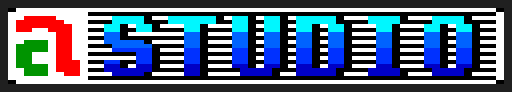
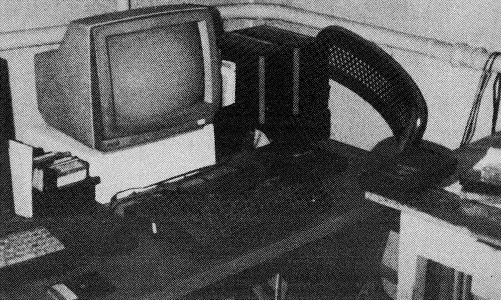
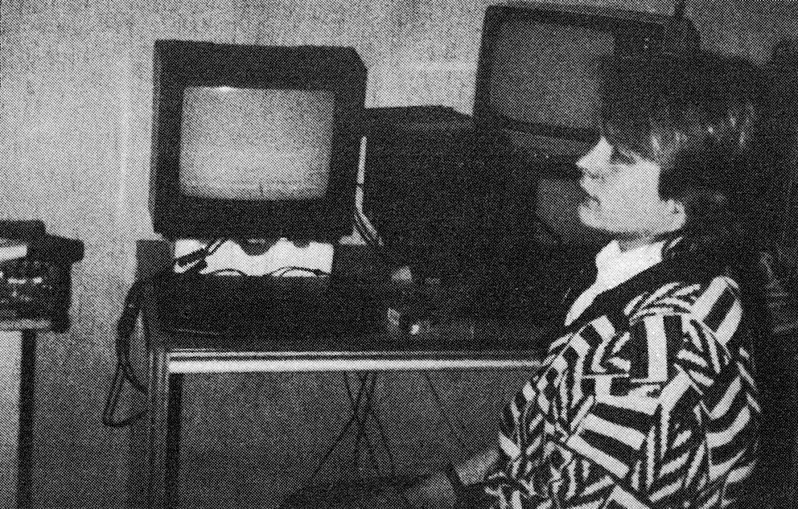

# 'á'-Studió

Cпеціальна команда для розробки програм саме під Enterprise сформувалася у 1987 році (після появи цих комп'ютерів в Угорщині). До її складу увійшли [Дьйордь Апор](../peoples/hu/pers_gyorgy-apor.md), [Ласло Сентторняї](../peoples/hu/pers_laszlo-szenttornyai.md), [Вільмош Копачі](../peoples/hu/pers_vilmos-kopacsy.md) та [Ференц Тілеш](../peoples/hu/pers_ferenc-tilesch.md), які й до цього створювали досить успішні ігри для [Novotrade](novotrade.md).

Штатними співробітниками були [Ігнац Фетсер](../peoples/hu/pers_ignac-fetser.md) та [Ференц Штенглер](../peoples/hu/pers_ferenc-staengler.md), які утворили команду [NASA & Guy](../peoples/community/oldschool/nasa-guy.md). Універсальним керівником був [Вільмош Копачі](../peoples/hu/pers_vilmos-kopacsy.md) — він і був тим самим «Guy» (а також співвласником **'a' Studio**). Першими роботами цієї команди стали демки NasaGuy.

  <i>В офісі компанії (фото з журналу <b>Mikroszámitógép Magazin 1988/7</b>)</i>

