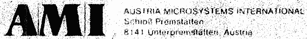
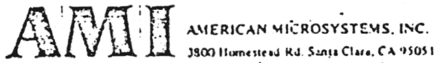

# AMI

https://en.wikipedia.org/wiki/AMS-Osram

> [компанія Voestalpine AG](https://en.wikipedia.org/wiki/Voestalpine_AG "Voestalpine AG") Наприкінці 1970-х років вирішує розширити асортимент своєї продукції та послуг і обрала напівпровідникову промисловість. Через пошуки Voestalpine партнера для спільного підприємства було укладено першу співпрацю з [American Microsystems, Inc.](https://en.wikipedia.org/wiki/American_Microsystems "Американські мікросистеми") (AMI), пізніше [AMI Semiconductor](https://en.wikipedia.org/wiki/AMI_Semiconductor "AMI Semiconductor") , яка зараз є частиною [OnSemi](https://en.wikipedia.org/wiki/Onsemi "Онсемі").

> У 1981 році це спільне підприємство призвело до створення American Micro Systems Incorporated-Austria GmbH (AMI-A). AMI належало 51%, а voestalpine AG – 49%. Штаб-квартирою було обрано замок Премштеттен в Унтерпремштеттені (Штирія, Австрія).

> У 1983 році австрійський канцлер [Фред Сіновац](https://en.wikipedia.org/wiki/Fred_Sinowatz "Фред Сіноватц") офіційно відкрив завод з виробництва 100-міліметрових [пластин](https://en.wikipedia.org/wiki/Wafer_\(electronics\) "Вафельна пластина (електроніка)") , на якому розпочалося виробництво з 300 співробітниками.

> 1987 рік був роком, коли voestalpine AG перейшла до повного володіння компанією. У вересні того ж року назву було змінено з AMI-A на AMS (Austria Mikro Systeme International GmbH). Крім того, були відкриті нові філії збуту в Каліфорнії та Німеччині.

---- 

