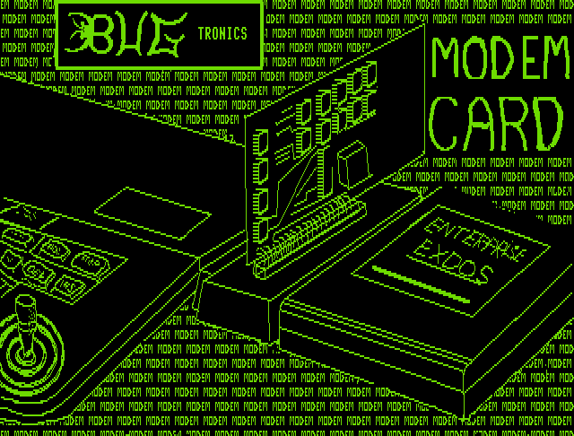

# Bugtronics

Засновники: Finn Stadel Nielsen та Per Stadel Nielsen.  
Країна: Данія.

У кооперації з [Dataquip Electronics](dataquip-electronics.md) розробили та продавали апаратне забезпечення: 

- внутрішню карту розширення ОЗП на 512 КБ (яка через німецьку філію Enterprise Computers потрапила у Німеччину а згодом і в Угорщину)
- зовнішню карту розширення ОЗП на 512 КБ
- [Serial/Modem Card](../hardware/net/hn-bugtronics-modem.md)
- [Mini motherboard](../hardware/system-bus/hb-bugtronics-mb.md)
- 2-port Parallel Card

