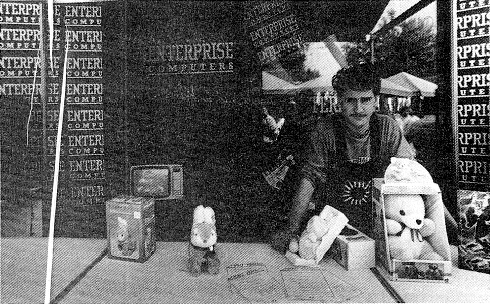
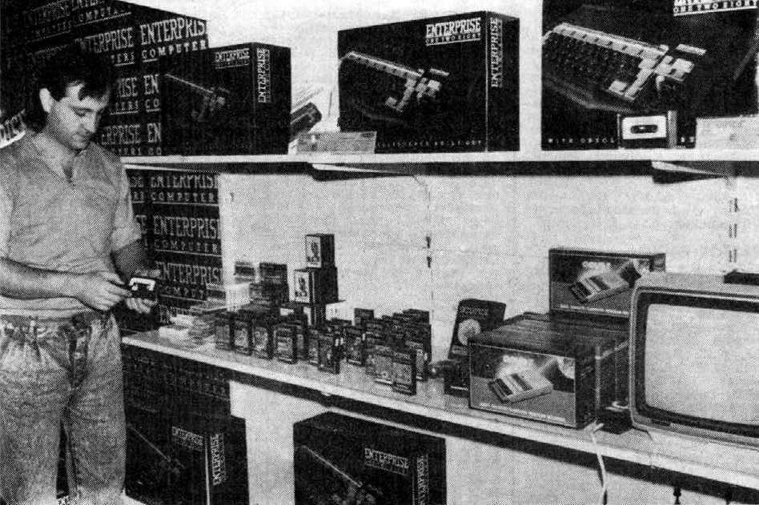

# Centrum

Велика угорська мережа універмагів. Один з дистріб'юторів комп'ютерів Enterprise.

 <i>Комп'ютерний відділ у одному з магазинів Centrum (фото з журналу <b>MikroVilág #05 1989.03</b>)  </i>

 

 <i>Комп'ютерний відділ у тимчасовій торгівельній точці Centrum (фото з газети <b>Somogyi Néplap #247 1987.10.20</b>)  </i>

[Угорська спільнота з історичними фотографіями магазинів Centrum](https://www.facebook.com/p/Centrum-Nosztalgia-%C3%A9s-Retro-Klub-100064792086071/)