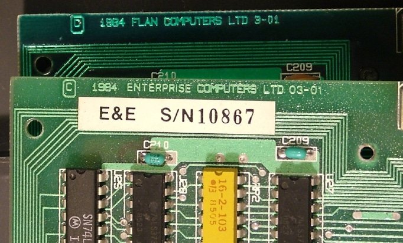
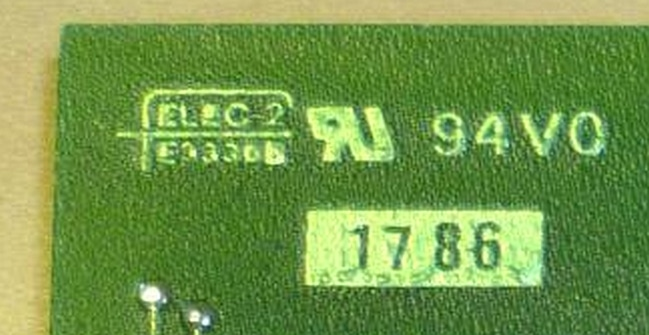

# Elec & Eltek

[https://www.eleceltek.com](https://www.eleceltek.com)

Один з виробників материнських плат та карт розширень.

   
Стікер з серійним номером на материнській платі  

   
Лого на платі EXDOS

> Заснована у 1972 році, компанія *Elec & Eltek International Company Limited* («Elec & Eltek») є одним із провідних світових виробників як традиційних, так і технологічно вдосконалених друкованих плат високої щільності (HDI), а також багатошарових об'єднавчих плат (до 50 шарів). Компанія впровадила послугу швидкого виконання замовлень (QTA — Quick Turn Around), що забезпечує значне скорочення термінів доставки. У 1994 році *Elec & Eltek* пройшла лістинг на Головному майданчику Сінгапурської фондової біржі (SGX), а у 2011 році отримала статус компанії з подвійним лістингом, вийшовши також на Головний майданчик Гонконзької фондової біржі (SEHK).