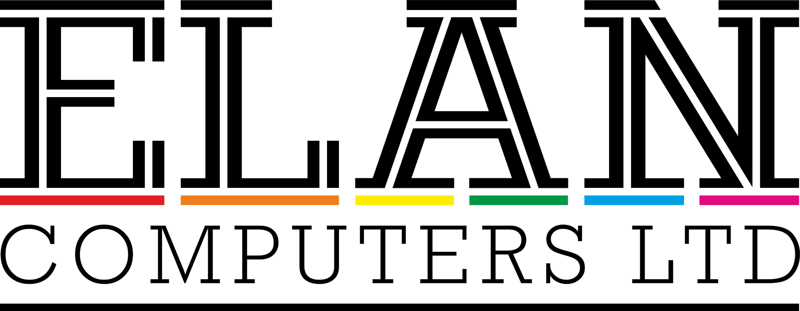
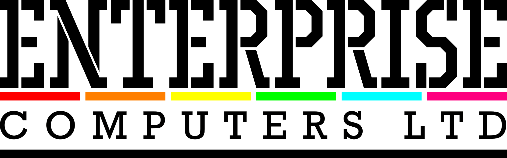

# Enterprise Computers Ltd

Попередні назви компанії які були змінені:

- **Samurai Worldwide Ltd.** — змінена після того як виявилось що є комп'ютери Samurai від Nissei Sangyo дочірньої компанії Hitachi
- **Elan Computers Ltd.** — змінена після позову компанії зі схожою назвою (скоріш за все це була Elan Digital Systems Ltd з лінійкою продуктів з назвою Elan). 