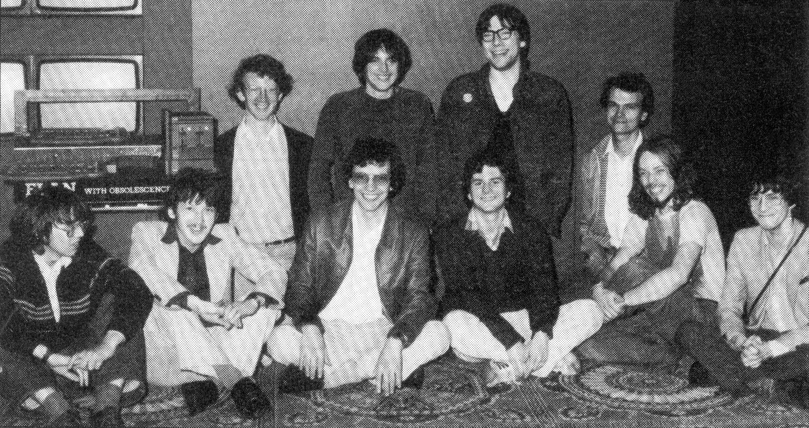

# Intelligent Software Ltd

Стаття про компанію у [Personal Computer World 1983.04](https://archive.org/details/PersonalComputerWorld1983-04/page/196/mode/2up)

*Фото з прес-презентації, що відбулася 17 вересня 1983 року. На презентацію також прийшли розробники шахових програм, тож вони теж є на знімку, хоча над самим Enterprise вони не працювали.*

*Верхній ряд (зліва-направо): [Брюс Таннер](../peoples/ec-uk/pers_bruce-tanner.md), Енді Стро, [Нік Вінсент](../peoples/ec-uk/pers_nick-vincent.md), [Річард Ланг](../peoples/ec-uk/pers_richard-lang.md)   
Нижній ряд (зліва-направо): [Марк Річер](../peoples/ec-uk/pers_mark-richer.md), Марк Тейлор, Девід Легг, [Мартін Лі](../peoples/ec-uk/pers_martin-lea.md), Ґарі (?), (???)*

[Intelligent Software](https://ep128.hu/Ep_Hardware/Intelligent_Software.htm) (угорською)