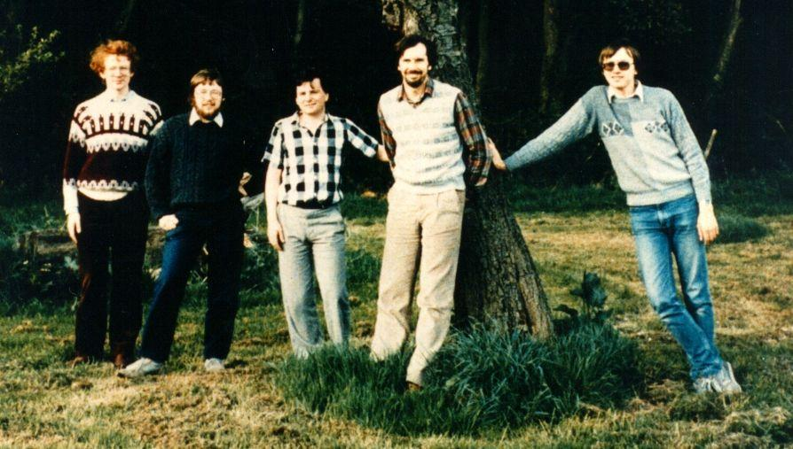

# Madge Networks

> Після банкрутства Enterprise Computers, яке потягнуло за собою й Intelligent Software, п'ятеро з нас заснували нову компанію під назвою Madge Networks. Цими п'ятьма були: Роберт Медж (колишній технічний директор в IS), я, Мартін Лі (автор EXOS), Марк Річер (який написав Enterprise LISP) та Роб Стаббс — інженер апаратного забезпечення.
> 
> IBM якраз тоді анонсувала свою мережеву технологію для оригінальних IBM PC, і вона базувалася на технології під назвою Token Ring, яка технічно була досконалішою та надійнішою за Ethernet. Тож ми розробили лінійку сумісних мережевих адаптерів для IBM PC та пізніших IBM AT. Протягом наступних 10 років ми були досить успішними та розширили компанію до понад 2000 співробітників по всьому світу. Я пішов звідти на самому піку її розквіту — Ethernet згодом витіснив усе, особливо коли з'явилася швидкість 100 Мбіт/с (Token Ring міг розганятися лише до 16 Мбіт/с), тож популярність Token Ring поступово зійшла нанівець, а разом із нею і Madge Networks.

> Після краху IS (Intelligent Software) ми заснували Madge Networks на фермі матері Роберта Меджа на околиці Лондона. Саме там я закінчив (а можливо, і почав?) роботу над VTDOS, і саме там улітку 1986 року було зроблено те фото на тлі дерева. Я не знаю, як саме вони врегулювали юридичні контракти, які мали бути укладені з IS — я в цю сторону справ не втручався.
> 
> Насправді ферма вже не була діючою — Джанет Медж (нехай спочиває з миром) просто тримала кількох коней. Але в міру того, як компанія Madge Networks поступово розросталася, вона один за одним переобладнувала старі фермерські будівлі та амбари під офіси. Зрештою амбари у нас закінчилися, і відділу продажів та маркетингу довелося переїхати у справжні офісні приміщення, тож на фермі знову залишилися самі лише розробники!

https://en.wikipedia.org/wiki/Madge_Networks