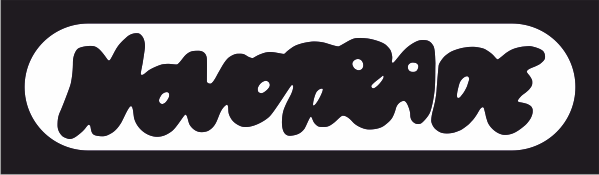

# Novotrade

Компанію Novotrade (акціонерне товариство) заснували у січні 1983 року 4 банки та 93 підприємства (засновники: Габор Реньї, Йожеф Сіладьї). Спочатку її профілем були імпорт та дистрибуція обчислювальної техніки, розробка програмного забезпечення для вимірювальних приладів і поліграфічна діяльність. Ринок домашніх комп'ютерів на Заході тільки-но починав стрімко розвиватися, коли Габору Реньї спало на думку зайнятися торгівлею ігровим ПЗ. На той час він уже був знайомий із Робертом Стайном — емігрантом 1956 року та керівником видавництва програмного забезпечення Andromeda. Завдяки цьому Novotrade швидко налагодила зв'язки із західними видавцями, на замовлення яких в Угорщині почали створювати ігри для C64, Spectrum, а пізніше для MSX та CPC.

Ігри розробляли сторонні молоді програмісти — часто студенти вишів — які брали участь у конкурсах, оголошених Реньї. Робота велася як за власними ідеями розробників, так і за концепціями замовників. Частину ігор (наприклад, [Caesar the Cat](../sf-games/c/caesar-a-cica-zx.md)) видала британська компанія Mirrorsoft — софтверний підрозділ газети Daily Mirror, але ігри від Novotrade випускали також Quicksilva, Ocean, Mastertronic, Commodore, Virgin та Activision. Згодом із програмістів-одинаків та дуетів, які працювали у форматі «партизанів», [Донат Кіш](../peoples/hu/pers_donat-kiss.md) сформував повноцінні команди. З'явилися колективи, що спеціалізувалися на Commodore та Z80.

Хоча Novotrade і раніше співпрацювала з компанією Enterprise (на замовлення були створені [Eggs of Death](../sf-games/e/eggs-of-death.md) та [Mirror World](../sf-games/m/mirror-world.md)), спеціальна команда для розробки програм саме під Enterprise сформувалася у 1987 році — після появи цих комп'ютерів в Угорщині. Вона отримала назву ['a' Studio](a-studio.md), а до її складу увійшли [Дьйордь Апор](../peoples/hu/pers_gyorgy-apor.md), [Ласло Сентторняї](../peoples/hu/pers_laszlo-szenttornyai.md), [Вільмош Копачі](../peoples/hu/pers_vilmos-kopacsy.md) та [Ференц Тілеш](../peoples/hu/pers_ferenc-tilesch.md), які й до цього створювали досить успішні ігри для Novotrade.

Штатними співробітниками були [Ігнац Фетсер](../peoples/hu/pers_ignac-fetser.md) та [Ференц Штенглер](../peoples/hu/pers_ferenc-staengler.md), які утворили команду [NASA & Guy](../peoples/community/oldschool/nasa-guy.md). Універсальним керівником був [Вільмош Копачі](../peoples/hu/pers_vilmos-kopacsy.md) — він і був тим самим «Guy» (а також співвласником ['a' Studio](a-studio.md)). Першими роботами цієї команди стали демки NasaGuy.

*(інформація узята з сайту [ep128.hu](https://ep128.hu/Ep_Demo/Leiras/NasaGuy.htm))*

[Сторінка компанії на сайті MobyGames](https://www.mobygames.com/company/1752/appaloosa-interactive-corporation/)