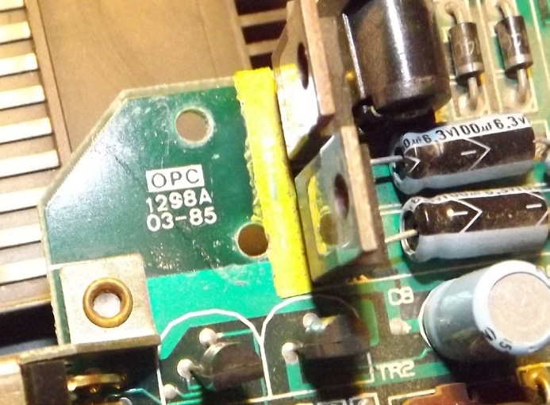

# OPC Manufacturing Ltd

[https://web.archive.org/web/20230131230926/http://www.hkexporter.net/electronic/circuit/opc-manufacturing.html](https://web.archive.org/web/20230131230926/http://www.hkexporter.net/electronic/circuit/opc-manufacturing.html)

[https://web.archive.org/web/20060519105852/http://www.meadvillegroup.com/eng/e_opc_profile.html](https://web.archive.org/web/20060519105852/http://www.meadvillegroup.com/eng/e_opc_profile.html)

(Oriental Printed Circuits)

Займалась виробництвом двосторонніх друкованих плат.

    

Компанія **Oriental Printed Circuits Limited (OPC)** була заснована у травні 1982 року. Спершу вона спеціалізувалася на виробництві двосторонніх друкованих плат із металізованими наскрізними отворами (PTH) для ринку споживчої електроніки. Восени 1986 року OPC увійшла до складу Meadville Technologies Group (MTG). Це об'єднання дозволило створити єдиний у Гонконзі вертикально інтегрований бізнес із виробництва друкованих плат. Компанія пройшла сертифікацію ISO9002 у 1995 році та ISO14001 у 2001 році. 

Щоб задовольнити ринковий попит, OPC у 1998 році першою серед виробників друкованих плат у Гонконзі встановила верстат для лазерного свердління. Разом із впровадженням передового процесу горизонтального імпульсного гальванічного покриття це дозволило випускати плати з високою щільністю з'єднань (HDI) та лазерними мікровідводами.

У 2001 році OPC розробила технології для надання рішень у сфері підкладок для напівпровідникових корпусів. Ці рішення охоплюють такі типи корпусів, як Chip Scale Packaging, Plastic Ball Grid Array, Ball Grid Array, System in Package, а також інші варіанти одно- та багаточипового пакування.
