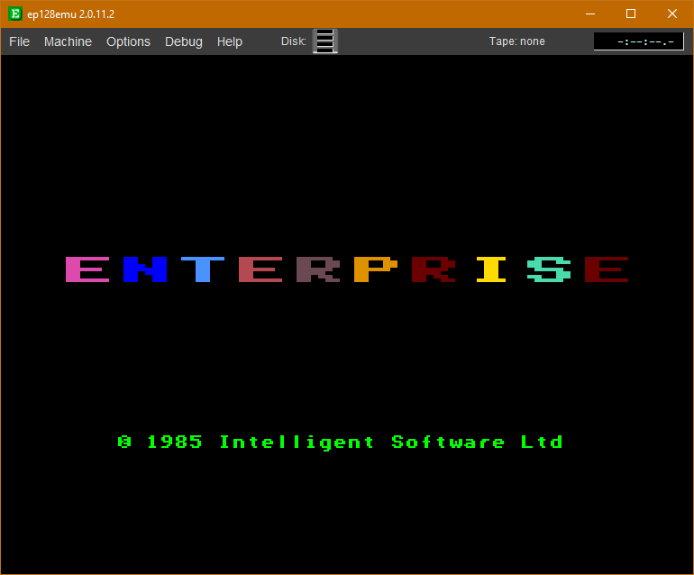
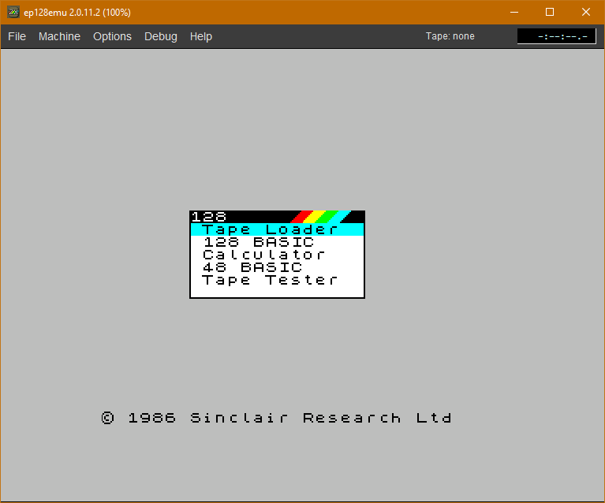
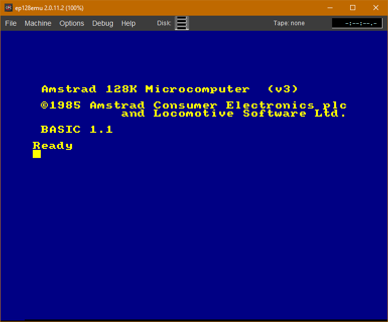
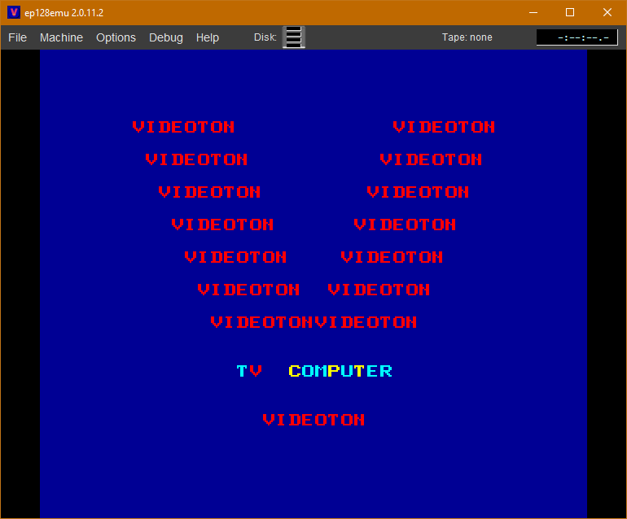

# ep128emu

 
 

Автор: [István Varga](../peoples/community/istvanv.md)  
[Сторінка проекту](https://ep128emu.enterpriseforever.com)  
[Сторінка проекту](http://ep128emu.sourceforge.net)  
[Актуальний вихідний код](https://github.com/czo/ep128emu)  
Платформа: Windows (32 bit), Linux & MacOS X (32 and 64 bit)

> ep128emu — це портативний емулятор комп'ютерів **Enterprise 128**, ZX Spectrum 48/128, Amstrad CPC 464/664/6128 та Videoton TVC із відкритим вихідним кодом. Він написаний на C++ та підтримує платформи Windows і POSIX (успішно протестований на 32- та 64-бітних версіях Windows, Linux, а також на MacOS X.  
> Програма забезпечує точну та високоякісну апаратну емуляцію, проте її системні вимоги є вищими, ніж у більшості інших емуляторів.

На сьогоднішній день EP128Emu є найбільш точним емулятором Enterprise для ПК і надає найбільшу кількість можливостей, хоча новачкам він може здатися складним у використанні. 

[EP Wiki](https://wiki.enterpriseforever.com/index.php?title=EP128Emu_manual)

## libretro core

На основі даного емулятора було створене ядро для Libretro.

[EP Wiki](https://wiki.enterpriseforever.com/index.php?title=Ep128emu-core_le%C3%ADr%C3%A1s)  
[github](https://github.com/zoltanvb/ep128emu-core)

[https://docs.libretro.com/library/ep128emu/](https://docs.libretro.com/library/ep128emu/)  
[https://retropie.org.uk/docs/Enterprise-128/](https://retropie.org.uk/docs/Enterprise-128/)