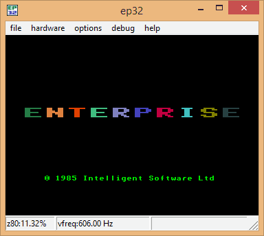

# EP32

Автор: [Vincze Béla György](../peoples/community/oldschool/exosworm-egzo.md)  
[Сторінка проекту](https://ep32.vbnet.hu)
Платформа: Windows (32 bit)

Один з старих емуляторів. Був розроблений на основі емулятора [Enter](em-enter.md) від [Кевіна Такера](../peoples/pers_kevin-thacker.md).

В даний час використання даного емулятора не рекомендується, хоч він колись і був доволі популярним. EP32 давно не оновлявся та коректно не емулює деякі апаратні особливості платформи.