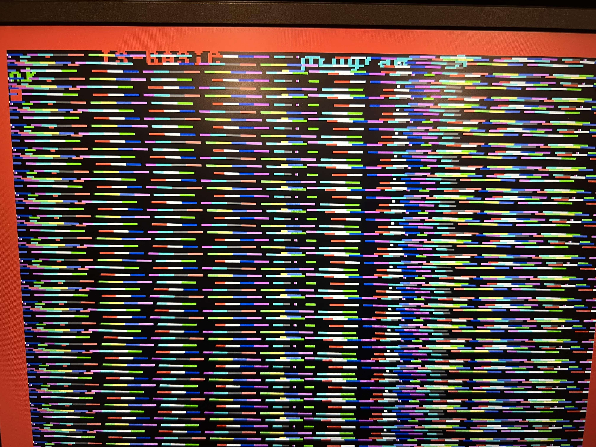
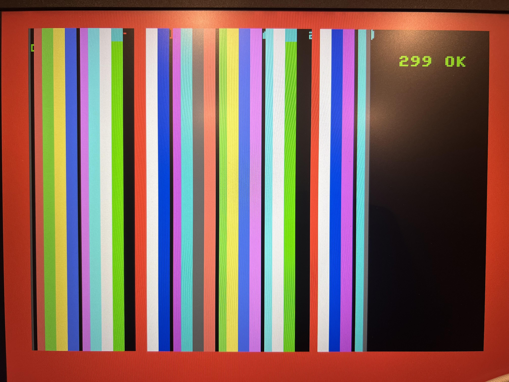
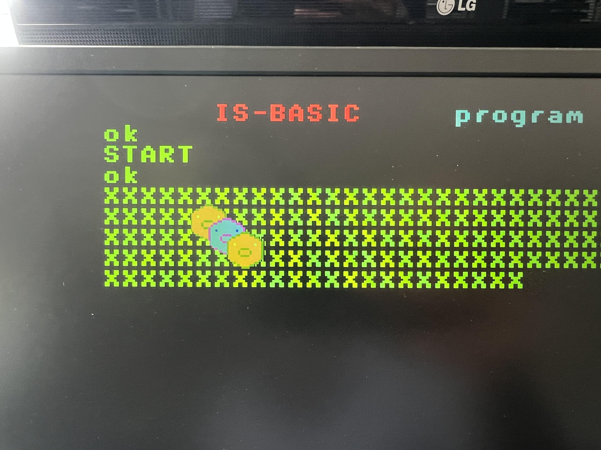
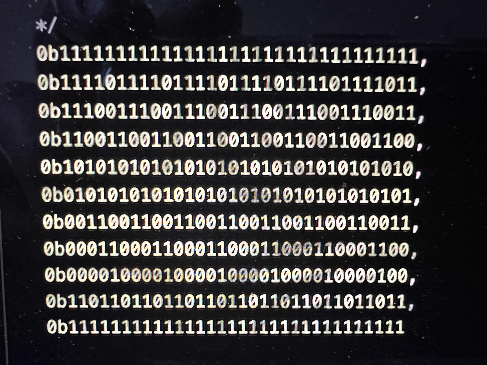
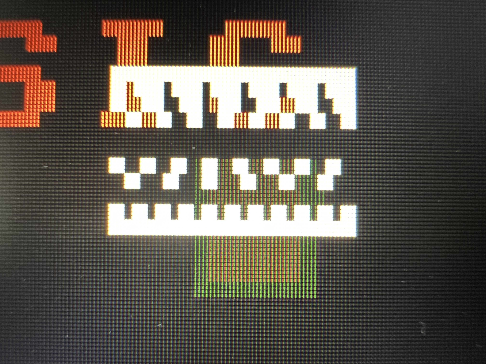
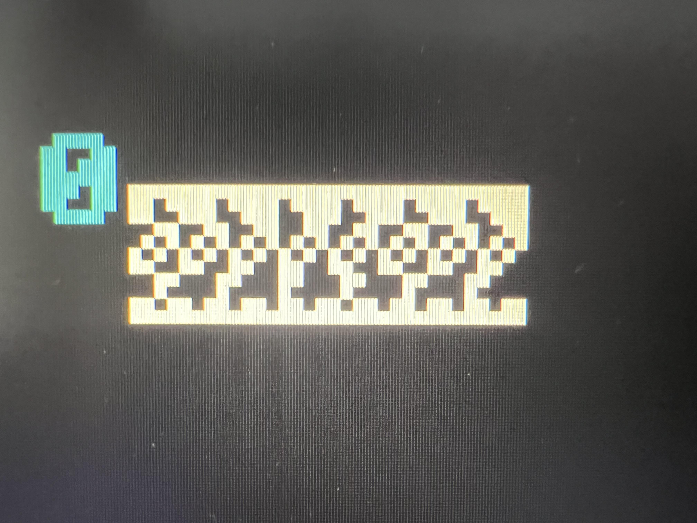

# Коментарі

Переклад з угорської постів [kvaczko](../../peoples/community/kvaczko.md) про процес розробки [карти 2dfx](../hv-2dfx.md) створено за допомогою ШІ Gemini.

## Частина 1

[Оригінал повідомлення](https://enterpriseforever.com/hardver/a-nick-elfeledett-titka/msg95564/#msg95564)

Привіт усім!

Я вже багато разів казав, що розробники Enterprise були геніями, без винятку. Це стосується і промислового дизайну, і всієї архітектури машини, і продуманої операційної системи [EXOS](../../software/ss-exos.md), і суперздібностей чипів [DAVE](../hm-dave.md) та [NICK](../hm-nick.md), а також тисячі інших дрібниць, які навіть неможливо перелічити. Дуже шкода, що фінал цієї історії став саме таким, але попри це ми все ще тут і підтримуємо життя в цій машині.

Для комп'ютера було створено чимало периферійних пристроїв, але одна річ до сьогодні ніколи не була у фокусі уваги — це здатність [NICK](../hm-nick.md) через п'ять своїх виділених вхідних ліній (які також виведені на роз'єм розширення шини) приймати зовнішній колірний сигнал. На практиці це означає, що піксель, який [NICK](../hm-nick.md) генерує в даний момент, можна перевизначити й відобразити будь-який колір із поточної **16-колірної** палітри замість того, що мав би намалювати сам [NICK](../hm-nick.md). Головний «вау-фактор» тут полягає в тому, що це стосується кожного *фізичного* пікселя, а не лише *логічних* пікселів, які прораховує [NICK](../hm-nick.md).

Що саме під цим мається на увазі?

Щоб зрозуміти це, зробімо крок назад і погляньмо, чим взагалі є [NICK](../hm-nick.md) із технічної точки зору. Роботу [NICK](../hm-nick.md) дуже легко уявити як «кінцевий автомат», більш відомий англійською як *Finite State Machine* (FSM). Працюючи на певній тактовій частоті, він переходить між дискретними, чітко визначеними станами, а ці зміни станів керуються фіксованим набором умов. Головною такою системою умов є сама [LPT](../../programming/system-info/nick/lpt.md) (таблиця параметрів рядків), яка для кожного окремого рядка пікселів (точніше: растрового рядка, або англійською — *scanline*) задає роздільну здатність, ліву та праву межі, доступні кольори, а для генерації самих пікселів — адресу розташування даних пікселів у відеопам'яті. Дані пікселів, завантажені у відео-RAM, безпосередньо визначають колір послідовних пікселів (до того ж остання за допомогою різних хитрощів дозволяє відображати символи або навіть використовувати техніку малювання в текстово-атрибутному режимі).

Отже, [NICK](../hm-nick.md) не робить нічого іншого, окрім як циклічно повторює цю послідовність [LPT](../../programming/system-info/nick/lpt.md) від моменту ввімкнення до вимкнення комп'ютера, змінюючи свої стани відповідно до описаних у ній умов. Сам по собі [NICK](../hm-nick.md) не інтерпретує «текст» або «графічні об'єкти» — він послідовно генерує піксельні шаблони на основі [LPT](../../programming/system-info/nick/lpt.md), відеорежиму та вмісту відеопам'яті. А чи стане це для користувача символом, графікою, екраном із атрибутами чи чимось іншим, визначається виключно таблицею [LPT](../../programming/system-info/nick/lpt.md) та даними в пам'яті. Під час обробки [LPT](../../programming/system-info/nick/lpt.md) визначаються поточні завдання чипа (адже його тактова частота постійно цокає), а на його виході з'являються самі дані пікселів (або сигнали синхронізації HSYNC та VSYNC) — рядок за рядком, піксель за пікселем.

У реальній моделі [NICK](../hm-nick.md) цей механізм роботи реалізовано так: його піксельна тактова частота **≈14.23 МГц** приводить у дію лічильник Джонсона, що складається з **восьми D-тригерів** (D flip-flops) і генерує **16** різних станів. Ці **16** різних станів використовуються для визначення того, яка саме задача є наступною для [NICK](../hm-nick.md). Зараз я не буду заглиблюватися в деталі, оскільки існує дуже хороший опис цього процесу, а також дві схеми [NICK](../hm-nick.md) формату **А0**, які ви могли бачити на стіні під час святкування 40-річчя комп'ютера. Крім того, кілька років тому [IstvanV](../../peoples/community/istvanv.md) написав багато розлогого матеріалу з поясненнями тут на форумі.

Один повний горизонтальний рядок має довжину в **912** тактів піксельного клоку. Оскільки внутрішній таймінг [NICK](../hm-nick.md) оперує групами по **16** піксельних тактів, це сумарно дає **57** таких часових груп, або «колонок». Тобто одна така колонка відповідає тривалості виведення **16** фізичних пікселів. У режимі [TEXT 40](../../manuals/is-basic-man-en/commands/man_cs-text.md) у видимій області **40** таких колонок забезпечують звичну ширину текстового екрана.

Число **912** є, звісно, теоретичним значенням для користувача — побачити всі ці пікселі неможливо, оскільки існує так званий період гасіння (blanking period), під час якого, наприклад, формується сигнал рядкової синхронізації (HSYNC), необхідний для нормальної роботи телевізорів. Також є цілі екранні рядки, які або випадають із видимої зони (у випадку традиційних кінескопних телевізорів), або необхідні для кадрової синхронізації (VSYNC). Крім того, існують групи з **16** тактів, які слугують для того, щоб [NICK](../hm-nick.md) взагалі міг зчитати таблицю параметрів рядків або блок параметрів рядка ([LPB](../../programming/system-info/nick/lpt.md)) з неї, чи байт за певною адресою у відео-RAM. А ще є, наприклад, ліве та праве поля (бордюри), під час розгортки яких NICK незалежно ні від чого виводить колір рамки.

Через особливості побудови внутрішніх схем [NICK](../hm-nick.md) існують різні відеорежими та відповідна їм максимальна кількість кольорів: у режимі [HIRES 2](../../manuals/is-basic-man-en/commands/man_cs-graphics.md) / [TEXT 80](../../manuals/is-basic-man-en/commands/man_cs-text.md) хоч і доступно лише два кольори, але горизонтальна роздільна здатність у цьому випадку є максимальною — у колонці видно всі **16** пікселів. Водночас у **256**-колірному режимі ці **16** фізичних пікселів стискаються до **2**-х логічних пікселів, тобто фактично один логічний піксель визначає собою вісім фізичних пікселів.

З точки зору фінального виводу, [NICK](../hm-nick.md) у кожному такті піксельного клоку видає колір одного фізичного пікселя. Різні відеорежими змінюють не цей фізичний ритм пікселів, а те, скільки таких фізичних пікселів одночасно визначається даними, зчитаними з відеопам'яті. Повному використанню горизонтальної роздільної здатності користувачем заважає те, що при заданій тактовій частоті та фіксованих **16**-тактових циклах [NICK](../hm-nick.md) здатний зчитати та обробити лише обмежену кількість піксельних даних із відео-RAM. Звісно, не треба зайвий раз пояснювати, що для збереження **256** кольорів потрібен цілий байт даних у відео-RAM, а для збереження двох кольорів — лише один біт. Отже, у двоколірному режимі один зчитаний із відео-RAM байт містить дані про вісім пікселів, а в **256**-колірному — лише про один. Таким чином, кількість логічних пікселів обернено пропорційна максимальній кількості кольорів, які можна використовувати у відеорежимі (режими [ATTR](../../programming/system-info/nick/lpt.md)(атрибутний) та [CHR](../../programming/system-info/nick/lpt.md)(текстовий) — це трохи інша історія, в яку я не заглиблюватимусь).

Повертаючись до початкової теми: [NICK](../hm-nick.md) має **п'ять** виділених вхідних ніжок/точок підключення, з якими за останні роки тут було проведено кілька цікавих експериментів. Схемотехнічно всередині чипа ці входи підключені безпосередньо до вузла формування фізичного пікселя. Тобто, власне кажучи, вони дозволяють перевизначити колір наступного реального фізичного пікселя майже повністю незалежно від стану кінцевого автомата (FSM).

Ось ці п'ять входів: `/EXTC` та `EC0-3`. Сам по собі `/EXTC` — це і є «Перемикач», сигнал із активним низьким рівнем; тобто він спрацьовує тоді, коли ми притискаємо цю лінію до логічного нуля. У цей момент [NICK](../hm-nick.md) виводить на екран не той колір пікселя, який він прорахував сам, а колір, що відповідає чотирибітному значенню, яке надходить по лініях `EC0–EC3` із поточної [**16**-колірної палітри](../../programming/system-info/info_colour-palette.md).

Це призводить до того, що кожен окремий фізичний піксель [NICK](../hm-nick.md) може мати будь-який колір у межах **16**-колірної палітри, незалежно від поточного встановленого відеорежиму.

Простіше кажучи: якщо зовнішня схема зможе достатньо точно, підлаштовуючись під піксельний клок [NICK](../hm-nick.md), надсилати кольори на лінії `EC0–EC3`, то на оригінальну картинку [NICK](../hm-nick.md) можна буде «накласти/домалювати» нові пікселі, взагалі без модифікації початкової відеопам'яті комп'ютера.

Саме з цим я почав інтенсивно експериментувати протягом останніх двох місяців, і про цей досвід, а також про отримані результати я й розповім далі.

## Частина 2

[Оригінал повідомлення](https://enterpriseforever.com/hardver/a-nick-elfeledett-titka/msg95584/#msg95584)

> [!NOTE]
> **Дисклеймер:** Цей цикл статей, окрім самої розповіді, має базову науково-популярну мету, водночас автор намагається зробити його цікавим і подекуди розважальним. Тому ви читаєте не докторську дисертацію, яка замінює технічний паспорт (datasheet): багато другорядних відгалужень та специфічних режимів роботи я навмисно не розкриваю в усій глибині. Якщо якась деталь буде важливою для наступних частин, я все одно повернуся до неї.

Щоб рухатися далі, варто прояснити кілька речей щодо таймінгів (часових затримок) — ці базові цифри також необхідні для розуміння подальшого матеріалу.

У нашому випадку [NICK](../hm-nick.md) генерує вихідний відеосигнал, що відповідає стандарту PAL. Цікавий факт: в [описі NICK](http://enterprise.iko.hu/technical/NICK-Old-VDC-ELITE-description.pdf#page=7) є вказівки на те, що шляхом зміни піксельної тактової частоти (**≈14,23 МГц**) можна отримати відеовихід, який відповідає таймінгам NTSC або SECAM. Проте, наскільки мені відомо, комп'ютери Ентерпрайз є лише стандарту PAL, тому я не буду заглиблюватися в цю тему.

В інтернеті можна знайти безліч статей про PAL і детально ознайомитися з працями Вальтера Бруха (**Walter Bruch**), тому я згадаю лише найважливіші для нашої теми речі, а саме — таймінги.

Стандарт PAL був розроблений для традиційних телевізорів із кінескопом (електронно-променевою трубкою, ЕПТ) ще у 1967 році, де зображення «малюється» електронним променем рядок за рядком, кадр за кадром. Електронний промінь позиціонується відхиляючими котушками, розташованими на горловині кінескопа. Різні модифікації PAL використовувалися в кількох регіонах світу відповідно до місцевих потреб (наприклад, на адаптацію стандарту впливає частота змінного струму в електромережі конкретної країни — **50** або **60 Гц**). Важливий для нас таймінг PAL означає **625 телевізійних рядків** із частотою **50 напівкадрів на секунду**, що дорівнює **25** повним кадрам із черезрядковою розгорткою.

Через низку технічних причин, обмежень та успадкованих архітектурних особливостей того часу це слід уявляти так: лише половина з **625** телевізійних рядків оновлюється кожну п'ятдесяту частину секунди — один раз непарні рядки, інший раз парні. Технічний термін для цього — «напівкадр» (або англійською — *field*). Отже, за секунду відображається п'ятдесят таких напівкадрів, що дає 25 повних кадрів (*frames*).

З цією особливістю практично всі тогочасні мікрокомп'ютери поводилися досить вільно: вони не створювали справжнього черезрядкового зображення (interlace), а фактично змушували промінь малювати обидва напівкадри один поверх іншого. Таким чином, зображення оновлювалося з частотою **50 Гц**, але розраховувати доводилося на прогресивну (нечерезрядкову) картинку об'ємом приблизно в **312** рядків, замість **625** різних ліній. Звісно, Enterprise і тут вирізняється, оскільки [NICK](../hm-nick.md) здатний працювати в режимі інтерлейсу (interlace mode) — у цьому випадку вертикальна роздільна здатність подвоюється, а характерною ознакою цього режиму є помітне мерехтіння екрана. Оскільки цей режим використовується вкрай рідко, надалі я його не розглядатиму, і ми зупинимося на традиційній вертикальній роздільній здатності в **312** рядків — саме з нею і проводилися експерименти.

Виведення одного напівкадру триває майже рівно **20 мс** (оскільки за **1** секунду виводиться **50** напівкадрів, то **1 сек**/**50**=**0,020 сек** на напівкадр). Оскільки напівкадр містить **312** рядків (насправді рівно **312** з половиною, але від цієї половинки ми знову ж таки елегантно абстрагуємося), на виведення одного екранного рядка відводиться загалом **64 мкс**. У моєму попередньому дописі йшлося про те, що в одному рядку [NICK](../hm-nick.md) генерує **912** тактів синхронізації, тобто теоретично є час на **912** фізичних пікселів.

Шляхом швидкої операції ділення стає зрозуміло, що на прорахунок одного фізичного пікселя є **≈70 нс**. Попервах це звучить не дуже обнадійливо, адже якщо перенести це на практику, нам знадобилося б залізо, здатне обчислити колір пікселя за ці **70 нс**. Це, звісно, можливо, але не зовсім життєздатно — особливо з огляду на те, що ми хочемо бачити на екрані не просто статичну випробувальну таблицю, а генерувати більш осмислений, динамічно змінний вміст зображення, від якого згодом буде реальна користь. Повторюся: це складно, але можливо.

Для простого вирішення цієї проблеми існують два загальноприйнятих методи: використання **лінійного буфера (line buffer)** або **кадрового буфера (frame buffer)**. Обидва працюють за однаковим принципом, і далі на їхній основі я розрахую необхідні розміри пам'яті.

Базова логіка буферних рішень полягає в тому, щоб розділити завдання і думати наперед. Перш за все, створимо два тимчасових сховища — тобто подвійний буфер (double buffer). Одна частина програмного коду працює незалежно від усього іншого, з точними таймінгами, і не робить нічого, окрім як методично, дані за даними, виштовхує з себе вміст одного з буферів (рядкового або повного кадрового) на кожному такті піксельного клоку, підлаштовуючись під сигнали синхронізації. Коли буфер порожніє (кінець рядка або кадру), ця частина коду перемикається на інший буфер і починає вивід даних спочатку, але вже з другого сховища. Завдання іншої частини коду — заповнити той буфер (рядковий або кадровий), який наразі не використовується, даними для наступного рядка або кадру. Просто як дверей, принаймні в теорії.

При використанні лінійного буфера ми вже маємо цілих **64 мкс** на те, щоб обчислити кольори пікселів для наступного рядка. У випадку з кадровим буфером таке часове вікно розширюється до **20 мс**, але натомість нам потрібно заздалегідь прорахувати дані для всього кадру повністю.

Звичайно, розмір подвійного тимчасового сховища відповідає цим завданням: якщо припустити, що колір пікселя визначається **чотирма бітами** (як на зовнішніх колірних входах [NICK](../hm-nick.md) — сигнали `EC0-EC3`), і таким чином в одному байті ми можемо зберігати колір двох пікселів, то розмір одного рядкового буфера становитиме **912** / **2** = **456** байтів. Оскільки нам потрібні два лінійних буфери, це вимагатиме **912 байтів** ємності.

У випадку з кадровим буфером ми отримуємо куди солідніші цифри — адже тут нам потрібно зберігати дані не для одного рядка, а для цілого кадру, тобто для **312** рядків, та ще й у подвійному обсязі через подвійну буферизацію. Математика тут наступна: **912**/**2**×**312**×**2** = **284,544** байти, тобто майже **277 кБ**!

Звісно, це теоретичні розрахунки. Стандарт визначає, що з **625** рядків лише **576** можуть містити корисну інформацію зображення — це становить **288** рядків на напівкадр (і в нашому випадку — на кадр). Час розгортки рядка визначено так, що з **64 мкс** невидима частина зображення займає близько **12 мкс**, тож видима область триває **52 мкс**. У перерахунку на піксельний клок NICK (фізичні пікселі) це становить **741 піксель**, тобто **≈46,3** колонки. Якщо рахувати повними колонками по **16** піксельних тактів, то з цього об'єму можна комфортно використовувати **46** колонок, або **736 фізичних пікселів**.

Якщо визначати розмір лінійного або кадрового буфера на основі цих цифр (адже навіщо зберігати в них те, що все одно не поміститься на екрані), то розмір подвійного лінійного буфера складе **736 байтів**, а розмір подвійного кадрового буфера — **211 968 байтів**, тобто рівно **207 кБ**.

У наведених вище розрахунках для простоти я враховував лише **4-бітне** значення кольору. Спосіб керування лінією `/EXTC` — це окреме питання: його можна було б зберігати як окремий біт для кожного пікселя, але це можна вирішити й за допомогою окремої логіки. Метою цього розрахунку було лише показати порядок величин та обсяг даних.

З огляду на все це, з апаратної сторони для забезпечення безперервного «годування» [NICK](../hm-nick.md) мають виконуватися такі мінімальні умови:

1. Залежно від обраного методу буферизації, необхідне сховище (пам'ять) об'ємом **736 байтів** або **207 кБ**. Воно має бути достатньо швидким, щоб за час, що не перевищує **70 нс**, видавати з себе **чотири біти** (колір наступного пікселя) при зчитуванні. Водночас інша схема повинна мати можливість (асинхронно) заповнювати це сховище новими піксельними даними. Тобто нам потрібна або справжня двопортова пам'ять (dual-port RAM), або така архітектура пам'яті та шини, де зчитування та фонове заповнення не заважають одне одному.
2. Необхідна швидка схема, яка в ідеальній синхронізації з сигналами `/VSYNC`, `/HSYNC` та піксельним клоком **≈14,23 МГц** зможе зчитувати з пам'яті кожні **70 нс** відповідні **чотири біти** колірної інформації та подавати їх на входи `EC0-EC3` чипа [NICK](../hm-nick.md) точно в потрібний момент.
3. Потрібна логіка, яка за відповідним внутрішнім алгоритмом зможе генерувати кольори пікселів для наступного рядка (*line*) або наступного кадру (*frame*) і завантажувати їх у неактивну на даний момент частину подвійного буфера.
4. Необхідний інтерфейс, який пов'яже користувача з вищезгаданим внутрішнім алгоритмом і дозволить користувачеві вказувати, що і на якому пікселі він хоче розмістити (і ці вказівки також потрібно десь тимчасово зберігати, щоб внутрішній алгоритм міг розподілити їх по відповідних ділянках буфера).

## Частина 3

[Оригінал повідомлення](https://enterpriseforever.com/hardver/a-nick-elfeledett-titka/msg95604/#msg95604)

Гаразд, отже ми зупинилися на тому, що для цього трюку потрібне потужне залізо, якщо є бажання зробити все як слід і створити дійсно корисну річ.

Це не та штука, яку можна зліпити «на коліні» з логічних TTL-вентилів, щиро кажучи, тут уже без магії не обійтися... 🙂 Є два притомних варіанти: FPGA або MCU (мікроконтролер).

Я вже неодноразово казав, що не тямлю в FPGA, головним чином тому, що в FPGA все відбувається паралельно — якщо хочете, одночасно, заздалегідь визначеним чином і в часі. Тобто за умови збігу певних зірок результат з'являється практично миттєво. Це зовсім інший підхід порівняно з класичним послідовним програмуванням. Знаю-знаю, це не зовсім так, адже всередині FPGA також можуть бути речі, які виконуються послідовно, а не паралельно, і їх найкраще реалізовувати за допомогою витончених кінцевих автоматів (state machines) і так далі, і так далі. У будь-якому разі, до мого розуміння того, як це найкраще зробити в FPGA, ще дуже далеко. Я вже почав поверхово вивчати цю тему — у майбутньому в мене обов'язково буде проєкт на FPGA... 🙂 До того ж варто додати, що мікросхеми FPGA зазвичай порівняно дорогі, і сьогодні виробляють переважно такі, що не витримують 5-вольтні рівні сигналів TTL, які використовуються в Enterprise. Вони витримують максимум 3.3 В, інакше просто згорять, тому в такому випадку доведеться продумувати ще й схеми узгодження рівнів (level shifters) як обв'язку для FPGA. Менше з тим, факт залишається фактом: у майбутньому мені доведеться зосередитися на цьому, і це обіцяє бути веселою пригодою.

Наразі для мене єдиним вибором залишалося рішення на мікроконтролері (MCU), хоча б тому, що багато десятиліть тому я вчився на програміста. Тоді мені в голову забивали всю красу алгоритмізації, якою, як на мене, я володію непогано — незалежно від того, що насправді програмувати (або, висловлюючись сучасною модною мовою, кодити) я не люблю і не вмію. Моїх старих спогадів про Turbo Pascal 6.0 тут замало. 🙂

Мікроконтролери мають ту перевагу, що, по-перше, вони мають багато GPIO (General Purpose Input Output), тобто виводів, які користувач може вільно програмувати як входи або виходи. По-друге, в них апаратно реалізовано безліч готових інтерфейсів, як-от SPI (для SD-карт) або I2C (для мікросхем годинника реального часу). Вони обробляють переривання, мають досить велику внутрішню флеш-пам'ять для зберігання програм і власну надшвидку оперативну пам'ять (RAM) прямо на кремнієвому кристалі. Крім того, я вже маю досвід роботи з ними у своїх різних проєктах. Усе це робить їхнє використання майже ідеальним.

Майже. Оскільки в нашому конкретному випадку їхнім найбільшим недоліком є те, що неможливо передбачити, коли саме відбудеться та чи інша дія. Наступна частина буде дещо неточною з технічної точки зору, попереджаю одразу. Якщо я скажу, що хочу, наприклад, увімкнути ті п'ять GPIO, які я підключив до входів `/EXTC` та `EC0-3` відеоконтролера NICK, це ніколи не відбувається миттєво, а «колись потім». На перший погляд це здається нелогічним: ось є скомпільований код на C, MCU слухняно виконує інструкції одну за одною, я знаю, скільки тактових циклів займає одна інструкція — то як це так, що все відбувається не тоді, коли, на мою думку, мало б? Річ у тім, що середньостатистичний (навіть 8-бітний) MCU поводиться далеко не так передбачувано, як, скажімо, процесор Z80 в Enterprise. Почнімо з того, що більшість із них мають певний кеш інструкцій, де намагаються вгадати, які команди будуть наступними, і певним чином готуються до цього. На першому ж розгалуженні коду (conditional branch) ця логіка рушиться: навіть якщо наступна інструкція і, боронь боже, пара даних уже в кеші, виявляється, що продовжувати роботу потрібно зовсім в іншому місці, ніж планувалося. Це вже викликає невелику затримку. Те саме відбувається, коли йде читання з флеш-пам'яті або запис у RAM — усе це забирає час, подекуди в поєднанні з тактами очікування (wait states). Або коли мікроконтролер виконує якусь рутину переривання для своїх фонових процесів, абсолютно незалежно від вашого коду. Ви не можете прорахувати це заздалегідь з точністю до такту. Само по собі при виконанні звичайної програми це не викликає проблем — ну яка різниця, якщо дані з SD-карти прийдуть на 1 мікросекунду пізніше? Ніякої. Але якщо повернутися до того, що ми маємо лише 70 наносекунд на те, щоб визначити колір пікселя і подати його на відповідні вихідні ніжки (GPIO), то достатньо всього 10 наносекунд «вагання» — і ми вже змістилися. Той піксель, про який ми думали, для NICK в цей момент може бути вже зовсім іншим. Коротше кажучи, у мікроконтролерах існує таке поняття, як «джіттер» (jitter — фазове тремтіння), яке в звичайних умовах може ні на що не впливати, але для нас таймінг — це один із найважливіших факторів.

Це завдало мені чимало клопоту, адже, як я писав у попередній частині, потрібно одночасно враховувати чотири базові умови. Їхній синхронний збіг є критично важливим для того, щоб ми могли в зрозумілий для NICK спосіб і час втрутитися у визначення кольору наступного пікселя.

І ось тут на сцену виходить лінійка продуктів RP235x від Raspberry. Цю мікросхему ви можете знайти в Raspberry Pi Pico 2, там використовується чип RP2350A; у ньому взагалі немає внутрішньої флеш-пам'яті, програми зберігаються в окремій маленькій зовнішній мікросхемі флеш-пам'яті. Мій вибір припав на версію **RP2354B**, яка, якщо не вдаватися в абсолютно всі деталі, має на борту таке:

- двоядерний процесор **Cortex-M33 ARM** із тактовою частотою **150 МГц**;
- **≈520 кБ SRAM**;
- **2 МБ** вбудованої флеш-пам'яті;
- **GPIO** з толерантністю до напруги **5 В**;
- **48** виводів **GPIO**;
- **DMA** (контролер прямого доступу до пам'яті);
- **USB 1.1** контролер без зайвих наворотів, що неймовірно спрощує оновлення прошивки, навіть згодом, коли пристрій уже є «готовим продуктом».

Дві речі роблять RP2354B ще привабливішим. Перша — це ціна, яка становить менше 2 доларів США. І якщо врахувати, що для його роботи потрібно лише кілька дрібних деталей (наприклад, кварцовий резонатор для тактування та пара пасивних компонентів), то запуск цієї штуки обходиться дешевше, ніж в одну тисячу форинтів (≈150 грн.). Друга річ, і, мабуть, найважливіша в цьому чипі — це те, що називається **PIO** (Programmable I/O). Описати PIO кількома словами важко, але найпростіше уявити його як крихітний окремий співпроцесор на тому ж кремнієвому кристалі, який, з одного боку, може мати прямий одночасний зв'язок із **32** лініями GPIO та контролером DMA мікроконтролера. Він має власну пам'ять програм об'ємом максимум **32** інструкції й гарантовано виконує кожну інструкцію рівно за один такт.

Для тих, хто вже стикався з цією темою, тут немає нічого нового, але у тих, хто бачить це вперше, можуть заблищати очі. Для нас це означає, що ми маємо блискавичний процесор, який робить свою справу у свій передбачуваний, хоч і трохи специфічний спосіб; маємо контролер DMA, який може до біса швидко переганяти дані з пам'яті в PIO без участі основного процесора; а сам PIO може за чітким розкладом, з точністю до такту, смикати GPIO. Таким чином, зовнішні інтерфейси нашого схильного до джіттеру процесора, якими ми підключаємося до NICK, перестають бути нестабільними.

Внутрішня архітектура практично повторює цю логіку:

- в оперативній пам'яті (RAM) мікроконтролера міститься лінійний буфер (line buffer) або кадровий буфер (frame buffer);
- MCU прораховує, що саме потрапляє в лінійний або кадровий буфер, і завантажує ці дані в RAM;
- MCU підтримує зв'язок із зовнішнім світом, де користувач через процесор Z80 каже, що має відбуватися;
- завдяки злагодженій роботі DMA та PIO вміст лінійного або кадрового буфера виводиться на підключені до NICK ніжки GPIO саме тоді й з такою швидкістю, як потрібно. При цьому всі таймінги формує сам PIO, оскільки він безпосередньо відстежує сигнали синхронізації та тактову частоту NICK на вхідній стороні.

І вуаля — усе готово! 🙂

А тепер зупинімося на мить. Уся ця розробка з моїм рівнем програмування не те що не зайшла б так далеко, вона б навіть не розпочалася. У мене є бачення, я будую алгоритми, зводжу процеси докупи, продумую описи інтерфейсів, прокручую це в голові, сумніваюся, шукаю якийсь хитрий підвох. Але у розробці безпосередньо прошивки, C-коду, PIO-програм та рішень із DMA величезну роль відіграв ChatGPT — спочатку модель OpenAI 5.4, а згодом 5.5. Не треба уявляти це так, ніби «я натиснув кнопку, і все само зробилося». Це було схоже скоріше на тривалий діалог: я давав апаратну концепцію, цілі щодо взаємодії з NICK, результати вимірювань, осцилограми, нові ревізії друкованих плат та нескінченні ідеї типу «а що, як зробити так...»; а ChatGPT перетворював усе це на робочий код C/PIO/DMA, алгоритми та кроки для пошуку багів. Тож можна скільки завгодно кривитися, мовляв: «ооой, знову цей ваш ШІ», але в цьому немає сенсу — інакше нічого б не вийшло.

Була виготовлена перша (а після того, як з'ясувалася нежиттєздатність початкової ідеї — і друга) друкована плата, першим відчутним результатом якої стало ось це:

 

😀 Гаразд, можливо це виглядає переконливіше:

 

...а потім ось це...

 

Для мене стало доведеним фактом, що зовнішні колірні входи NICK можна: 1) **дійсно**, 2) **стабільно** та 3) **повторювано** контролювати за допомогою зовнішнього заліза, побудованого на базі MCU RP2354B, синхронізованого з NICK. І це правильний напрямок розвитку.

Відтоді вороття вже не було.

## Частина 4

[Оригінал повідомлення](https://enterpriseforever.com/hardver/a-nick-elfeledett-titka/msg95634/#msg95634)

Першою конкретною метою всього проєкту було створення можливості використання зовнішніх колірних входів — а тобто, вивести на екран програмовані спрайти.

Мої перші тести пройшли досить успішно, але тепер зупинимося на апаратній частині трохи детальніше:

Оскільки в моїй голові ще не було чіткого розуміння того, як саме спрайтовий рушій буде керуватися з боку Enterprise, на першій платі я підвів до мікроконтролера все, що тільки могло знадобитися: всі лінії адреси, всі лінії даних, сигнали шини керування, і, звісно ж, `/EXTC` та `EC0-3`, а також `/HSYNC`, `/VSYNC` і `14M` (тактову частоту NICK). Мені не вдалося надійно впоратися з повноцінною шиною. Периферія PIO витискала все, що могла, але обробка виявилася настільки повільною через те, що доводилося, наприклад, декодувати певну адресу пам'яті або порт введення-виведення програмно, безпосередньо з ISR (рутини обробки переривань в MCU), що мені довелося уповільнити EP десь до 2,5 МГц. Так діло не піде, тому почалися роздуми та перепроектування.

Під час створення другої плати я вже обрав конкретний напрямок: узявши за основу логіку керування NICK, я придумав, що ми матимемо два порти введення-виведення, декодовані апаратно (і про всяк випадок буферизовані). Один — порт команд (command port), інший — порт даних (data port). Обидва працюють лише на запис, як і в NICK (так, із портів NICK можна вичитати якесь сміття, але я на це забив, це безглуздо). Після апаратного декодування потік даних запрацював як слід, мікроконтроллер «ловив сигнал» навіть від Enterprise, розігнаного до 10 МГц (навіть за допомогою команд `OTI`/`OTIR`), і я зміг почати роботу над структурою самого протоколу обміну.

Останній підхід (і я описую це лише тому, що це рішення залишилося і діятиме надалі) також прагнув схожості з мисленням розробників NICK: потрібна таблиця, в якій користувач може оновлювати базові параметри спрайтів, а MCU виконуватиме свою роботу на основі цієї таблиці. Маючи хорошу інтуїцію, я назвав її **SPT** (*Sprite Parameter Table*), а її окремі частини, що стосуються кожного спрайту зокрема — **SPB** (*Sprite Parameter Block*), за аналогією з парою **LPT** та **LPB** у NICK. Я дуже зрадів цьому, але за кілька тижнів, гортаючи архіви форуму, дізнався, що не я придумав цей велосипед — те саме зробив **balagesz** ще у 2017 році, щоправда, там усе закінчилося без реальної специфікації. Ну менше з тим. 🙂

Блок **SPB** для одного спрайту складається з таких елементів: порядковий номер спрайту, його видимість, початкова адреса даних у спрайтовій RAM, його X- та Y-позиція на екрані, а також розмір спрайту в пікселях (ширина та висота) і кілька додаткових керуючих бітів, які з'явилися трохи пізніше, про них я ще розповім. Тут також могла б фігурувати кількість фаз анімації та те, яка саме фаза має виводитися на екран, але про це я теж напишу згодом, бо в підсумку зробив інакше. Порядковий номер спрайту починається з нуля, що означає найнижчий пріоритет — тобто це буде той бідолаха, якого перекриватиме будь-який інший спрайт у разі накладання. 🙂

Уже тоді було очевидно, що для зберігання даних спрайтів мені доведеться використовувати внутрішню SRAM мікроконтролера, адже через невдалу роботу з шиною на першій платі я не знайшов іншого способу зберігати дані спрайтів або, скажімо, зчитувати їх безпосередньо з оперативної пам'яті Enterprise. Рішенням стало створення команди, після відправки якої в порт команд мікроконтролер переходить у стан «очікування даних спрайту», а далі в порт даних можна «заливати» самі дані спрайту, передавши чотири параметричні байти, які MCU потім зберігає у своїй RAM.

Внутрішня SRAM мікроконтролера становить **≈520 кБ**, з яких під зберігання спрайтових даних було виділено **256 кБ**. Цей об'єм завжди фіксовано доступний користувачеві, і він може розпоряджатися ним як завгодно. Завантаження даних спрайту відбувається так: із чотирьох параметричних байтів **18 бітів** відведено під початкову адресу у спрайтовій RAM, а решта **14 бітів** — під кількість завантажуваних даних у байтах. Таким чином, за одну команду завантаження можна передати максимум **16384** байти спрайтових даних. Це зручно й з тієї точки зору, що користувацька програма може зчитати один сегмент даних з SD-карти або касети, одним рухом записати його у спрайтову RAM, а потім продовжити з наступною порцією — якщо в цьому є потреба.

Суттєвим стало й питання про те, як керувати входом `/EXTC` мікроконтролера NICK. Інакше кажучи, як сказати йому, чи має зараз виводитися «наш» колір для конкретного пікселя, чи цей піксель має бути прозорим (тобто на екрані має відображатися піксель, згенерований самим NICK). Спочатку була ідея, щоб колір під індексом 0 керував лінією `/EXTC`: якщо піксель спрайту має нульовий колір палітри, він стає прозорим. Спершу це здавалося непоганим рішенням, але згодом через буферизацію/PIO та загальну «упаковку» в MCU процес став складнішим, а головне — забирав надто багато часу. Обчислення цієї прозорості та відповідне керування через GPIO суттєво збільшували час рендерингу. Мені це не подобалося.

Третя плата вже проєктувалася з урахуванням апаратного 4-бітного компаратора. Він порівнює два 4-бітних числа, і в разі їхньої ідентичності на його виході встановлюється низький рівень. Щоправда, «активний низький» рівень нам не зовсім підходить, адже при збігу нам потрібен високий рівень, а в інших випадках — низький, але це легко вирішується інвертором. Принцип роботи такий: на MCU є чотири додаткових виходи GPIO, які підключені до одного з 4-бітних входів компаратора. На інший 4-бітний вхід компаратора подається сигнал кольору `EC0–EC3`, який іде з MCU і означає колір поточного пікселя для NICK. Для чотирьох нових виходів GPIO я створив команду, яка, залежно від свого номера, встановлює цей 4-бітний вихід у потрібне нам значення. А вихід компаратора через інвертор безпосередньо керує ніжкою `/EXTC` чіпа NICK. Простіше кажучи: однією командою можна задати прозорий колір, а сигналом прозорості в бік NICK тепер завідує крихітна окрема залізяка. Це не ускладнило загальну логіку, а користувачеві дало можливість призначити прозорим абсолютно будь-який колір із 16-колірної палітри. Крім того, оскільки тепер на один піксель потрібно зберігати лише 4 біти (4 bits per pixel, 4bpp), усе керування спрайтовою пам'яттю, DMA та PIO стало набагато компактнішим і в рази швидшим. Як на мене, вийшло чудово.

Те, про що я досі мовчав і що вилізло ще під час ранніх тестів: схоже, що всі чіпи NICK мають баг. Нічого критичного, але для мене це свідчить про те, що Нік Туп (**Nick Toop**) під час проєктування вузла зовнішніх колірних входів щось упустив, і це не виявилося під час тестування чіпа. Нагадаємо, що свого часу створення самого NICK зіткнулося з серйозними труднощами, оскільки перші виробники мікросхем взагалі не могли забезпечити роботу з піксельною тактовою частотою **≈14,25 МГц**, яку заклали в NICK. Саме через це виникла величезна затримка у виробництві, яка, можливо, і призвела до краху Enterprise, оскільки комп'ютер не зміг вчасно вийти на ринок. Через відсутність такого швидкого чіпа Нік, імовірно, не зміг створити тестове залізо, на якому можна було б нормально відлагодити ці зовнішні колірні входи. Ну і фактор часу теж міг зіграти роль — треба було терміново видавати результат, і на повноцінні тести просто бракувало часу.

Суть проблеми дуже проста: NICK не здатний коректно обробляти прозорість для пікселів, що йдуть підряд. Якщо вмикати та вимикати `/EXTC` на кожному пікселі, він просто «губиться». Для глибшого розуміння я створив таке тестове середовище: лінії `EC0-3` жорстко підключив до логічної 1 (що означає 15-й колір, який у стандартній палітрі є майже білим) і з MCU смикав лінію `/EXTC` відповідно до певного бітового шаблону, синхронізованого з піксельним клоком.

Ось бітовий шаблон:

 

...і результат на екрані:

 

...упс...

Чітко видно, що коли йде змінний бітовий шаблон або коли `/EXTC` вмикається лише на час одного пікселя, NICK помічає це не завжди. Крім того, уважні користувачі можуть помітити, що при переході від прозорого тла до зовнішнього колірного входу NICK у деяких випадках просто поглинає перший зовнішній піксель.

Якщо ж я відправляю той самий бітовий шаблон так, що зміни відбуваються лише на кожному другому піксельному такті (тобто ділю горизонтальну роздільну здатність навпіл), усе стає ідеально:

 

Тоді я подумав: добре, значить найнадійніший варіант — різати горизонтальну роздільну здатність навпіл, так не буде проблем. У такому ключі розробка тривала ще кілька тижнів, аж поки мені не стукнуло в голову: а чому я маю обмежувати горизонтальну роздільну здатність та юзабіліті лише через баг NICK? Нехай цю проблему вирішує шановний користувач, тобто це варто розцінювати як правило проєктування спрайтів: уникайте графіки, що базується на поодиноких піксельних спалахах або шаблонах прозорості, які чергуються на кожному пікселі, бо зовнішній колірний вхід NICK цього не любить. Отже, це проблема не для звичайних, великих суцільних площин спрайтів, а лише для швидких перемінних шаблонів прозорості шириною в один піксель. Тому я повернувся до повної горизонтальної роздільної здатності; цей баг NICK — просто данність, з якою я нічого не можу вдіяти.

Повертаючись трохи до логіки та пари **SPT**/**SPB**, у мене виникли побоювання щодо таймінгів. Тобто, як користувач дізнається, що спрайт уже відрендерено, і він може безпечно змінити його координати перед наступним виведенням на екран (наприклад, зсунути на один піксель для руху), не ризикуючи переписати **SPB** спрайту прямо під час його малювання? Адже інакше на один кадр (**20 мс** — це мало, але людське око помітить, що «щось не так») виникне розірваний стан: половина спрайту намалюється за старими координатами, половина — за новими.

Для цього я впровадив механізм подвійної **SPT**: з'явилися активна (active) та тіньова (shadow) **SPT**. Користувач завжди пише дані в тіньову (shadow) **SPT**, а її вміст у момент сигналу `/VSYNC` (тобто під час кадрової розгортки) MCU копіює в активну **SPT**. Малювання відбувається виключно на основі активної **SPT**. Поясню простішими словами: користувачеві не потрібно знати, де саме зараз перебуває спрайтовий рушій у процесі рендерингу поточного кадру. Користувач може у своїй програмі в будь-який момент часу переписати будь-які дані будь-якого **SPB** або навіть усю **SPT** повністю — і все це активується під час наступного кадрового імпульсу. Тобто наступний кадр малюватиме спрайти вже на основі нових даних. Це дозволяє змінювати положення спрайтів абсолютно без мерехтіння.

Тут я знову повернуся до питання анімації: якщо заздалегідь зберегти окремі фази анімації спрайту у спрайтовій RAM (у мене є під це **256 кБ**, повністю незалежних від внутрішньої пам'яті EP), то анімувати спрайт можна так: у відповідному **SPB** ми просто переписуємо початкову адресу даних спрайту на початкову адресу наступної фази анімації, і під час наступного оновлення екрана з'явиться вже новий вміст спрайту. Таким чином, анімація як окрема функція чи команда тут відсутня — вона випливає з можливостей системи, і завдання правильного розподілу фаз у часі лягає на плечі користувача. Це також означає, що один і той самий набір графічних даних можна повторно використовувати для будь-якої кількості спрайтів.

Наступну частину я почну з програмної реалізації спрайтового рушія в коді мікроконтролера, зокрема з дилеми «*line buffer* проти *frame buffer*», адже тут знову випливло те саме, про що я писав раніше: важливість точних таймінгів.

> [!NOTE]
> P.S. Щойно, фіналізуючи цю частину, я згадав дещо про згаданий вище баг NICK. Цілком можливо, що вони все-таки не браковані, просто їхня логіка працює інакше, ніж можна було припустити спочатку за відсутності точної документації. Поки що немає часу це перевірити; якщо дійдуть руки й моя здогадка підтвердиться, я обов'язково повернуся до цієї теми.

## Частина 5

[Оригінал повідомлення](https://enterpriseforever.com/hardver/a-nick-elfeledett-titka/msg95657/#msg95657)

У найпершій частині я розгортав тему про те, скільки часу відводиться на обчислення піксельних даних і як це можна практично реалізувати за допомогою двох лінійних або двох кадрових буферів. Свої експерименти я розпочав саме з лінійного буфера.

В цілому — незалежно від обраної техніки буферизації — обчислення одного пікселя може відбуватися за такою простою логікою:

```
PIX_OUT = TRANSP_COL (надаємо змінній PIX_OUT початкове значення індексу прозорого кольору)

- проходимо циклом від спрайту з найвищим пріоритетом до найнижчого
- якщо поточний спрайт не активувано, переходимо до наступного
- перевіряємо, чи потрапляє поточна точка X/Y у межі цього спрайту
- якщо так, зчитуємо відповідний піксель спрайту
- якщо він не дорівнює TRANSP_COL, то присвоюємо PIX_OUT = колір спрайту і виходимо з циклу
- якщо жоден спрайт не видав непрозорого пікселя, PIX_OUT залишається TRANSP_COL

Тепер значення PIX_OUT можна подавати на відповідні ніжки чипа NICK
```

Ця проста логіка з точки зору виконання є досить марнотратною щодо часу, у ній сховано величезний потенціал для оптимізації, але суто теоретично все виглядає приблизно так.

У випадку з лінійним буфером ми завжди точно знаємо, який саме рядок зараз виводить [NICK](../hm-nick.md), і наше завдання — заповнювати значення для *наступного* рядка. Водночас, як уже згадувалося раніше, контролер DMA та PIO займаються безпосереднім виведенням даних `EC0-3` у фоновому режимі (взагалі без залучення основного ARM-процесора мікроконтролера). На формування одного рядка є максимум **64 мкс**. Перші тести працювали саме так, і загалом результати були досить непогані. Проте, коли спрайти почали накладатися один на одного у відносно великій кількості, цих **64 мкс** забракло. Ось подивіться:

  
*(лінійний буфер vs. 11 спрайтів)*

Це одинадцять спрайтів розміром **32**×**32** пікселі із вдвічі зменшеною горизонтальною роздільною здатністю. Насправді такий збіг обставин — велика рідкість, я навмисно максимально обмежив їм простір для руху як по вертикалі, так і по горизонталі, щоб якомога сильніше ускладнити життя движку. Коли ці одинадцять спрайтів рухалися по всьому екрану, не було жодного посмикування, тобто сам по собі принцип життєздатний, але...

...мені цього замало. 🙂

Звісно, якщо порівнювати з позицій «раніше було нуль апаратних спрайтів», а «тепер маємо одинадцять», то результат цілком пристойний.

Лінійна буферизація набагато краще підходить для того, щоб, скажімо, вивести на екран один рядок скролінгу і рухати його плавно та приємно для ока. А от там, де потрібна пошарова «багатошаровість» (рендеринг шарів), лінійний буфер стає набагато менш ефективним. Як ви бачили на відео, є проміжок приблизно у 40 екранних рядків, де мікроконтролер буквально стікає потом, тоді як під час розгортки всіх інших рядків він абсолютно нічого не робить.

Отже, у рішенні з лінійним буфером вичерпалася не середня обчислювальна потужність як така, а просто часове вікно у **64 мкс**, відведене на один рядок, виявилося в певні моменти занадто вузьким.

При використанні кадрового буфера (framebuffer) саме базове завдання не змінюється, але його розподіл у часі стає зовсім іншим. Якщо перекласти це на приклад із відео, можна сказати, що обчислення тих сорока рядків займає по **70 мкс** на рядок (для розуміння порядку величин), а всіх інших — скажімо, по **1 мкс** на рядок (адже мінімальну перевірку порожніх рядків усе одно треба робити). Таким чином, прорахунок усього екрана насправді триває **40**×**70**+(**312**-**40**)×**1 мкс**, тобто **3072 мкс**, або **≈3 мс**. І це при тому, що насправді ми маємо на це цілих **20 мс**! **Тобто приблизно 85% свого часу мікроконтролер просто «плює у стелю» (точніше, байдикує своїми GPIO 😀)**.

Взагалі це дуже грубий розрахунок. На відео чітко видно, що при лінійній буферизації виведена картинка «ламається» лише в дуже рідкісних випадках і лише на кількох рядках розгортки одночасно — зазвичай на одному чи двох. Тобто **38**–**39** рядків із тих сорока гарантовано прораховуються за відведені **64 мкс** із великим запасом, і лише на **1**–**2** рядках цей час стає трохи більшим. Напевно, зовсім на крихту, але я не заміряв. Тож у реальності, якщо залишити спрайтам увесь екран для руху, ймовірність складних обчислень через накладання (а отже, і потреба в часі) зводиться до мінімуму. За моїми оцінками, загальний час рендерингу не перевищує **1**–**2 мс**. Тоді можна стверджувати, що мікроконтролер працює вхолосту **98**–**99%** свого часу. Це вражаючі та приголомшливі цифри.

**Інакше кажучи, якщо не вираховувати картинку рядок за рядком, а малювати заздалегідь у повний кадровий буфер, роботу мікроконтролера можна рівномірно розподілити на весь час тривалості кадру.**

Тому подальший вектор розвитку став очевидним — перехід на кадровий буфер. Сама логіка рендерингу від цього не змінюється, єдина відмінність полягає в тому, що замість заповнення лінійного буфера **312**×**50** (тобто близько **15 600** разів на секунду), ми заповнюємо повний кадровий буфер рівно **50** разів на секунду. Тож я рушив у цьому напрямку, і ми повністю переписали весь механізм рендерингу з лінійного буфера на кадровий.

Я ще не розповідав, але на другій тестовій платі я розвів 8-бітний вихід «статусу». Фактично це вісім ніжок GPIO, до яких підключено крихітні зелені світлодіоди, і вони також виведені на штировий роз'єм, до якого я можу під'єднати осцилограф. Це чудове рішення, адже так я маю візуальне підтвердження коректної роботи окремих програмних підсистем, а там, де треба побачити конкретні часові інтервали, я просто чіпляю щуп осцилографа і відразу отримую точні вимірювання. Лінія `STATUS0` у цьому плані найважливіша: рушій рендерингу спрайтів вмикає цю ніжку на самому початку процесу, і як тільки закінчує закидати дані спрайтів у кадровий буфер — вимикає її. Таким чином, на екрані осцилографа я можу з точністю до наносекунди виміряти інтервал часу, який витрачається безпосередньо на рендеринг.

Повертаючись після цього невеликого ліричного відступу: нова ситуація сама підказала рішення. Оскільки у мікроконтролера раптово з'явилася купа вільного часу, треба було знайти йому корисне застосування.

І так у нас з'явилася можливість впровадити **трансформацію спрайтів**.

Я подумав: якби я писав гру для Enterprise на цьому спрайтовому движку, мені б точно знадобилися функції, які дозволяють повторно використовувати вже наявні дані спрайтів. Але оскільки писати ігри для Enterprise я не збираюся — ні зі спрайтовим движком, ні без нього 🙂 — я запитав у [geco](../../peoples/community/geco.md), що, на його думку, варто реалізувати. Він одразу запропонував дублювання (масштабування). Тобто, щоб спрайт можна було розтягнути вдвічі по горизонталі та/або по вертикалі. Реалізація не змусила себе довго чекати, та й сама логіка не надто складна: якщо треба продублювати спрайт по горизонталі, то поточні дані пікселя беруться до уваги й для наступного пікселя (простіше кажучи, для двох послідовних пікселів видається один і той самий колі); а при вертикальному дублюванні оригінальні дані спрайту просто дублюються у двох сусідніх рядках. Заміри на осцилографі чітко показали, що після впровадження трансформації дублювання мікроконтролер буквально посміявся мені в обличчя: мовляв, гаразд, тепер промальовування займає на кілька мікросекунд довше на кожен спрайт, але загалом різниця мізерна (додам, що конкретно ця програмна оптимізація — заслуга вже не моя, а ChatGPT).

Тоді я додав можливість **дзеркального відображення**. Згадайте, наприклад, **JetPac**, коли наш астронавт летить то ліворуч, то праворуч, і при цьому «розвертається». Графіка та сама, просто пікселі йдуть не зліва направо, а справа наліво. Навіщо витрачати на це окрему пам'ять спрайтів? Тут логіка вже трохи складніша, оскільки пікселі з пам'яті спрайтів (Sprite RAM) доводиться зчитувати у зворотному порядку. Операція виявилася помітно важчою для процесора, але вона працює і за порядком величин залишається в цілком розумних межах. Вертикальне дзеркалювання порівняно з цим — майже дитяча забавка: із структури SPB ми знаємо висоту нашого спрайту, тож можемо миттєво прорахувати інверсне зчитування рядків із пам'яті — спочатку беремо найнижчий рядок, а наприкінці — найвищий.

Таким чином ми отримали чотири варіанти трансформації, які можна комбінувати як завгодно. Найважча для процесора трансформація — це, очевидно, «все разом», тобто коли спрайт дублюється по горизонталі й вертикалі та одночасно віддзеркалюється по обох осях. Чесно кажучи, навряд чи це життєвий сценарій для якогось реального спрайту в грі, але суто апаратно залізо це дозволяє.

І раз уже ми зайшли так далеко, усі ці трансформації потрібно якось передавати спрайтовому рушію. Тому зараз буде трохи пояснень, а саме — опис структури **SPB (Sprite Parameter Block)**, яку в попередній частині я вже зачепив загальними мазками.

- Один **SPB** складається рівно з **8 байтів**.
- Одна **SPT (Sprite Parameter Table)** складається рівно з **64 SPB**.

Так, це означає, що спрайтовий движок може одночасно обробляти **64 спрайти**.

При проєктуванні архітектури SPT/SPB для мене першочерговим завданням було зробити керування спрайтами максимально простим для користувача, особливо з огляду на те, що на «іншому кінці дроту» стоїть процесор Z80 із частотою 4 МГц. Тому потрібно було мінімізувати завдання, які марнують час Z80, і перекласти левову частку роботи на спрайтовий рушій.

Усе починається з того, що Z80 не має щоразу пересилати повну таблицю SPT. Поміркуйте самі: для **64** спрайтів це **64**×**8**=**512** байтів даних, які довелося б виштовхувати через інструкцію `OTIR`. Теоретично цей код міг би виглядати так:

```
LD HL, адреса_буфера_в_RAM
LD BC, 00F8h
OTIR
OTIR
```

Це займає **10 762** тактових цикли, що для Enterprise на частоті **4 МГц** становить **≈2,7 мс** — дуже багато часу, якщо врахувати, що ми, можливо, захочемо оновлювати бодай один спрайт у кожному кадрі, тоді як на всю логіку програми на Z80 у нас є загалом **20 мс**. Крім того, якщо в конкретному додатку у нас усього десять спрайтів, то на якого біса нам гнати порожні нулі для решти **54** неіснуючих спрайтів?

Тому насправді таблиця SPT існує лише в теорії. На практиці є лише окремі блоки SPB. Те, про який саме спрайт ідеться, визначається безпосередньо кодом команди. Командний порт спрайтового движка при отриманні коду від **0** до **63** завжди очікує на зміну конкретного SPB, і сам код команди вказує на той блок, дані якого ми будемо змінювати. Таким чином, якщо ми хочемо змінити параметри лише одного спрайту, достатньо відправити код команди, що задає номер потрібного спрайту (тобто конкретний SPB), і передати слідом **8** байтів.

Але я перехитрив систему ще раз: для модифікації не обов'язково надсилати всі **8** байтів. Наприклад, останні два байти, які визначають розмір спрайту (ширину та висоту), достатньо вказати лише один раз. Що б ми потім не змінювали в цьому SPB, повторно надсилати ці два байти не потрібно.

Перш ніж рухатися далі, зазначу одну важливу річ, яка допомагає зрозуміти логіку роботи, використання та можливості всієї системи: на відміну від цільових процесорів (як, наприклад, сам чип [NICK](../hm-nick.md)), які працюють за детермінованим принципом кінцевого автомата і складаються з жорсткої системи логічних вентилів, де кожна дія займає фіксований час, у нашому випадку час рендерингу **ніколи не є фіксованим**. Він завжди залежить від того, скільки спрайтів зараз на екрані, якого вони розміру, які трансформації до них застосовано і скільки з них перекриваються в даний момент часу.

Тому у цього спрайтового движка майже немає апаратних обмежень у класичному розумінні. Насправді їх лише два:

 - **Перше** — це доступний об'єм пам'яті Sprite RAM у **256 кБ**. Більше цього користувач отримати не зможе.
 - **Друге** і водночас найвужче місце спрайтового рушія — це **час**, який дозволяє тривалість зміни кадру, тобто **20 мс**. Рендерер кров з носа мусить вкластися в цей проміжок, щоб підготувати наступний кадр.

Простіше кажучи, реальним обмеженням у цьому залізі є сам часовий інтервал, який рендерер витрачає на створення наступного кадру. Тому сам по собі розмір спрайту (навіть якщо він виходить за межі видимої частини екрана) практично нічим не обмежений. Інша справа, що якщо програміст накладе один на одного десять спрайтів розміром у повний екран, їхній прорахунок може зайняти у мікроконтролера більше ніж **20 мс**. Це призведе до того, що зміна кадрів стане смиканою і втратить плавність. Проте система від цього не зависне і не вилетить, просто візуальний результат буде не зовсім таким, як планувалося.

Тож тут немає таких жорстких апаратних обмежень, як, скажімо, у Commodore 64, де відеочип VIC-II може відобразити максимум **8** спрайтів розміром **24**×**21** піксель кожен.

Ви можете спокійно вивести хоч усі **64** величезні спрайти з усіма трансформаціями одночасно і подивитися, чи впорається система. Якщо так — ура, якщо ні — доведеться трохи стримати апетити або переглянути структуру коду (приклад цього я покажу згодом). Звичайно, оскільки «теоретичну нескінченність» усе одно треба спакувати в біти та байти, певні рамки все ж існують:

- одночасно можна визначити максимум **64** спрайти;
- координата **X** будь-якого спрайту може бути будь-якою позицією (**0**–**911**) на рядку розгортки, незалежно від того, що з **912** теоретично можливих пікселів на екрані видно максимум **736**;
- координата **Y** будь-якого спрайту може бути будь-яким із **312** можливих рядків, незалежно від того, що перші **10** та останні **14** рядків не відображаються згідно зі стандартом PAL;
- значення ширини **W** будь-якого спрайту має вкладатися в **10 біт** (тобто **0**–**1023**);
- значення висоти **H** будь-якого спрайту має вкладатися в **9 біт** (тобто **0**–**511**).

Цілком закономірно може виникнути питання: якщо в одному рядку максимум **736** видимих пікселів, який сенс позиціонувати спрайт на невидимі координати? Річ у тім, що **912** пікселів (які ми отримуємо з тактової частоти [NICK](../hm-nick.md)) складаються так, що перші **88** пікселів не промальовуються, так само як і останні **88** пікселів. Якщо я маю спрайт завширшки **50** пікселів і поміщу його на позицію **X**=**0**, я його не побачу. Якщо після цього я буду збільшувати координату **X** спрайту на одиницю з кожним кадром, він у певний момент почне «вповзати» на екран, тобто я зможу красиво реалізувати плавний вхід спрайту зліва. Рушій умовно малює спрайт завжди, просто його частина або він увесь може перебувати за межами видимості. Те саме стосується правого краю, а також вертикального напрямку.

Тут варто згадати ще один важливий фактор: доступна видима область екрана розміром **736**×**288** пікселів актуальна лише тоді, коли наша програма користувача в [NICK](../hm-nick.md) заздалегідь сформувала таблицю [LPT](../../programming/system-info/nick/lpt.md) саме таким чином. На стандартному екрані BASIC у режимі [TEXT 40](../../manuals/is-basic-man-en/commands/man_cs-text.md) ширина становить **40** символів (або колонок, якщо повертатися до цієї термінології), і з попереднього матеріалу ми знаємо, що одна колонка має ширину **16** пікселів. Отже, наша видима горизонтальна роздільна здатність у [TEXT 40](../../manuals/is-basic-man-en/commands/man_cs-text.md) становить **40**×**16**=**640** пікселів. Водночас спрайтовий рушій взагалі нічого не знає про поточний розмір екрана [NICK](../hm-nick.md): він просто розкладає пікселі по області **736**×**288**, а [NICK](../hm-nick.md) згодом може просто ігнорувати частину з них, вважаючи, що згідно з [LPT](../../programming/system-info/nick/lpt.md) тут іще діє область бордюру (border).

Оскільки координати ми прив'язуємо до сигналів `/VSYNC` та `/HSYNC`, початком відліку є лівий верхній кут із координатами `[0;0]`. Відповідно, коли ми говоримо про початкові координати **X** та **Y** спрайту, ми маємо на увазі його лівий верхній кут.

Структура **8** байтів блока SPB:

- **BYTE0 – старші біти (highbits)**
	 - `bit7` — **SPE** (SPrite Enable bit): якщо дорівнює **1**, спрайт видимий і рендериться.
    - `bit6` — **CDE** (Collision Detection Enable bit): так, детекція зіткнень є, про це згодом 🙂
    - `bit5..4` — Координата **X**, біти **9**..**8**
    - `bit3` — Координата **Y**, біт **8**
    - `bit2..1` — Ширина **W** (в пікселях), біти **9**..**8**
    - `bit0` — Висота **H** (в пікселях), біт **8**
- **BYTE1 – біти трансформації (transform bits)**
    - `bit7` — **Xdouble** (**1** = подвійна ширина при виведенні)
    - `bit6` — **Ydouble** (**1** = подвійна висота при виведенні)
    - `bit5` — **Xflip** (**1** = горизонтальне віддзеркалювання)
    - `bit4` — **Yflip** (**1** = вертикальне віддзеркалювання)
    - `bit3..2` — зарезервоване для майбутнього використання
    - `bit1..0` — початкова адреса в Sprite RAM, біти **17**..**16**
- **BYTE2** — початкова адреса в Sprite RAM, біти **15**..**8**
- **BYTE3** — початкова адреса в Sprite RAM, біти **7**..**0**
- **BYTE4** — координата **X**, біти **7**..**0**
- **BYTE5** — координата **Y**, біти **7**..**0**
- **BYTE6** — ширина **W** (в пікселях), біти **7**..**0**
- **BYTE7** — висота **H** (в пікселях), біти **7**..**0**

*Приклад:* у нас є спрайт під номером **43**, який має розмір **63**×**52** пікселі. Дані цього спрайту ми заздалегідь завантажили в Sprite RAM за адресою `12345h`. Ми хочемо вивести цей спрайт, починаючи з пікселя `613;126`, при цьому подвоївши його розмір по вертикалі та віддзеркаливши по горизонталі.

- **X** = **613**, тобто (в 10-бітному форматі) `10 01100101b`
- **Y** = **126**, тобто (в 9-бітному форматі) `0 01111110b`
- **W** = **63**, тобто (в 10-бітному форматі) `00 00111111b`
- **H** = **52**, тобто (в 9-бітному форматі) `0 00110100b`
- **Sprite RAM** біти **17**..**16** = `01b` (`1h`)
- **Sprite RAM** біти **15**..**8** = `00100011b` (`23h`)
- **Sprite RAM** біти **7**..**0** = `10001001b` (`45h`)

```
OUT 248, 43         ; вибираємо спрайт №43 через командний порт
OUT 249, 128+32     ; 128 = sprite enable, 32 = X9..8 = 10b (запис у BYTE0)
OUT 249, 64+32+1    ; 64 = Ydouble, 32 = Xflip, 1 = верхні два біти Sprite RAM = 01b (запис у BYTE1)
OUT 249, 35         ; середні 8 біт адреси Sprite RAM: 35 = 23h (запис у BYTE2)
OUT 249, 73         ; нижні 8 біт адреси Sprite RAM: 73 = 45h (запис у BYTE3)
OUT 249, 101        ; нижні 8 біт координати X: 101 = 01100101b (запис у BYTE4)
OUT 249, 126        ; нижні 8 біт координати Y: 126 = 01111110b (запис у BYTE5)
OUT 249, 63         ; нижні 8 біт ширини W: 63 = 00111111b (запис у BYTE6)
OUT 249, 52         ; нижні 8 біт висоти H: 52 = 00110100b (запис у BYTE7)
```

Якщо після цього ми захочемо тимчасово вимкнути наш спрайт (сховати його з екрана), нам потрібно лише скинути в 0 біт `SPE` у байті `BYTE0`. Оскільки нам не обов'язково надсилати всі вісім байтів блока SPB, процедура вимкнення виглядатиме всього так:

```
OUT 248, 43         ; вибираємо спрайт №43 через командний порт
OUT 249, 32         ; 32 = залишаємо лише біти X9..8 = 10b
```

*Важливо:* при вимкненні, звісно, не треба «занулювати» весь `BYTE0` — слід лише прибрати з нього біт `SPE` (увімкнення спрайту), зберігши значення інших старших бітів. У наведеному вище прикладі значення **32** виявилося достатньо, оскільки для заданих параметрів **X**/**Y**/**W**/**H** у байті `BYTE0` активними залишалися лише два старші біти координати **X**.

Решта сім байтів цього SPB при вимкненні не змінюються — вони продовжують зберігатися у тіньовій таблиці SPT (shadow SPT). Тож якщо ми їх не перепишемо, ці самі значення можна буде миттєво використати при наступному ввімкненні спрайту:

```
OUT 248, 43         ; вибираємо спрайт №43 через командний порт
OUT 249, 128+32     ; 128 = sprite enable, 32 = X9..8 = 10b
```

Після цього спрайт знову з'явиться на тій самій позиції, з тими самими трансформаціями, за тією самою адресою пам'яті Sprite RAM і з тими ж значеннями ширини та висоти, які ми налаштували раніше.

Про безпосередню структуру кодування пікселів ми ще не згадували. Оскільки один піксель може мати максимум **16** кольорів, для його опису потрібно **4** біти. Логічно, що в одному байті ми визначаємо колір двох послідовних пікселів. Найпростіше це можна було б зробити так: верхні **4** біти відповідають за лівий піксель, а нижні **4** біти — за правий. Проте за пропозицією [geco](../../peoples/community/geco.md) я зберіг фірмовий метод пакування **16** кольорів чипа [NICK](../hm-nick.md): колір лівого пікселя формується з бітів `bit7`, `bit5`, `bit3`, `bit1`, а правого — з бітів `bit6`, `bit4`, `bit2`, `bit0`. Якщо ширина спрайту є непарною, то наприкінці рядка утворюється зайвий «півбайт». У завантажуваному масиві цю порожню пару все одно необхідно надіслати, але спрайтовий рушій просто проігнорує цей останній неіснуючий правий піксель рядка.

На цьому, власне, опис можна було б і завершити, адже тепер ми знаємо все про базове керування спрайтами, розуміємо, як завантажувати колірні дані, виводити їх на екран, керувати фазами анімації та імітувати рух шляхом зміни координат.

Проте тести показують, що виведення спрайтів (залежно від їхнього розміру та ступеня накладання) у більшості випадків не є якимось надважким завданням для нашого заліза — з доступних **20 мс** залишається ще вагон і маленький візок часу. Саме тому процес розробки не зупинився: було впроваджено додаткові функції, про які я детально розповім у наступній частині.

