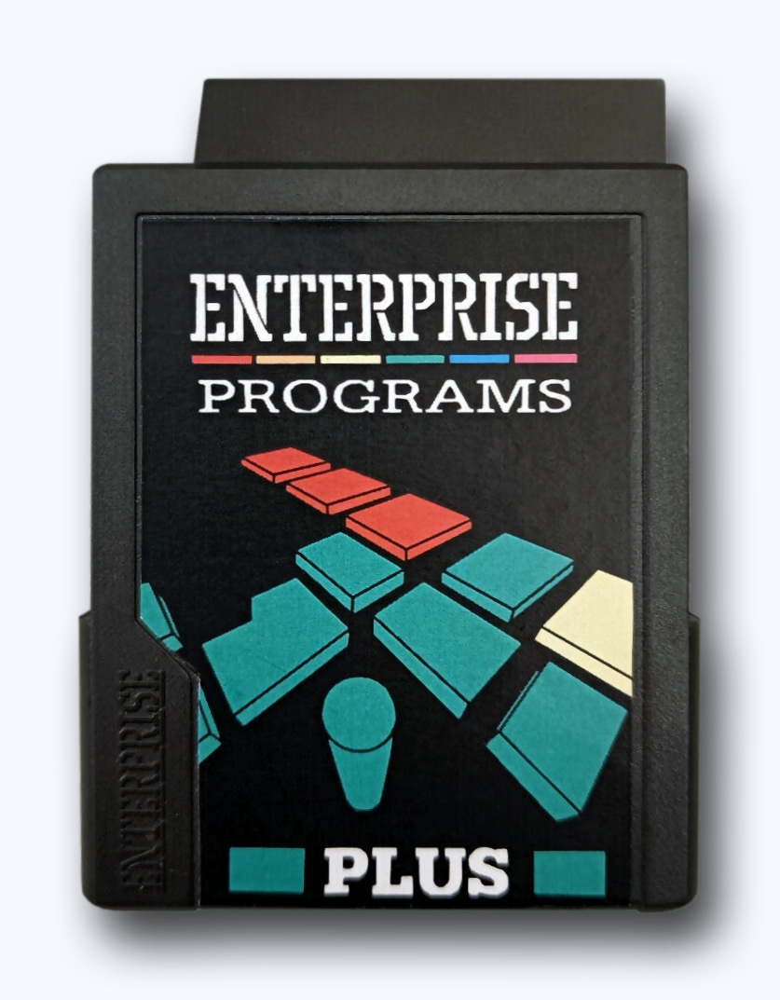
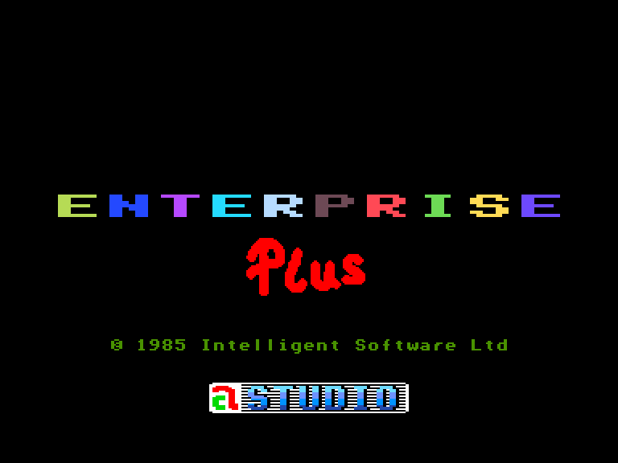

# Картрідж Enterprise Plus

 
 

Розробник: ['á'-Studió](../../companies/a-studio.md)  
Виробник: [Softcart](../../companies/softcart.md)  
Рік: 1988  
Модель носія: [2x16K+1x32K cartridge (P/N 09-88)](cart-main.md)

⚠ Картрідж не є EXOS-сумісним.

[HU info](http://ep128.hu/Ep_Konyv/Ep_Plus.htm)

## Містить

[Розширення команд Бейсіку від BoxSoft](../../programming/is-basic/ext-boxsoft.md)  

Нові системні змінні:
 - [exos_var199_epplus](../../programming/system-info/exos-variables/exos_var199_epplus.md)
 - [exos_var200_epplus](../../programming/system-info/exos-variables/exos_var200_epplus.md)
 - [exos_var201_epplus](../../programming/system-info/exos-variables/exos_var201_epplus.md)
 - [exos_var202_epplus](../../programming/system-info/exos-variables/exos_var202_epplus.md)
 - [exos_var203_epplus](../../programming/system-info/exos-variables/exos_var203_epplus.md)

Команди системних розширень:
 - VSAVE
 - VLOAD
 - VDUMP
 - DATUM
 - UK
 - BRD
 - HUN
 - PRN
