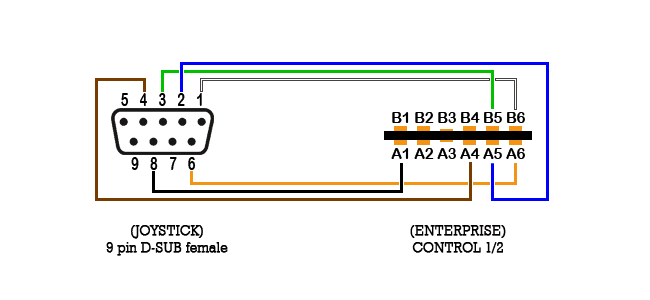

# Control 1 / Control 2

Порти для підключення джойстиків або інших пристроїв керування.

6 контактів завширшки, використано 9 з 12 контактів.  
Усі сигнали мають рівні TTL — зчитуються як частина клавіатурної матриці.  
Використовуйте багатожильний екранований кабель.  

|      **Control 1**      |        |        |             |             |                |
|:-----------------------:|:------:|:------:|:-----------:|:-----------:|:--------------:|
|         **B1**          | **B2** | **B3** |   **B4**    |   **B5**    |     **B6**     |
|           0V            |  KB K  |   nc   |     +5V     | KB 3 (⬅) |  KB 1 (⬆)   |
|                         |        |        |             |             |                |
| KB J **(Загальний)** |  KB L  |   nc   | KB 4 (➡) | KB 2 (⬇) | KB 0 (Fire) |
|         **A1**          | **A2** | **A3** |   **A4**    |   **A5**    |     **A6**     |

|      **Control 2**      |        |        |             |             |                |
|:-----------------------:|:------:|:------:|:-----------:|:-----------:|:--------------:|
|         **B1**          | **B2** | **B3** |   **B4**    |   **B5**    |     **B6**     |
|           0V            |  KB K  |   nc   |     +5V     | KB 8 (⬅) |  KB 6 (⬆)   |
|                         |        |        |             |             |                |
| KB J **(Загальний)** |  KB L  |   nc   | KB 9 (➡) | KB 7 (⬇) | KB 5 (Fire) |
|         **A1**          | **A2** | **A3** |   **A4**    |   **A5**    |     **A6**     |

**Загальний пін для джойстиків:**

Ext Joy 1: Control 1 + KB J  
Ext Joy 2: Control 2 + KB J  
Ext Joy 3: Control 1 + KB K  
Ext Joy 4: Control 2 + KB K  
Ext Joy 5: Control 1 + KB L  
Ext Joy 6: Control 2 + KB L  

⚠ При підключенні додаткових джойстиків (3-6) необхідно використовувати додаткові діоди на сигнальних лініях.

У багатокнопкових джойстиках **Fire2** та **Fire3** використовують **Fire** від додаткових джойстиків (Лінії **K** та **L**).

Для перевірки роботи можна використовувати програму [HIDTest](../../software/testing/su-hidtest.md).

Для підключення зазвичай використовуються різноманітні [адаптери](../joy-adapters.md).

Лінію **5V** можна використати як живлення, але лише для малопотужних пристроїв.

----

	 A1 : Keyboard J (Common) B1 : OV
     A2 : Keyboard L          B2 : Keyboard K
     A3 : nc                  B3 : nc
     A4 : KB4/9 (Right)       B4 : +5V
     A5 : KB2/7 (Down)        B5 : KB3/8 (Left)
     A6 : KB0/5 (Fire)        B6 : KB1/6 (Up)            
(The numbers appearing after the slashes apply to control 2.)

## Джойстики із вбудованою функцією автовогню (AutoFire)

Вбудована функція автовогню фірмових джойстиків на Enterprise працювати не буде:

> [!Zozosoft:]
> На інших комп'ютерах 4 напрямки + кнопка вогню — це ВХІД, які перемикачі замикають на GND (землю). На EP 4 напрямки + кнопка вогню — це ВИХІД, які замикаються на спільний ВХІД J (або на входи K чи L, завдяки чому можна мати більше кнопок або більше джойстиків).
> 
> У разі звичайного механічного джойстика абсолютно неважливо, які два дроти замикаються між собою, тому в найпростішому перехіднику замість дроту GND підключено спільний дріт J. Проблема починається тоді, коли є електронні хітрощі, наприклад, автовогонь — у цьому випадку його схема не отримує заземлення. У [згаданій модифікації](../../press/magz/enterpress-hu/enterpress-1991-09-10.md) вивід землі схеми потрібно від'єднати від спільного дроту та підвести для нього окремий додатковий дріт GND. Його вихід також не може йти напряму на дріт вогню, оскільки туди потрібен не сигнал GND, а з'єднання ВИХОДУ вогню EP зі спільним ВХОДОМ J EP. Для цього й знадобився транзистор.
> 
> Варіант b) — це [інтерфейс джойстика/миші](../hid/mouse-boxsoft.md) від BOXSOFT з мікросхемами, які перемикають ВИХОДИ із ВХОДОМ, керуючись сигналами GND, отриманими від традиційно підключеного джойстика.

## Додаткові матеріали

[Enterprise AppNote #01](http://enterprise.iko.hu/technical/Enterprise-AppNote-01.pdf)