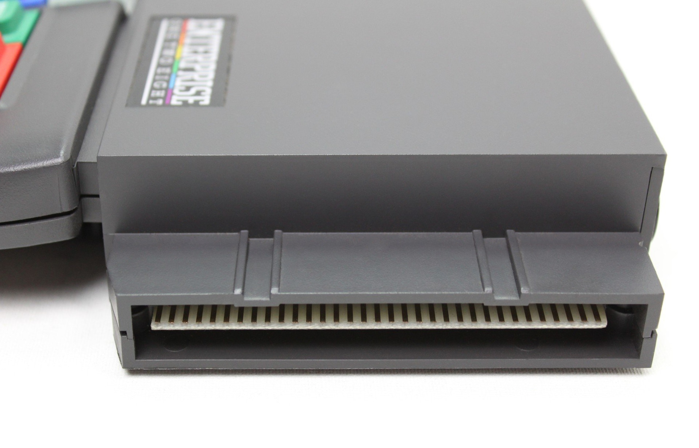

# Expansion port

<div style="text-align:center;">
</div>

Порт системної шини використовується для підключення апаратних розширень як напряму, так і через [пристрої розширення системної шини](system-bus/hb-main.md) (в залежності від конструкції апаратних розширень).

На комп'ютері: 33 контакти завширшки, використовуються 63 з 66 контактів: 

```
 A1: Right Audio In     B1: Left Audio In
 A2: RFSH               B2: WR
 A3: RD                 B3: IORQ
 A4: nc (⚠)             B4: nc (⚠)
 A5: MREQ               B5: NMI
 A6: A8                 B6: A9
 A7: A10                B7: A11
 A8: A12                B8: A13
 A9: A14                B9: A15
A10: A0                B10: A1
A11: A2                B11: A3
A12: A4                B12: A5
A13: A6                B13: A7
A14: D0                B14: D1
A15: D2                B15: D3
A16: D4                B16: D5
A17: D6                B17: D7
A18: RESET             B18: INT
A19: WAIT              B19: GND
A20: M1                B20: GND
A21: 1 MHz Clock       B21: GND
A22: CPU Clock         B22: GND
A23: 8 MHz Clock       B23: GND
A24: EC0               B24: EC1
A25: EC2               B25: EC3
A26: EXTC              B26: A16
A27: A17               B27: A18
A28: A19               B28: A20
A29: A21               B29: 14 MHz Clock
A30: GND               B30: VSYNC
A31: GND               B31: nc (⚠)
A32: HSYNC             B32: GND
A33: +9V (⚠)           B33: +9V (⚠)
```

## Додаткові матеріали

[Application Note #22: The Enterprise Expansion Port](http://enterprise.iko.hu/technical/Enterprise-AppNote-22.pdf)

# Bus Bridge

Єдиний офіційний розширювач системної шини [System Bus Bridge](../system-bus/hb-bus-bridge.md).

На пристрої: 37 контактів завширшки, використовуються 67 з 74 контактів: 

```
 A1: Right Audio In      B1: Left Audio In
 A2: RFSH                B2: WR
 A3: RD                  B3: IORQ
 A4: +5V (⚠)             B4: +5V (⚠)
 A5: MREQ                B5: NMI
 A6: A8                  B6: A9
 A7: A10                 B7: A11
 A8: A12                 B8: A13
 A9: A14                 B9: A15
A10: A0                 B10: A1
A11: A2                 B11: A3
A12: A4                 B12: A5
A13: A6                 B13: A7
A14: D0                 B14: D1
A15: D2                 B15: D3
A16: D4                 B16: D5
A17: D6                 B17: D7
A18: RESET              B18: INT
A19: WAIT               B19: GND
A20: M1                 B20: GND
A21: 1 MHz Clock        B21: GND
A22: CPU Clock          B22: GND
A23: 8 MHz Clock        B23: GND
A24: EC0                B24: EC1
A25: EC2                B25: EC3
A26: EXTC               B26: A16
A27: A17                B27: A18
A28: A19                B28: A20
A29: A21                B29: 14 MHz Clock
A30: GND                B30: VSYNC
A31: GND                B31: ¬EXP (⚠)
A32: HSYNC              B32: GND
A33: GND (⚠)            B33: GND (⚠)
A34: nc                 B34: nc
A35: GND                B35: SA0
A36: SA1                B36: SA2
A37: nc                 B37: nc
```