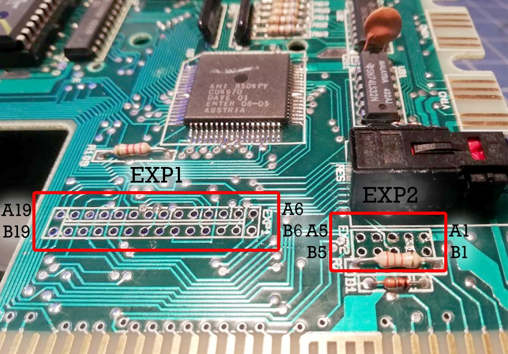

# EXP1 / EXP2

Внутрішній порт розширення використовується для підключення модуля [внутрішнього розширення оперативної пам'яті](../ram-expansion/int-ram-exp-main.md).

**EXP2**

    A1: GND       B1: +5V
    A2: GND       B2: GND
    A3: A21       B3: A20
    A4: A19       B4: A18
    A5: A17       B5: A16

**EXP1**

     A6: RFSH       B6: MREQ
     A7: D6         B7: D7
     A8: D4         B8: D5
     A9: D2         B9: D3
    A10: D0        B10: D1
    A11: A6        B11: A7
    A12: A4        B12: A5
    A13: A2        B13: A3
    A14: A0        B14: A1 
    A15: A14       B15: A15
    A16: A12       B16: A13
    A17: A10       B17: A11
    A18: A8        B18: A9
    A19: WR        B19: RD

 <i>розташування внутрішніх портів розширення (вигляд зі сторони порту системної шини)</i>

> [!⚠ Увага]
> При модифікації материнської плати не бажано впаювати піни у порт **EXP2**. При збірці вони скоріш за все будуть заважати встановленню верхньої кришки корпусу.