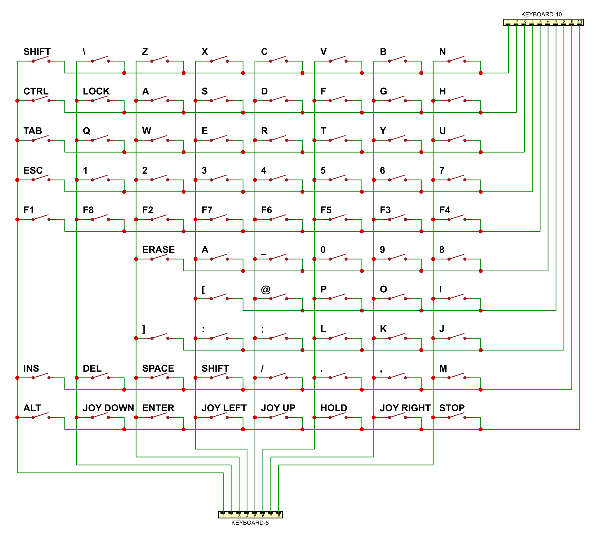

# Keyboard

Лівий: 8-контактний (**X1**..**X8**; нумерація зліва-направо)  
Правий: 10-контактний (**Y1**..**Y10**; нумерація зліва-направо)  

> Роз’єм для шлейфу (мембрани) клавіатури: 
> 
> Part numbers: **05-05** та **05-06**
> 
> оригінальний тип роз’ємів — MOLEX **5229-08CPB** та **5229-10CPB**   
> (новіші артикули: **22-02-3083** та **22-02-3103**)
> 
> Китайський аналог: CONNFLY **DS1020-08ST1D** та **DS1020-10ST1D**.

