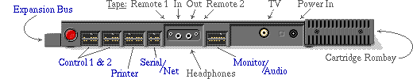

# Pinouts

[Pinouts](http://enterprise.iko.hu/pinouts.htm)

Нумерація контактів для крайових роз'ємів наступна (якщо дивитися на них ззаду):

Контакт **B1** — зверху ліворуч  
Контакт **A1** — знизу ліворуч  

Крок крайового роз'єму становить **2,54 мм**; деякі контакти не використовуються, але враховуються при нумерації.

Для виготовлення конекторів можна використати ISA-слот зі старої материнської плати, або стандартні *2.54mm PCB edge connector* на потрібну кількість контактів.

Expansion Port / Expansion Bus

Cartridge

[Internal Expansion](pinouts-int-exp.md)

[Internal Keyboard](pinouts-kb-int.md)

[Control 1](pinouts-control12.md) / [Control 2](pinouts-control12.md)

[Printer](pinouts-printer.md)

[Serial / Network](pinouts-serial-net.md)

[Monitor / Audio](pinouts-monitor.md)

[Tape IN/OUT](pinouts-tape-rem.md) / [REM 1/2](pinouts-tape-rem.md)

[Power](pinouts-power.md)

[TV](pinouts-tv.md)

[CBM](pinouts-cbm.md)

