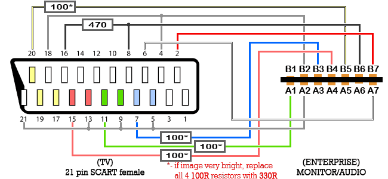
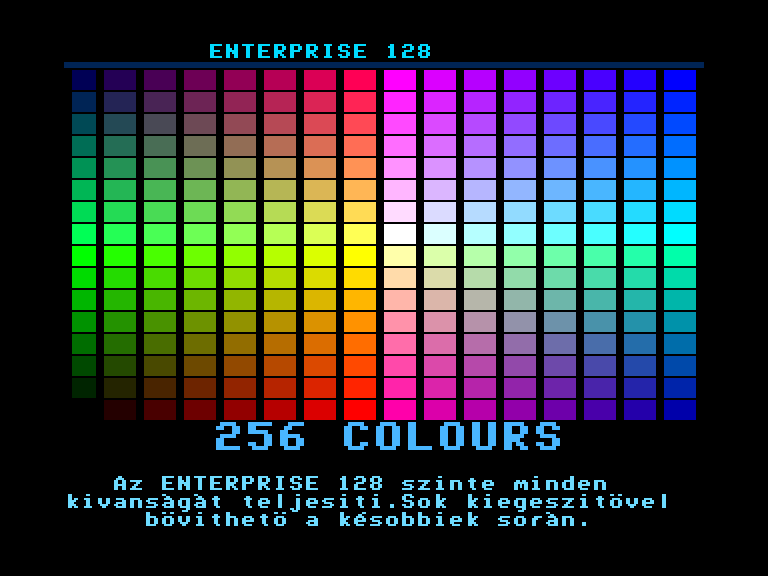
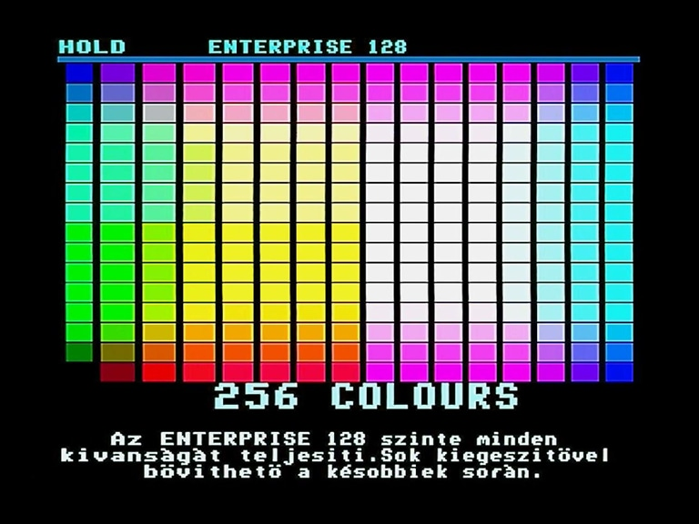
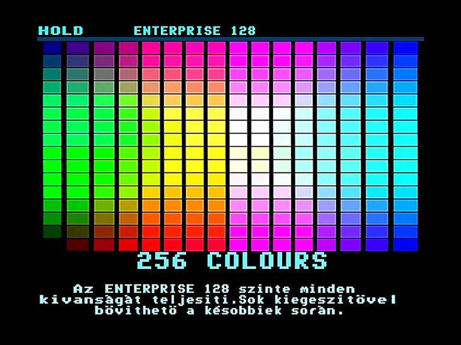
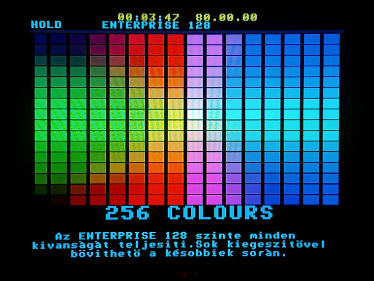

# Monitor

7 контактів завширшки, використовуються 12 з 14 контактів: 

	A1 : Сигнал зеленого (Green)			B1 : не підключено (nc) 
	A2 : 0В 								B2 : 0В 
	A3 : Композитне відео (Монохромний)		B3 : Сигнал синього (Blue)
	A4 : Рядкова синхронізація (HSYNC)		B4 : Сигнал червоного (Red)
	A5 : Кадрова синхронізація (VSYNC)		B5 : Складена синхронізація (CSYNC)
	A6 : не підключено (nc)					B6 : Перемикач режиму / SCART (Mode Switch)
	A7 : Лівий аудіоканал					B7 : Правий аудіоканал

Сигнали синхронізації мають рівні ТТЛ.  
Сигнали кольорів (червоний, зелений та синій) — лінійні від **0** до **4** В. 

Використовуйте багатожильний екранований кабель. 

Виводи **B1** та **A6** відсутні на материнських платах **ISSUE 4**/**5**, на платах **ISSUE 6** це порожні точки пайкі.

## Підключення аудіо

Звук для зовнішніх динаміків можна брати з цього порта, але порівняно з портом [Tape Out](pinouts-tape-rem.md) тихіший та виводить звук завантаження з касетного накопичувача. В сучасних кабелях аудіо, зазвичай беруть з **Tape Out**.

## Підключення Composite (монохромний)

> [!Примітка]  
> Підключення по монохромному композиту видасть чітку, але дещо дивну картинку: зелені кольори (які мали би бути світлими є навпаки доволі темними). Причина цього полягає в тому, що стандартний монохромний відеосигнал змішує зелений, червоний та синій сигнали у співвідношенні приблизно 60–30–10%, тоді як Enterprise змішує їх у рівних пропорціях.

## Підключення RGB - SCART

Резистори для сигнальних дротів я б радив брати як мінімум на **220 Ом** (бо в багатьох випадках **100 Ом** давали пересвічену картинку на якій світлі відтінки зливались). Для перевірки можна використовувати один з екранів демонстраційної програми з комплектної касети до комп'ютера.

Нижче можна побачити приклади зображень з різними номіналами резисторів (звертайте увагу на кольори в центрі екрану, а не на геометрію зображення)

## Додаткові матеріали

[Enterprise AppNote #01](http://enterprise.iko.hu/technical/Enterprise-AppNote-01.pdf)

