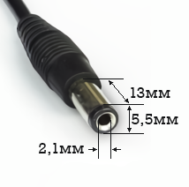

# Роз'єм живлення

> Тип конектора: DC Power Jack Socket 5.5×2.1 mm
> 
> Part number: **05-08** (power jack socket 2.1mm; centre of socket 6.6mm above PCB; right angle pins into PCB)
> 
> Артикули постачальників:
> 
> Yell, part no. DCP-20  
> Hung Chang: part no. DCP-20  
> Tai Chung TC18-013  
> Singatron DJ-005-A  

Вхідна напруга: **⎓9V**, **2A**, **19W**

> [!Увага!]
> Мінус на центральному контакті!
>  

Розміри конектора:  

[Блоки живлення](../power/power-main.md)
