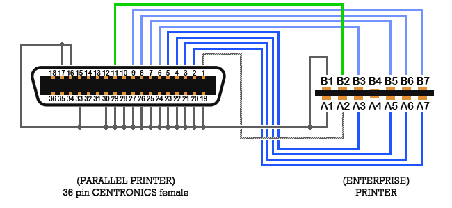
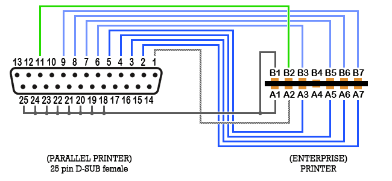

# Printer

7 контактів завширшки, використовуються 12 з 14 контактів:

	A1 : 0В					B1 : 0В
	A2 : STROBE (Строб)		B2 : READY (Готовність)
	A3 : DATA 3				B3 : DATA 4
	A4 : не підключено (nc)	B4 : не підключено (nc)
	A5 : DATA 2				B5 : DATA 5
	A6 : DATA 1				B6 : DATA 6
	A7 : DATA 0				B7 : DATA 7

Усі сигнали мають рівні ТТЛ.

Використовуйте 12-жильний гнучкий стрічковий кабель (шлейф).

## Додаткові матеріали

[Enterprise AppNote #01](http://enterprise.iko.hu/technical/Enterprise-AppNote-01.pdf)