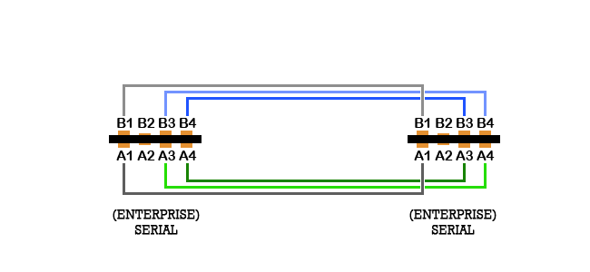
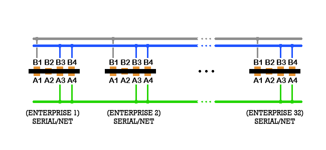
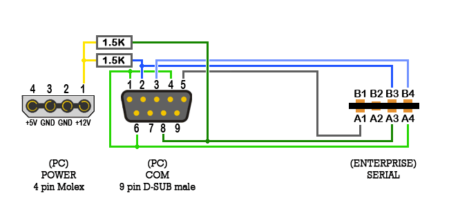
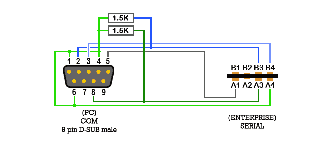
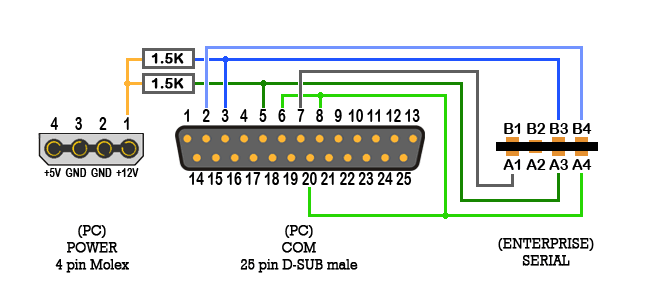
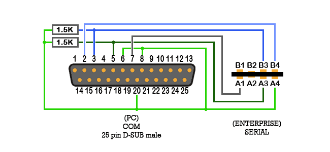

# Serial/Net

4 контакти завширшки, використовуються 6 з 8 контактів:

	A1 : Опорна напруга (Reference)	B1 : 0В 
	A2 : не підключено (nc)			B2 : не підключено (nc)
	A3 : RTS							B3 : Вихід даних (Data Out)
	A4 : CTS							B4 : Вхід даних (Data In)

Рівні сигналів відносно лінії **0В**:

**0** = **0В**  
**1** = **+12В**

Рівні сигналів відносно лінії опорної напруги (**Reference**):

**0** = **−5В**  
**1** = **+7В**

Опорна напруга — це зміщена напруга «землі», вона може бути непридатною для використання в деяких конфігураціях обладнання. Для використання в мережі, з метою формування «шини керування», необхідно з'єднати **RTS** із **CTS**, а для формування «шини даних» — з'єднати «вхід даних» із «виходом даних». 

Для послідовного з'єднання (serial) використовуйте 6-жильний екранований кабель.  
Для мережевого з'єднання (net) використовуйте 2-жильний екранований кабель.  

Порт не є повнодуплексним (не може одночасно приймати та передавати дані) та реалізує стандарт [RS-232](https://uk.wikipedia.org/wiki/RS-232) / RS-423.

Для реалізації повнодуплексного послідовного порта використовувались зовнішні карти розширення.

## Підключення Enterprise - Enterprise

## Підключення Enterprise - ПК

## Підключення Enterprise - Atari ST

[Замітка у журналі Popular Computing Weekly Issue 87.09.11](https://archive.org/details/NH2021_Popular_Computing_Weekly_Issue870911.pdf/page/n27/mode/1up?q=enterprise)

## Додаткові матеріали

[Enterprise AppNote #01](http://enterprise.iko.hu/technical/Enterprise-AppNote-01.pdf)

