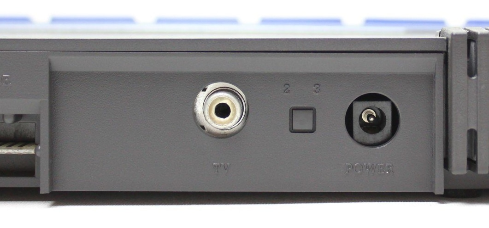

# Роз'єм для підключення TV

> Тип конектора: RCA jack, also known as the pin jack
> 
> Part number: **05-41** (Panel mounted phono socket)
> 
> Артикули постачальників:
> 
> Lih Sheng LP-0837  

Використовується для підключення до телевізора через антенний вхід.

Кабель (RCA male - Belling-Lee male).
