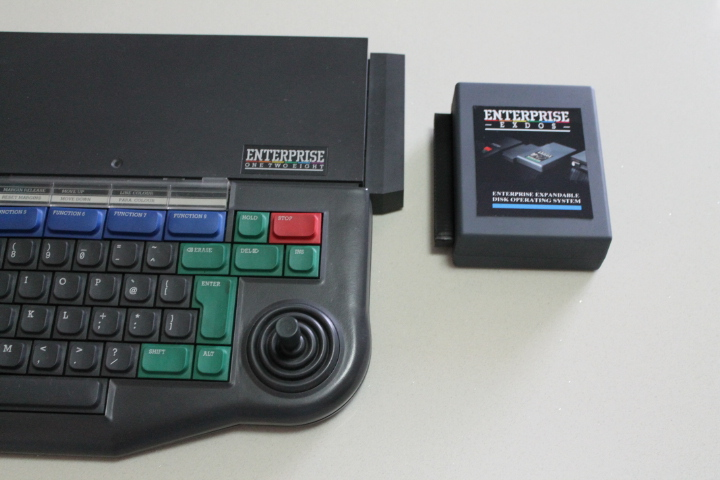
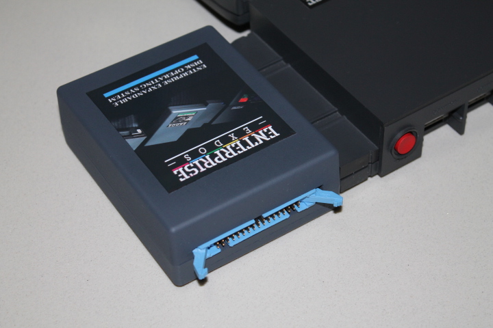
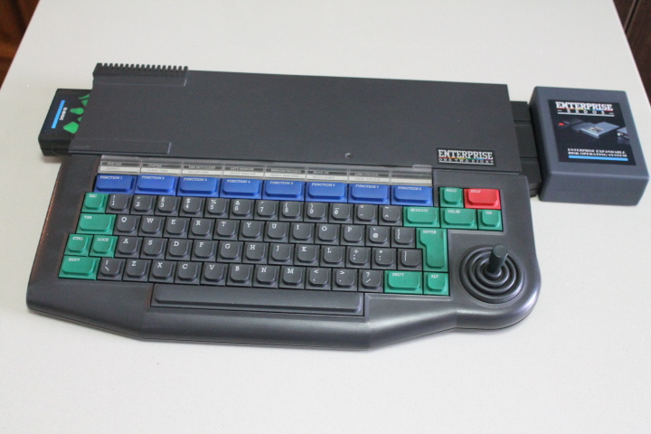
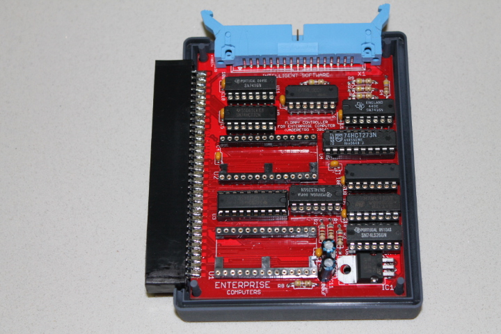
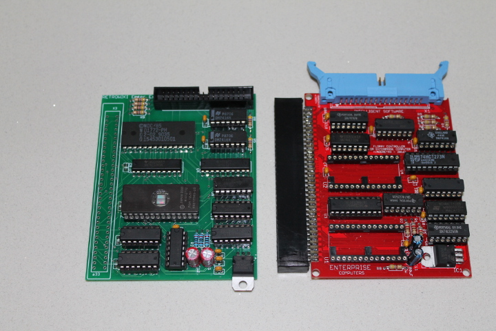
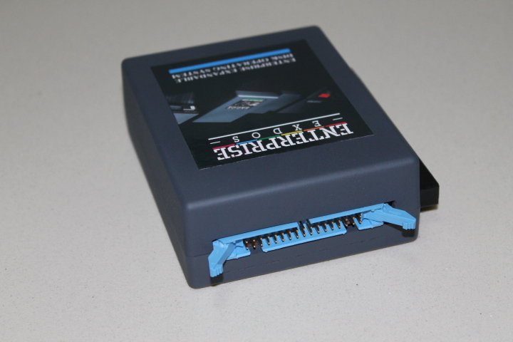
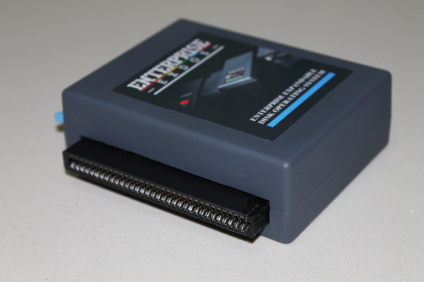

# EXDOS від [Wilco](../../peoples/community/wilco.md)

    

 
 
 
 
 
 
 

Автор: [Wilco](../../peoples/community/wilco.md)  
Підключення: напряму до порта системної шини.

[Github](https://github.com/wilco2009/EXDOS)

