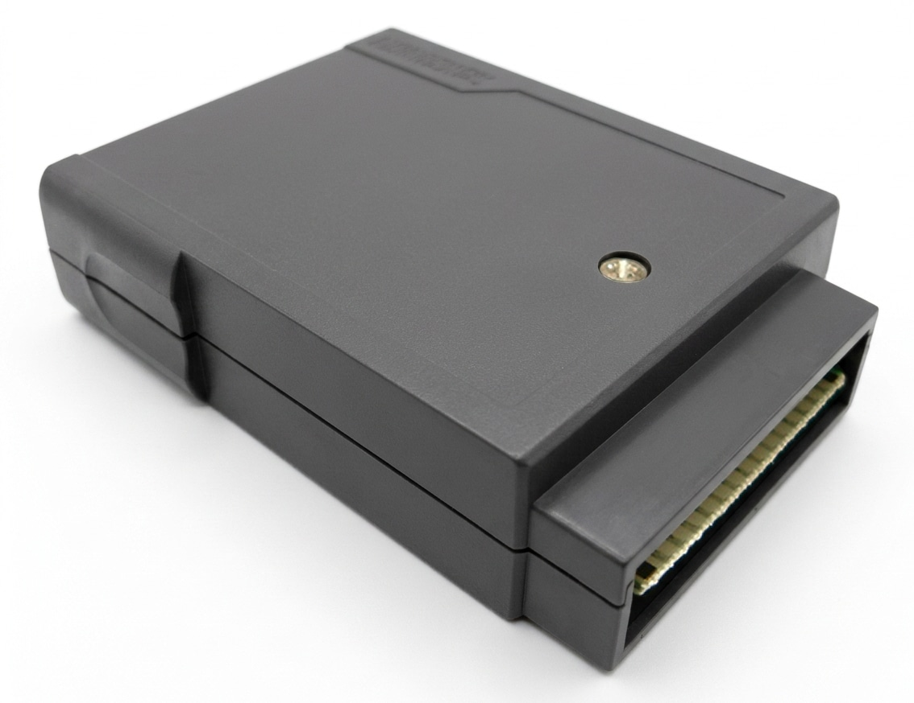
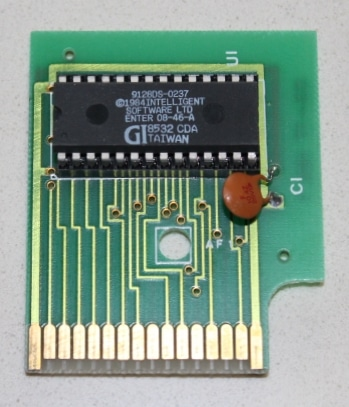
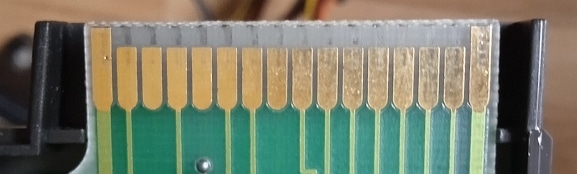
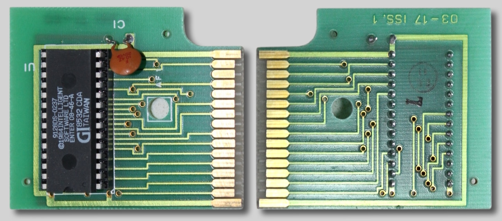
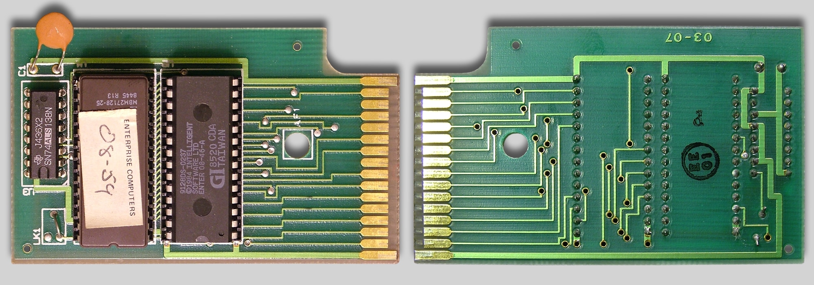
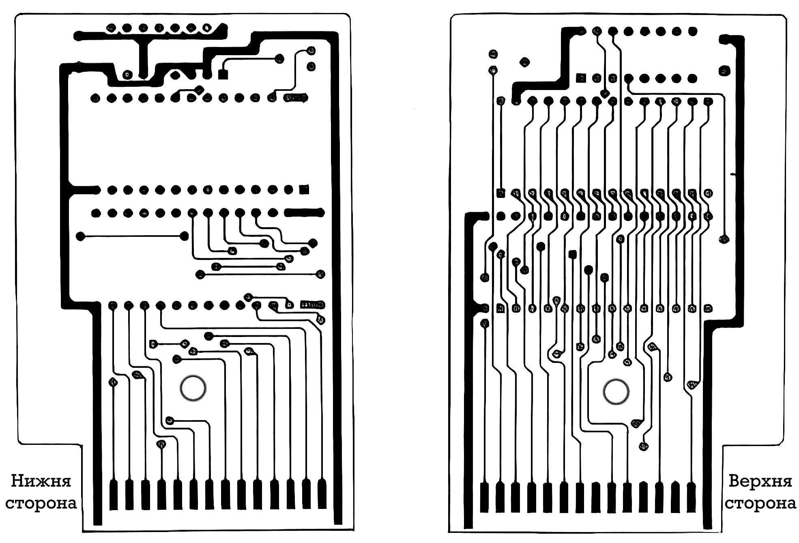
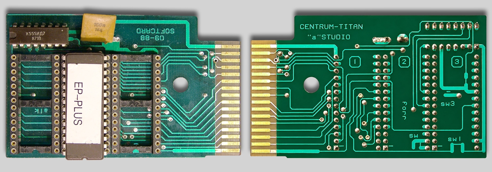

# Картріджі

 
 

Головна фішка архітектури Enterprise полягала в тому, що його вбудований ПЗП містив лише операційну систему [EXOS](../software/ss-exos.md) — без жодної вбудованої мови програмування високого рівня. Enterprise після ввімкнення без вставленого картриджа запускав вбудований текстовий процесор [WP](../software/st-wp.md), який можна було використовувати не лише для роботи з текстом, але й завантажувати програми в машинному коді та виконувати EXOS-команди (системних розширень).  

Найвідоміший і найпоширеніший — це картридж [IS-Basic](../programming/is-basic.md). Оскільки комп'ютер постачався з ним у комплекті, для більшості користувачів він став невід'ємною частиною архітектури. Окрім BASIC, існували картриджі з іншими мовами (наприклад, [Forth](../programming/is-forth.md), [Lisp](../programming/is-lisp.md), [Pascal](../programming/hisoft-pascal.md) або асемблери). Ви просто витягували один картридж, вставляли інший — і комп'ютер після перезавантаження змінював своє програмне середовище. 

За картріджем зарезервовані сегменти пам'яті **4**-**7**, тому ПЗП-картріджу може адресувати максимум **64 КБ** (для використання ROM-файлів більшого розміру потрібні інші пристрої, що підключаються до роз'єму системної шини розширення). При вмиканні комп'ютера (або повному перезавантаженні) EXOS сканує сегменти пам'яті на відповідні заголовки, та автоматично інтегрує код в систему. Це можуть бути нові системні виклики, драйвери пристроїв або середовища програмування.

Ентерпрайз підтримує зміну картріджів в увімкненому стані (для цього на платі картріджа контакти живлення трішки довші), але їх ініціалізація все одно відбувається лише при увімкнені/перезавантаженні комп'ютера, тому користувачі для зміни картріджів зазвичай вимикають комп'ютер (щоб зменшити вірогідність пошкодження апаратури). Також хочу зазначити, що не всі виробники робили контакти живлення довшими, тому будьте з цим обачними (цим "грішив" Softcart та деякі сучасні репліки плат).

  
*коректна довжина контактів*

Крім суто програмних картриджів (які містили в собі лише ПЗП), є ще й такі які розширяють можливості комп'ютера. В даний час найвідомішим картриджем такого типу є [адаптер SD-карток](hd-sd-card-adapter.md), який додає дискову систему [EXDOS](../software/ss-exdos.md) завдяки якій, прозоро для системи, використовуються сучасні носії даних та годинник реального часу (RTC). У 90-ті роки більш популярним був картрідж який дозволяв підключати периферію Commodore (дисководи, принтери та імітувати комодорівький послідовний порт). MIDI-картрідж був лише у вигляді прототипу. Компанія BoxSoft пропонувала картрідж BATRAM (що містив NiCad-батарейку та 32 КБ статичної ОЗП) вміст якого можна було легко перезаписувати (або використовувати як невеличкий RAM-диск).

## Офіційні моделі

Із принциповими схемами цих моделей можна ознайомитись на сайті [enterprise.iko.hu](http://enterprise.iko.hu/schematics.htm) з техдокументацією.

### One socket cartridge (P/N 03-17)

Розрахований на 1 EPROM об'ємом **32** КБ (**27С128**). Використовувалась з англійською моделлю 128.

Модифікована версія плати підтримує 1 EPROM об'ємом **64** КБ (**27С256**).

### Two sockets cartridge (P/N 03-07)

Плата картріджу 03-07 розроблена для локалізованих версій комп'ютерів. Має **2** сокети для EPROM чипів об'ємом **8** або **16** КБ (**27С64**, **27С128**) та перемичку вибору об'єму. Використовувалась з англійськими моделями 64/128 (2\*8 КБ: IS-Basic) та німецькою 128 (2\*16 КБ: IS-Basic+локалізація)

 *схема оригінальної плати картріджу 03-07* 

Згодом з'явилась її модифікація з підтримкою ПЗП розміром **32** КБ (**27С256**).

[Модифікація стандартного картріджа](mods/exos-cart-03-07-mod.md)

### 2x16K+1x32K cartridge (EP-PLUS) (P/N 09-88)

Картрідж з трьома слотами для ПЗП був розроблений угорською фірмою **'a' Stúdió** для свого системного розширення **Enterprise Plus**. Один слот (16КБ) був призначений для ПЗП із розширенням, другий (16КБ) для ПЗП з Бейсіком (який потрібно було переставити з оригінального картріджу), а третій (32КБ) - порожній (для користувацьких ПЗП).

## Інші виробники

Quick-change EPROM Cartridge

## Інші пристрої
CBM Multi File Transfer (Cartridge version)  
MIDI Cartridge  
[SD-card reader](hd-sd-card-adapter.md)  

External Cartridge Bay  

## Як зробити самому

### Плата

by Pear
Basic
Flash

Cartridge 512K switchable

### Корпус

[3dpr-cartridge](3dprint/3dpr-cartridge.md)

## Що записати

[Ігри](../sf-games/games-rom-versions.md)

[Софт](../software/soft-rom-version.md)