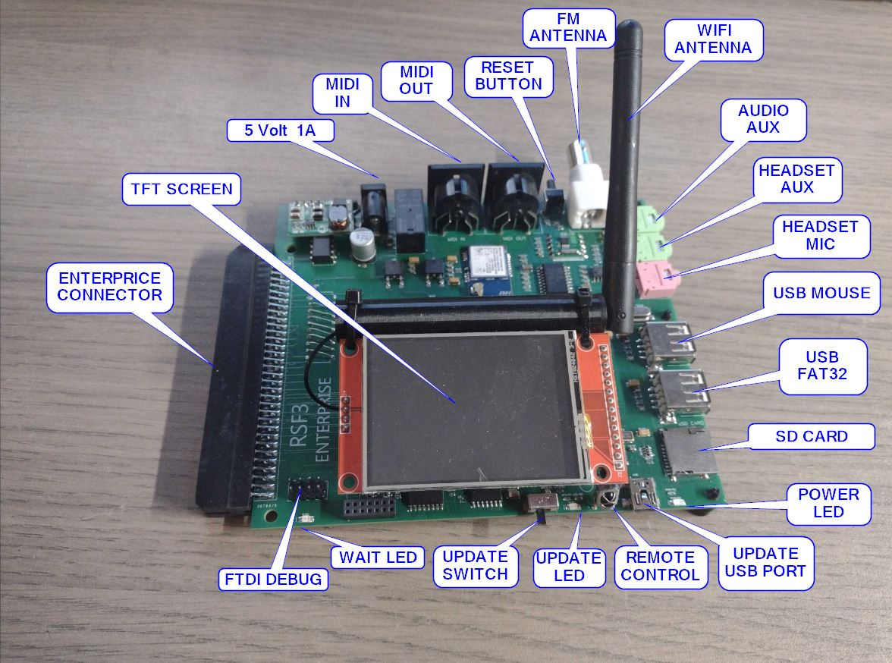
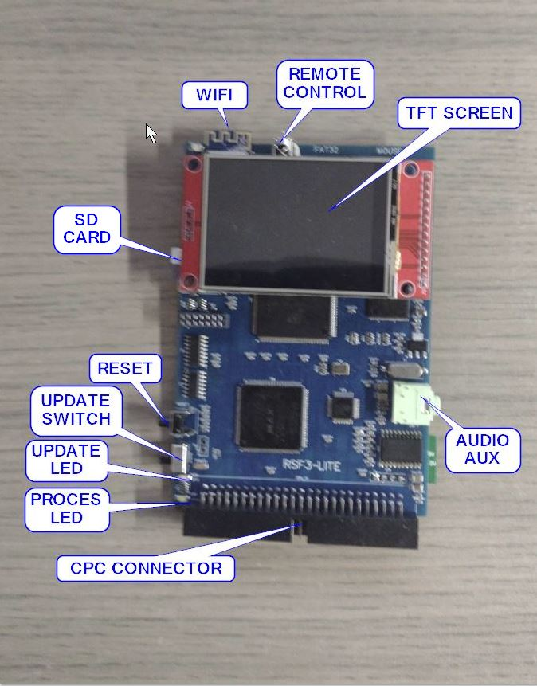
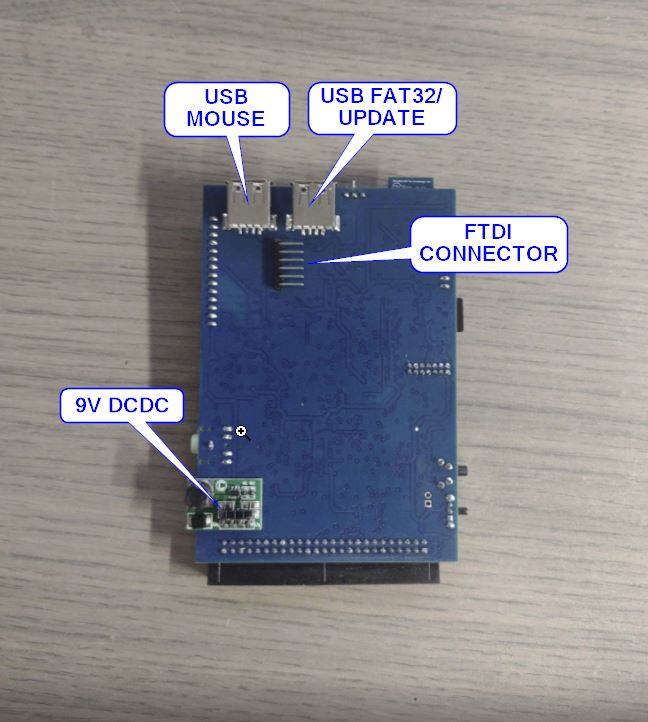

# RSF III

    

[Сайт проекту](http://www.tmtlogic.com/index.html)

Багатофункціональна карта розширення, розроблена TNTLogic та випущена у 2023 році у якості подальшого розвитку карти [SymbiFace III](he-sf3.md).

## Технічні характеристики

- 2 MB ОЗП.
- 2 MB ПЗП.
- TFT тач-дисплей.
- 480 МГц 2-ядерний процесор.
- USB порт для накопичувача (флешка).
- USB порт для миші.
- microSD порт для зберігання системи і налаштувань.
- MP3-модуль + FM радіо (еквівалент карті [MSX SE-One](sound/hs-msx-se-one.md)).
- Конектор для підключення антени для FM радіо.
- Вхід/вихід для підключення навушників та мікрофону для VOIP.
- MIDI вхід/вихід
- Аналоговий аудіовихід.
- WiFi з антеною (швидкість 2 МБ/с).
- RTC.
- Інфрачервоний порт.
- Кнопка скидання.

## Статус

TMTlogic більше не виробляє цю карту. На заміну їй пропонується **RSF3 Lite** із схожими але дещо урізаними характеристиками.

# RSF III Lite

     

## Технічні характеристики (у порівнянні з RSF3)

- Лише 1 MB ОЗП.
- Лише 1 MB ПЗП.
- Відсутнє FM радіо.
- Немає VOIP.
- Відсутні виходи MIDI I/O.
- Інтегрована антена WiFi.

