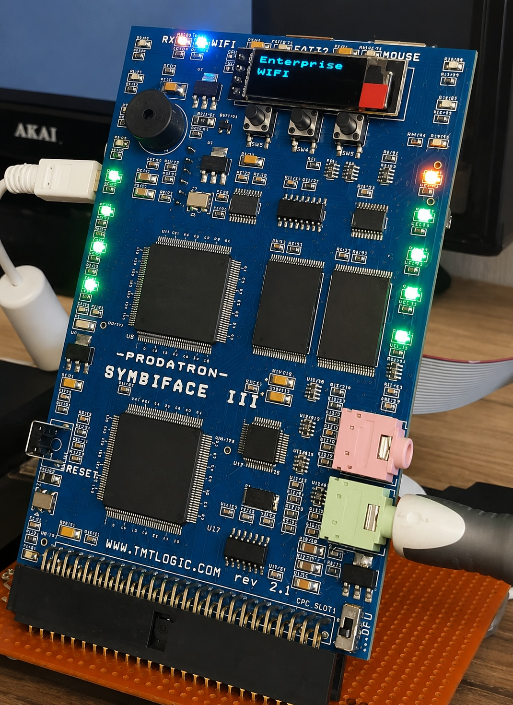

# SymbiFace III

    

[Сайт проекту](http://www.tmtlogic.com/index.html)

SYMBiFACE III — це багатофункціональна карта розширення, розроблена TNTLogic та випущена у 2018 році за фінансової та програмної підтримки з боку [Prodatron](../peoples/community/prodatron.md).

## Технічні характеристики

 - Мікроконтролер: Cortex-M7 216 МГц
 - ОЗП (RAM): 2 МБ
 - ПЗП/Флеш-пам'ять (ROM/FLASH): 2 МБ
 - USB Host: HID-миша
 - USB Host: FAT-32 накопичувач (флешка) 
 - АУДІО: MP3-плеєр
 - АУДІО: recorder / prepare for VOIP
 - WIFI: модуль IoT / протокол MQTT
 - RTC: годинник реального часу + батарейка
 - VU: стереоіндикатор рівня звуку
 - JTAG: вбудований
 - ВИМІРЮВАННЯ: живлення 5 В, температура процесора ARM, заряд батарейки RTC
 - SD-карта: для внутрішньої системної пам'яті
 - OLED-дисплей
 - зумер

## Статус

TMTlogic більше не виробляє цю карту.

У 2023 році компанія TMTlogic замінила її своєю покращеною картою розширення [RSF3](he-rsf3.md).

