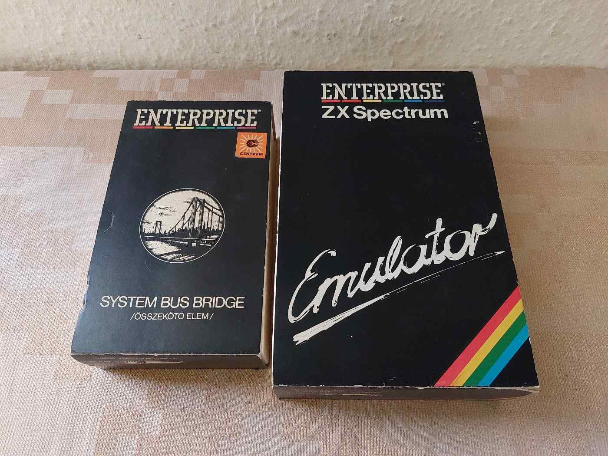
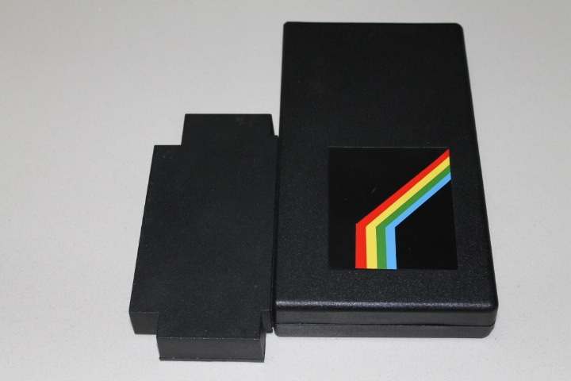
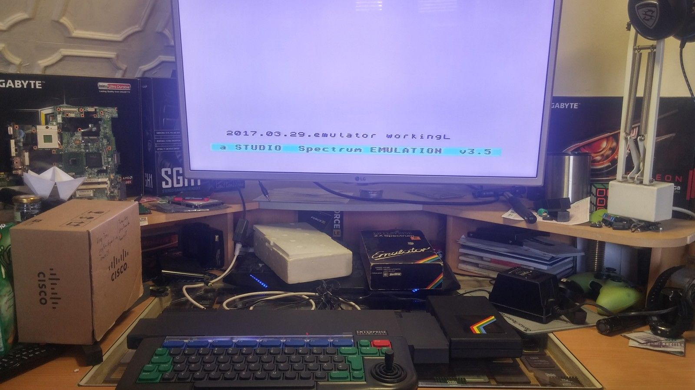
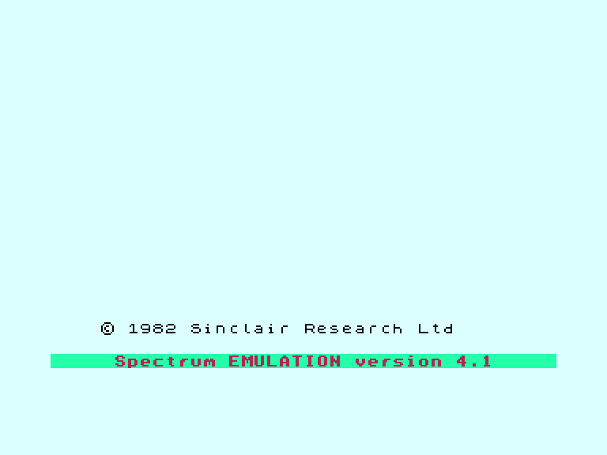
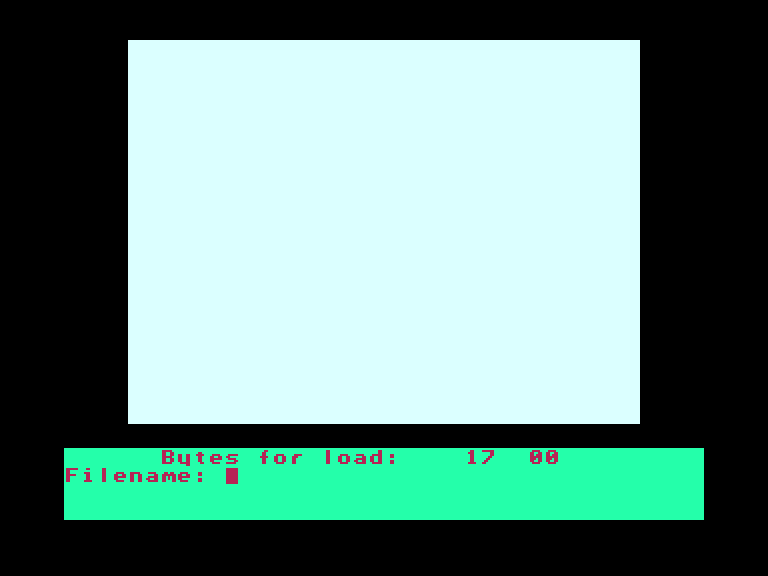
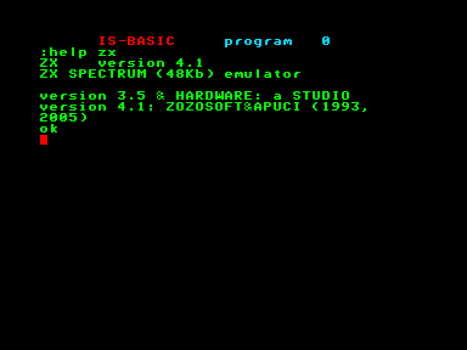
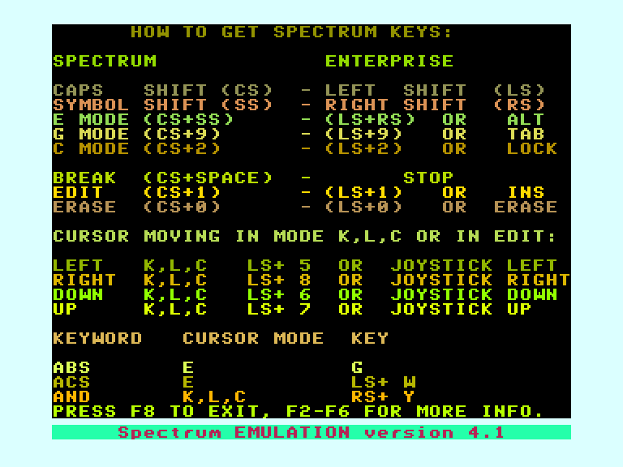

# Апаратний емулятор ZX Spectrum

 
 
 

[http://ep128.hu/Ep_Hardware/Ep_Emulator1.htm](http://ep128.hu/Ep_Hardware/Ep_Emulator1.htm)      
[http://ep128.hu/Ep_Hardware/Ep_Emulator2.htm](http://ep128.hu/Ep_Hardware/Ep_Emulator2.htm)

[Manual](http://ep.homeserver.hu/Dokumentacio/Egyebek/Spectrum_emulator_kezikonyv/Spectrum_Emulator_Kezikonyv.htm) (угорською)

## Швидкий старт з користування

(актуально для версії прошивки **4.1**)

 
 
 
 

Для запуску емулятора введіть команду `:ZX`.  
Додатково можна вказати файл, який буде автоматично завантажено після старту емулятора: `:ZX назва_файлу.TAP` (файли з довгою назвою можуть некоректно завантажуватись), або `:ZX $назва_снапшоту.ZXF` для завантаження снапшоту.

**F1**-**F6**: вбудована довідка по клавішам  
**Reset**: скидання емульованої системи  
**Stop**+**Reset**: Вихід з емулятора  
**Hold**/**Pause**+**Stop**: виклик командної режиму:  

- ввести `назва_файлу` — збереження снапшоту
- ввести `$назва_файлу` — завантаження снапшоту
- ввести **Alt**+**P**,`назва_файлу` — завантаження POKE-файлу  
- також можна вводити EXOS-команди (але не використовувати для виходу з емулятора)  

**Internal Joystick**+**Alt**: емуляція джойстиків Cursor/AGF/Protek (клавіші: **5**, **6**, **7**, **8**, **0**)  
**External Joystick 1**: емуляція джойстика Sinclair 1 (Interface II Left) (клавіші: **1**, **2**, **3**, **4**, **5**)  
**External Joystick 2**: емуляція джойстика Sinclair 2 (Interface II Right) (клавіші: **6**, **7**, **8**, **9**, **0**)  

Завантажувати програми можна як ~~через аудіо (у стандартному ZX форматі)~~, так і з EXOS-пристроїв (формати файлів TAP, TZX, ZXF^[пропрієтарний снепшот])