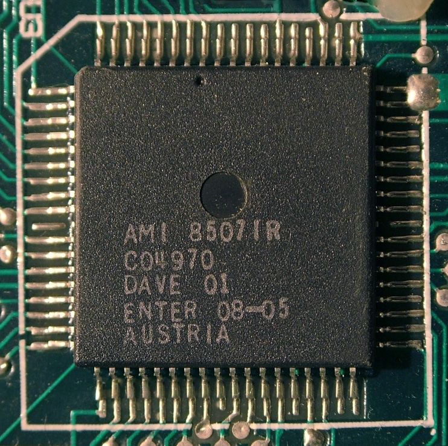

# DAVE

    

Тип: **Менеджмент пам'яті, обробка переривань та генерація звуку**  
Розробник: [Dave Woodfield](../peoples/ec/pers_dave-woodfield.md)  
Внутрішня назва: **ESPRIT**  
Внутрішній номенклатурний номер: **08-05**  

Чип **DAVE** виконує наступні функції:

1. **Багатофункціональний стереогенератор звуку:** схема «3 тони + шум».
2. **Керування пам'яттю:** перемикання банків.
3. **Декодування адрес:** для вбудованої RAM, ROM та картриджів.
4. **Система переривань:** включає переривання 1 Гц, програмовані таймери та два зовнішні входи.
5. **Схема скидання (Reset):** сумісна із Z80 та динамічною пам'яттю (DRAM).
6. **Сигнали стробування введення/виведення:** для роботи із зовнішніми засувками 74LS374.
7. **Системна синхронізація:** тактовий сигнал 1 МГц.
8. **Генерація станів очікування (Wait states):** для процесора Z80.

## Технічні характеристики та архітектура

Чип має **22 внутрішні регістри** (17 тільки для запису, 5 — читання/запис), які після скидання очищуються:

- **16 регістрів** керують генерацією звуку.
- **4 регістри (R/W)** відповідають за менеджмент пам'яті.
- **1 регістр (R/W)** керує перериваннями.
- **1 регістр (Write only)** задає загальну конфігурацію системи.

## Звукові можливості

Три генератори тону виробляють прямокутні імпульси в діапазоні від **30 Гц** до **125 кГц**. Можливості модифікації звуку:

- **Дисторшн:** використання ПСП-лічильників (4, 5, 7 або до 17 біт) для створення специфічних шумів та спотворень.
- **Фільтрація:** кожен канал має простий фільтр високих частот (HPF), що тактується виходом іншого каналу.
- **Кільцева модуляція (Ring Modulation):** ефект створюється шляхом взаємодії виходів різних каналів.
- **Канал шуму:** базується на 17-бітному лічильнику ПСП (білий шум), який може тактуватися від будь-якого з трьох тональних каналів та проходити через власні фільтри.
 - **Амплітуда та вихід:** Звук виводиться через два 6-бітні ЦАП (лівий та правий канали). Будь-який канал можна перетворити на чистий 6-бітний ЦАП-вихід для відтворення семплів.

## Керування пам'яттю (MMU)

Чотири регістри дозволяють адресувати **256 сторінок по 16 КБ**. Це забезпечує гнучкість розподілу пам'яті між ROM, RAM та зовнішніми пристроями.
