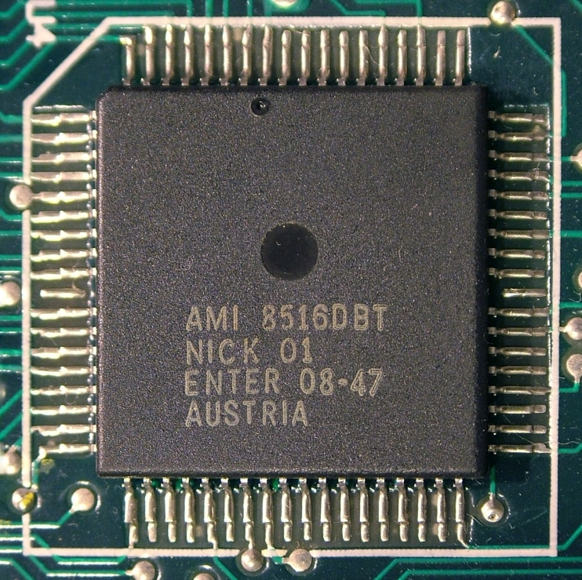

# NICK

    

Тип: Відеопроцессор  
Розробник: [Nick Toop](../peoples/ec-uk/pers_nick-toop.md)  
Внутрішня назва: **ELITE**  
Внутрішній номенклатурні номери: **08-04** та **08-47**  

На відміну від більшості відеоконтролерів, які дозволяють користувачеві обирати різні режими лише для всього екрана загалом, **NICK** дає змогу поєднувати безліч різноманітних режимів у межах одного кадру.

Ключові особливості NICK:

- **Максимальний обсяг відеопам'яті:** 64 кБ.
- **Змішані режими відображення:** можливість комбінувати різні типи графіки на одному екрані.
- **Символи, що визначаються користувачем:** підтримка шрифтів на 64, 128 та 256 знаків.
- **8-бітний колірний вивід:** палітра з 256 кольорів.
- **Гнучкість палітри на рядок:** вибір 2, 4, 16 або 256 кольорів для кожного рядка з загальної палітри у 256 відтінків.
- **Максимальна роздільна здатність:** до **736 × 576** пікселів (з використанням інтерлейсу).
- **Універсальність графіки:** підтримка знакомісцевої графіки, бітмапів (растру) та текстових символів.
- **Налаштовувана висота символів:** від 1 до 256 екранних рядків.
- **Апаратний текстовий режим**.
- **Колір бордюру:** вибір із 256 кольорів.
- **Довільні розміри екрана:** ширина та висота задаються користувачем.
- **Зовнішній цифровий 4-бітний відеовхід:** можливість виводу на екран необмеженої кількості спрайтів або відеоданих з додаткового обладнання.
- **Ефективне використання пам'яті:** здатність працювати навіть із об'ємом RAM менше ніж 1 КБ.
- **Текстовий режим на 84 колонки:** підтримка 4-х колірних пар.
- **Спеціальне кодування бітів:** для розширення колірних можливостей.
- **Вказівникова організація пам'яті:** використання вказівників для максимальної гнучкості та швидкодії при відображенні даних.

[Системна інформація для програмування](../programming/system-info/nick/pro-nick.md)