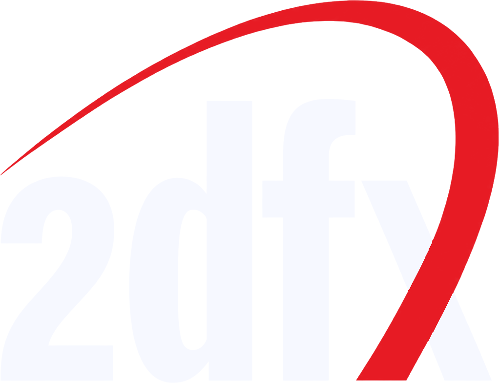

# 2dfx

 

Це апаратне розширення є першим графічним акселератором для комп'ютера Enterprise що задіює раніше невикористаний потенціал чипа Nick, функціонал якого був передбачений ще на стадії проєктування на початку 1980-х років.

Карта, що отримала назву **2dfx**, буде інтегрована до складу нової материнської плати Issue7, але також буде доступна як під'єднувальний периферійний пристрій для наявних машин.

Вона задіює існуючий 4-бітний цифровий відеовхід чипа, що дозволяє зовнішньому обладнанню перевизначати колір пікселів на екрані, до того ж з максимально можливою горизонтальною роздільною здатністю (в якій при звичайному використанні доступно лише 2 кольори на піксель). Інакше кажучи, на екрані з'являється додатковий 16-кольоровий графічний шар (із підтримкою прозорості та максимальною горизонтальною роздільною здатністю), на який можливо виводити такі типи даних:

 - до 64-х багатокадрових спрайтів довільного розміру зі спрощеною детекцією колізій, прозорістю та перетворенням (віддзеркалення + масштабування).
 - векторна графіка (до 256 інструкцій малювання графічних примітивів на кадр).
 - бліттер, на основі якого реалізовані такі функції:
	 - виведення моноширинних шрифтів;
	 - тайлова графіка (до 64 наборів, кожен із яких містить 256 тайлів);
	 - заливка паттерном (візерунком) векторних об'єктів.

Для графічних даних передбачено 256 кілобайтів додаткової пам'яті.

Уся обробка графіки та апаратна взаємодія з чипом Nick здійснюються недорогим і загальнодоступним мікроконтролером [RP2354B](https://pip-assets.raspberrypi.com/categories/1214-rp2350/documents/RP-008374-DS-1-rp2350-product-brief.pdf), що дозволило суттєво спростити схемотехніку плати.

Використовувати цей акселератор можна буде з легкістю не лише у програмах на машинному коді, а й навіть із вбудованого [Бейсіка](../programming/is-basic.md), оскільки онлайн-редактор графіки, що зараз розробляється, автоматично згенерує текст необхідних команд для завантаження графічних даних.

Випуск фінальної версії 2dfx заплановано на осінь 2026 року.

<iframe src="https://www.youtube.com/embed/rkOJymZdHxc"  
style="width:75%; aspect-ratio:16/9;" allowfullscreen></iframe>

[Коментарі автора розробки](2dfx/about.md)

[Редактор спрайтів].

[Програмування](../programming/2dfx-programming.md)
