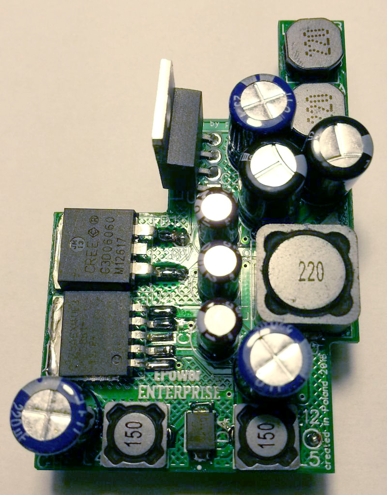
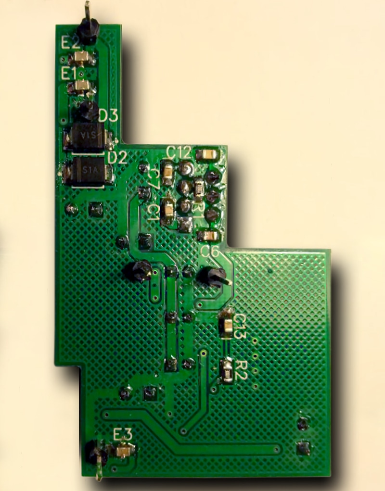

# EPower

 

Автор: [pear](../../peoples/community/pear.md)

Модуль замінює оригінальні схеми живлення Enterprise на більш сучасні компоненти. Новішою версією даного модуля є [REpower](repower.md) (але її автор не викладав схему у вільний доступ).

[EP Wiki](https://wiki.enterpriseforever.com/index.php?title=EPower) (англійська, іспанська, польська, угорська)
