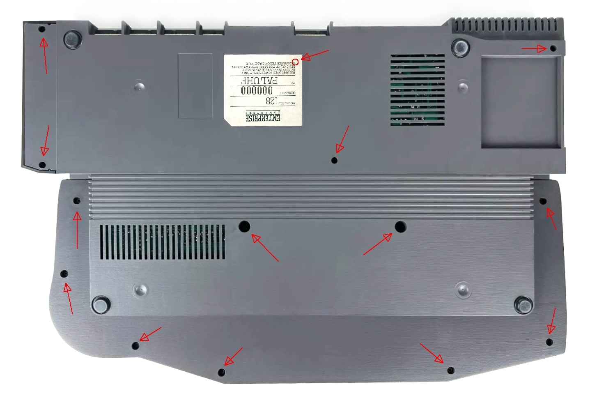
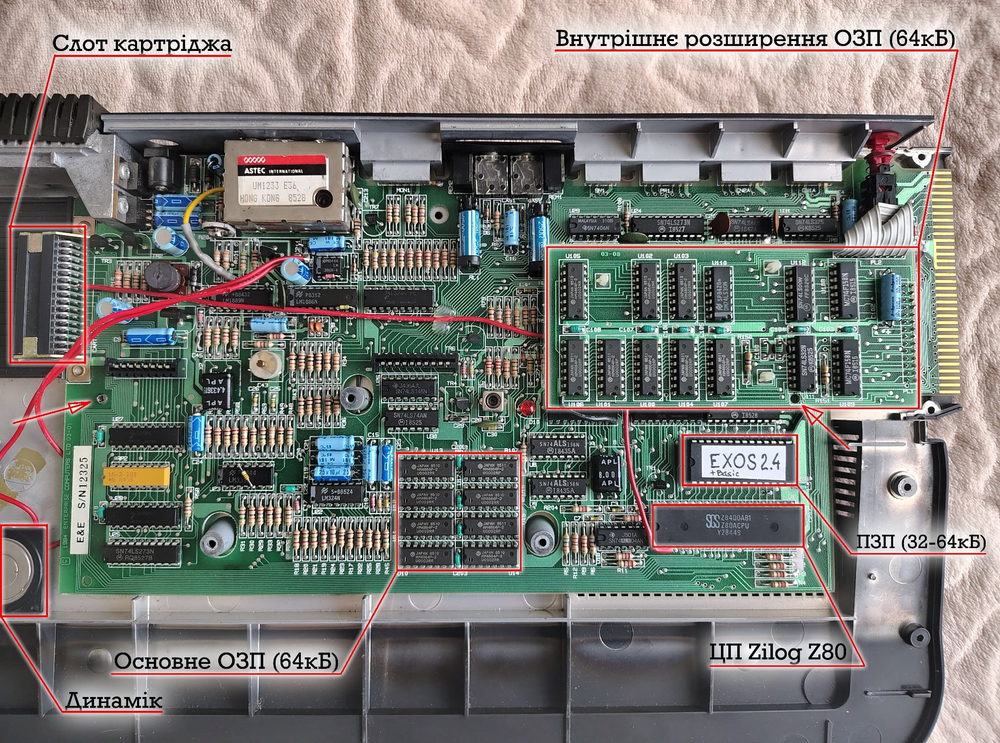
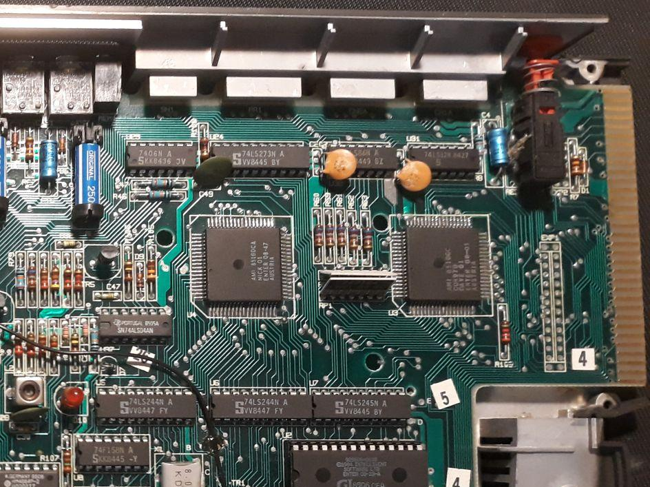
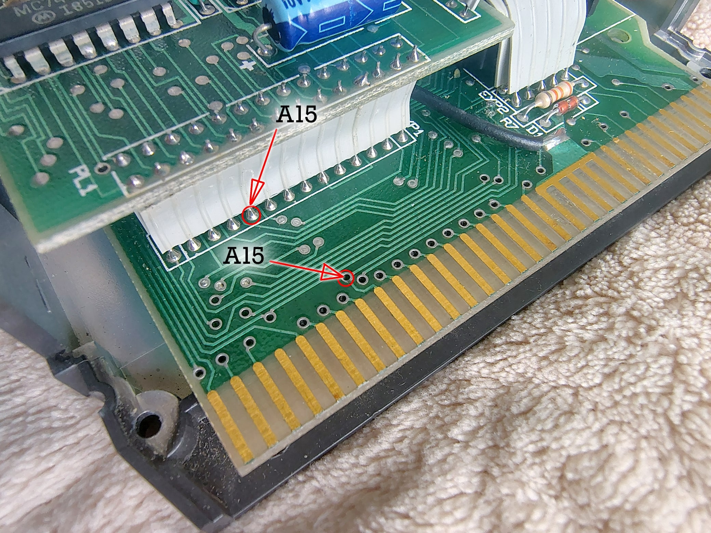
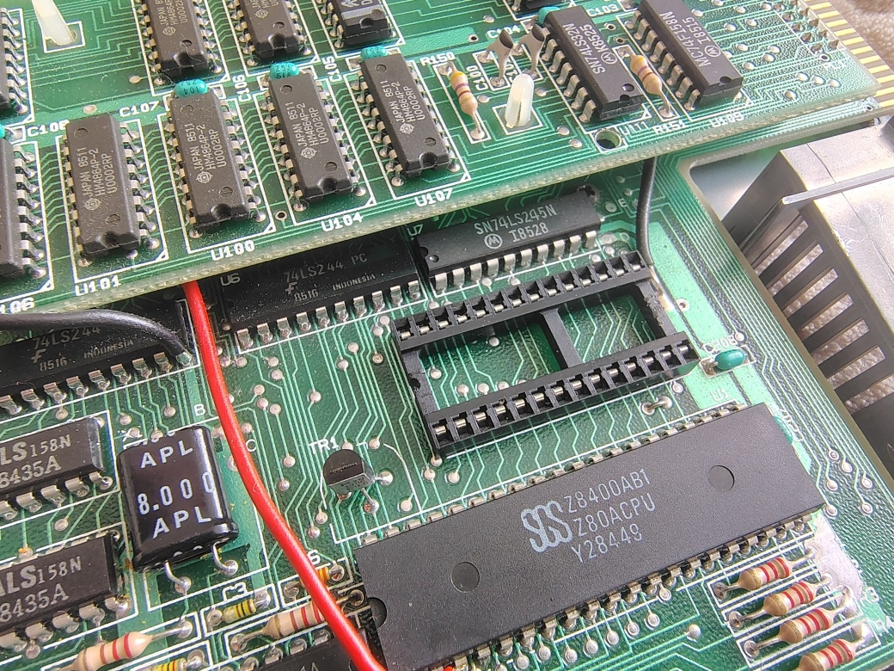
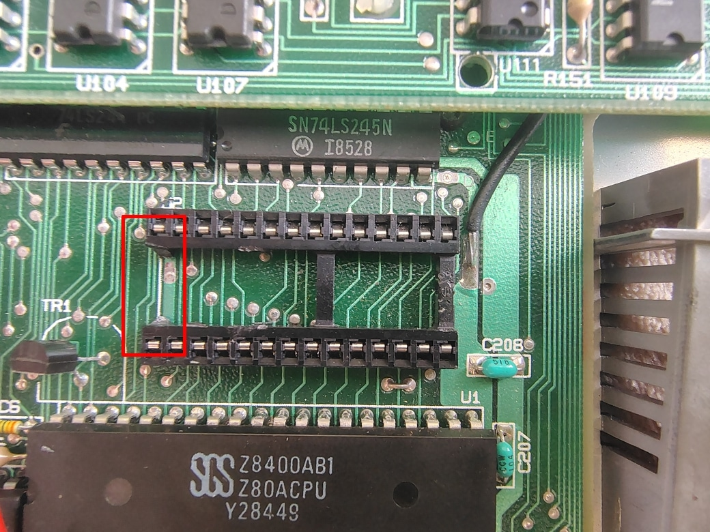
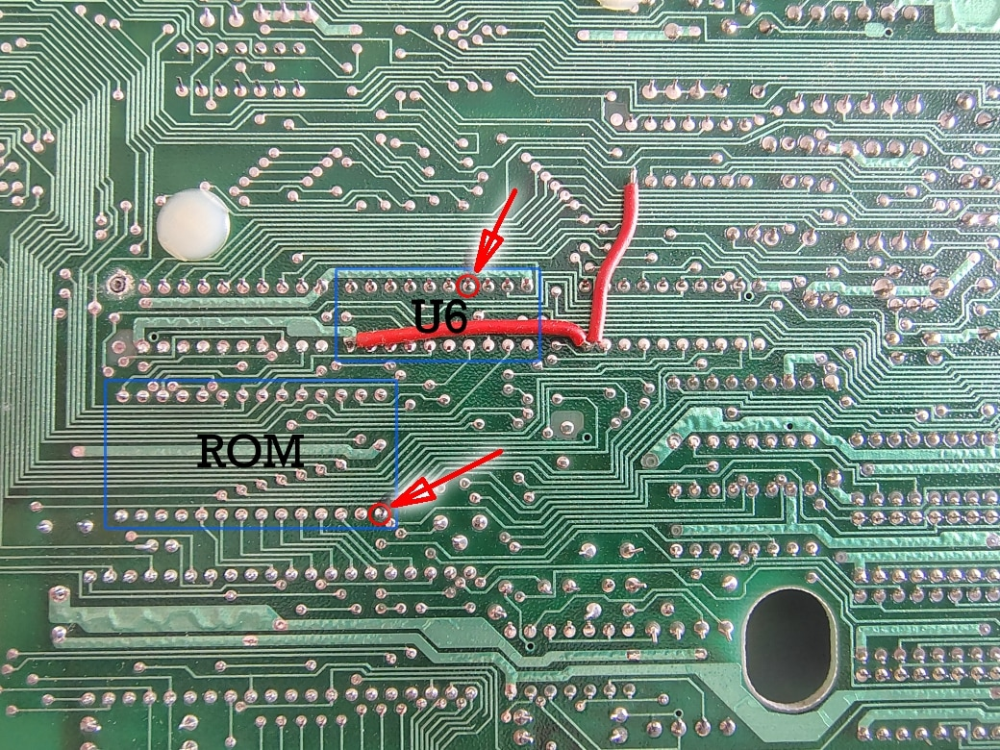
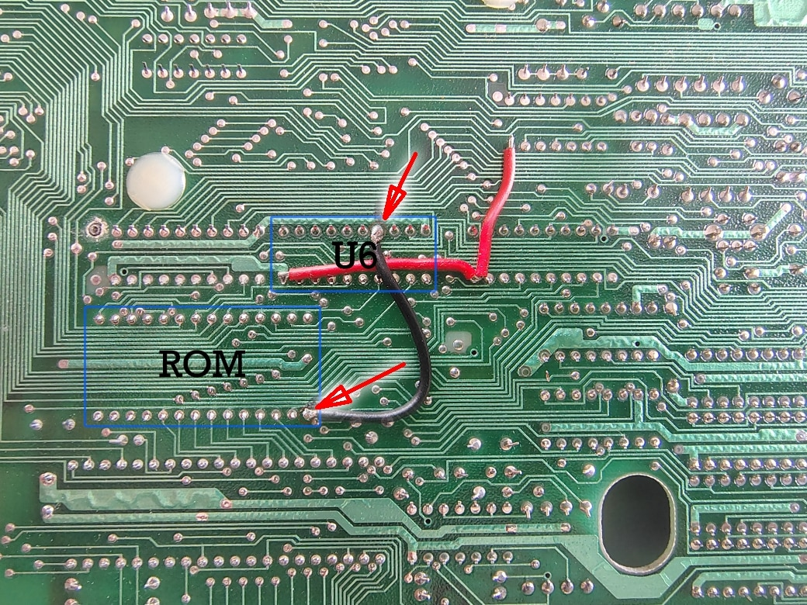

# Оновлення ПЗП комп'ютера

[EXOS](../../software/ss-exos.md) — це гнучка та модульна операційна система комп'ютерів Enterprise, яка керує каналами введення-виведення, розподілом пам'яті та підтримкою зовнішніх пристроїв. В кінці 80-х в Угорщині вийшла перша книга з детальним розбором компонентів системи що розміщені у нульовому сегменті (друга книга так і не була випущена через проблеми з авторськими правами і на заборону зворотнього проектування самої системи). В той же час ентузіасти почали створювати неофіційні версії для виправлення помилок та адаптації до сучасних реалій. Передусім, був змінений алгоритм тесту пам'яті на значно швидший. Також було здійснено перенесення інтерпретатора Бейсіку (який, по суті, став основним інтерфейсом для більшості користувачів) до внутрішнього ПЗП. Це стало можливим завдяки тому, що замість стандартної мікросхеми ПЗП об'ємом 32 кБ можна встановити мікросхему на 64 кБ. Це дозволяє задіяти вільні сегменти 2 та 3, при цьому вимагаючи мінімальних змін у схемі плати комп'ютера.

Про версії EXOS розписано [окремо](../../software/exos/exos-versions.md).

## Для чого це потрібно

Оновлення до **версії 2.4** (яку активно розвиває угорська спільнота) буде корисним з кількох причин:
 - виправлення деяких критичних помилок оригінальних версій.
 - швидкий тест пам'яті (що є дуже корисним у випадку встановлення розширення ОЗП), та розширені можливості діагностики.
 - інтерпретатор Бейсіку переміщується з картріджу у внутрішній ПЗП. Це дає можливість використовувати інші картріджі не втрачаючи доступ до Бейсіку.

Чи потрібне оновлення усім? Ні. Більшість сучасних пристроїв зазвичай мають підтримку офіційних версій 2.0-2.1: [EXDOS](../../software/ss-exdos.md) чи [адаптер SD-карточок](../hd-sd-card-adapter.md) нормально працюють із немодифікованими системами (бо не всі користувачі мають бажання лізти всередину та порушувати цілісність гарантійної наклейки). Але якщо ви хочете збільшити об'єм оперативної пам'яті, чи розігнати швидкість процесора, то оновлення буде потрібним.

Власникам Enterprise 64 раджу оновити систему хоча б до версії **2.1**. Це не потребує модифікації комп'ютера, але кількість програм, що можна буде запустити на цій моделі трішки збільшиться.

## З чого почати

Для оновлення потрібна мікросхема ПЗП **Winbond W27С512** (або сумісні) до того ж не дуже стара (бо деякі користувачі мали проблеми з старими перемаркованими чіпами які не працювали належним чином)

Прошивку можна взяти [звідси](../../software/exos/exos-download.md). Вам потрібна версія **2.4** або **2.4 з системним розширенням File** (якщо планується використання дискових пристроїв). Мова впливає лише на переклад екрану тестування і не залежить від локалізації комп'ютера.

З інструментів: викрутка з тонким довгим жалом, кусачки та паяльник.

## Розбирання

Перевертаємо корпус комп'ютера, і викручуємо 14 гвинтів хрестоподібною викруткою, один з яких знаходиться під гарантійною наклейкою.

Знову перевертаємо корпус та знімаємо частину з клавіатурою та джойстиком. Потім обережно знімаємо верхню кришку щоб не пошкодити шлейф клавіатури: трішки припіднімаємо кришку щоб просунути руку та від'єднуємо 2 шлейфи. І маємо приблизно таку картину:

Чіпи Nick та Dave не видно, бо вони знаходяться під платою внутрішнього розширення ОЗП. Ось фото без цієї плати.

Я б радив відразу звернути увагу на радіатор який зазвичай встановлений на мікросхемі Nick (звичайна мідна пластинка). Інколи він може відлетіти, тому бажано перевірити чи він добре тримається на своєму місці.

## Заміна ПЗП

Є два способи встановлення ПЗП більшого об'єму.

### 1-й спосіб

Цей спосіб є менш інвазивним для материнської плати.

Витягаємо стару мікросхему. Відгинаємо ніжку **1** нової мікросхеми ПЗП (щоб вона не входила у сокет) та підпаюємо до неї дріт який під'єднується іншим кінцем до сигнальної лінії **A15**. Її можна знайти на ніжці **17** мікросхеми **U6**, або на коннекторі **EXP1** (для внутрішнього розширення пам'яті), або на шині розширення.

### 2-й спосіб

Цей спосіб вимагає невеличкої переробки материнської плати, але в подальшому дозволяє простіше змінювати мікросхему ПЗП на іншу.

Витягаємо стару мікросхему.

Кусачками викушуємо пластикову перетинку сокета зі сторони "ключа".

Під нею бачимо широку доріжку, яку потрібно обережно розрізати. Обережно, бо поруч йдуть інші значно вужчі доріжки (під білою шовкографією теж є доріжка).

І лишилось підвести до ніжки **1** сигнальну лінію **A15**.  
Це зручніше зробити з іншої сторони плати. Для цього відкручуємо 2 гвинти якими вона кріпиться до корпусу (один біля сокету картріджа, а другий під платою внутрішнього розширення пам'яті — позначені на фото загального вигляду). І з'єднуємо цих дві точки.

Вставляємо нову мікросхему, збираємо все в зворотньому порядку, вмикаємо та перевіряємо чи все працює коректно.

Відтепер після увімкнення ми маємо помітити такий екран (бо тепер тест пам'яті проходить значно швидше):

Відтепер з картріджу можна витягнути ПЗП із Бейсіком, а замість неї вставити якусь іншу (або в SD-card рідері вивільнити місце яке займав ROM Бейсіку).