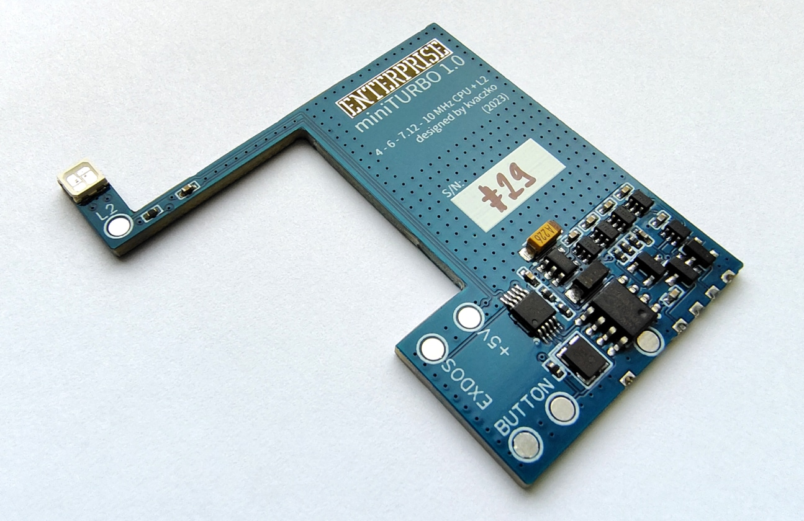

# Модуль «miniTURBO»

Автор: [kvaczko](../../peoples/community/kvaczko.md)  
Рік: 2023  

Модуль додає можливість "прозорого" перемикання [частоти роботи системи](turbo-main.md). Крім стандартної частоти процесора (**4** МГц) можна перемкнути на **6**, **7.12** та **10** МГц. Також до складу модуля інтегровано [The "L2"](the-l2.md). Для індикації режиму роботи використовується багатоколірний світлодіод, а перемикання частоти проводиться за допомогою кнопки яка монтується у непомітному місці корпусу.

> [!Примітка:]  
> Нещодавно виявилося, що miniTURBO не на 100% сумісна з оригінальною машиною за таймінгами. У 99,9999% випадків ця різниця в таймінгах взагалі ніяк не проявляється крім 2-3 демок, які дуже критичні до точних затримок (і вони можуть зависнути). Мова йде про різницю приблизно у 20 наносекунд.

## Посилання

Стаття у журналі **Enterpress \#3-4/2023**: [miniTURBO](../../press/magz/enterpress-hu/2023-05-08/miniturbo.md)

[miniTURBO panel](https://ep128.hu/Ep_Hardware/Ep_Turbok2.htm) (угорською)

[Анонс у Facebook](https://www.facebook.com/groups/112679608813524/posts/5895937457154348/)