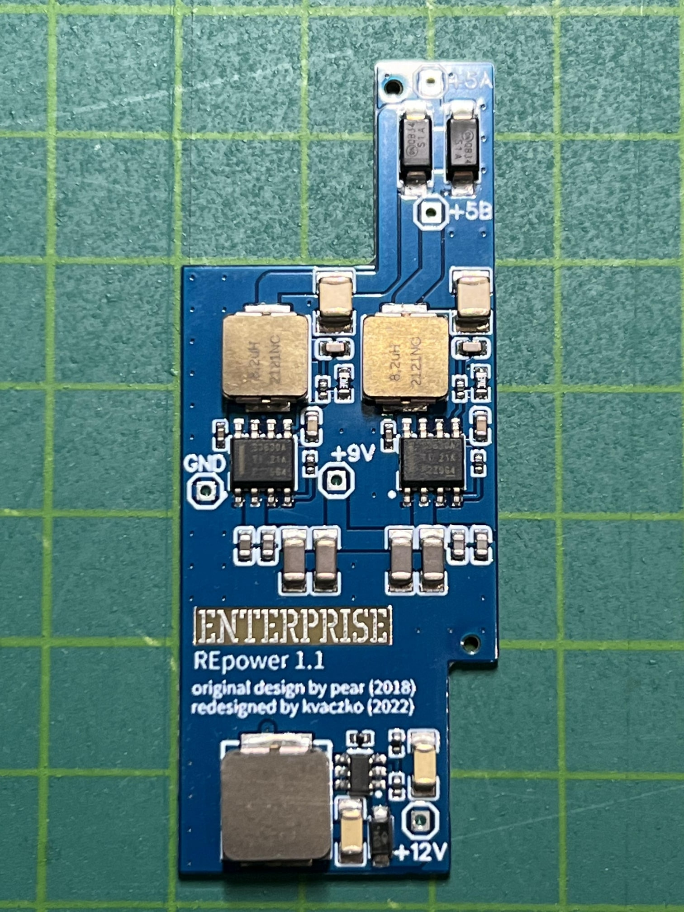
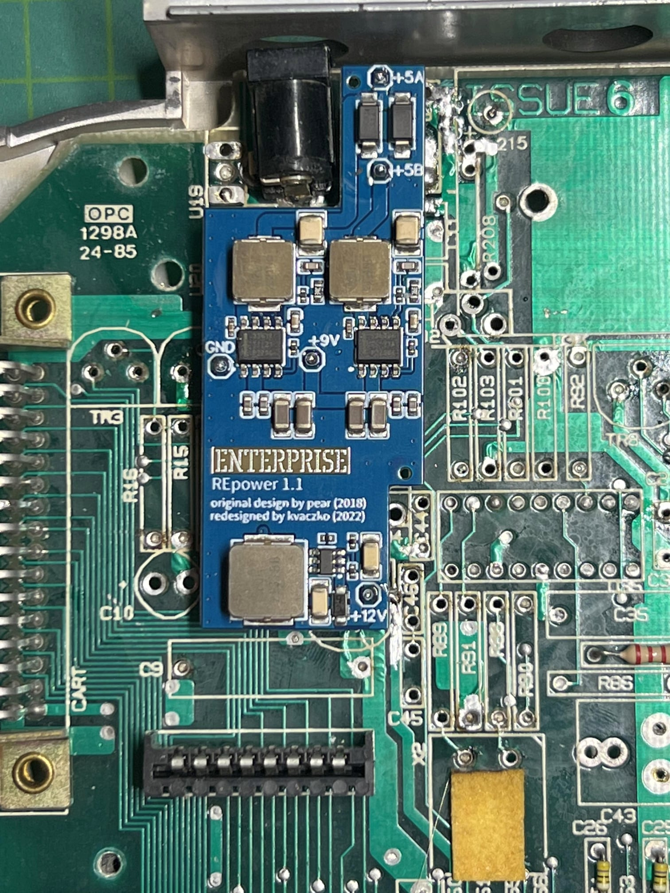

# REpower

 

Автор: [kvaczko](../../peoples/community/kvaczko.md)

Оновлена версія [EPower](epower.md) для заміни оригінальної схеми живлення комп'ютера.

> Встановлення REpower дозволяє замінити старі ланцюги живлення на материнській платі, особливо дві мікросхеми стабілізаторів 7805. Разом із цим знижується і загальне енергоспоживання комп'ютера (старі стабілізатори розсіювали величезну кількість енергії в повітря у вигляді тепла).
> 
> Увага! REpower повністю вимикає недокументовану суперздібність Enterprise — модуль для смаження яєць, замаскований під радіатор охолодження. Скористатися ним знову вже ніколи не вдасться. 🙂
