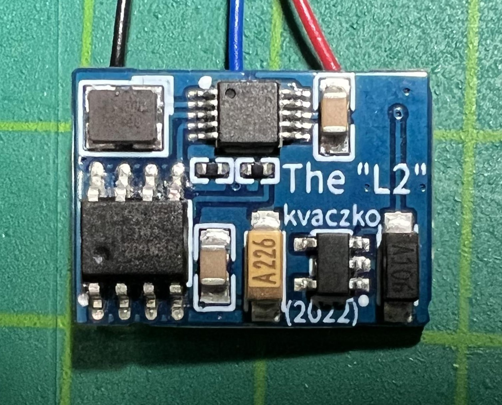
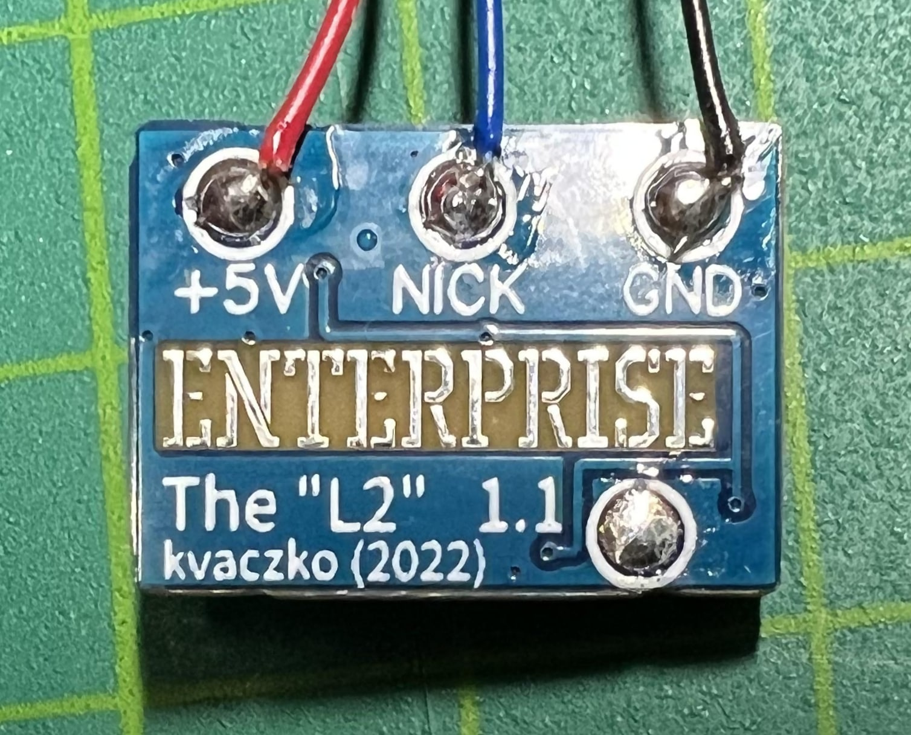

# The L2

 
 

Автор: [kvaczko](../../peoples/community/kvaczko.md)  
Рік: 2022  

Модуль створений для заміни котушки індуктивності **L2** яка з віком могла суттєво впливати на стабільність зображення. Пізніше цей модуль був інтегрований у модуль [miniTurbo](miniturbo.md).