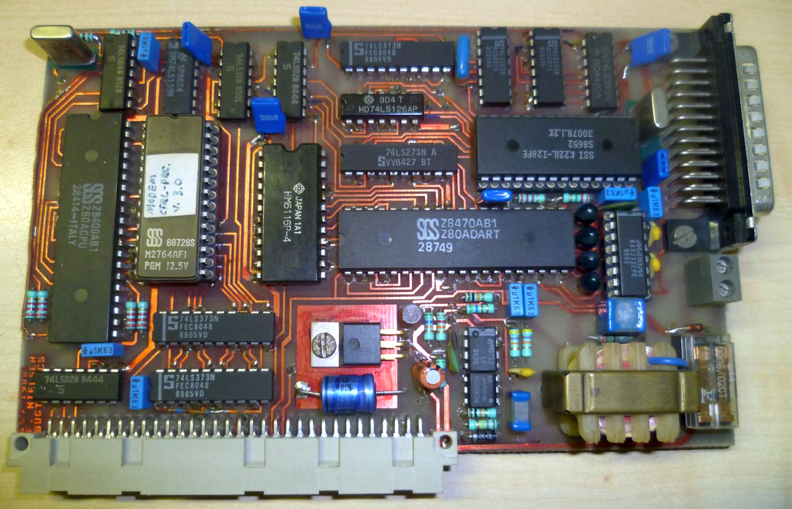
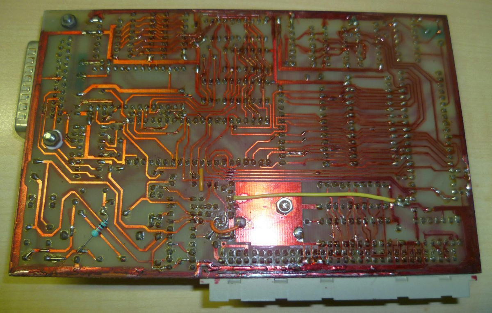
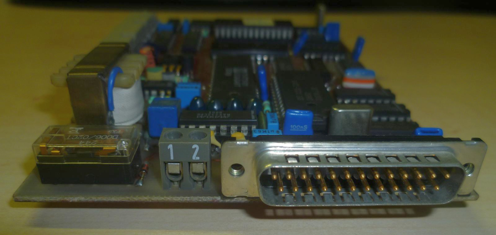
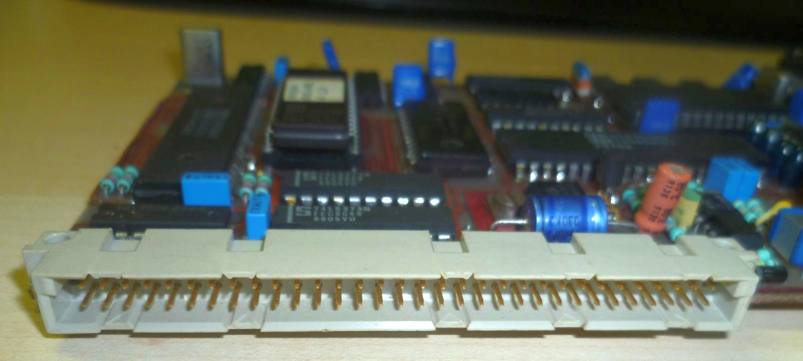
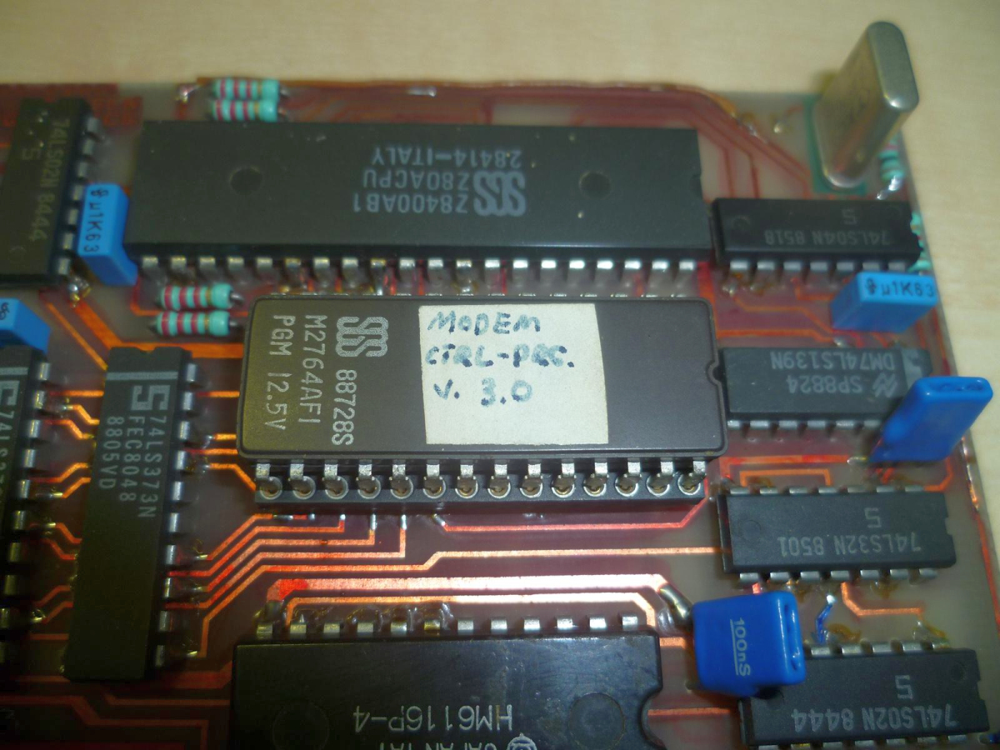
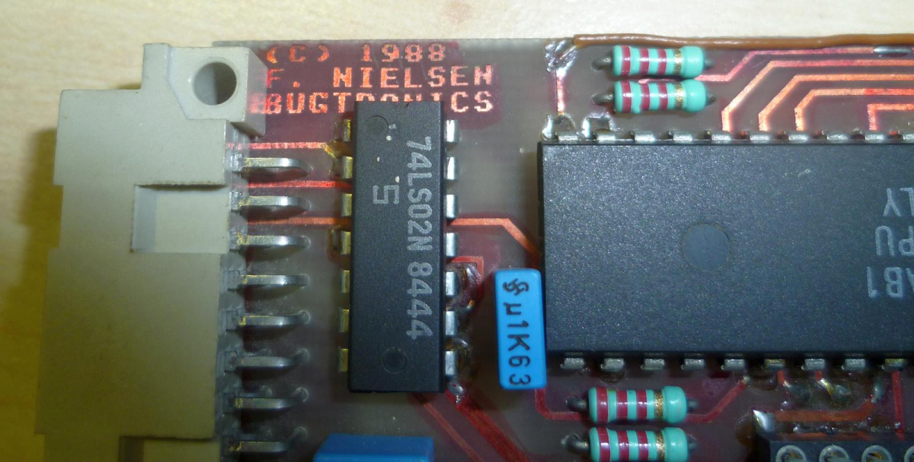

# Serial/Modem Card by Bugtronics

  
 
 
 
 
 
 

[pers_anders-nielsen](../../peoples/pers_anders-nielsen.md)

Розробка: [Bugtronics](../../companies/bugtronics.md)  
Поточний статус: неактуально (єдиний відомий екземпляр пристрою знаходиться у [Вернера Лінднера](../../peoples/ec-de/pers_werner-lindner.md))

Хоча Enterprise має послідовний порт, він не може одночасно приймати та передавати дані (повний дуплекс), що необхідно для зв'язку через модем. Ця проблема вирішується за допомогою плати послідовного порту/модема, яка містить не лише модем, але й стандартний повнодуплексний послідовний порт.

Плата послідовного порту/модема підключається зовні до шини Enterprise і потребує лише [міні-материнської плати](../system-bus/hb-bugtronics-mb.md) зі слотом розширення. Модем підтримує європейські стандарти модемів V21 та V22 (300 бод та 1200 біт/с). Це означає, що ви можете одночасно передавати та приймати дані зі швидкістю 150, 300, 600, 1200 біт на секунду. Пізніше можуть бути поставлені спеціальні версії модемної плати з підтримкою стандарту V22bis (2400 біт/с) та/або американських стандартів 300 і 1200 біт/с. Модем також має функції автонабору (импульсний та тоновий набір), автовідповіді, автоматичного регулювання швидкості передачі даних та буферизацію отриманих даних на 1.75 Кб. Буферизація отриманих даних дозволяє користувачам із суто касетними системами приймати дані та файли за допомогою плати послідовного порту/модема. Таким чином, вони зможуть повною мірою скористатися перевагами модемної плати.

Доступна безкоштовна програма зв'язку під назвою **ASICOM**, яка дозволяє використовувати більшість функцій модемної плати. Вона підтримує керуючі ANSI escape-послідовності, що використовуються більшістю електронних дошок оголошень (BBS), і містить найважливіші функції комунікаційної програми, такі як відкриття/призупинення/закриття лог-файлу, налаштування формату даних, набір номера, розрив з'єднання та передачу за протоколом Xmodem. Крім того, доступна програма дошки оголошень із низкою розширень Бейсіку. За допомогою неї ви можете запустити власну BBS (і звести з розуму свою родину!). Для роботи програми BBS потрібна програма **ENTERCOM** (див. нижче).

Плата послідовного порту/модема з модемом на 2400 біт/с (V22bis) могла з'явитись пізніше. Плати на 1200 біт/с можна було оновити до версії 2400 біт/с. Існує ймовірність, що могла існувати і версія на 9600 біт/с.

**Entercom** — це програма, яка використовується разом із описаною вище платою послідовного порту/модема. Вона містить два нові драйвери: один для модема та один для послідовного порту на платі. Вона також містить просунуту комунікаційну програму, яка може працювати як із текстом, так і з графікою. Драйвери пристроїв дозволять вам зручно використовувати всі можливості плати. Наприклад, ви можете завантажувати програми безпосередньо з `MODEM:`, що дає змогу завантажувати програми прямо з телефонної лінії так само легко, як із `DISK:` або `TAPE:`, копіювати з `COM:` (послідовний порт RS232) у файл тощо.

