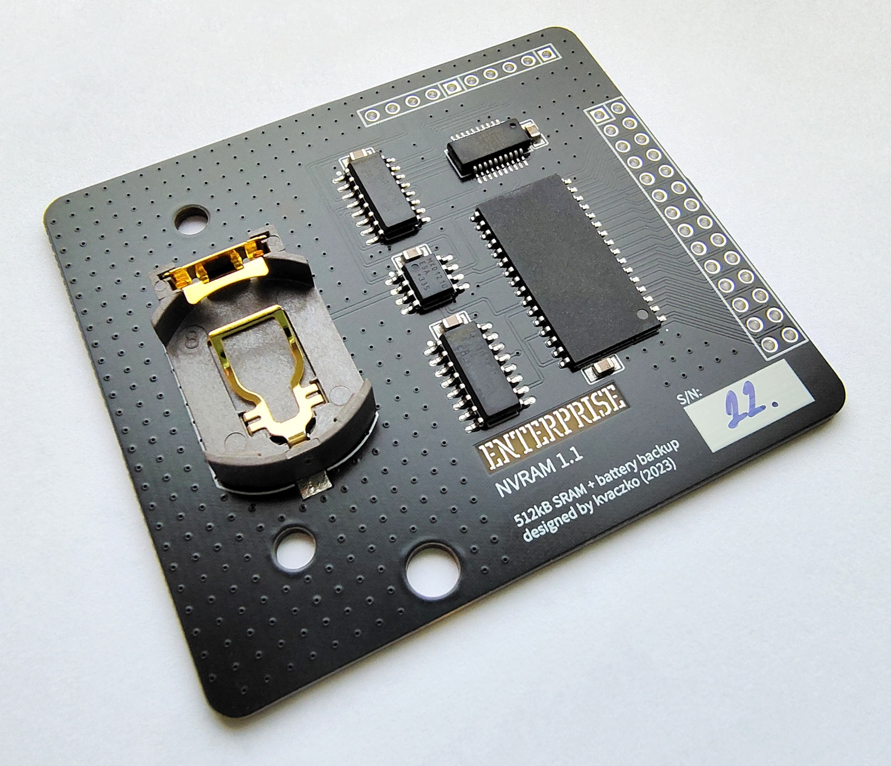

# Внутрішнє розширення ОЗП «NVRAM»

Автор: [kvaczko](../../peoples/community/kvaczko.md)  
Рік: 2023  

Внутрішнє розширення оперативної пам'яті на **512** кБ з можливістю збереження вмісту під час вимкнення або перезавантаження. 

Встановлюється замість оригінального модуля розширення пам'яті на 64 кБ (яке присутнє у моделі на 128 кБ). Загальний обсяг оперативної пам'яті комп'ютера стане 512+64=**576** кБ.

Збереження вмісту працює лише з [EXOS 2.4](../../software/exos/exos-versions.md). Функціонал дозволяє зберігати у пам'яті завантажені ROM-файли та/або вміст RAM-диску.

## Посилання

[Анонс у Facebook](https://www.facebook.com/groups/112679608813524/posts/5947231608691599/)

Стаття у журналі **Enterpress \#3-4/2023**: [NVRAM 1.1](../../press/magz/enterpress-hu/2023-05-08/nvram.md)
