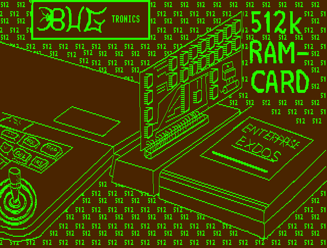
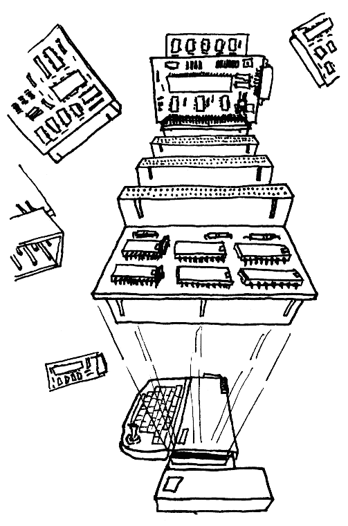

# Motherboard від Bugtronics

Модуль розширення системної шини **Mini Motherboard** пропонувався данською фірмою [Bugtronics](../../companies/bugtronics.md) у кооперації з [Dataquip Electronics](../../companies/dataquip-electronics.md). Одною стороною підключається до шини розширення (з правого боку комп'ютера), а з іншої сторони має слот для підключення офіціального EXDOS. Додатковий слот (скоріш за все був використаний роз'єм [DIN 41612](https://uk.wikipedia.org/wiki/DIN_41612)) був розташований у верхній частині пристрою.

Цей модуль дозволяв підключати карту зовнішнього розширення ОЗП на 512КБ та/або [модем](../net/hn-bugtronics-modem.md).

На даний момент немає ніяких фотографій даних плат за винятком схематичного зображення створеного у графічному редакторі PaintBox.

У цей модуль можна було підключити розширювач з додатковими слотами, що дозволяло підключати до 4 (або 8) карт розширення.

