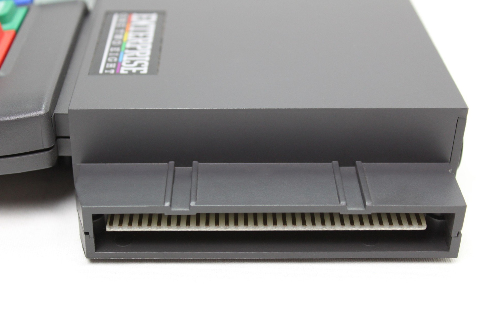

# Пристрої розширення системної шини

    

Як відомо Enterprise має лише один крайовий роз'єм на який виведена системна шина. Усі апаратні розширення, за офіційним дизайном [Enterprise Computers](../../companies/enterprise-computers-ltd.md), мали підключатись до спеціального адаптера системної шини, який при потребі мав би живити всі розширення підключені до нього. Планувались як однослотові адаптери (призначені лише для одного пристрою), так і багатослотові. Але з невдачами на ринку та фінансовими втратами ця модульна система так і не була реалізована. На ринок вийшов лише [однослотовий Bus Bridge](hb-bus-bridge.md), бо крім [контролера гнучків дисків](../hd-exdos.md) інших офіційних апаратних розширень так і не з'явилось.

В Угорщині, у зв'язку відносною з популярністю комп'ютера, виникла потреба в одночасному підключенні кількох апаратних розширень. Тому на основі існуючого адаптера була розроблена багатослотова версія. В якій всі слоти мали однаковий пріоритет, що залишало розробнику плат розширення обов'язок знати, які ресурси використовувалися раніше на інших платах, щоб уникнути конфліктів з ними. Як виявилось з часом (коли внутрішні розробки компанії потрапили у вільний доступ) оригінальний дизайн був дещо кращим, але з іншого боку, угорський «стандарт» також має деякі переваги, такі як відсутність обмежень на кількість сегментів або портів Z80, які можна використовувати в слоті.

Але потреба у підключенні декількох карт розширення виникала не лише в угорських користувачів. У 80-роках в Німеччині [майбутній технічний директор](../../peoples/ec-de/pers_werner-lindner.md) компанії [Enterprise Computers GmbH](../../companies/enterprise-computers-gmbh.md) та користувачі у Данії створювали свої версії розширювачів системної шини.

## Офіційні

[System Bus Bridge](hb-bus-bridge.md)  

Expansion Motherboard (проект)

## Класична угорська версія

Автор: [Gyula Mészáros](../../peoples/hu/pers_gyula-meszaros.md)

[Bus Expander](hb-bus-expander.md)

[FlexiBridge](hb-flexibridge.md) (сучасний редизайн угорськоі версії)

## NGE (Next-Generation Expansion)

Автор: [kvaczko](../../peoples/community/kvaczko.md)

[NGE](hb-nge.md)

## Іспанська версія

Автор: [Wilco](../../peoples/community/wilco.md)

[New Bus Expander](hb-new-bus-expander.md)

 -  [M-Slot](hb-m-slot.md)

## Німецька версія

Автор: [Вернер Лінднер](../../peoples/ec-de/pers_werner-lindner.md)  
Статус: не актуальна

[hb-mb-exp-bus](hb-mb-exp-bus.md)  
[hb-minibus](hb-minibus.md)

## Данська версія

Статус: не актуальна

[Mini DDC](hd-mini-ddc.md)