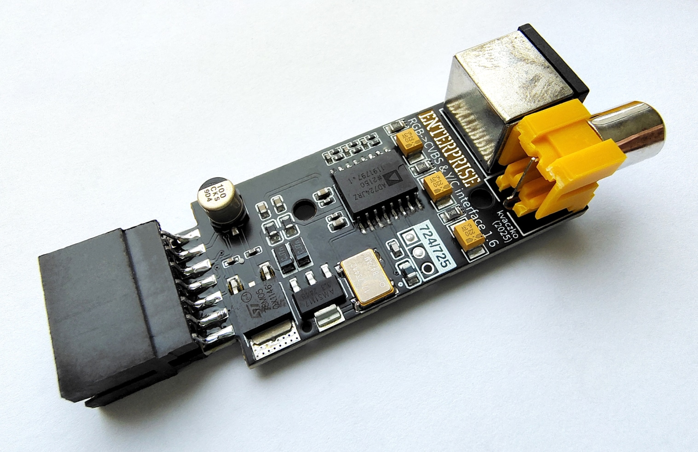
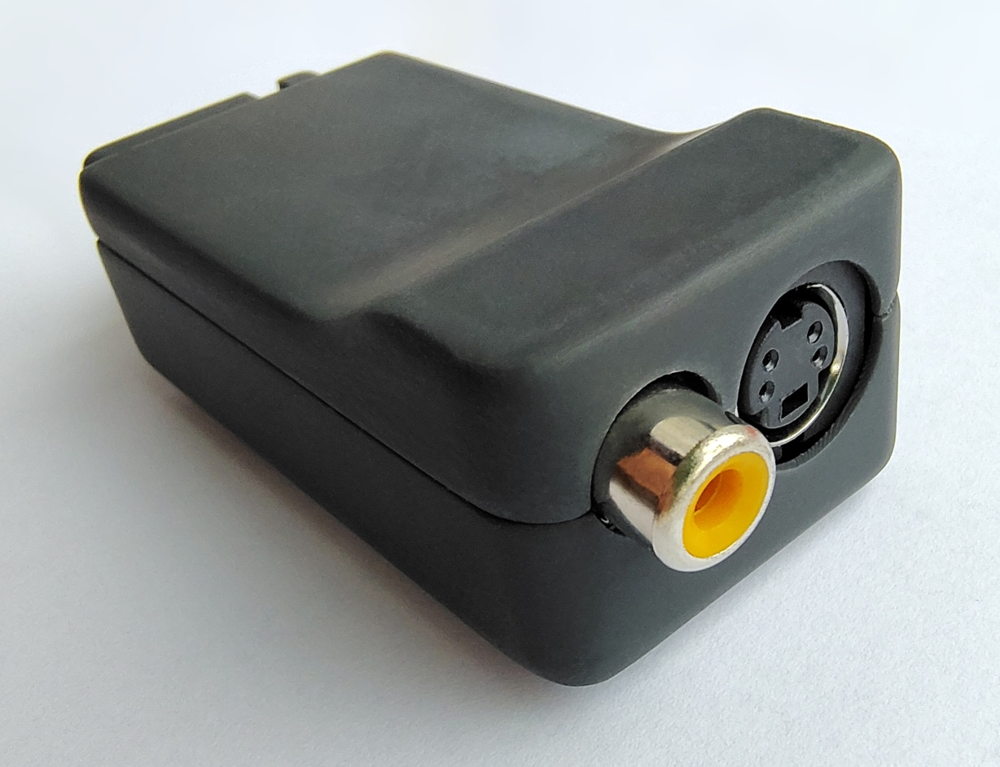

# Конвертер «RGB → CVBS & Y/C»

 

Автор: [kvaczko](../../peoples/community/kvaczko.md)  
Рік: 2022  

Конвертер RGB → S-Video / Composite. Генерує чіткіший відеосигнал у порівнянні з "класичною" модифікацією материнської плати для кольорового композиту. Підключається до роз'єму [Monitor](../connections/pinouts-monitor.md).

## Посилання

Стаття у журналі **Enterpress \#3-4/2023**: [RGB/S-video/kompozit adapter](../../press/magz/enterpress-hu/2023-05-08/rgb-svideo-kompozit-adapter.md)