# Питання та відповіді з Вернером Лінднером

Ця сторінка є перекладом питань до [Вернера Лінднера](../peoples/ec/pers_werner-lindner.md) (**Werner Lindner**) на форумі [enterpriseforever.com](http://enterpriseforever.com/hall-of-fame/qa-with-werner-lindner-technical-director-of-the-enterprise-computers-gmbh/).

Вернер розповідає про свою роботу в компанії і робить огляд різноманітного обладнання для Enterprise, прототипів і програмного забезпечення, про які існували лише чутки та домисли.

> [!NOTE]
> Примітка: Порядок повідомлень трішки змінений для групування їх по темах.

## Історичні подробиці

[(оригінал повідомлення)](https://enterpriseforever.com/hall-of-fame/qa-with-werner-lindner-technical-director-of-the-enterprise-computers-gmbh/msg45482/#msg45482)

**Zozosoft**: Наш найновіший учасник — надзвичайно важлива постать в історії Enterprise!

Оскільки він має дуже багато роботи й не має часу відповідати на безліч запитань безпосередньо на форумі, він попросив мене побути свого роду «речником», щоб опублікувати обговорену інформацію тут.

Перш за все, ось його самопрезентація:

> **Werner Lindner**: Я зареєструвався на вашому чудовому сайті/форумі два дні тому, натрапивши на нього абсолютно випадково. Я вже провів кілька годин, гортаючи теми та читаючи купу цікавих речей. Був просто вражений знайти тут таких людей, як [Брюс Таннер](../peoples/ec/pers_bruce-tanner.md), [Пітер Гайнер](../peoples/pers_peter-hiner.md) чи [Тім Бокс](../peoples/pers_tim-box.md) через стільки років — у голові одразу виринуло безліч фантастичних спогадів.
> 
> Трішки про себе: Я працював у компанії [ENTERPRISE Computers GmbH](../companies/enterprise-computers-gmbh.md) у Мюнхені з 1986 року і до її ліквідації у 1997-му. На самому початку (я тоді ще був студентом) я відповідав за роботу з кінцевими користувачами та технічну підтримку офісного персоналу. У 1987 році (після ліквідації [ENTERPRISE UK](../companies/enterprise-computers-ltd.md)) моїм завданням стало встановлення контактів з усіма виробниками та постачальниками, які були залучені до виробництва Enterprise 64/128 та периферії. Я особисто кілька разів їздив до Англії, відвідуючи всі ці компанії та намагаючись з'ясувати, чи можливо знову запустити виробництво комп'ютера.
> 
> Пізніше я став технічним директором компанії. Я брав безпосередню участь у різних проєктах ENTERPRISE в СРСР (Москва, Алмати, Джезказган — усе це в період між 1989 та 1992 роками). Тоді я мав дуже хороший контакт із [Вілмошем Копачі](../peoples/pers_vilmos-kopacsy.md) з [á-Studio](../companies/a-studio.md) і провів із ним кілька тижнів в Алмати, налаштовуючи перші шкільні мережі.

----

[(оригінал повідомлення)](https://enterpriseforever.com/hall-of-fame/qa-with-werner-lindner-technical-director-of-the-enterprise-computers-gmbh/msg45483/#msg45483)

**Zozosoft**: Перше питання: чи знаєте ви, скільки машин було продано в Німеччині та інших країнах? Нам уже відомо про продажі у Великій Британії, Німеччині, Угорщині (понад 20 000), Нідерландах, Данії, Іспанії, Франції, Єгипті (4000) та Радянському Союзі (3000).

> **Werner Lindner**: Щодо проданих машин у кожній країні, я дійсно мушу визнати, що в жодному разі не знаю точних цифр. Моя робота в [ENTERPRISE Germany](../companies/enterprise-computers-gmbh.md) розпочалася тоді, коли [британський офіс](../companies/enterprise-computers-ltd.md) уже був закритий. На початку я відповідав за підтримку кінцевих користувачів і проводив певне навчання — що стосується апаратного та програмного забезпечення — для нових менеджерів із продажу. Нових, тому що попередній штат у Німеччині також був звільнений [Лачу Матані](../peoples/ec/pers_lachu-mathani.md) восени 1986 року. Ті люди обіцяли, що зможуть продати тисячі комп'ютерів у Німеччині, але спромоглися лише приблизно на 2500 штук за майже рік роботи. Через їхні обіцянки [ENTERPRISE UK](../companies/enterprise-computers-ltd.md) виробила велику кількість німецьких машин EC128k, і тепер вони лежали у [Лачу](../peoples/ec/pers_lachu-mathani.md) на складі (його компанія [Broadlight Ltd.](../companies/broadlight-ltd.md) перебрала на себе всі залишки запасів ENTERPRISE).
> 
> Багато документів втрачено, особливо тих, що стосуються показників продажів, тому всі обсяги до осені 1986 року — це лише приблизні оцінки:
> 
> Німеччина: Приблизно 2500 машин моделі **128k** і зовсім невелика кількість **ENTERPRISE 64k** (обидві позиції через [ENTERPRISE Computers GmbH](../companies/enterprise-computers-gmbh.md)), а також дуже мала кількість **Mephisto PHC** (через фірму [Hegener & Glaser](../companies/hegener-and-glaser.md)). Навіть більше: я бачив лише один картридж **Mephisto BASIC** і один **Mephisto PHC**, які приносили до нас у ремонт.
> 
> Данія, Нідерланди, Норвегія, Франція, Іспанія та, ймовірно, інші країни Західної Європи: [ENTERPRISE UK](../companies/enterprise-computers-ltd.md) мала прямі дилерські контракти з одним імпортером у кожній країні, але ці люди володіли лише невеликими компаніями. Фактично вони були швидше звичайними дилерами, ніж справжніми імпортерами/дистриб'юторами, тому в кожній із цих країн, ймовірно, є лише невелика кількість машин — можливо, по кілька сотень на країну. Імпорт та контакти в більшості випадків припинилися після того, як [ENTERPRISE UK](../companies/enterprise-computers-ltd.md) перейшла під зовнішнє управління (оголосила про банкрутство).
> 
> У Німеччині ми мали контакти лише з людьми з Данії та Нідерландів. Я кілька разів спілкувався з чоловіком із Нідерландів по телефону і зустрівся з ним особисто один раз, коли він приїжджав до Мюнхена, щоб купити у нас 12 машин. Він показав нам кілька прототипів заліза зі своєї країни: внутрішнє розширення пам'яті на 512 кБ із динамічною пам'яттю (DRAM) та маленький контролер EXDOS, який встановлювався «бутербродом» поверх комп'ютера (фото якого можна побачити в журналі [ENTERFACE](../press/pr-enterface.md) за квітень-травень 1987 року).
> 
> Що стосується Данії, я мав контакт із [Андерсом Роаром Нільсеном](../peoples/pers_anders-nielsen.md). Він та його брат очолювали місцеву групу користувачів і зробили дуже багато речей для ENTERPRISE. Окрім чудових програм та системних розширень (як-от розширення карт пам'яті), вони створили плату модему та програмне забезпечення для ENTERPRISE. Завдяки цьому комплекту комп'ютер можна було використовувати як BBS-станцію (на той час не було ні інтернету, ні електронної пошти ).
> 
> Єгипет: Єгипетським імпортером була компанія [Computer Technical Co.](../companies/computer-technical-co.md) у Каїрі. Засновником і керуючим директором був пан [Набіль Лашин](../peoples/pers_nabil-lashine.md). Він уже купив близько 500 машин **ENTERPRISE 64k** в Англії. Він імпортував їх до Єгипту і продавав іншим компаніям як електронні друкарські машинки. Його не цікавили ігри чи інша периферія, тому що він не міг їх продати (ніхто в Єгипті на той час не міг дозволити собі домашній комп'ютер для приватних потреб). Він створив власне програмне забезпечення для комп'ютера і сам зробив зелений принт на клавіатурі. Він купував у нас додаткові машини 64k, але це була приблизно одна поставка на рік і не більше 150 машин (25 коробок по 6 комп'ютерів). Він також отримав від нас близько 500 порожніх картриджів. Він завжди платив щомісячними чеками. Іноді отримання грошей займало багато часу, але він був дуже надійним. Його останнє замовлення було у 1993 році, а останній контакт із ним — у 1994-му. На той час його компанія мала великі проблеми, і його банк наклав руку на залишки комп'ютерів EC на складі. Після цього я нічого про нього не чув, але в мене досі зберігається повний комплект клавіш із принтом, який він подарував мені під час свого візиту до нас у Мюнхен. Загалом, я вважаю, що 4000 одиниць — це забагато. Особисто я знаю лише про 1500 одиниць, включно з машинами з Англії (але, можливо, Лачу продав щось йому напряму).
> 
> Про Угорщину та країни колишнього Радянського Союзу: Це дві дуже особливі історії. Я не знаю всіх деталей і хотів би розпитати свого хорошого друга, який укладав ці контракти, перш ніж розповім вам щось не те. Я також запитаю його про загальну кількість комп'ютерів на складах в Англії, бо зараз не можу згадати цю цифру.
> 
> Англія: Я поняття не маю про загальну кількість проданих там машин, але припускаю, що вони продали не більше 25 000 одиниць. Люди з компанії [GRI Ltd](../companies/gri-ltd.md) розповідали мені, що вони виробили десь близько 45 000 машин (64k та 128k, англійських та німецьких версій). Я не знаю обсягів виробництва попереднього виробника (між жовтнем 1984 та червнем 1985 років), але загальний випуск у 84-му був дуже низьким, до того ж вони випускали дуже багато браку, що зрештою змусило ENTERPRISE шукати іншого виробника. Люди з **GRI** розповіли мені набагато більше (проблеми з комунікацією, проблеми з постачанням деталей та матеріалів, великі проблеми з тестовим обладнанням і, загалом, занадто дороге виробництво через конструкцію машини та велику кількість ручної праці, як-от розширення пам'яті...), але це також окрема історія, яку слід розповісти пізніше.
> 
> У 1996/1997 роках залишався складський запас у близько 2000 комп'ютерів ENTERPRISE (64k, 128k UK та 128K німецьких версій), які ми продали компанії в Чеській Республіці. Разом із цими комп'ютерами пішло майже все супутнє приладдя (кабелі, програми на касетах, дисководи, інструменти, тестове обладнання...), і це став офіційний кінець компанії [ENTERPRISE Computers GmbH](../companies/enterprise-computers-gmbh.md), якою ви її знаєте.

----

[(оригінал повідомлення)](https://enterpriseforever.com/hall-of-fame/qa-with-werner-lindner-technical-director-of-the-enterprise-computers-gmbh/msg45670/#msg45670)

> *(про бізнес в Угорщині)*  
> **Werner Lindner**: Початкова угода стосувалася всієї партії (приблизно 20 000 одиниць), але відвантаження здійснювалося кількома партіями. Товар з англійських складів постачався напряму з Англії та об’єднувався з німецькими залишками на складі компанії _MIDI-DATA_ у Франкфурті. Звідти кілька вантажівок вирушили до Угорщини. Магнітофони **OMEGA** привезли з Гонконгу. Я особисто знаю про одну поставку в 5000 штук, але не впевнений, чи були інші. Управлінською стороною (контракти, логістика тощо) на той час займався [Г. М. Віндіш](../peoples/pers_h-m-windisch.md) («Майк» Віндіш), який пізніше став керуючим директором [ENTERPRISE Computers GmbH](../companies/enterprise-computers-gmbh.md). Я вже намагався зв’язатися з ним (щодо деталей по Угорщині, Алмати, Джезказгану та Москві), але, на жаль, він зараз за кордоном. Він повернеться десь у середині квітня, і я думаю, що раніше отримати більше інформації не вдасться.

**Zozosoft**: Хто створив цей чудовий дизайн магнітофонів і чому існують інші версії (**Cloud 7**/**Omega**)?

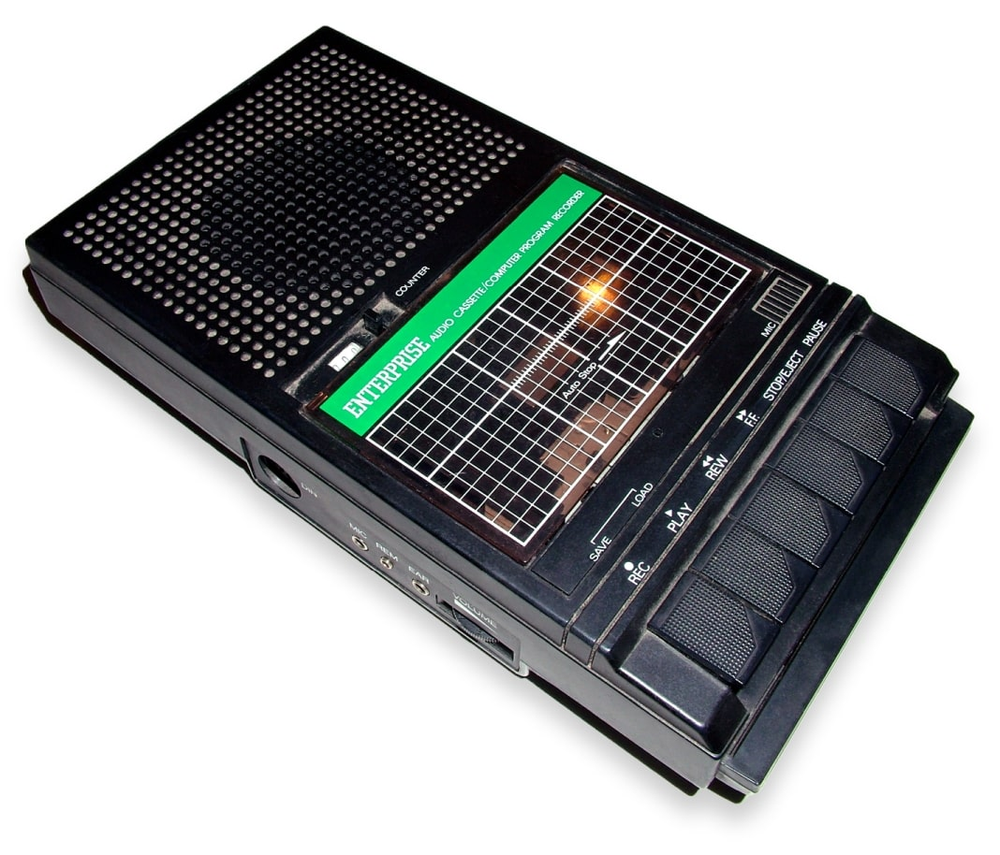 
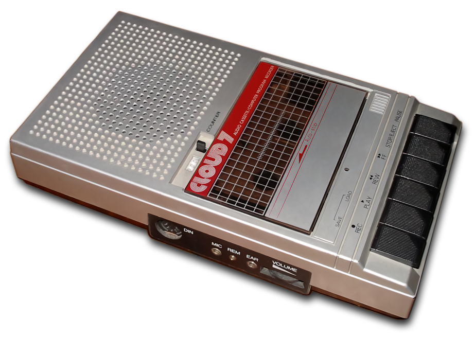 
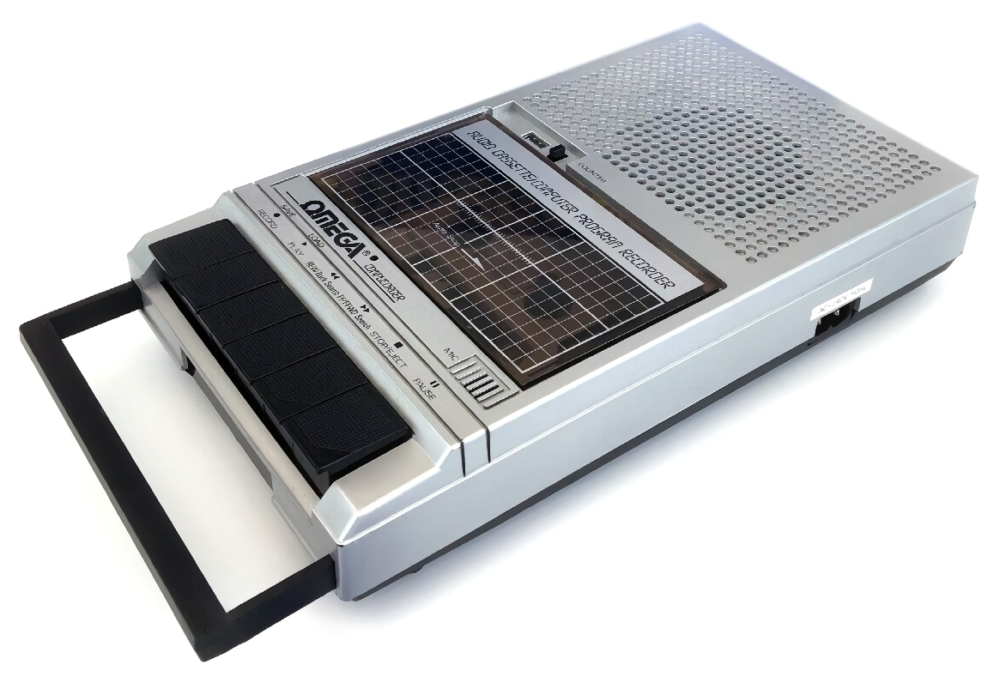 

> **Werner Lindner**: Наскільки мені відомо, усі магнітофони, відправлені до Угорщини, прибули з Гонконгу. Замовлення та доставку організувала філія [Locumals Ltd.](../companies/locumals-ltd.md) у Гонконгу — це торгова компанія родини [Матані](../peoples/ec/pers_lachu-mathani.md). Чорно-зелений корпус був нашою ідеєю; ми надіслали плівки для логотипа **Гені Матані** (Heny Mathani), який узгодив усі деталі з постачальником. Здається, початкове замовлення було на 10 000 штук, але я не пам’ятаю точно.
> 
> Коли нам знадобилося зробити повторне замовлення, **Гені** повідомив, що оригінальний постачальник/дизайн більше недоступний. Йому довелося звернутися до іншого постачальника (це зрештою і були **Cloud 7** / **Omega**), а пошук альтернативи зайняв багато часу. Вже не було можливості замовити чорний корпус та індивідуальний принт логотипа. Крім того, транспортування було справжнім жахом — довгим і дорогим: вантаж із Гонконгу йшов через Роттердам, а потім вантажівками через Німеччину до Угорщини, але іншої альтернативи на той час не було. Загальний обсяг був недостатнім, щоб відправити повний 40-футовий контейнер, тому нашому вантажу завжди доводилося чекати на інші товари, що йшли в тому ж напрямку.

----

[(оригінал повідомлення)](https://enterpriseforever.com/hall-of-fame/qa-with-werner-lindner-technical-director-of-the-enterprise-computers-gmbh/msg46278/#msg46278)

Стаття з журналу **Mein Homecomputer, 12/1985**:  
 
 

І з **Computer Aktuell 01/1986**:  
 
 
 

Ціни з каталогу **METRO** за 1986 рік. Для порівняння наведено сторінки, присвячені IBM PC:  
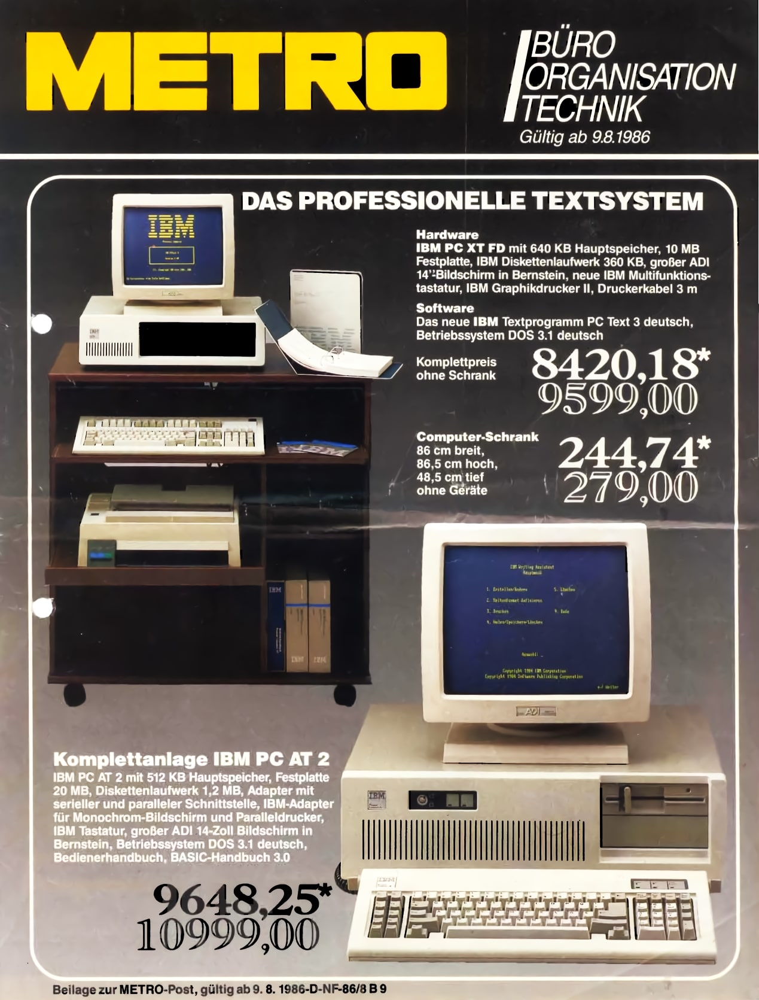 
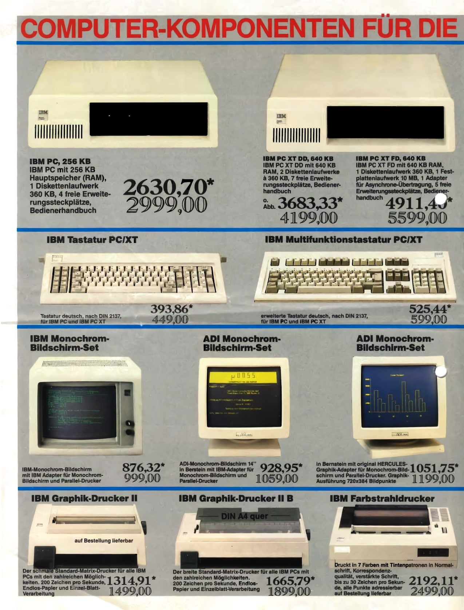 
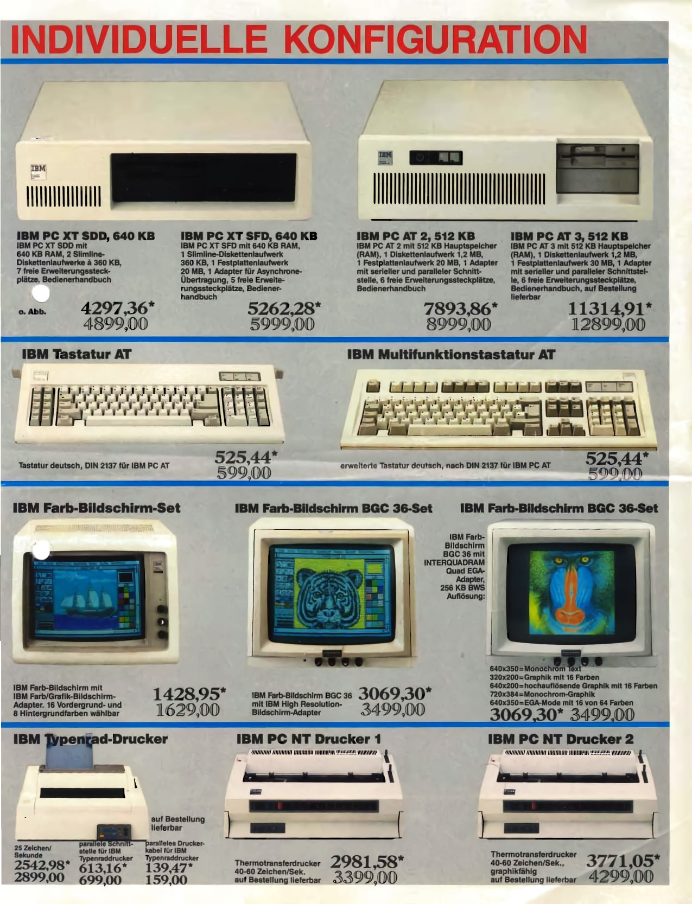 
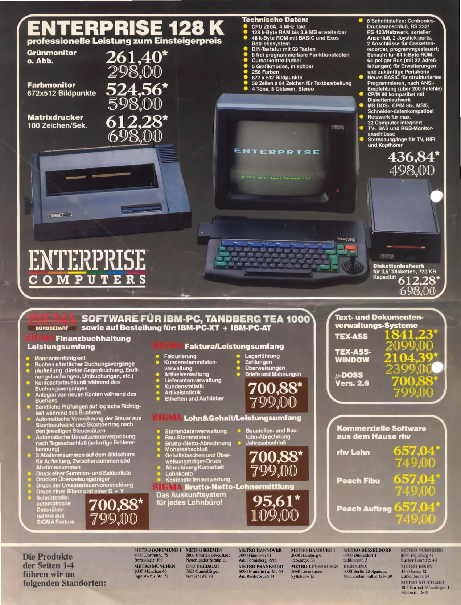

----

[(оригінал повідомлення)](https://enterpriseforever.com/hall-of-fame/qa-with-werner-lindner-technical-director-of-the-enterprise-computers-gmbh/msg46299/#msg46299)

**Zozosoft**: чи були в каталозі інші 8-бітні системи, наприклад, Commodore?

> **Werner Lindner**: METRO — це оптовий посередник, клієнтами якого є лише компанії та дилери, а не кінцеві споживачі. Тому на той час вони не пропонували жодних інших "домашніх комп'ютерів". Перше керівництво ENTERPRISE намагалося позиціювати машину як професійний інструмент, і саме тому вони запропонували її мережі METRO.
> 
> На жаль, це не мало великого успіху: торгові точки METRO отримували комп'ютери та периферію на умовах комісії, тобто вони оплачували все, але мали право повернути будь-які непродані компоненти протягом певного періоду. Загалом METRO продала лише кілька сотень машин, і весь нерозпроданий товар повернувся на початку 1987 року.

----

[(оригінал повідомлення)](https://enterpriseforever.com/hall-of-fame/qa-with-werner-lindner-technical-director-of-the-enterprise-computers-gmbh/msg46307/#msg46307)

> **Werner Lindner**: У цій угоді брали участь приблизно 50 торгових точок METRO. Кожна з них отримала по 12 машин (2 коробки), кілька моніторів, принтерів та 4 дисководи (1 коробка). У підсумку приблизно 300 комп'ютерів, частина моніторів, принтерів та половина дисководів повернулися назад. Великою проблемою стало те, що в магазинах викинули коробки від демонстраційних зразків (які вони також повернули), тому після завершення угоди ми отримали близько 50 комп'ютерів, дисководів та принтерів без пакування, кабелів та інструкцій. Якщо врахувати час і гроші, витрачені на розпакування, перепакування та заміну відсутніх позицій, а також фінансові втрати від продажу цих очевидно вживаних товарів — для нас ця угода стала повним провалом.

----

[(оригінал повідомлення)](https://enterpriseforever.com/hall-of-fame/qa-with-werner-lindner-technical-director-of-the-enterprise-computers-gmbh/msg45552/#msg45552)

**Zozosoft**: Я завжди думав, що німецькі комп'ютери та німецьке ПЗП розширень були виготовлені німецькою компанією. Але коли я запитав про ПЗП [BRD](../software/ss-localizations.md), відповідь мене повністю здивувала!

> **Werner Lindner**: EPROM 08-59 та його вміст походять не від [ENTERPRISE GmbH](../companies/enterprise-computers-gmbh.md). Німецький ENTERPRISE 128k був єдиною офіційною іноземною версією, яка була спроектована, виготовлена та висилалась безпосередньо з Англії. Окрім неї, існували лише англійські машини на 64к та 128к. Вміст EPROM 08-59 мав бути створений безпосередньо компанією [Intelligent Software](../companies/intelligent-sofware-ltd.md).
> 
> Я вважаю, що ця історія почалася в той час, коли компанія [Hegener & Glaser](../companies/hegener-and-glaser.md) намагалася продавати ENTERPRISE 64k під назвою **Mephisto PHC**. Вони зрозуміли, що суто англійську машину важко продати, особливо з огляду на те, що її намагалися просувати як мережевий комп'ютер (для шкіл тощо). Тому розробка розширення [BRD](../software/ss-localizations.md) мала розпочатися десь між груднем 1984 року та початком 1985 року. [Німецька філія ENTERPRISE](../companies/enterprise-computers-gmbh.md) була заснована в середині 1985 року, і на той момент німецька модель на 128к вже була готова.

----

[(оригінал повідомлення)](https://enterpriseforever.com/hall-of-fame/qa-with-werner-lindner-technical-director-of-the-enterprise-computers-gmbh/msg45753/#msg45753)

**Zozosoft**: А тепер дещо дуже особливе!

> **Werner Lindner**: Серед коробок, які ми отримали з Великобританії, була одна з поміткою "Harrods Computer". Те, що ми розпакували, стало для нас справжнім сюрпризом: це був ENTERPRISE 128k із темно- та світло-сірою клавіатурою. Світло-сірі клавіші не пофарбовані — вони повністю відлиті зі світло-сірого пластику ABS. Коли я запитав [Лачу Матхані](../peoples/ec/pers_lachu-mathani.md) про історію цієї машини, він розповів мені ось що:
> 
> Після різдвяних продажів 1985 року, які виявилися далеко поза всіма очікуваннями, відділ продажів [EC UK](../companies/enterprise-computers-ltd.md) шукав нових потенційних клієнтів. Серед іншого вони запропонували модель 128k мережі **Harrods** — великому універмагу в Лондоні. Проте керівництво **Harrods** відмовилося, заявивши, що через різнокольорову клавіатуру комп'ютер більше схожий на іграшку, ніж на серйозну машину.
> 
> Після цього керівництво ENTERPRISE вирішило створити версію комп'ютера з більш серйозним виглядом і спробувати ще раз презентувати зразок у **Harrods**. Замість синіх, зелених та червоних клавіш вони замовили у компанії [Sovrin Plastics](../companies/sovrin-plastics.md) пробну партію світло-сірих і знову показали цю модель універмагу. На жаль, їм так і не вдалося їх переконати, тож комп'ютер відправився в коробку в офісі й більше ніколи з неї не виймався — аж дотепер!

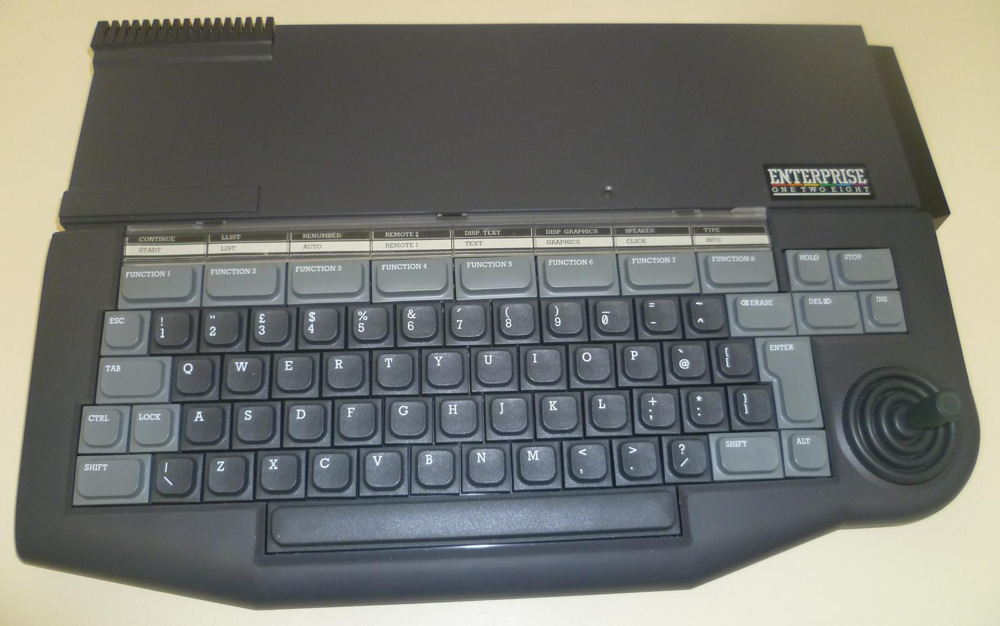 
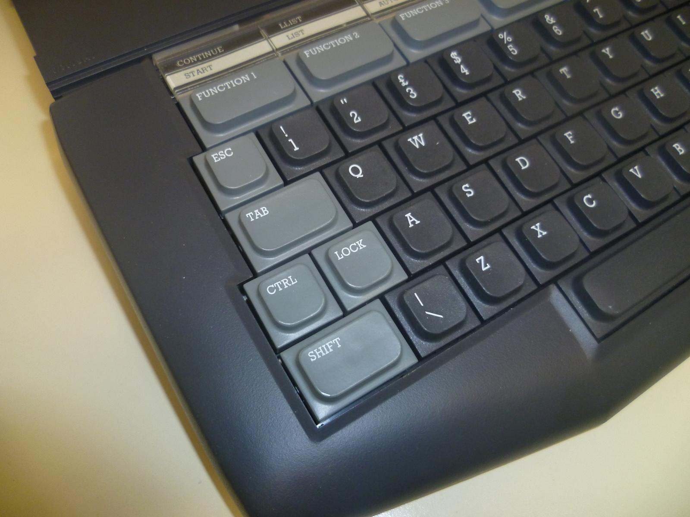 
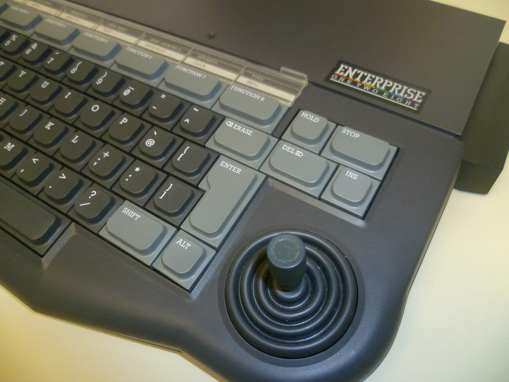  
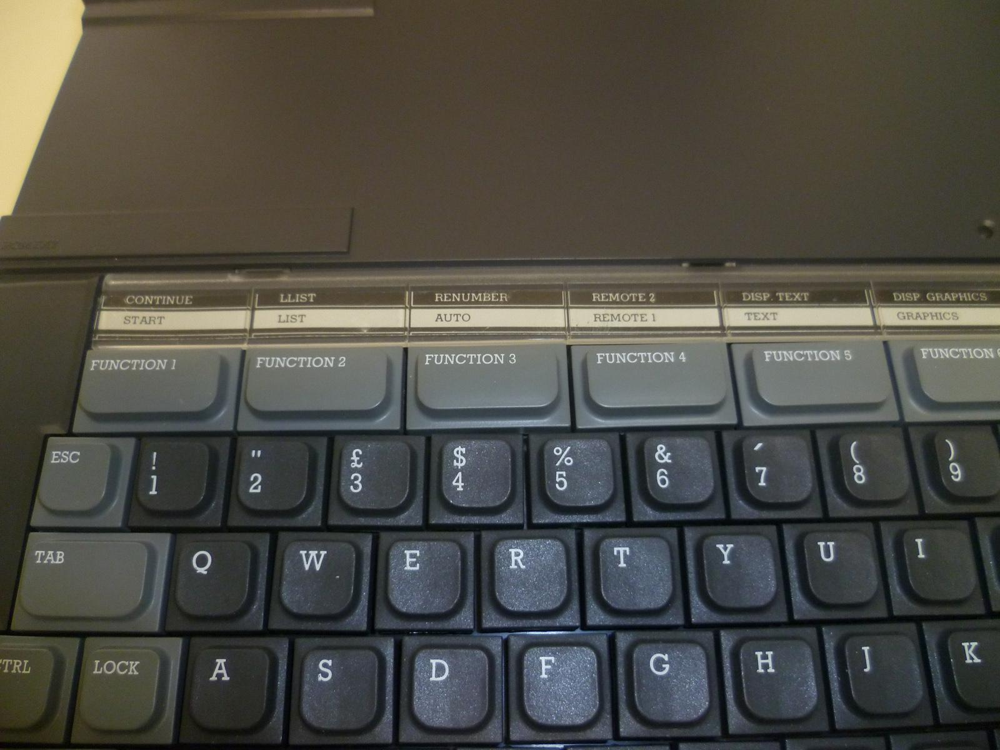 
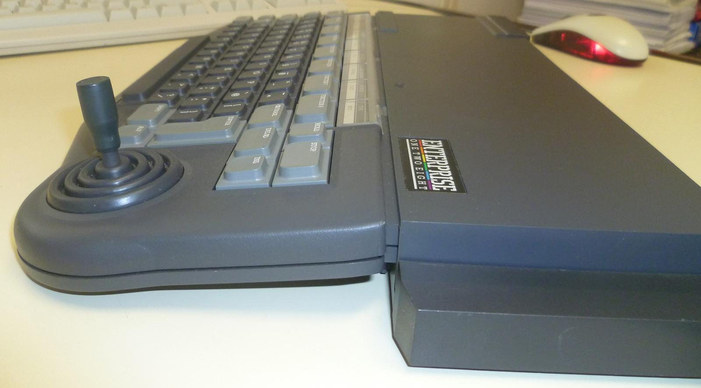 
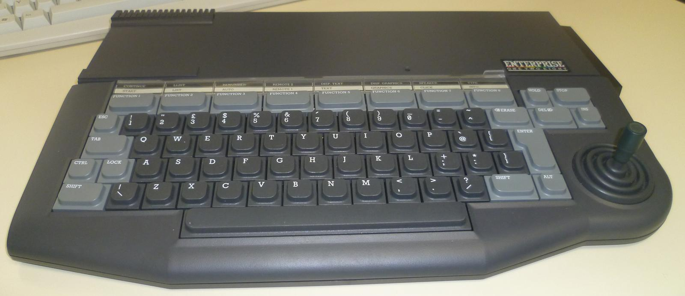  

----

[(оригінал повідомлення)](https://enterpriseforever.com/hall-of-fame/qa-with-werner-lindner-technical-director-of-the-enterprise-computers-gmbh/msg45761/#msg45761)

**Zozosoft**: Чи було також видалено різнокольоровий екран з написом ENTERPRISE?

> **Werner Lindner**: Комп'ютер працює і має стандартну звичайну англійську версію [EXOS 2.1](../software/ss-exos.md)/[BASIC 2.1](../programming/is-basic.md).
> 
> Наклейка із серійним номером незаймана. Тому я вважаю, що вони просто зняли верхню частину клавіатури й замінили її на цю спеціальну. Оскільки нанесенням символів на клавіатуру займався складальник (компанія [GRI Ltd.](../companies/gri-ltd.md)), ця верхня частина клавіатури, мабуть, до цього перебувала в Шотландії

## Розробка апаратного забезпечення

[(оригінал повідомлення)](https://enterpriseforever.com/hall-of-fame/qa-with-werner-lindner-technical-director-of-the-enterprise-computers-gmbh/msg45485/#msg45485)

**Zozosoft**: що вам відомо про проблеми з чипом [Nick](../hardware/hm-nick.md) та його різні версії (**08-04**/**08-47**)?

> **Werner Lindner**: Тепер дещо про NICK/DAVE:
> 
> Люди з [IS](../companies/intelligent-sofware-ltd.md)/[ENTERPRISE](../companies/enterprise-computers-ltd.md) вийшли на зв'язок з [AMI](../companies/ami.md) у 1983 році. Представники [AMI](../companies/ami.md) розповідали мені, що ці хлопці прийшли до них в офіс із двома зібраними «на коліні» (вручну розпаяними) прототипами «чогось» і заявили, що їм потрібно зробити з цього спеціалізовані мікросхеми (ASIC). При цьому не було ні конкретних креслень чи планів цих чипів, ні фінального дизайну. Очевидно, люди з [IS](../companies/intelligent-sofware-ltd.md) ніколи раніше не робили нічого подібного. Вони не знали, що не можна просто взяти схему на стандартних компонентах та мікросхемах і зробити її точну копію в кремнії. Інженерам [AMI](../companies/ami.md) довелося моделювати стандартні деталі прототипів за допомогою величезної кількості елементарних («низькорівневих») логічних вентилів. На той час не існувало такої конфігурованої логіки, як сьогоднішні FPGA чи CPLD...

> [!NOTE]
> *Примітка:* Це дещо відрізняється від того що розповідав [Дейв Вудфілд](../peoples/ec/pers_dave-woodfield.md) на зустрічі присвяченій 40-ій річниці комп'ютера.

> 
> Через це найперший дизайн чипа [DAVE](../hardware/hm-dave.md) (на той час він називався **ESPRIT**, і AMI зберігала цю назву протягом усього виробництва) був готовий у серпні/вересні 1983 року. Перший (і дефектний) дизайн чипа [NICK](../hardware/hm-nick.md) (**ELITE**) підготували у листопаді 1983 року. Достеменно невідомо, коли перші прототипи прибули до Лондона, але вони працювали зовсім не так, як очікувалося. До жовтня 1984 року **ESPRIT** пройшов 5 великих ревізій, а **ELITE** — чотири ревізії, перш ніж обидва чипи досягли того фінального стану, який ми знаємо як **08-05** та **08-47** відповідно.
> 
> Проблема NICK версії 08-04:
> 
> Наскільки мені відомо, немає жодного шансу виправити проблему цієї ревізії за допомогою зовнішнього заліза (не допоможе ні охолодження, ні швидка відеопам'ять). Повністю стабільною була лише пізня D-ревізія чипа.

----

[(оригінал повідомлення)](https://enterpriseforever.com/hall-of-fame/qa-with-werner-lindner-technical-director-of-the-enterprise-computers-gmbh/msg45490/#msg45490)

**Zozosoft**: на деяких материнських платах немає наклейок, а на інших є наклейки з різними назвами: AEL, FLHK, E&E. Чи знаєте ви щось про них?

> **Werner Lindner**:  
> [E&E](../companies/elec-and-eltek.md): [http://www.eleceltek.com/en/aboutus.php](https://www.eleceltek.com/profile/)
> 
> Більшість материнських плат були виготовлені компанією [OPC](../companies/opc-manufacturing-ltd.md): [http://www.hkexporter.net/electronic/circuit/opc-manufacturing.html](https://web.archive.org/web/20230131230926/http://www.hkexporter.net/electronic/circuit/opc-manufacturing.html)
> 
> Отже, в принципі: майже всі материнські плати (а також [EXDOS](../hardware/hd-exdos.md) та [картриджі](../hardware/hc-cartridge.md)) постачалися з Далекого Сходу, і [AMI](../companies/ami.md) відправляла виробничі партії чипів прямо до Гонконгу. Саме тому в Англії ніколи не було суттєвих запасів нерозпаяних мікросхем [NICK](../hardware/hm-nick.md)/[DAVE](../hardware/hm-dave.md).
> 
> Назви **AEL** та **FLHK** наразі вилетіли мені з голови, але у мене є копія кодової книги ENTERPRISE — це свого роду «біблія» всіх компонентів, які коли-небудь використовувала компанія. Ймовірно, я зможу знайти щось там. Будь ласка, запасіться терпінням.

----

[(оригінал повідомлення)](https://enterpriseforever.com/hall-of-fame/qa-with-werner-lindner-technical-director-of-the-enterprise-computers-gmbh/msg45506/#msg45506)

**Zozosoft**: Невеликий шматочок історії, але дуже цікавий:

> **Werner Lindner**: Ми в [ENTERPRISE Germany](../companies/enterprise-computers-gmbh.md) використовували для своїх розробок компілятор на базі ПК. Код писали в текстовому редакторі, також у нас були пакетні файли для компіляції, а для тестування розширень ROM на самому ENTERPRISE ми використовували емулятори EPROM. Ці емулятори підключалися за допомогою шлейфа безпосередньо до панельок усередині картриджа або до панельки на платі розширення. Усе було дуже просто: пишеш код, компілюєш його, відправляєш на емулятор через LPT-порт, натискаєш Reset на Ентерпрайзі і дивишся, що відбувається.

----

[(оригінал повідомлення)](https://enterpriseforever.com/hall-of-fame/qa-with-werner-lindner-technical-director-of-the-enterprise-computers-gmbh/msg45549/#msg45549)

**Zozosoft**: Як виглядав такий емулятор?

> **Werner Lindner**: Деякі люди на форумі запитували про емулятор EPROM. На жаль, у мене вже немає того оригінального пристрою, який ми використовували приблизно з 1990 року. Проте в мене досі зберігся один робочий екземпляр новішої моделі, яку ми купили в 1993 році для підтримки роботи програмістів.
> 
> Старіша модель була набагато більшою і мала всього 128 КБ пам'яті (емулювала EPROM ємністю до 27128). На той час вона коштувала неймовірно дорого, але робота над розробкою з нею вийшла на абсолютно новий рівень. Модель на фотографіях має 512 КБ статичної оперативної пам'яті (SRAM) і може емулювати EPROM аж до 27512. Вона живиться безпосередньо від панельки EPROM, до якої підключена.

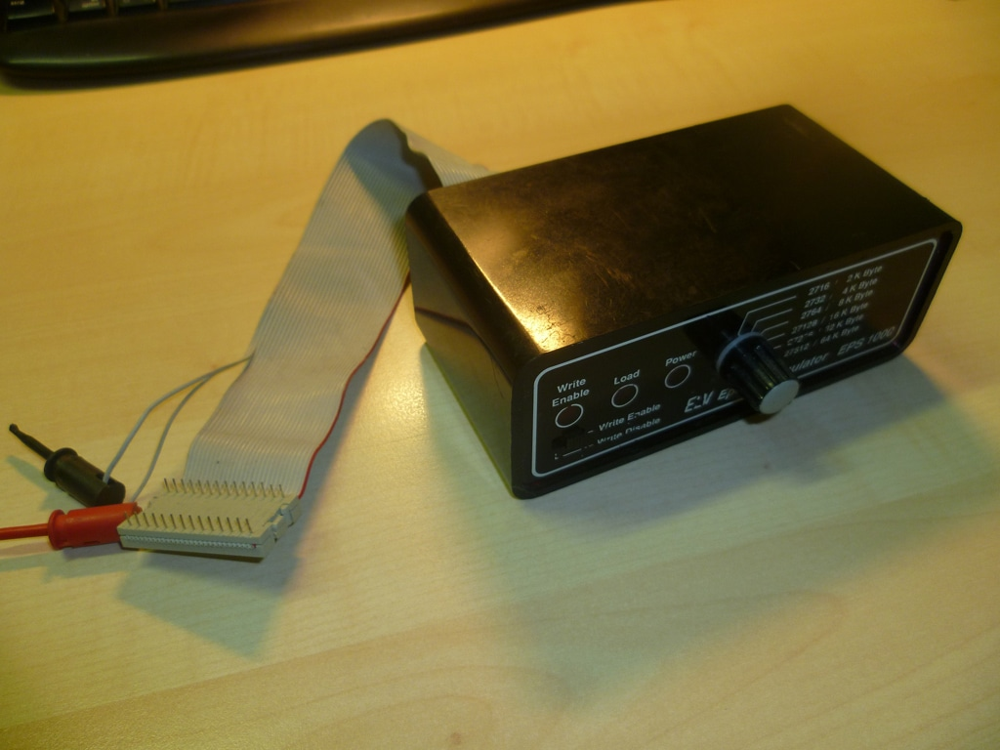 
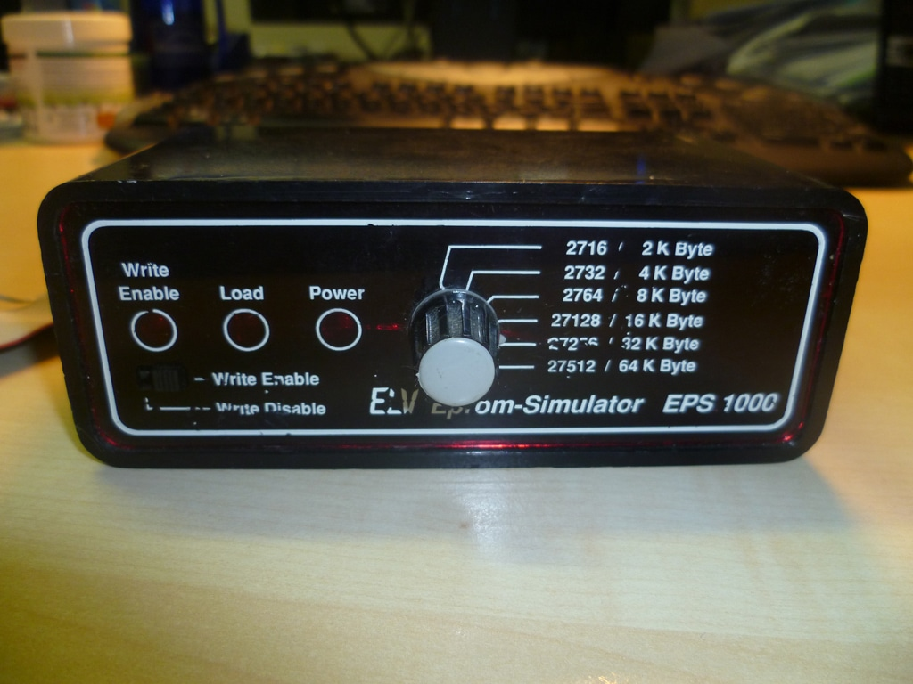 
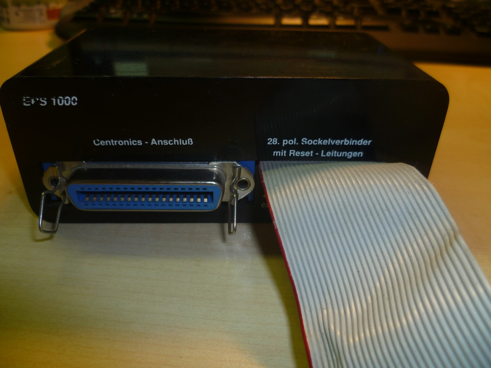 
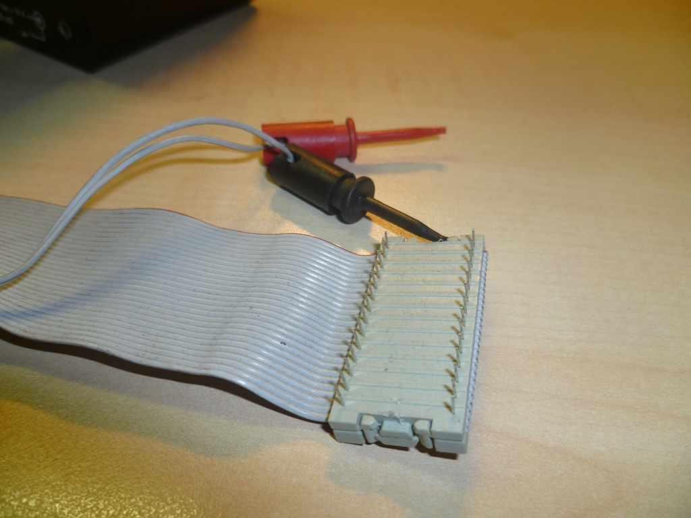 

> Робота з пристроєм дійсно проста:
> - Вставте роз'єм у панельку EPROM.
> - Оберіть тип EPROM, який ви хочете емулювати, за допомогою поворотного перемикача на передній панелі.
> - Підключіть емулятор до ПК за допомогою стандартного LPT-кабелю (25 Pin/Centronics).
> - Надішліть HEX-файл із ПК на LPT-порт (звісно ж, у бінарному режимі).
> - Скиньте (зробіть reset) ENTERPRISE і подивіться, працює ваш код чи ні.

----

[(оригінал повідомлення)](https://enterpriseforever.com/hall-of-fame/qa-with-werner-lindner-technical-director-of-the-enterprise-computers-gmbh/msg45561/#msg45561)

**Zozosoft**: А ось тепер справді фантастичні речі! Я ніколи не думав, що побачу їх!

[Схеми чипа Nick, Аркуш 1](http://enterprise.iko.hu/schematics/3006-0000-22_Sheet-1.pdf)  
[Схеми чипа Nick, Аркуш 2](http://enterprise.iko.hu/schematics/3006-0000-22_Sheet-2.pdf)  
[Технічні описи чипа Nick](http://enterprise.iko.hu/technical/NICK-Old-VDC-ELITE-description.pdf)  
[Внутрішні таймінги чипа Nick](http://enterprise.iko.hu/technical/NICK-Internal-timing-of-VDC-Elite.pdf)  

[Схеми чипа Dave, Аркуш 1](http://enterprise.iko.hu/schematics/3007-000-22_Sheet-1.pdf)  
[Схеми чипа Dave, Аркуш 2](http://enterprise.iko.hu/schematics/3007-000-22_Sheet-2.pdf)  
[Цоколівка чипа Dave та інформація про пластиковий корпус](http://enterprise.iko.hu/technical/DAVE-Chip-Pinout-and-plastic-package-dimensions.pdf)

[NICK/DAVE: Легенда (пояснення) до схем](http://enterprise.iko.hu/schematics/NICK-DAVE-Legend_to_Plans.txt)

Величезне-величезне спасибі Вернеру!!!

> **Werner Lindner**: Сьогодні я отримав скани для [NICK](../hardware/hm-nick.md) та [DAVE](../hardware/hm-dave.md), тож настав час для дійсно великого пакета даних. У вкладенні для завантаження ви знайдете всю додаткову оригінальну документацію, яка в мене є щодо цих двох чипів, зокрема:
> 
> - Найперший опис VDC (назва на той момент ще не була затверджена);
> - Більш-менш фінальний опис VDC ELITE (майбутнього NICK);
> - Креслення/розміри для 68-контактного корпусу, включаючи телекс від [AMI](../companies/ami.md), який інформував [EC](../companies/enterprise-computers-ltd.md)/[IS](../companies/intelligent-sofware-ltd.md) про зміну в цоколівці (розводці виводів) ESPRIT;
> - Чотири плани формату А0 з фінальним дизайном обох чипів.
> 
> Плани були відскановані у форматі А0 з роздільною здатністю 400 DPI. Вони сильно відрізняються за розміром файлів через різну якість оригіналів. Постачальник послуг сканування зробив усе можливе, щоб витиснути максимум якості з моїх "оригінальних" копій від [AMI](../companies/ami.md), і я сподіваюся, що все читабельно.
> 
> Схеми для ESPRIT не відображають жодних змін із часом. Тому я припускаю, що хоча [DAVE](../hardware/hm-dave.md) і мав ревізію **D**, це була єдина і неповторна версія (**08-05**), яка взагалі коли-небудь випускалася. На аркуші 1 для ESPRIT можна побачити деякі серйозні зміни/доповнення. Оригінальне креслення датоване 12.08.1983, але сам аркуш має дату 04.11.1983. Я думаю, що на той момент [DAVE](../hardware/hm-dave.md) вже був готовий до виробництва, але до цієї дати він уже зазнав чотирьох великих виправлень.
> 
> Схеми для ELITE показують п'ять ревізій протягом приблизно одного року виробництва. Невідомо, коли саме відбувся перехід від версії 1 (**08-04**) до версії 2 (**08-47**), але остання ревізія **E** — це точно **08-47**. На жаль, на самих схемах немає жодних позначок про ці зміни, тому ми можемо лише припускати, що це були незначні, але важливі виправлення.

----

[(оригінал повідомлення)](https://enterpriseforever.com/hall-of-fame/qa-with-werner-lindner-technical-director-of-the-enterprise-computers-gmbh/msg46054/#msg46054)

> **Werner Lindner**: Як і обіцяв, я відсканував схеми материнської плати **Issue 6** (компоненти/пайки/план розміщення) у форматі TIF з роздільною здатністю 400dpi.
> 
> [QAWL_EP_ISSUE-6.rar](https://web.archive.org/web/20201101085203/https://25a45f6c-a-62cb3a1a-s-sites.googlegroups.com/site/enterprise128k/home/internet-obzor/qa-werner-linder_main/qa-werner-lindner-hardvaredesign/QAWL_EP_ISSUE-6.rar?attachauth=ANoY7cpPYNeLo4SYHhrYaep7e4qBUbNrrKpWYFNVxeyNF6R3dMyXPCYeelejaKkJ8YikOvwnrTxpoMrgd0h4o6kf5KcmPxRrepebMhs0Bxw5_ddTSXsHAKRQ0TvygsT0DWHXULuWhFX7JwN3tgf6qhg3yDh7c_ZQD5P1AxmpKMLTjGeG7HQPZcGnlcBS5bdqL3AC2pi1DAgIqaljYY0upztKFzMJcy3VaECClg-ekimG9yhGeFawaoxz0jG3JMDoWLGQNuSJ3iMOME1SqOI2MkHb2isMuDakCZ3l00HpfmeAFQ2vv7BFk3NoIl4YAjbirApMeRv0fZBo990LLeGOrrhFwBZGEW6YnA%3D%3D&attredirects=0&d=1)

----

[(оригінал повідомлення)](https://enterpriseforever.com/hall-of-fame/qa-with-werner-lindner-technical-director-of-the-enterprise-computers-gmbh/msg45699/#msg45699)

[Кодова книга Enterprise: деталі та постачальники](http://enterprise.iko.hu/technical/Enterprise-Code-Book_Parts-and-Suppliers.pdf)  
[Деталі Enterprise для іноземних версій](http://enterprise.iko.hu/technical/Enterprise-Parts-of-foreign-variations.pdf)

> **Werner Lindner**: Кодова книга ENTERPRISE (та список деталей для іноземних версій): Ця кодова книга дуже цікава, оскільки в ній вказані всі деталі та постачальники комп'ютерів [ENTERPRISE UK](../companies/enterprise-computers-ltd.md). Дані дуже точні та відображають стан справ на червень 1986 року. Примітки від руки були зроблені мною особисто. На жаль, оригінальної версії більше не існує, а мій роздрукований примірник вицвів, проте все можна прочитати.
> 
> Список деталей для іноземних версій також дуже цікавий, бо в ньому фігурує лише один іноземний комп'ютер (модель 408, EC 128k German). [ENTERPRISE UK](../companies/enterprise-computers-ltd.md) ніколи не виробляла інших версій, окрім англійських моделей на 64к/128к та німецької на 128к. Існували деякі варіації моделей (з інструкцією або без неї, з касетою чи без, з німецькою або європейською вилкою живлення тощо), але жодних інших клавіатур чи системних розширень, подібних до [:BRD](../software/ss-localizations.md). Компанія в Каїрі самостійно займалася нанесенням символів на клавіатуру, а для комп'ютерів із кирилицею, які ми робили, просто використовувалися прозорі наклейки на клавіші.

## Апаратні розширення та картриджі

[(оригінал повідомлення)](https://enterpriseforever.com/hall-of-fame/qa-with-werner-lindner-technical-director-of-the-enterprise-computers-gmbh/msg45532/#msg45532)

> **Werner Lindner**: Фотографії прототипу друкованої плати картриджа з безкорпусною мікросхемою BASIC 2.1. [EC UK](../companies/enterprise-computers-ltd.md) шукала можливості для зниження виробничих витрат, і GI виготовила для них ці інженерні зразки для оцінки.

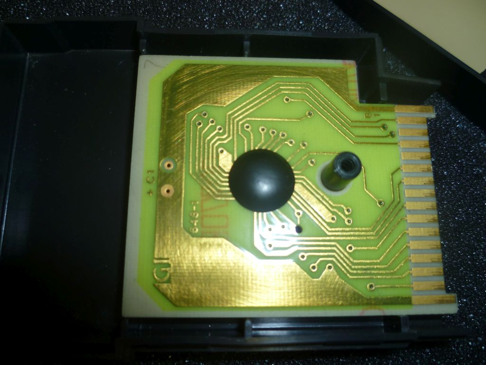 
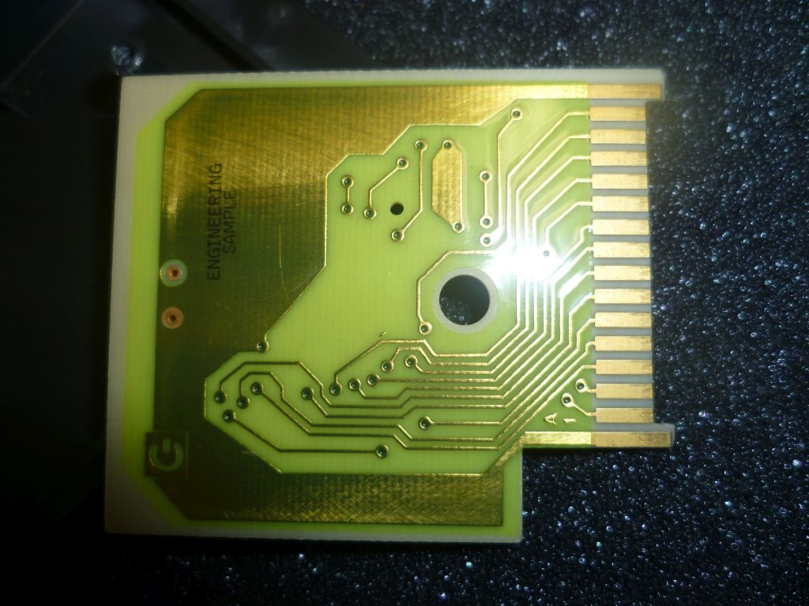 

----

[(оригінал повідомлення)](https://enterpriseforever.com/hall-of-fame/qa-with-werner-lindner-technical-director-of-the-enterprise-computers-gmbh/msg45673/#msg45673)

**Zozosoft**: Деякі ультрарідкісні картриджі: 

Корпус ELAN із раннім прототипом друкованої плати:

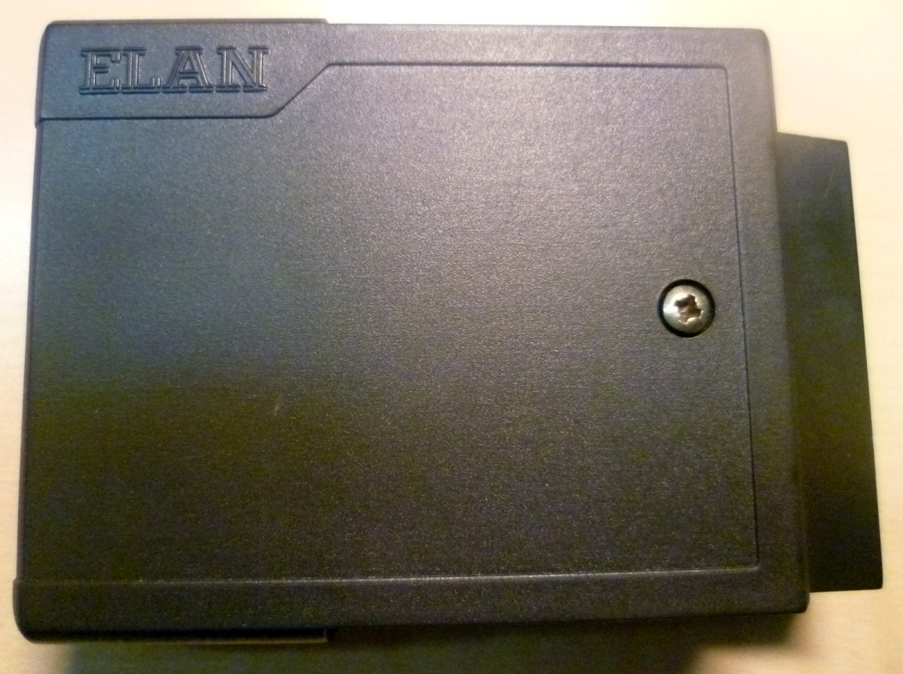 
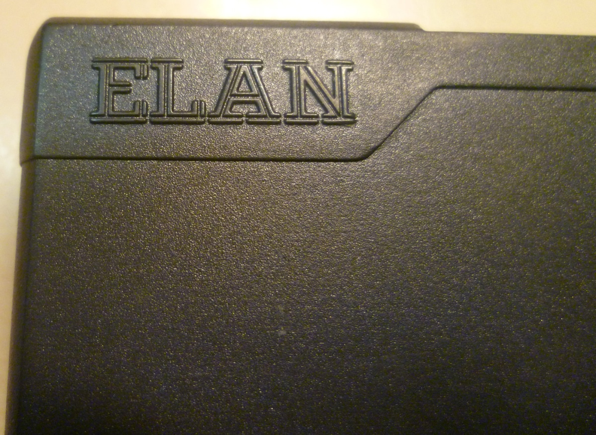 
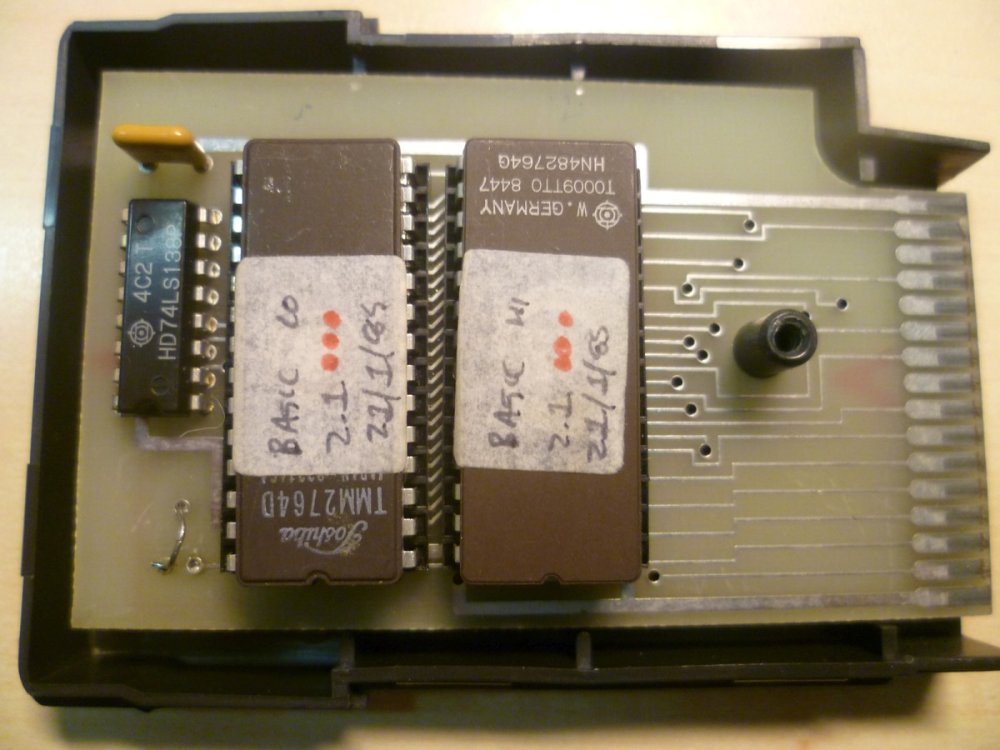 

Картридж для Mephisto PHC:

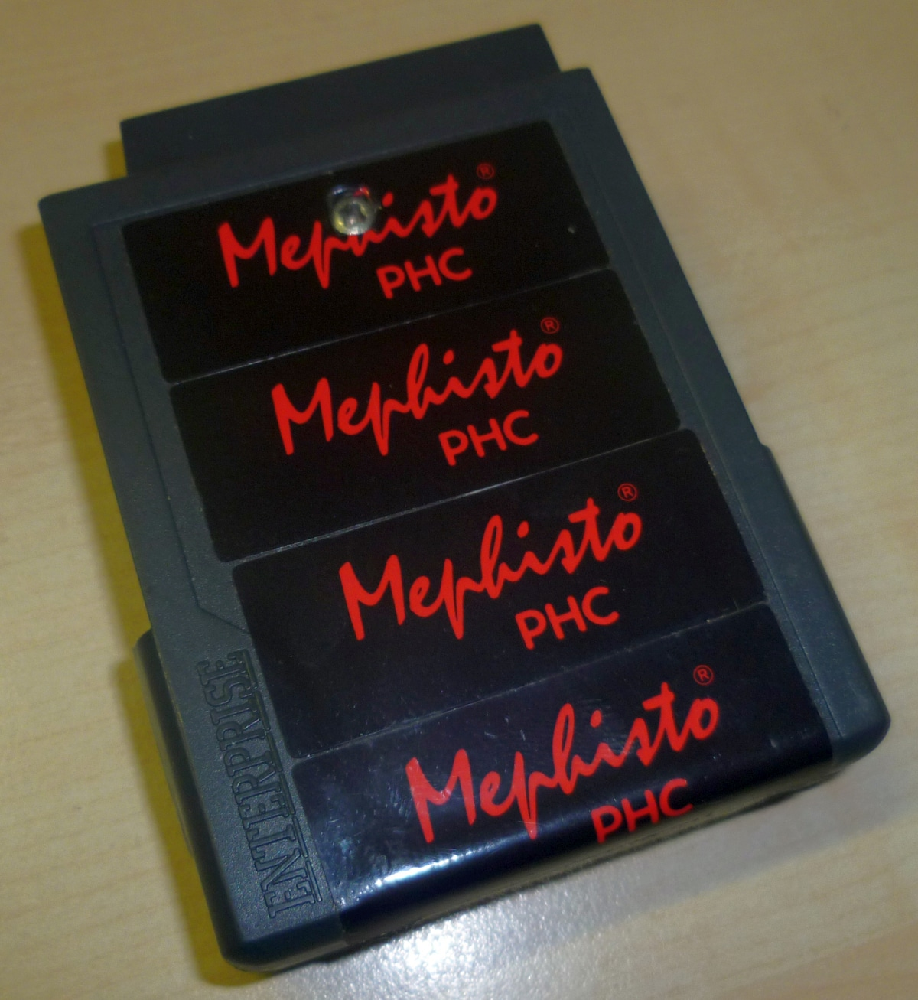 
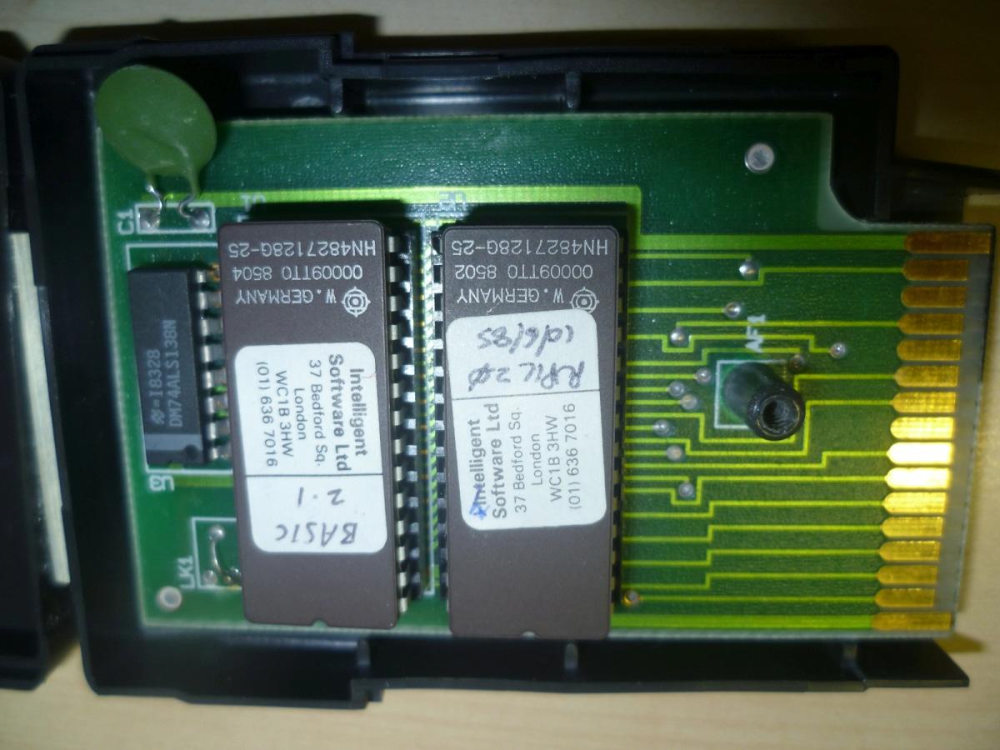 

> **Werner Lindner**: [Quasar-Pascal](../programming/quasar-pascal.md), написаний Р. Й. Хорстом (R. J. Horst) із Нідерландів, був запропонований нам у 1986 році. Він хотів самостійно виготовляти плати та продавати їх нам. Ми не укладали жодного контракту, і цей продукт ніколи не був у продажу. Quasar Pascal також доступний для комп'ютерів стандарту MSX, і ви досі можете знайти ім'я пана Хорста в інтернеті.

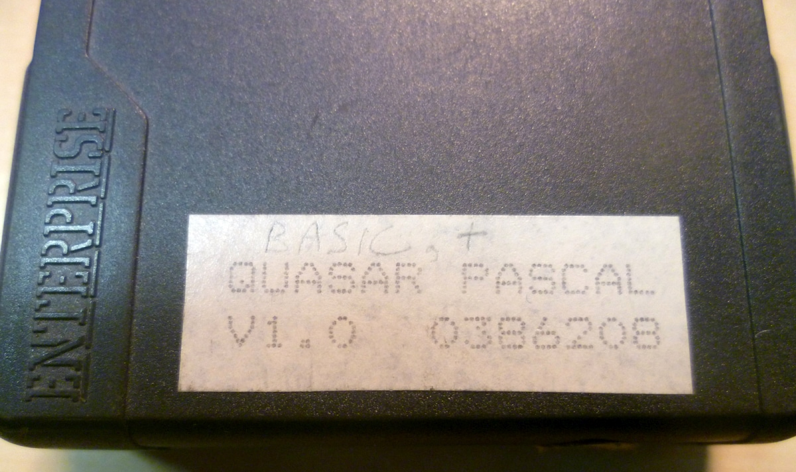 
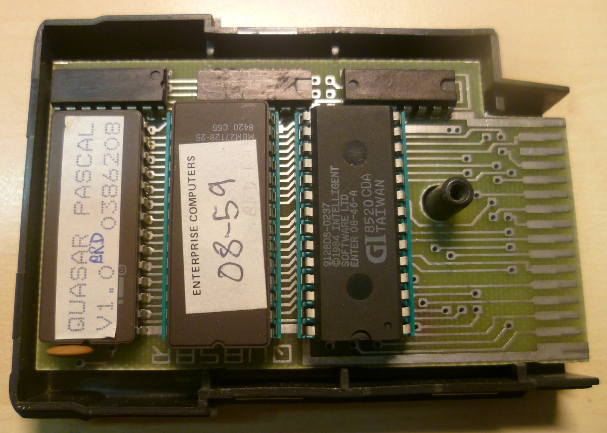 

**Bruce Tanner**: Ого, здається, на цих ПЗП з написом "Elan" мій почерк 30-річної давнини! (Не так багато людей пишуть цифру "1" саме так). Я пам'ятаю червоні крапки, але вже не пригадаю, що вони означали. Як бачите, у нас був чималий мікс мікросхем EPROM від найрізноманітніших виробників!

----

[(оригінал повідомлення)](https://enterpriseforever.com/hall-of-fame/qa-with-werner-lindner-technical-director-of-the-enterprise-computers-gmbh/msg45956/#msg45956)

> **Werner Lindner**: Картридж MEPHISTO:
> 
> Компанія [Hegener & Glaser](../companies/hegener-and-glaser.md) початково намагалася продавати цей комп'ютер у школи. [EC UK](../companies/enterprise-computers-ltd.md) в одному зі своїх ранніх проспектів також згадує про можливість використання комп'ютерів Enterprise саме в школах. Я вважаю, що компанія [IS](../companies/intelligent-sofware-ltd.md) створила якесь системне розширення спеціально для цієї мети, і **Mephisto** початково комплектувався саме ним.
> 
> Мікросхеми EPROM від **Mephisto** (**Pupil-20** для моделі 64к та **Pupil-21** для моделі 128к) є ранніми версіями розширення [BRD](../software/ss-localizations.md). Командою для активації німецького набору символів є `FONT`, крім того, команди `VLOAD`, `VDUMP` та `VSAVE` вже повністю там присутні. Є дві додаткові команди: `NET X` та `ASK`. `NET X` слугує для встановлення номера каналу на головній машині вчителя, а `ASK` — для того, щоб "запитати вчителя". Проте я не маю жодної додаткової інформації про ці розширення.

**Zozosoft**: Я виявив, що там також визначено пристрій `TEACHER:`.

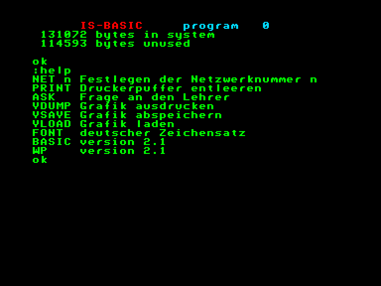 
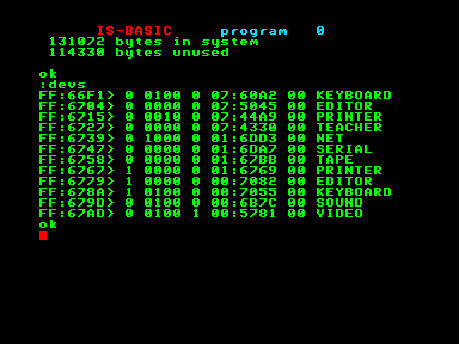 

----

[(оригінал повідомлення)](https://enterpriseforever.com/hall-of-fame/qa-with-werner-lindner-technical-director-of-the-enterprise-computers-gmbh/msg45679/#msg45679)

**Zozosoft**: Іще одна річ, яку ми ніколи раніше не бачили: розширення оперативної пам'яті на 64 КБ у корпусі в стилі EXDOS!

> **Werner Lindner**: Розширення пам'яті на 64 КБ:
> 
> Це єдине відоме розширення (окрім [контролера EXDOS](../hardware/hd-exdos.md)), яке взагалі вироблялося (у кількості прототипів). Після того, як було прийнято рішення не запускати в серійне виробництво системи розширення, потреба чи мета в ньому зникла, і воно просто відійшло в минуле.

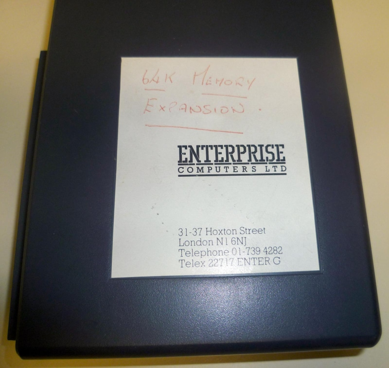 
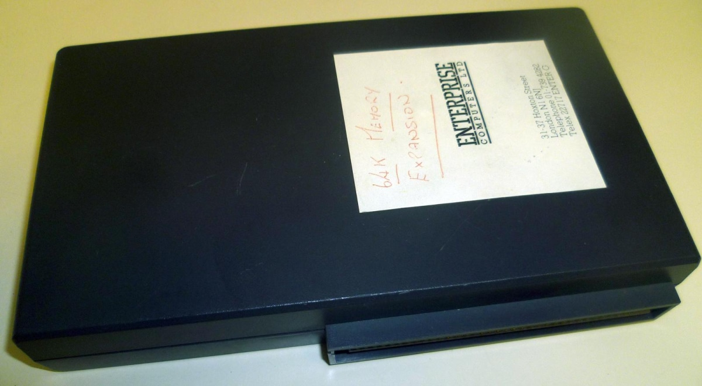 
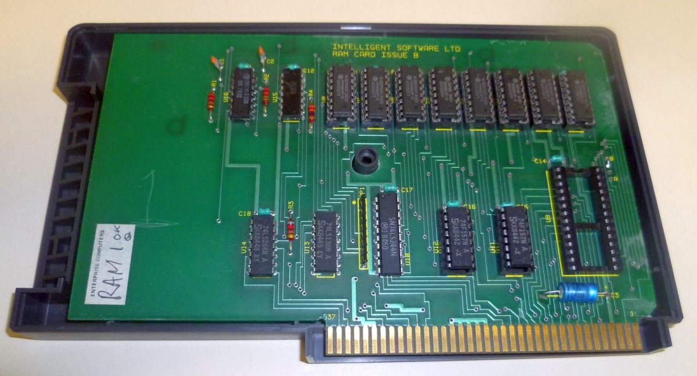 
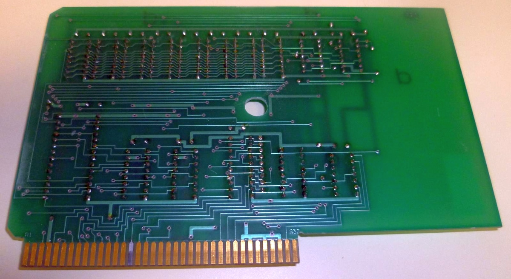 

----

[(оригінал повідомлення)](https://enterpriseforever.com/hall-of-fame/qa-with-werner-lindner-technical-director-of-the-enterprise-computers-gmbh/msg45713/#msg45713)

[Система розширень Enterprise 64/128](http://enterprise.iko.hu/technical/PER-11-4_Enterprise_64-128_System_Expansion.pdf)  
[Попередні технічні характеристики системи розширень Enterprise 64/128](http://enterprise.iko.hu/technical/PER-12-1_Enterprise_64-128_System_Expansion_Provisional_Specifications.pdf)  
[Шина розширення Enterprise 64/128](http://enterprise.iko.hu/technical/PER-6-7_Enterprise_64-128_Expansion_Bus.pdf)  
[Шина розширення Enterprise 64/128 (багатослотова версія)](http://enterprise.iko.hu/technical/PER-7-8_Enterprise_64-128_Expansion_Motherboard_Bus.pdf)  
[Таймінги шини Enterprise 64/128](http://enterprise.iko.hu/technical/A3PER-1_Enterprise_64-128_Bus_Timing.pdf)  
[Список деталей материнської (багатослотової) плати розширення](http://enterprise.iko.hu/technical/PER-15-8_Expansion_Motherboard_Parts_List.pdf)  
[Модуль контролера дисковода Enterprise 64/128](http://enterprise.iko.hu/technical/PER-18-10_Enterprise_64-128_Disk_Controller_Module.pdf)  
[Таймінги шини модуля контролера дисковода Enterprise 64/128](http://enterprise.iko.hu/technical/A3PER-5_Enterprise_64-128_Disk_Controller_Bus_Timing.pdf)  
[Список деталей контролера дисковода](http://enterprise.iko.hu/technical/PER-13-7_Disk_Controller_Parts_List.pdf)  
[Модуль розширення оперативної пам'яті Enterprise 64/128 64K RAM](http://enterprise.iko.hu/technical/PER-17-7_Enterprise_64-128_64K_RAM_Expansion_Module.pdf)  
[Таймінги модуля розширення оперативної пам'яті Enterprise 64/128 64K RAM](http://enterprise.iko.hu/technical/A3PER-4_Enterprise_64-128_64K_Expansion_Module_Timing.pdf)  
[Список деталей плати розширення оперативної пам'яті (RAM)](http://enterprise.iko.hu/technical/PER-14-8_RAM_Card_Parts_List.pdf)  
[Специфікації блока живлення модуля розширення (Expansion Unit)](http://enterprise.iko.hu/technical/PER-8-10_Expansion_Unit_Power_Supply_Specifications.pdf)  
[Результати тестів таймінгів шини розширення Enterprise](http://enterprise.iko.hu/technical/PER-10-3_Enterprise_Expansion_Bus_Test_Timing_Results.pdf)   
[Звіт про тестування периферійних пристроїв Enterprise](http://enterprise.iko.hu/technical/PER-24-1_Enterprise_Peripherals_Test_Report.pdf)  

> **Werner Lindner**: Модуль розширення (Expansion Unit):
> 
> Планувався, але ніколи не випускався серійно. Ймовірно, це був лише прототип для тестування шини розширення під повним навантаженням. Креслень корпусу для нього немає. Цей юніт дуже схожий на різноманітні концепції розширення з Данії, Німеччини та Угорщини, і в ньому використовуються оригінальні ножові роз'єми (edge-connectors) на платах розширення. Існуючий [міст системної шини](../hardware/hb-bus-bridge.md) є найменшим з можливих варіантів цієї системи.
> 
> Важливо: цей модуль відрізняється від того, на який у мене є детальні конструкторські креслення. Той, інший, мав концепцію з двома дисководами FDD/EXDOS та блоком живлення, що розташовувалися поруч із комп'ютером, а далі йшла система модулів, які можна було ставити один на один (максимум чотири) з правого боку від FDD. Цей модуль показаний на одному з ранніх англійських рекламних проспектів (який я все ще шукаю у своїх архівах). Він має чудовий вигляд і типовий для ENTERPRISE дизайн. Але я думаю, що він був занадто дорогим для виробництва. З іншого боку, система від [IS](../companies/intelligent-sofware-ltd.md) була аж надто великою, щоб підключати її з правого боку комп'ютера, тому її також ніколи не випускали.

[Креслення Enterprise 64/128 у розібраному вигляді (Explosion drawing)](http://enterprise.iko.hu/technical/ENTERPRISE_64-128_Explosion_drawing.pdf)  

**Zozosoft**: Подивіться на цю схему! Тут гумовий килимок для клавіатури ще повного розміру. [Пізніше з неї забрали частину під джойстиком та замінили її червоним гумовим кільцем](http://enterprise.iko.hu/historical/Concession%20Note%208.pdf).

[Розміри материнської плати ENTERPRISE 64/128](http://enterprise.iko.hu/technical/ENTERPRISE_64-128_Motherboard_Dimensions.pdf)  

----

[(оригінал повідомлення)](https://enterpriseforever.com/hall-of-fame/qa-with-werner-lindner-technical-director-of-the-enterprise-computers-gmbh/msg45892/#msg45892)

Креслення 6-слотового модуля розширення (Expansion Unit), який згодом так і не був випущений:  
[A3PER-12_Enterprise_64-128_Expansion_Motherboard_Schematic](http://enterprise.iko.hu/schematics/A3PER-12_Enterprise_64-128_Expansion_Motherboard_Schematic.jpg)  
[Expansion-Unit_Place-Plan](http://enterprise.iko.hu/schematics/Expansion-Unit_Place-Plan.jpg)  
[Expansion-Unit_Component-Side](http://enterprise.iko.hu/schematics/Expansion-Unit_Component-Side.jpg)  
[Expansion-Unit_Solder-Side](http://enterprise.iko.hu/schematics/Expansion-Unit_Solder-Side.jpg)  
[A3PER-13_DPC-PER_Motherboard_PCB_Profile](http://enterprise.iko.hu/schematics/A3PER-13_DPC-PER_Motherboard_PCB_Profile.jpg)

Оригінальна плата [EXDOS](../hardware/hd-exdos.md), а також зовнішнє розширення пам'яті на 64 КБ, розроблене для цього модуля. Ось звіт про тестування (Test Report) цієї системи розширення: [PER-24-1_Enterprise_Peripherals_Test_Report](http://enterprise.iko.hu/technical/PER-24-1_Enterprise_Peripherals_Test_Report.pdf)

----

[(оригінал повідомлення)](https://enterpriseforever.com/hall-of-fame/qa-with-werner-lindner-technical-director-of-the-enterprise-computers-gmbh/msg46111/#msg46111)

**Zozosoft**: Цікава дрібничка: «Плата EXOS»

Це внутрішня плата ПЗП (EPROM) на 4x8 КБ або 2x16 КБ EPROM-мікросхем, яка встановлюється у внутрішній роз'єм розширення (де у версії EP128 зазвичай розташовані другі 64 КБ оперативної пам'яті).

Сигнал ROM надходить із виводу CE (Chip Enable) роз'єму для вбудованого ПЗП на материнській платі.

Як на мене, це трохи дивно, навіщо це було зроблено. Мені здається, що 4 мікросхеми EPROM по 8 КБ разом із друкованою платою коштуватимуть дорожче, ніж одна мікросхема EPROM на 32 КБ.

Брюсе! Ти маєш якісь спогади із цього приводу? Схеми походять від компанії [IS](../companies/intelligent-sofware-ltd.md).

[Flan-Enterprise-Eprom-Sub-Board 0](http://enterprise.iko.hu/schematics/Flan-Enterprise-Eprom-Sub-Board~0.jpg)  
[Flan-Enterprise-Eprom-Sub-Board 1](http://enterprise.iko.hu/schematics/Flan-Enterprise-Eprom-Sub-Board~1.jpg)  
[Flan-Enterprise-Eprom-Sub-Board 2](http://enterprise.iko.hu/schematics/Flan-Enterprise-Eprom-Sub-Board~2.jpg)  
[Flan-Enterprise-Eprom-Sub-Board 3](http://enterprise.iko.hu/schematics/Flan-Enterprise-Eprom-Sub-Board~3.jpg)  
[Flan-Enterprise-Eprom-Sub-Board 4](http://enterprise.iko.hu/schematics/Flan-Enterprise-Eprom-Sub-Board~4.jpg)  

----

[(оригінал повідомлення)](https://enterpriseforever.com/hall-of-fame/qa-with-werner-lindner-technical-director-of-the-enterprise-computers-gmbh/msg46121/#msg46121)

**Bruce Tanner**: Ні, я цього не пам'ятаю, але я й не обов'язково мав чути про такі речі. Проте я думаю, що на той момент ми перебували на тогочасній межі рентабельності технологій, і мікросхеми 27128 тільки-но почали з'являтися, навіть 2764 тоді здавалися великими!

----

[(оригінал повідомлення)](https://enterpriseforever.com/hall-of-fame/qa-with-werner-lindner-technical-director-of-the-enterprise-computers-gmbh/msg46113/#msg46113)

**Werner Lindner**: Оригінальне внутрішнє розширення пам'яті на 64 кБ прямо з заводу [Elec&Eltek](../companies/elec-and-eltek.md). Там відсутня одна мікросхема (U111). На той час деякі компоненти було неможливо дістати на Далекому Сході, тому розширення пам'яті вироблялися без них. Компоненти, яких бракувало, доводилося впаювати в друковані плати пізніше, вже під час процесу збирання на фабриці [GRI](../companies/gri-ltd.md).

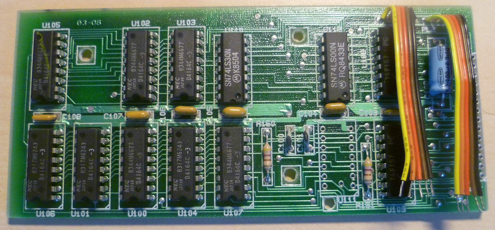 
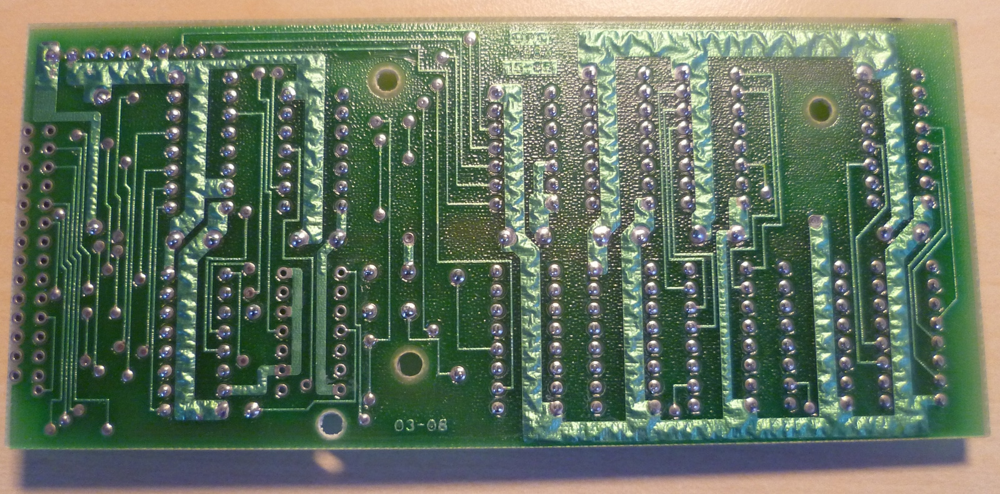 

----

[(оригінал повідомлення)](https://enterpriseforever.com/hall-of-fame/qa-with-werner-lindner-technical-director-of-the-enterprise-computers-gmbh/msg45892/#msg45892)

> **Werner Lindner**: Я створив внутрішню плату статичної пам'яті на 64 КБ для ENTERPRISE, щоб апгрейдити 64-кілобайтні машини до 128 кілобайт. У мене є порожні друковані плати (PCB) цього розширення, але вони з ранньої партії виробництва, і там бракує однієї доріжки/провідника (як ви можете бачити на фотографії готового виробу).

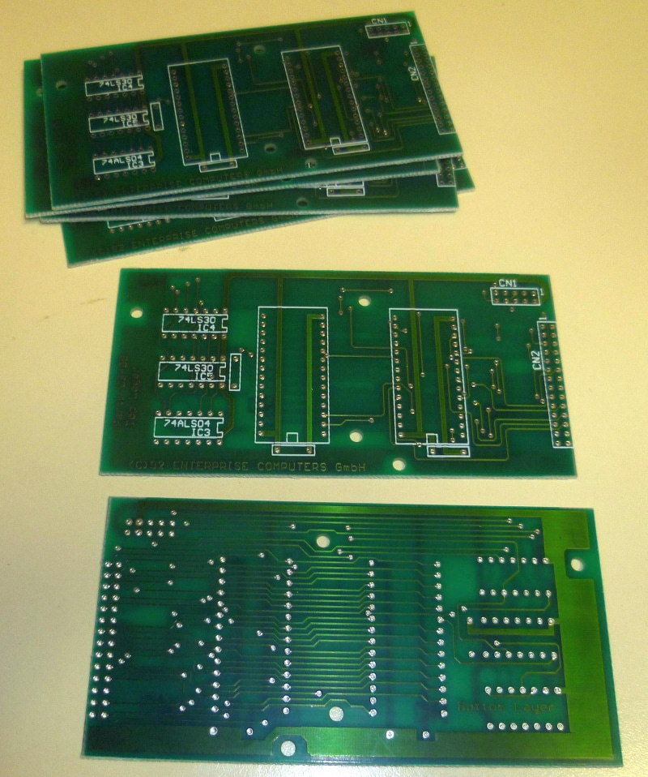 
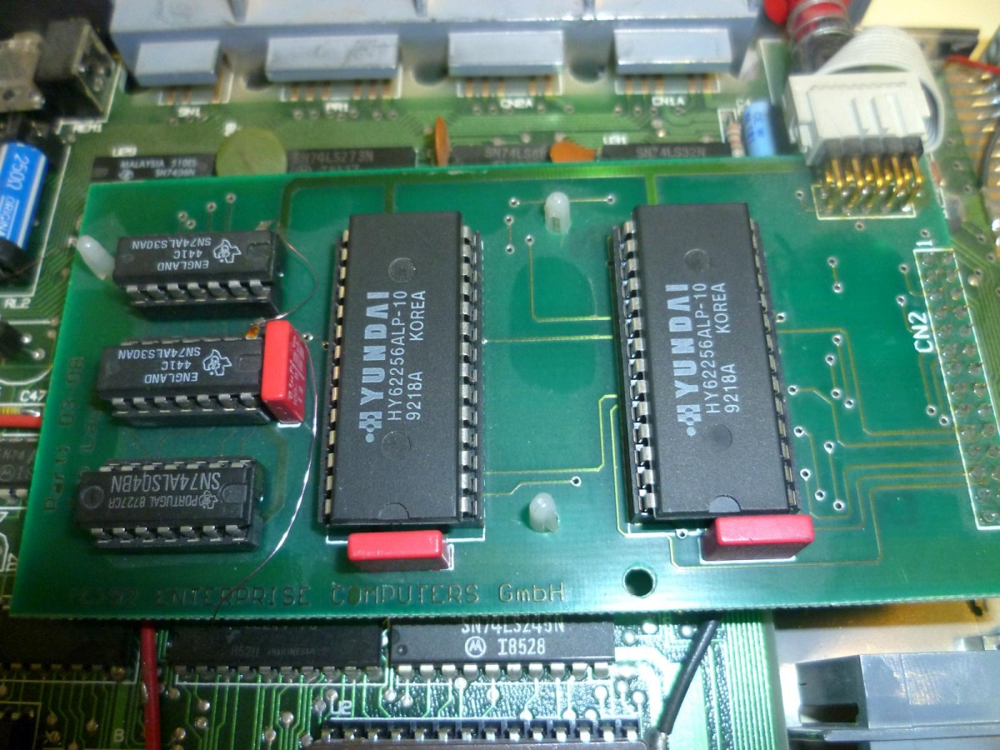 

----

[(оригінал повідомлення)](https://enterpriseforever.com/hall-of-fame/qa-with-werner-lindner-technical-director-of-the-enterprise-computers-gmbh/msg46750/#msg46750)

> **Werner Lindner**: Ідея створення системи розширення для Enterprise з'явилась в мене ще у 1986 році, коли я розробив [власний EXDOS-контролер](../hardware/hd-exdos-w-lindner.md). Я був не в захваті від ножових роз'ємів (edge connectors) комп'ютера Enterprise. Особливо роз'єм розширення з його 66 виводами — він був занадто великим, занадто специфічним, занадто дорогим і не дуже стабільним з механічної та електричної точок зору. І найбільша проблема: він уже був зайнятий [мостом системної шини](../hardware/hb-bus-bridge.md)  та оригінальним [контролером EXDOS](../hardware/hd-exdos.md).
> 
> Не знаючи нічого про систему розширення від [IS](../companies/intelligent-sofware-ltd.md)/[EC UK](../companies/enterprise-computers-ltd.md), ми з моїм другом Міхаелем Леопольдседером (Michael Leopoldseder) вирішили створити власну невелику систему розширення на базі роз'ємів DIN 41612. Вони були (і залишаються) дешевими, надійними та механічно стабільними. Крім того, вони мають 64 виводи, що майже збігається з кількістю контактів системної шини Enterprise. Ба більше, у продажу є безліч макетних плат (гетинаксових та з текстоліту FR4), які вже мають монтажні отвори та мідні контактні майданчики під ці роз'єми. Робити прототипи для такої системи дуже легко, а фінальні плати виходять дуже міцними й можуть використовуватися роками, як і повноцінні фабричні друковані плати.
> 
> Ми розробили концепцію буферизації шини й знайшли дуже дешевий спосіб керування сигналом `/EXP` (ми зробили це за допомогою звичайного діода: спочатку 1N4148, а пізніше BAT46 через менше падіння напруги), який підключався до сигналу `/RD` плати. Ми прибрали всі сигнальні лінії, які могли б створювати перешкоди на шині (ніяких аналогових сигналів, ніякого аудіо/відео тощо), а все інше забуферизували в одному або двох напрямках. Усі слоти на шині мали однакову схему розведення, тобто ми не робили жодного попереднього декодування для конкретних слотів, пам'яті чи адресного простору. Це означає, що плати розширення для цієї системи повинні самостійно виконувати правильне й повне декодування всіх портів введення-виведення (I/O) та всіх адресних ліній, але це лише незначний недолік порівняно з системою, яка взагалі не має обмежень. Ми придумали назву "[MINIBUS](../hardware/hb-minibus.md)" для меншої версії, яка підключається безпосередньо до порту розширення комп'ютера. Після завершення роботи над [моїм EXDOS-контролером](../hardware/hd-exdos-w-lindner.md) ми обидва використовували цю систему вдома, і вона слугувала стабільною платформою для майбутніх апаратних розширень (наприклад, [інтерфейсу жорсткого диска](../hardware/hd-exdos-hdd-mfm.md)). Я зробив другу версію адаптера MINIBUS із роз'ємом DIN-VG, який був припаяний безпосередньо до моєї тестової машини. Я встановив на машину додатковий стабілізатор на 5 В, щоб живити a4/b4 напряму, і зібрав схему на 8 МГц для підтримки EXDOS-контролера на машині з частотою 6 МГц. Вона була взята з [материнської плати 911](../hardware/hm-911.md) (зроблено на швидку руку).
> 
> Пізніше я створив модульну систему шини розширення материнської плати (Motherboard-Extension-Bus-System). Вона складалася з двох плат: одна (комп'ютерний інтерфейс) поміщалася в корпус EXDOS і використовувала міст системної шини (System-Bus-Bridge) для підключення до ENTERPRISE. Інша сторона (інтерфейс шини) використовувала друковану плату формату європлати (160х100 мм) і встановлювалася в стандартний 19-дюймовий корпус із 64-контактним крос-плейном (backplane) у якості шинної системи. Корпус містив блок живлення на 5/12 В, потужності якого вистачало для живлення жорсткого диска. На жаль, зберігся лише комп'ютерний інтерфейс. Свій 19-дюймовий корпус я віддав іншому користувачеві ENTERPRISE, плануючи зробити новий, повністю професійний на вигляд, але так і не довів це до кінця. У мене залишився тільки корпус із встановленим крос-плейном для нього, і більше нічого. Але в принципі я міг би доробити його, щоб мати повну систему. Спеціального розширення пам'яті для цієї системи я ніколи не робив (навіть не питайте чому).
> 
> Обидві системи ніколи не випускалися промислово. Загалом було створено лише близько 20 систем MINIBUS і, ймовірно, лише кілька штук Motherboard Extension Bus (ми випустили лише десять дослідних друкованих плат)».

**Zozosoft**: Ви розробили все це нічого не знаючи про систему розширення з [Intelligent Software](../companies/intelligent-sofware-ltd.md)/[Enterprise Computers UK](../companies/enterprise-computers-ltd.md) і без отриманих від них всіх схем?

> **Werner Lindner**: Плани створення невеликої системи розширення народилися разом із [моїм EXDOS-контролером](../hardware/hd-exdos-w-lindner.md). Це було у 1986 році, і все було готово ще до того, як я вийшов на прямий контакт із [EC GmbH](../companies/enterprise-computers-gmbh.md). Тому на той час я мав лише повний комплект принципових схем самого комп'ютера та контролера EXDOS, і нічого більше. Контролер EXDOS став моєю "перепусткою" в [EC GmbH](../companies/enterprise-computers-gmbh.md), оскільки я показав цей контролер і свою шинну систему своєму дилеру, а той негайно зателефонував в [EC GmbH](../companies/enterprise-computers-gmbh.md). [Майк Віндіш](../peoples/pers_h-m-windisch.md) (Mike Windisch) запросив Міхаеля Леопольдседера і мене до офісу на Зонненштрассе, 3 у Мюнхені, і це стало початком нашої співпраці. Приблизно через пів року ми отримали технічну документацію на систему розширення з Англії.

Базова система MiniBus з картками

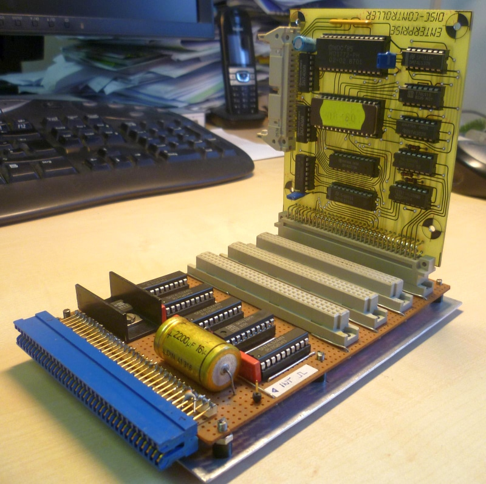 
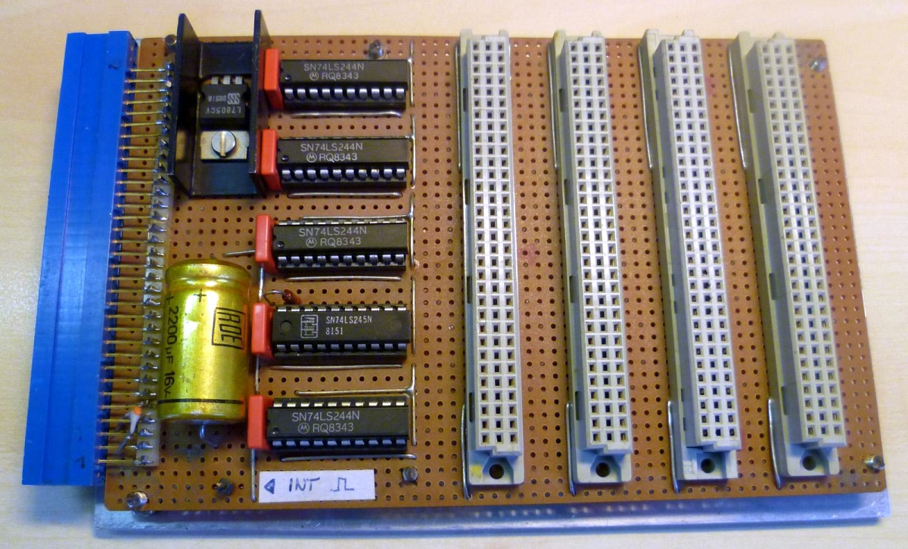 
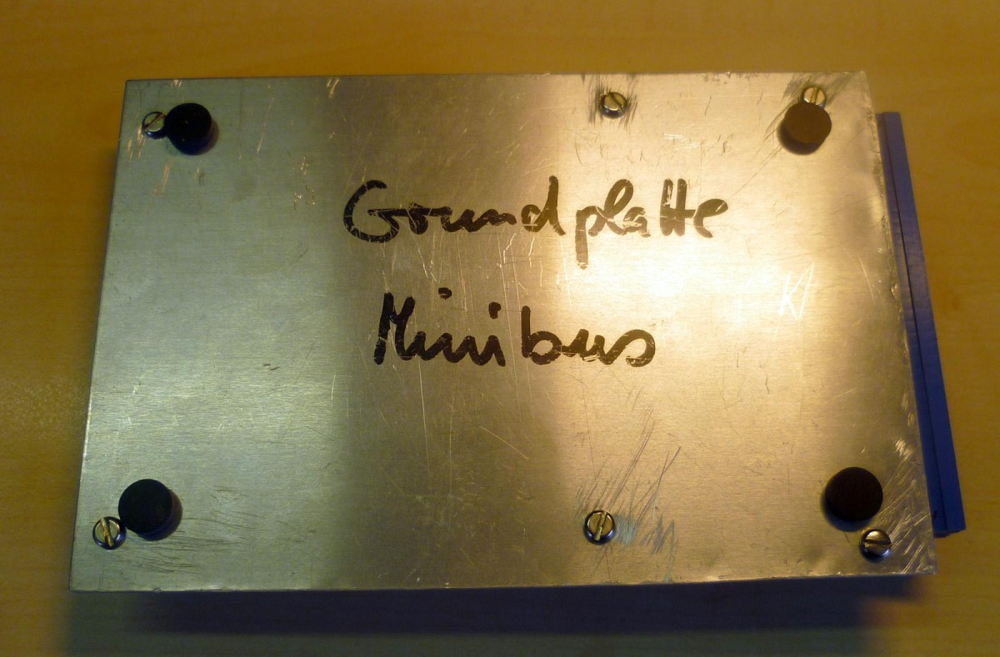 
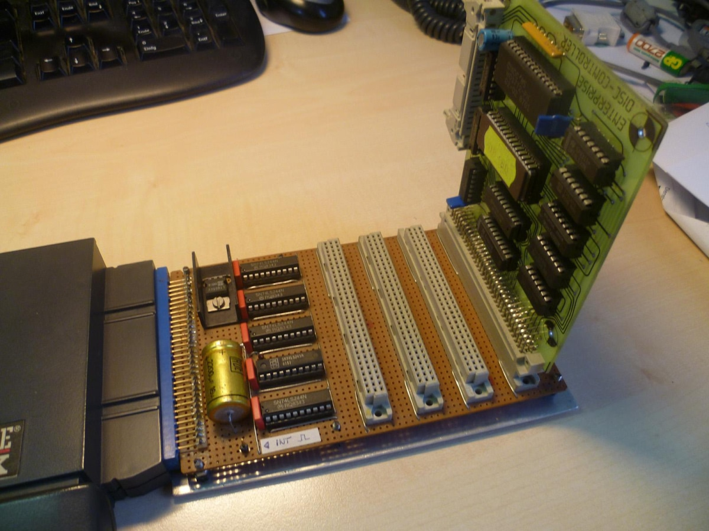 
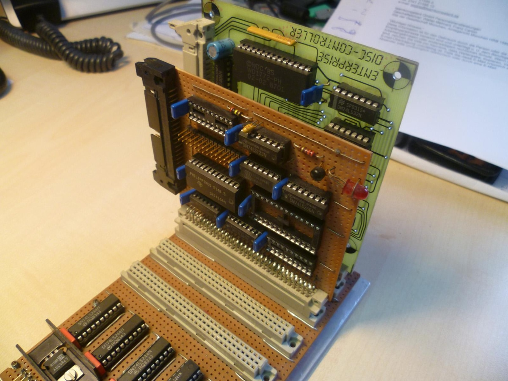 
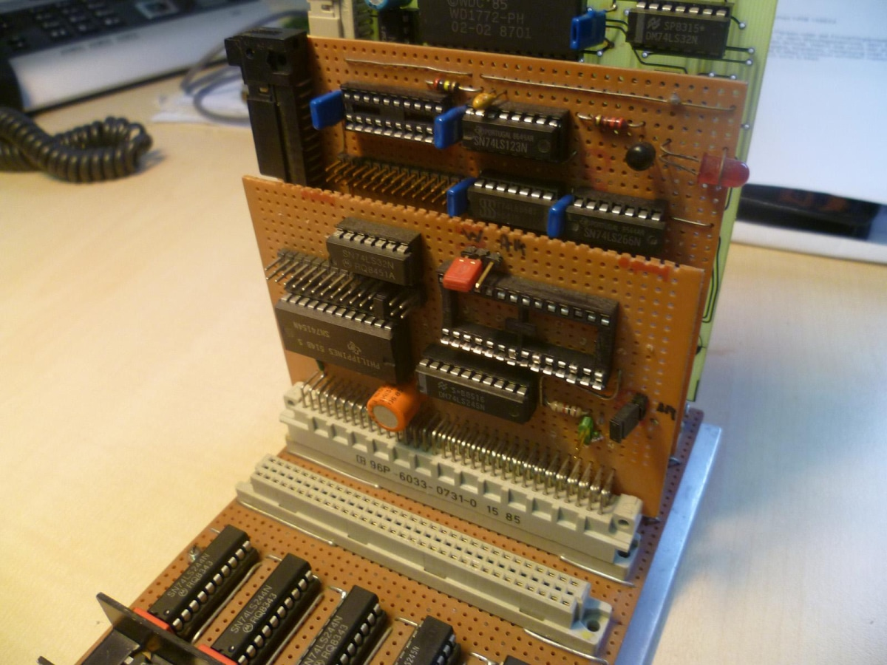 

Другий прототип MiniBus з перетворювачем 8 МГц

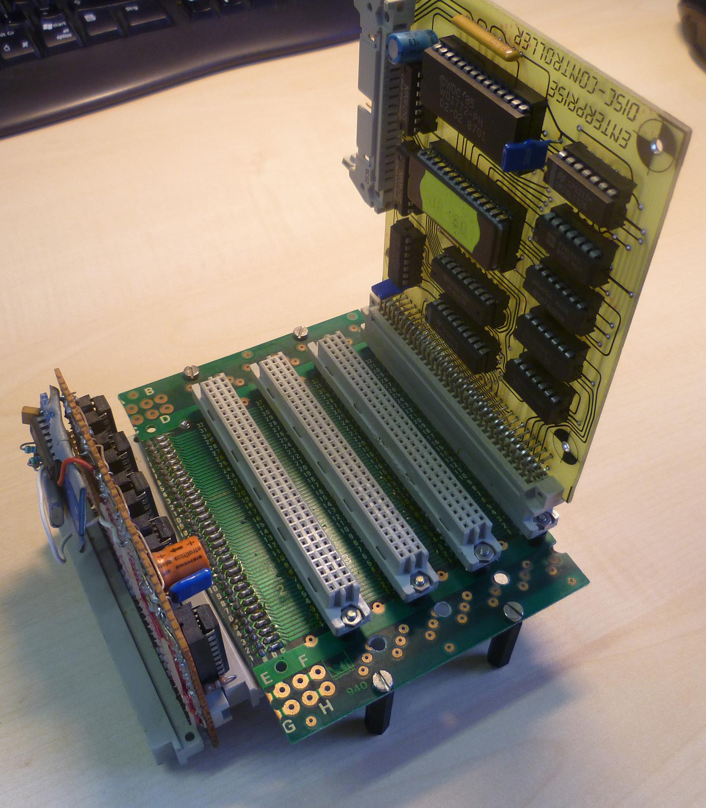 
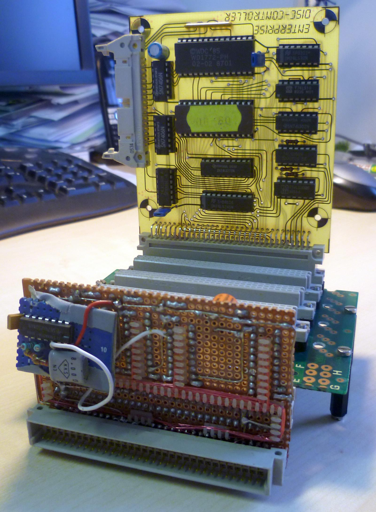 
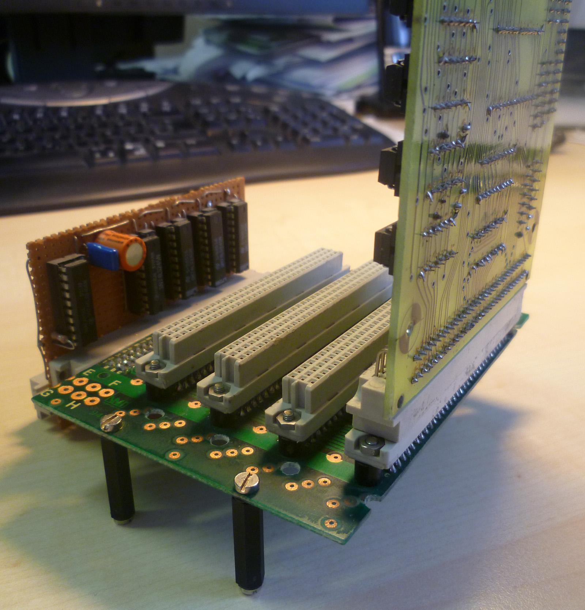 
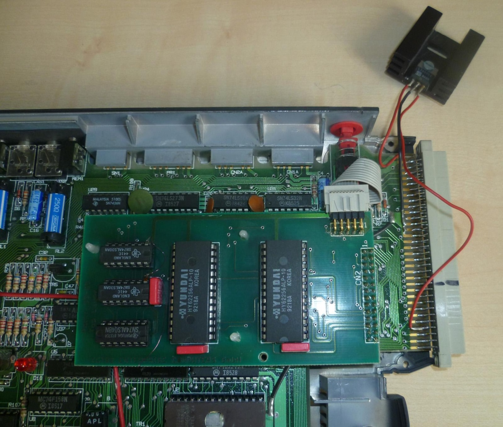 
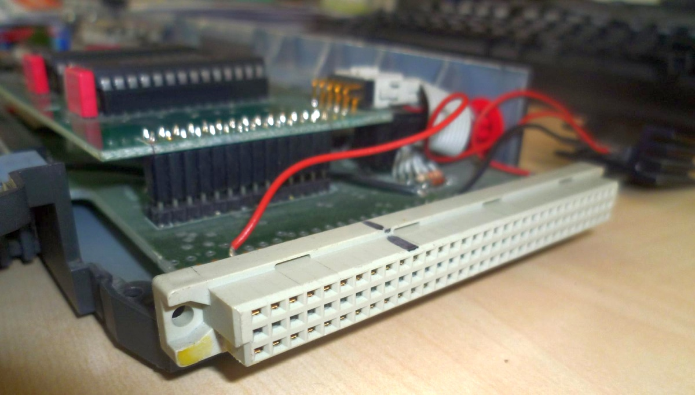 
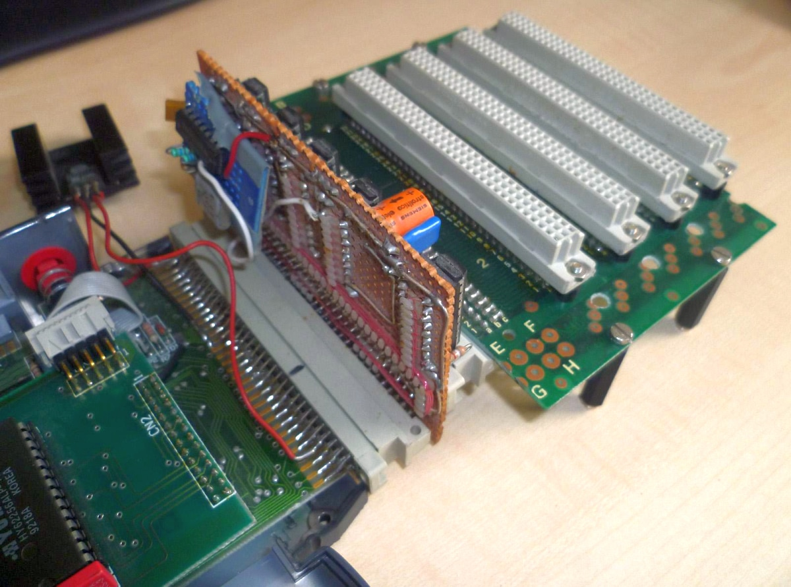 
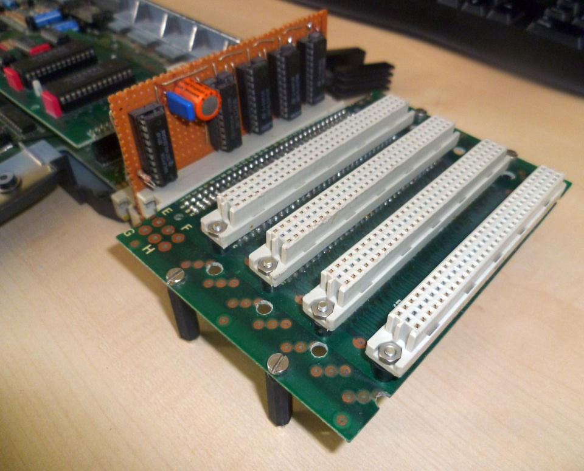 
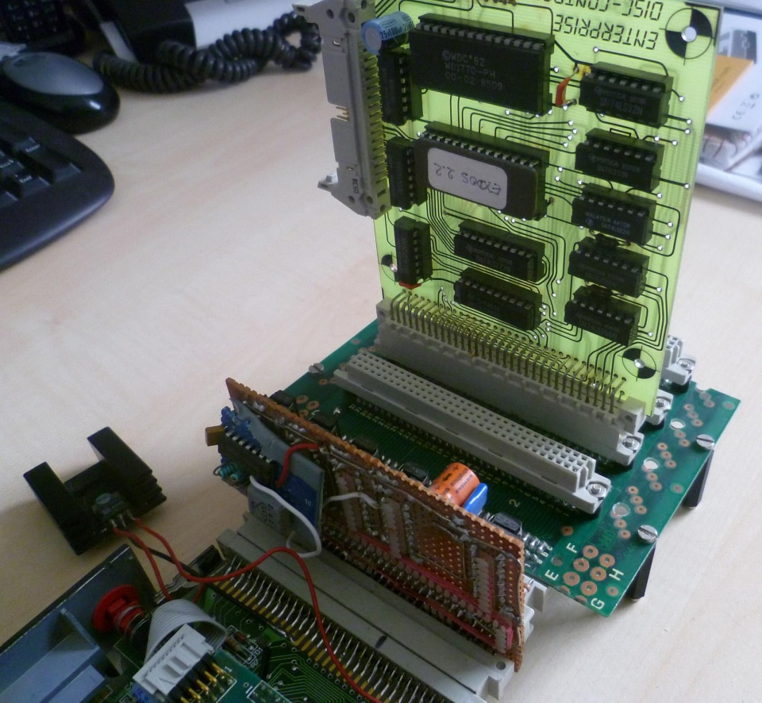 
 

Плата ROM з джампером для вибору сегмента пам'яті

 
 
 

----

[(оригінал повідомлення)](https://enterpriseforever.com/hall-of-fame/qa-with-werner-lindner-technical-director-of-the-enterprise-computers-gmbh/msg46752/#msg46752)

Enterprise GmbH Motherboard Bus

 
 
 
 
 
 
 
 
 
 
 
 

----

[(оригінал повідомлення)](https://enterpriseforever.com/hall-of-fame/qa-with-werner-lindner-technical-director-of-the-enterprise-computers-gmbh/msg45551/#msg45551)

> **Werner Lindner**: Ви, ймовірно, знаєте про дисковод [EXDOS/Floppy-Station](../hardware/hd-diskettenstation-35.md) ("Diskettengrundeinheit"), який продавався в Німеччині. У нас був прототип для додаткового дисковода, що встановлювався поверх першого, і я додаю кілька його фотографій. Це дійсно єдиний у своєму роді екземпляр. Він ніколи не випускався і не продавався ні в Німеччині, ні деінде. Навіть один дисковод з його металевим корпусом та великим імпульсним блоком живлення вже був занадто дорогим. Його замовила перша команда продажів ENTERPRISE у 1986 році, а загальна кількість випущених дисководів становила лише близько 600 штук. На самому початку він продавався за ціною 698,00 німецьких марок (DEM) з урахуванням ПДВ. За такою ціною ніхто не був зацікавлений у купівлі другого дисковода.
> 
> Прототип трохи постраждав від того, що зберігався в моєму підвалі щонайменше 25 років, але обидва дисководи досі працюють. За допомогою роз'єму на задній панелі другого дисковода можна підключати додаткові накопичувачі. У нас було два подвійних 3.5-дюймових дисководи **Cumana**, і в нашому офісі в Мюнхені ми демонстрували ENTERPRISE із чотирма підключеними дисководами.

 
 
 
 
 
 

----

[(оригінал повідомлення)](https://enterpriseforever.com/hall-of-fame/qa-with-werner-lindner-technical-director-of-the-enterprise-computers-gmbh/msg45891/#msg45891)

> **Werner Lindner**: Це мій саморобний подвійний дисковод FDD, зібраний з OEM-дисководів та OEM-корпусів, які я купив за дуже низькою ціною в одному з магазинів електроніки в Мюнхені. Мені так і не вдалося з'ясувати, хто початково їх виготовляв чи продавав, але самі дисководи виробництва **EPSON**. Я зробив для них зовнішній блок живлення (12В/5В) і використовував їх протягом кількох років зі своїм власним ENTERPRISE 128k.

 
 
 

----

[(оригінал повідомлення)](https://enterpriseforever.com/hall-of-fame/qa-with-werner-lindner-technical-director-of-the-enterprise-computers-gmbh/msg45946/#msg45946)

> **Werner Lindner**: У вкладенні додаю документацію на це внутрішнє розширення 64 кБ для комп'ютера, яке я розробив для [ENTERPRISE GmbH](../companies/enterprise-computers-gmbh.md) у 1992 році. Ви можете побачити необхідні зміни (додатковий провідник на першій версії друкованої плати) на нових/старих принципових схемах. Це сигнал `/MREQ`, який додатково інвертується і подається на вивід 1 обох мікросхем **74ALS30**.
> 
> Звичайно, на той час уже були доступні мікросхеми більшої місткості. Але завдання полягало не в тому, щоб зробити велике розширення. Завдання було в тому, щоб перетворити на 128-кілобайтні моделі ті приблизно 350 машин на 64 кБ, які все ще залишалися в нас на складі на той момент. Комп'ютери на 64 кБ вже нікого не цікавили, але ніхто також не став би платити додаткові гроші за "великі" домашні комп'ютери, які до того ж на той час уже були 5-річної давнини».

----

[(оригінал повідомлення)](https://enterpriseforever.com/hall-of-fame/qa-with-werner-lindner-technical-director-of-the-enterprise-computers-gmbh/msg45583/#msg45583)

**Zozosoft**: Ми вже дещо знаємо про [цю плату](../hardware/hn-bugtronics-modem.md) від [її розробника](../peoples/pers_anders-nielsen.md), але у нього самого її немає. А от у Вернера вона є! Це плата модему, в Данії її використовували для Enterprise BBS!

> **Werner Lindner**: Плата має процесор Z80CPU, що працює на частоті 2.4 МГц, 2 КБ статичної оперативної пам'яті (SRAM) та мікросхему Z80DART. Це найскладніше розширення для ENTERPRISE, яке я знаю. Принаймні, воно має не більше потужності, ніж комп'ютер, до якого воно підключалося.
> 
> Роз'єм точно такий самий, як і той, що використовувався для [нідерландського контролера EXDOS](../hardware/hd-exdos-ddc.md).

 
 
 
 
 
 

## Різне

[(оригінал повідомлення)](https://enterpriseforever.com/hall-of-fame/qa-with-werner-lindner-technical-director-of-the-enterprise-computers-gmbh/msg45894/#msg45894)

> **Werner Lindner**: Компанія [ENTERPRISE GmbH](../companies/enterprise-computers-gmbh.md) підготувала кілька подарунків для клієнтів. Це були дві різні самоклеючі наклейки, лінійка із вбудованим цифровим годинником та дві головоломки.

 
 
 


> **Werner Lindner**: Був план створити корпоративний комп'ютерний клуб, але, гадаю, він так і не став реальністю.

 