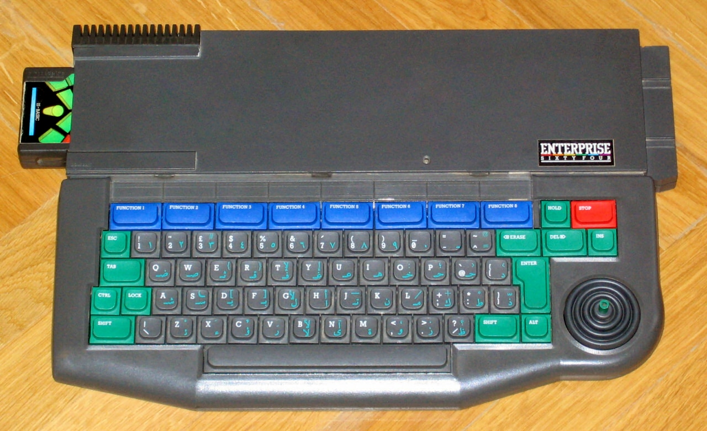
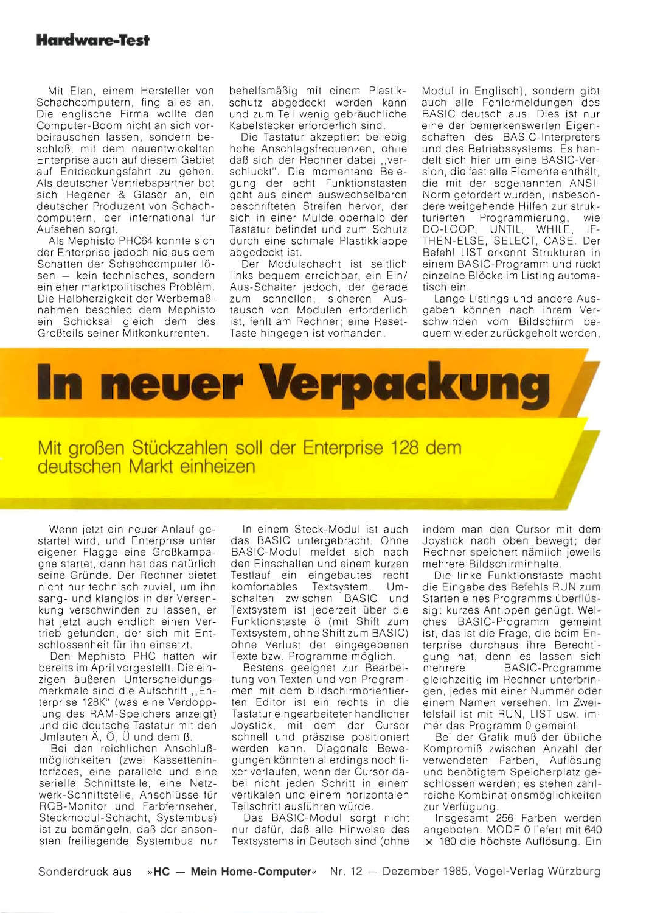
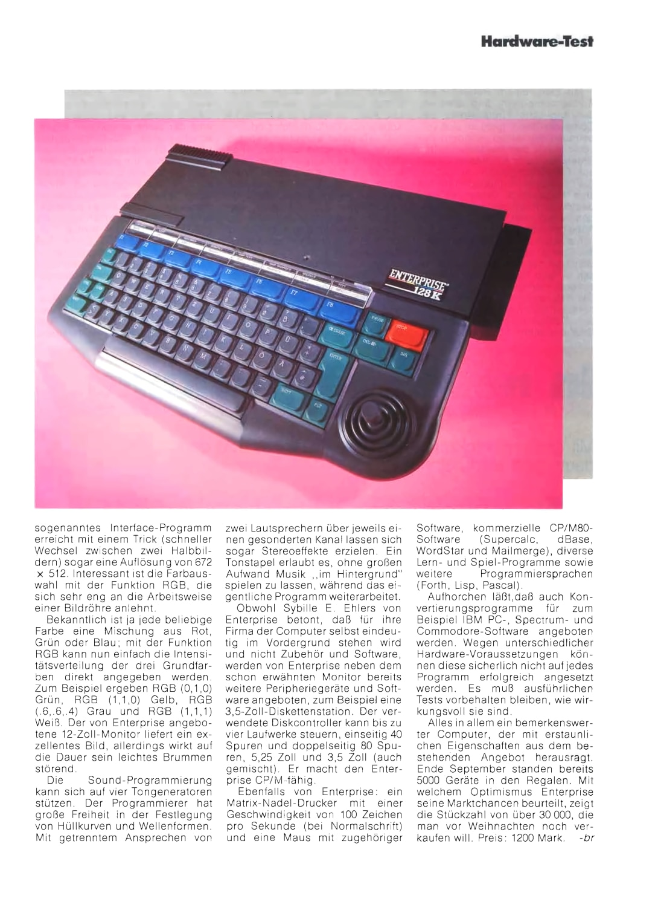
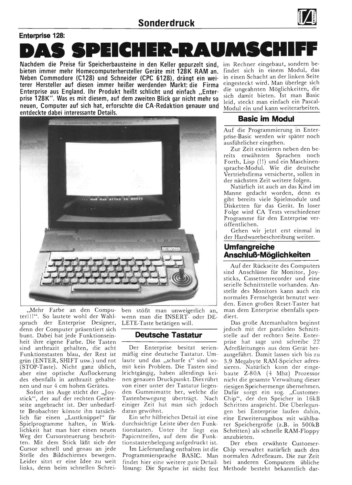
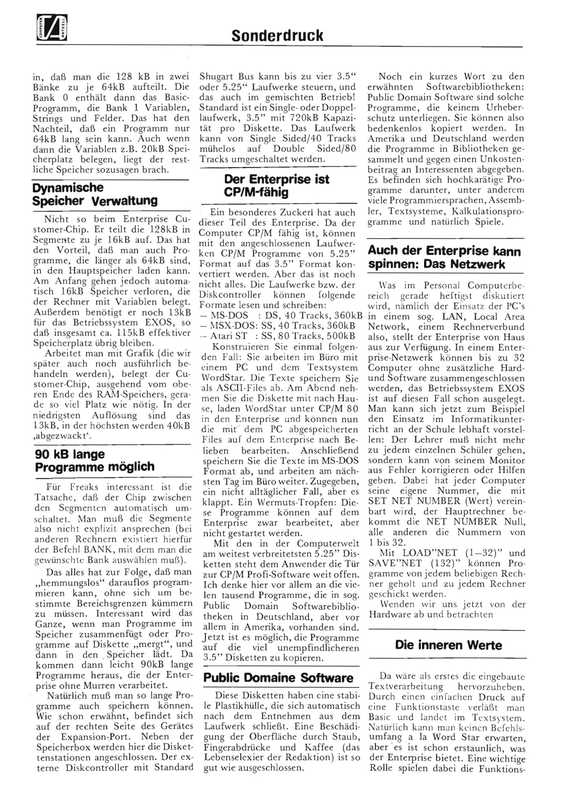
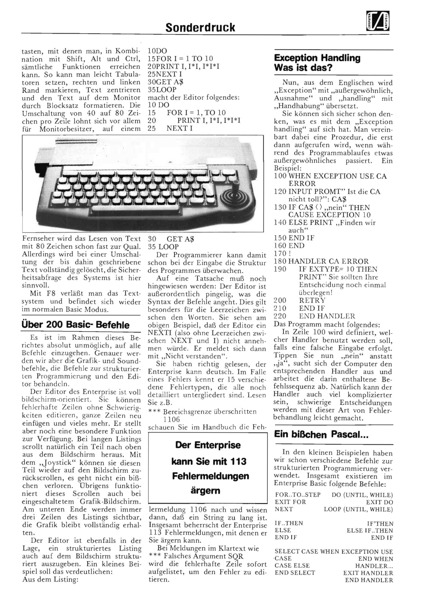
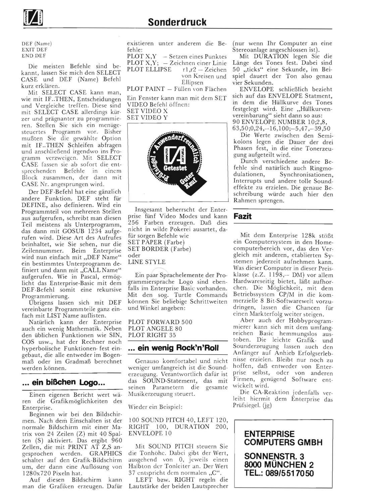

 1. Історичні подробиці
 2. [Розробка апаратного забезпечення](qa-werner-lindner2.md)
 3. [Апаратні розширення та картриджі](qa-werner-lindner3.md)
 4. [Апаратні розширення (EXDOS)](qa-werner-lindner4.md)
 5. [Прототип MIDI-картріджа](qa-werner-lindner5.md)
 6. [Прошивки ПЗП](qa-werner-lindner6.md)
 7. [Enterprise X, Model 911 або Project Vulcan](qa-werner-lindner7.md)
 8. [Кирилична версія для радянських шкіл](qa-werner-lindner8.md)
 9. [Різне](qa-werner-lindner9.md)
 10. [Модуль жорсткого диску](qa-werner-lindner10.md)

# Історичні подробиці

[(оригінал повідомлення)](https://enterpriseforever.com/hall-of-fame/qa-with-werner-lindner-technical-director-of-the-enterprise-computers-gmbh/msg45482/#msg45482)

**Zozosoft**: Наш найновіший учасник — надзвичайно важлива постать в історії Enterprise!

Оскільки він має дуже багато роботи й не має часу відповідати на безліч запитань безпосередньо на форумі, він попросив мене побути свого роду «речником», щоб опублікувати обговорену інформацію тут.

Перш за все, ось його самопрезентація:

> **Werner Lindner**: Я зареєструвався на вашому чудовому сайті/форумі два дні тому, натрапивши на нього абсолютно випадково. Я вже провів кілька годин, гортаючи теми та читаючи купу цікавих речей. Був просто вражений знайти тут таких людей, як [Брюс Таннер](../peoples/ec/pers_bruce-tanner.md), [Пітер Гайнер](../peoples/pers_peter-hiner.md) чи [Тім Бокс](../peoples/pers_tim-box.md) через стільки років — у голові одразу виринуло безліч фантастичних спогадів.
> 
> Трішки про себе: Я працював у компанії [ENTERPRISE Computers GmbH](../companies/enterprise-computers-gmbh.md) у Мюнхені з 1986 року і до її ліквідації у 1997-му. На самому початку (я тоді ще був студентом) я відповідав за роботу з кінцевими користувачами та технічну підтримку офісного персоналу. У 1987 році (після ліквідації [ENTERPRISE UK](../companies/enterprise-computers-ltd.md)) моїм завданням стало встановлення контактів з усіма виробниками та постачальниками, які були залучені до виробництва Enterprise 64/128 та периферії. Я особисто кілька разів їздив до Англії, відвідуючи всі ці компанії та намагаючись з'ясувати, чи можливо знову запустити виробництво комп'ютера.
> 
> Пізніше я став технічним директором компанії. Я брав безпосередню участь у різних проєктах ENTERPRISE в СРСР (Москва, Алмати, Джезказган — усе це в період між 1989 та 1992 роками). Тоді я мав дуже хороший контакт із [Вілмошем Копачі](../peoples/pers_vilmos-kopacsy.md) з [á-Studio](../companies/a-studio.md) і провів із ним кілька тижнів в Алмати, налаштовуючи перші шкільні мережі.

----

[(оригінал повідомлення)](https://enterpriseforever.com/hall-of-fame/qa-with-werner-lindner-technical-director-of-the-enterprise-computers-gmbh/msg45483/#msg45483)

**Zozosoft**: Перше питання: чи знаєте ви, скільки машин було продано в Німеччині та інших країнах? Нам уже відомо про продажі у Великій Британії, Німеччині, Угорщині (понад 20 000), Нідерландах, Данії, Іспанії, Франції, Єгипті (4000) та Радянському Союзі (3000).

> **Werner Lindner**: Щодо проданих машин у кожній країні, я дійсно мушу визнати, що в жодному разі не знаю точних цифр. Моя робота в [ENTERPRISE Germany](../companies/enterprise-computers-gmbh.md) розпочалася тоді, коли [британський офіс](../companies/enterprise-computers-ltd.md) уже був закритий. На початку я відповідав за підтримку кінцевих користувачів і проводив певне навчання — що стосується апаратного та програмного забезпечення — для нових менеджерів із продажу. Нових, тому що попередній штат у Німеччині також був звільнений [Лачу Маxтані](../peoples/ec/pers_lachu-mahtani.md) восени 1986 року. Ті люди обіцяли, що зможуть продати тисячі комп'ютерів у Німеччині, але спромоглися лише приблизно на 2500 штук за майже рік роботи. Через їхні обіцянки [ENTERPRISE UK](../companies/enterprise-computers-ltd.md) виробила велику кількість німецьких машин EC128k, і тепер вони лежали у [Лачу](../peoples/ec/pers_lachu-mahtani.md) на складі (його компанія [Broadlight Ltd.](../companies/broadlight-ltd.md) перебрала на себе всі залишки запасів ENTERPRISE).
> 
> Багато документів втрачено, особливо тих, що стосуються показників продажів, тому всі обсяги до осені 1986 року — це лише приблизні оцінки:
> 
> Німеччина: Приблизно 2500 машин моделі **128k** і зовсім невелика кількість **ENTERPRISE 64k** (обидві позиції через [ENTERPRISE Computers GmbH](../companies/enterprise-computers-gmbh.md)), а також дуже мала кількість **Mephisto PHC** (через фірму [Hegener & Glaser](../companies/hegener-and-glaser.md)). Навіть більше: я бачив лише один картридж **Mephisto BASIC** і один **Mephisto PHC**, які приносили до нас у ремонт.
> 
> Данія, Нідерланди, Норвегія, Франція, Іспанія та, ймовірно, інші країни Західної Європи: [ENTERPRISE UK](../companies/enterprise-computers-ltd.md) мала прямі дилерські контракти з одним імпортером у кожній країні, але ці люди володіли лише невеликими компаніями. Фактично вони були швидше звичайними дилерами, ніж справжніми імпортерами/дистриб'юторами, тому в кожній із цих країн, ймовірно, є лише невелика кількість машин — можливо, по кілька сотень на країну. Імпорт та контакти в більшості випадків припинилися після того, як [ENTERPRISE UK](../companies/enterprise-computers-ltd.md) перейшла під зовнішнє управління (оголосила про банкрутство).
> 
> У Німеччині ми мали контакти лише з людьми з Данії та Нідерландів. Я кілька разів спілкувався з чоловіком із Нідерландів по телефону і зустрівся з ним особисто один раз, коли він приїжджав до Мюнхена, щоб купити у нас 12 машин. Він показав нам кілька прототипів заліза зі своєї країни: внутрішнє розширення пам'яті на 512 кБ із динамічною пам'яттю (DRAM) та маленький контролер EXDOS, який встановлювався «бутербродом» поверх комп'ютера (фото якого можна побачити в журналі [ENTERFACE](../press/pr-enterface.md) за квітень-травень 1987 року).
> 
> Що стосується Данії, я мав контакт із [Андерсом Роаром Нільсеном](../peoples/pers_anders-nielsen.md). Він та його брат очолювали місцеву групу користувачів і зробили дуже багато речей для ENTERPRISE. Окрім чудових програм та системних розширень (як-от розширення карт пам'яті), вони створили плату модему та програмне забезпечення для ENTERPRISE. Завдяки цьому комплекту комп'ютер можна було використовувати як BBS-станцію (на той час не було ні інтернету, ні електронної пошти ).
> 
> Єгипет: Єгипетським імпортером була компанія [Computer Technical Co.](../companies/computer-technical-co.md) у Каїрі. Засновником і керуючим директором був пан [Набіль Лашин](../peoples/pers_nabil-lashine.md). Він уже купив близько 500 машин **ENTERPRISE 64k** в Англії. Він імпортував їх до Єгипту і продавав іншим компаніям як електронні друкарські машинки. Його не цікавили ігри чи інша периферія, тому що він не міг їх продати (ніхто в Єгипті на той час не міг дозволити собі домашній комп'ютер для приватних потреб). Він створив власне програмне забезпечення для комп'ютера і сам зробив зелений принт на клавіатурі. Він купував у нас додаткові машини 64k, але це була приблизно одна поставка на рік і не більше 150 машин (25 коробок по 6 комп'ютерів). Він також отримав від нас близько 500 порожніх картриджів. Він завжди платив щомісячними чеками. Іноді отримання грошей займало багато часу, але він був дуже надійним. Його останнє замовлення було у 1993 році, а останній контакт із ним — у 1994-му. На той час його компанія мала великі проблеми, і його банк наклав руку на залишки комп'ютерів EC на складі. Після цього я нічого про нього не чув, але в мене досі зберігається повний комплект клавіш із принтом, який він подарував мені під час свого візиту до нас у Мюнхен. Загалом, я вважаю, що 4000 одиниць — це забагато. Особисто я знаю лише про 1500 одиниць, включно з машинами з Англії (але, можливо, [Лачу](../peoples/ec/pers_lachu-mahtani.md) продав щось йому напряму).
> 
> 

> 
> Про Угорщину та країни колишнього Радянського Союзу: Це дві дуже особливі історії. Я не знаю всіх деталей і хотів би розпитати свого хорошого друга, який укладав ці контракти, перш ніж розповім вам щось не те. Я також запитаю його про загальну кількість комп'ютерів на складах в Англії, бо зараз не можу згадати цю цифру.
> 
> Англія: Я поняття не маю про загальну кількість проданих там машин, але припускаю, що вони продали не більше 25 000 одиниць. Люди з компанії [GRI Ltd](../companies/gri-ltd.md) розповідали мені, що вони виробили десь близько 45 000 машин (64k та 128k, англійських та німецьких версій). Я не знаю обсягів виробництва попереднього виробника (між жовтнем 1984 та червнем 1985 років), але загальний випуск у 84-му був дуже низьким, до того ж вони випускали дуже багато браку, що зрештою змусило ENTERPRISE шукати іншого виробника. Люди з **GRI** розповіли мені набагато більше (проблеми з комунікацією, проблеми з постачанням деталей та матеріалів, великі проблеми з тестовим обладнанням і, загалом, занадто дороге виробництво через конструкцію машини та велику кількість ручної праці, як-от розширення пам'яті...), але це також окрема історія, яку слід розповісти пізніше.
> 
> У 1996/1997 роках залишався складський запас у близько 2000 комп'ютерів ENTERPRISE (64k, 128k UK та 128K німецьких версій), які ми продали компанії в Чеській Республіці. Разом із цими комп'ютерами пішло майже все супутнє приладдя (кабелі, програми на касетах, дисководи, інструменти, тестове обладнання...), і це став офіційний кінець компанії [ENTERPRISE Computers GmbH](../companies/enterprise-computers-gmbh.md), якою ви її знаєте.

----

[(оригінал повідомлення)](https://enterpriseforever.com/hall-of-fame/qa-with-werner-lindner-technical-director-of-the-enterprise-computers-gmbh/msg45670/#msg45670)

> *(про бізнес в Угорщині)*  
> **Werner Lindner**: Початкова угода стосувалася всієї партії (приблизно 20 000 одиниць), але відвантаження здійснювалося кількома партіями. Товар з англійських складів постачався напряму з Англії та об’єднувався з німецькими залишками на складі компанії _MIDI-DATA_ у Франкфурті. Звідти кілька вантажівок вирушили до Угорщини. Магнітофони **OMEGA** привезли з Гонконгу. Я особисто знаю про одну поставку в 5000 штук, але не впевнений, чи були інші. Управлінською стороною (контракти, логістика тощо) на той час займався [Г. М. Віндіш](../peoples/pers_h-m-windisch.md) («Майк» Віндіш), який пізніше став керуючим директором [ENTERPRISE Computers GmbH](../companies/enterprise-computers-gmbh.md). Я вже намагався зв’язатися з ним (щодо деталей по Угорщині, Алмати, Джезказгану та Москві), але, на жаль, він зараз за кордоном. Він повернеться десь у середині квітня, і я думаю, що раніше отримати більше інформації не вдасться.

**Zozosoft**: Хто створив цей чудовий дизайн магнітофонів і чому існують інші версії (**Cloud 7**/**Omega**)?

 
 
 

> **Werner Lindner**: Наскільки мені відомо, усі магнітофони, відправлені до Угорщини, прибули з Гонконгу. Замовлення та доставку організувала філія [Locumals Ltd.](../companies/locumals-ltd.md) у Гонконгу — це торгова компанія родини [Маxтані](../peoples/ec/pers_lachu-mahtani.md). Чорно-зелений корпус був нашою ідеєю; ми надіслали плівки для логотипа **Гені Матані** (Heny Mathani), який узгодив усі деталі з постачальником. Здається, початкове замовлення було на 10 000 штук, але я не пам’ятаю точно.
> 
> Коли нам знадобилося зробити повторне замовлення, **Гені** повідомив, що оригінальний постачальник/дизайн більше недоступний. Йому довелося звернутися до іншого постачальника (це зрештою і були **Cloud 7** / **Omega**), а пошук альтернативи зайняв багато часу. Вже не було можливості замовити чорний корпус та індивідуальний принт логотипа. Крім того, транспортування було справжнім жахом — довгим і дорогим: вантаж із Гонконгу йшов через Роттердам, а потім вантажівками через Німеччину до Угорщини, але іншої альтернативи на той час не було. Загальний обсяг був недостатнім, щоб відправити повний 40-футовий контейнер, тому нашому вантажу завжди доводилося чекати на інші товари, що йшли в тому ж напрямку.

----

[(оригінал повідомлення)](https://enterpriseforever.com/hall-of-fame/qa-with-werner-lindner-technical-director-of-the-enterprise-computers-gmbh/msg46278/#msg46278)

Стаття з журналу **Mein Homecomputer, 12/1985**:  
 
 

І з **Computer Aktuell 01/1986**:  
 
 
 
 

Ціни з каталогу **METRO** за 1986 рік. Для порівняння наведено сторінки, присвячені IBM PC:  
 
 
 

----

[(оригінал повідомлення)](https://enterpriseforever.com/hall-of-fame/qa-with-werner-lindner-technical-director-of-the-enterprise-computers-gmbh/msg46299/#msg46299)

**Zozosoft**: чи були в каталозі інші 8-бітні системи, наприклад, Commodore?

> **Werner Lindner**: METRO — це оптовий посередник, клієнтами якого є лише компанії та дилери, а не кінцеві споживачі. Тому на той час вони не пропонували жодних інших "домашніх комп'ютерів". Перше керівництво ENTERPRISE намагалося позиціювати машину як професійний інструмент, і саме тому вони запропонували її мережі METRO.
> 
> На жаль, це не мало великого успіху: торгові точки METRO отримували комп'ютери та периферію на умовах комісії, тобто вони оплачували все, але мали право повернути будь-які непродані компоненти протягом певного періоду. Загалом METRO продала лише кілька сотень машин, і весь нерозпроданий товар повернувся на початку 1987 року.

----

[(оригінал повідомлення)](https://enterpriseforever.com/hall-of-fame/qa-with-werner-lindner-technical-director-of-the-enterprise-computers-gmbh/msg46307/#msg46307)

> **Werner Lindner**: У цій угоді брали участь приблизно 50 торгових точок METRO. Кожна з них отримала по 12 машин (2 коробки), кілька моніторів, принтерів та 4 дисководи (1 коробка). У підсумку приблизно 300 комп'ютерів, частина моніторів, принтерів та половина дисководів повернулися назад. Великою проблемою стало те, що в магазинах викинули коробки від демонстраційних зразків (які вони також повернули), тому після завершення угоди ми отримали близько 50 комп'ютерів, дисководів та принтерів без пакування, кабелів та інструкцій. Якщо врахувати час і гроші, витрачені на розпакування, перепакування та заміну відсутніх позицій, а також фінансові втрати від продажу цих очевидно вживаних товарів — для нас ця угода стала повним провалом.

----

[(оригінал повідомлення)](https://enterpriseforever.com/hall-of-fame/qa-with-werner-lindner-technical-director-of-the-enterprise-computers-gmbh/msg45552/#msg45552)

**Zozosoft**: Я завжди думав, що німецькі комп'ютери та німецьке ПЗП розширень були виготовлені німецькою компанією. Але коли я запитав про ПЗП [BRD](../software/ss-localizations.md), відповідь мене повністю здивувала!

> **Werner Lindner**: EPROM 08-59 та його вміст походять не від [ENTERPRISE GmbH](../companies/enterprise-computers-gmbh.md). Німецький ENTERPRISE 128k був єдиною офіційною іноземною версією, яка була спроектована, виготовлена та висилалась безпосередньо з Англії. Окрім неї, існували лише англійські машини на 64к та 128к. Вміст EPROM 08-59 мав бути створений безпосередньо компанією [Intelligent Software](../companies/intelligent-sofware-ltd.md).
> 
> Я вважаю, що ця історія почалася в той час, коли компанія [Hegener & Glaser](../companies/hegener-and-glaser.md) намагалася продавати ENTERPRISE 64k під назвою **Mephisto PHC**. Вони зрозуміли, що суто англійську машину важко продати, особливо з огляду на те, що її намагалися просувати як мережевий комп'ютер (для шкіл тощо). Тому розробка розширення [BRD](../software/ss-localizations.md) мала розпочатися десь між груднем 1984 року та початком 1985 року. [Німецька філія ENTERPRISE](../companies/enterprise-computers-gmbh.md) була заснована в середині 1985 року, і на той момент німецька модель на 128к вже була готова.

----

[(оригінал повідомлення)](https://enterpriseforever.com/hall-of-fame/qa-with-werner-lindner-technical-director-of-the-enterprise-computers-gmbh/msg45753/#msg45753)

**Zozosoft**: А тепер дещо дуже особливе!

> **Werner Lindner**: Серед коробок, які ми отримали з Великобританії, була одна з поміткою "Harrods Computer". Те, що ми розпакували, стало для нас справжнім сюрпризом: це був ENTERPRISE 128k із темно- та світло-сірою клавіатурою. Світло-сірі клавіші не пофарбовані — вони повністю відлиті зі світло-сірого пластику ABS. Коли я запитав [Лачу Маxтані](../peoples/ec/pers_lachu-mahtani.md) про історію цієї машини, він розповів мені ось що:
> 
> Після різдвяних продажів 1985 року, які виявилися далеко поза всіма очікуваннями, відділ продажів [EC UK](../companies/enterprise-computers-ltd.md) шукав нових потенційних клієнтів. Серед іншого вони запропонували модель 128k мережі **Harrods** — великому універмагу в Лондоні. Проте керівництво **Harrods** відмовилося, заявивши, що через різнокольорову клавіатуру комп'ютер більше схожий на іграшку, ніж на серйозну машину.
> 
> Після цього керівництво ENTERPRISE вирішило створити версію комп'ютера з більш серйозним виглядом і спробувати ще раз презентувати зразок у **Harrods**. Замість синіх, зелених та червоних клавіш вони замовили у компанії [Sovrin Plastics](../companies/sovrin-plastics.md) пробну партію світло-сірих і знову показали цю модель універмагу. На жаль, їм так і не вдалося їх переконати, тож комп'ютер відправився в коробку в офісі й більше ніколи з неї не виймався — аж дотепер!

 
 
  
 
 
  

----

[(оригінал повідомлення)](https://enterpriseforever.com/hall-of-fame/qa-with-werner-lindner-technical-director-of-the-enterprise-computers-gmbh/msg45761/#msg45761)

**Zozosoft**: Чи було також видалено різнокольоровий екран з написом ENTERPRISE?

> **Werner Lindner**: Комп'ютер працює і має стандартну звичайну англійську версію [EXOS 2.1](../software/ss-exos.md)/[BASIC 2.1](../programming/is-basic.md).
> 
> Наклейка із серійним номером незаймана. Тому я вважаю, що вони просто зняли верхню частину клавіатури й замінили її на цю спеціальну. Оскільки нанесенням символів на клавіатуру займався складальник (компанія [GRI Ltd.](../companies/gri-ltd.md)), ця верхня частина клавіатури, мабуть, до цього перебувала в Шотландії

----

[Наступна сторінка: розробка апаратного забезпечення](qa-werner-lindner2.md)
