 1. [Історичні подробиці](qa-werner-lindner1.md)
 2. [Розробка апаратного забезпечення](qa-werner-lindner2.md)
 3. [Апаратні розширення та картриджі](qa-werner-lindner3.md)
 4. Апаратні розширення (EXDOS)
 5. [Прототип MIDI-картріджа](qa-werner-lindner5.md)
 6. [Прошивки ПЗП](qa-werner-lindner6.md)
 7. [Enterprise X, Model 911 або Project Vulcan](qa-werner-lindner7.md)
 8. [Кирилична версія для радянських шкіл](qa-werner-lindner8.md)
 9. [Різне](qa-werner-lindner9.md)
 10. [Модуль жорсткого диску](qa-werner-lindner10.md)

# Апаратні розширення (EXDOS)

[(оригінал повідомлення)](https://enterpriseforever.com/hall-of-fame/qa-with-werner-lindner-technical-director-of-the-enterprise-computers-gmbh/msg45889/#msg45889)

> **Werner Lindner**:
> 
> [EXDOS](../hardware/hd-exdos.md) — інженерний зразок
> 
> - Маленький монтажний отвір.
> - Роз'єм дисковода (FDD) не кутовий, а вертикальний.
> - Жовта маска/маркування плати.
> - Коротший ножовий роз'єм (на 2 мм коротший за фінальну версію).
> - Трохи інший контур ножового роз'єму.
> 
> Ця версія не поміщається у фінальний корпус контролера EXDOS.

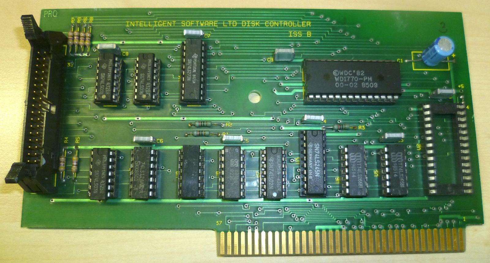 
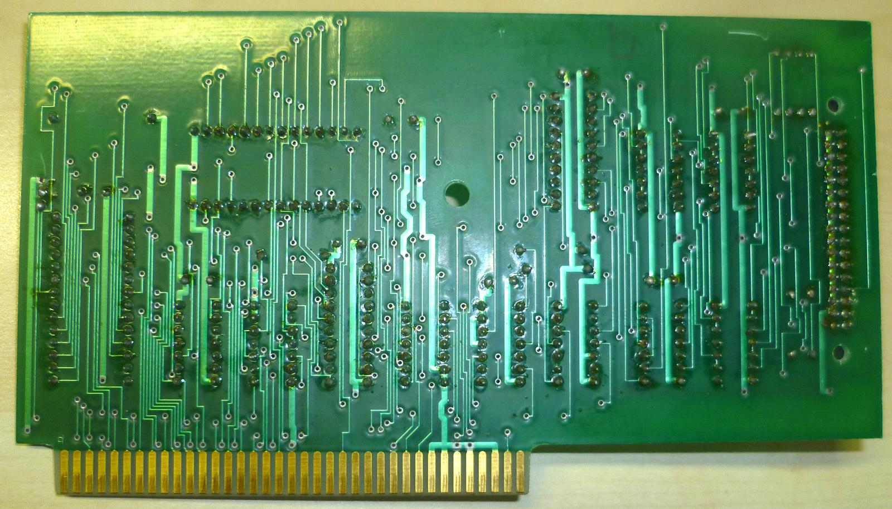 

> [EXDOS](../hardware/hd-exdos.md) — рання версія з маленьким отвором
> 
> - Маленький монтажний отвір.
> - Коротший ножовий роз'єм.
> - Контур ножового роз'єму не ідеальний для [моста системної шини](../hardware/system-bus/hb-bus-bridge.md) — центрування зміщене.

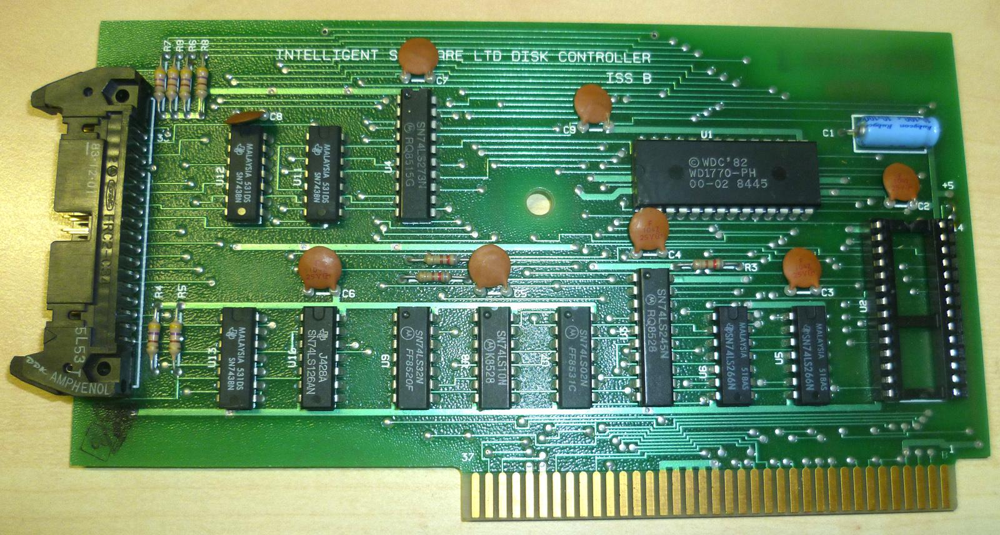 
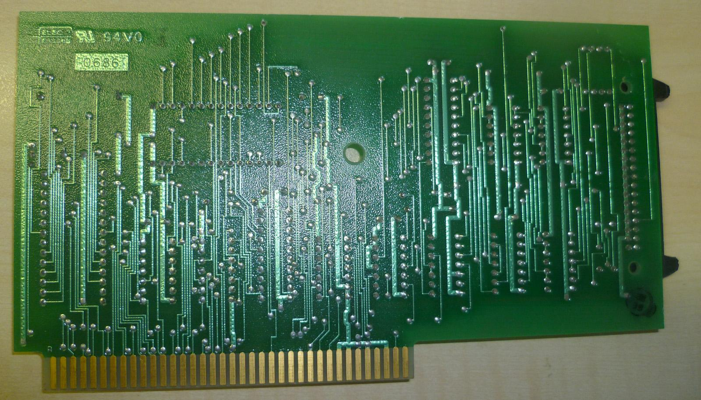 

> [EXDOS-контролер](../hardware/hd-exdos.md) у саморобному корпусі.
> 
> - Взірець контролера у вручну зробленому корпусі. Цей екземпляр використовувався для деяких фотографій у пресі, оскільки на той час фабричного корпусу Exdos ще не існувало. Цей виготовлений вручну контролер з Англії можна побачити на [наступній сторінці](http://www.zock.com/8-Bit/D_Enterprise64.HTML) разом із подвійним дисководом Cumana.
> 
>  

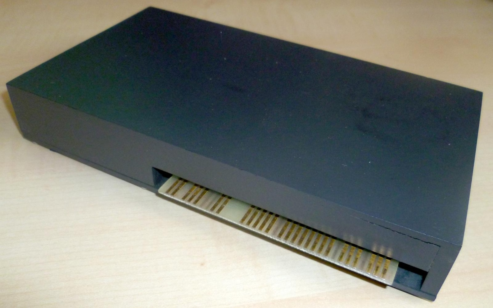 
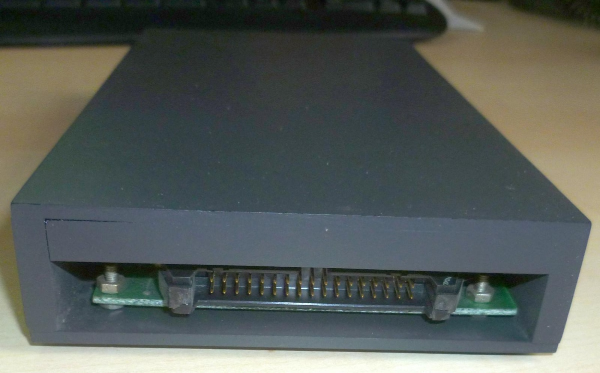 
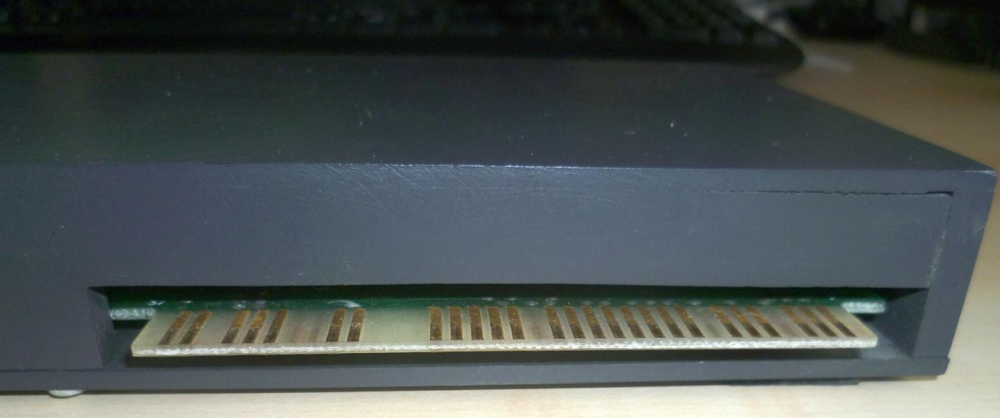 
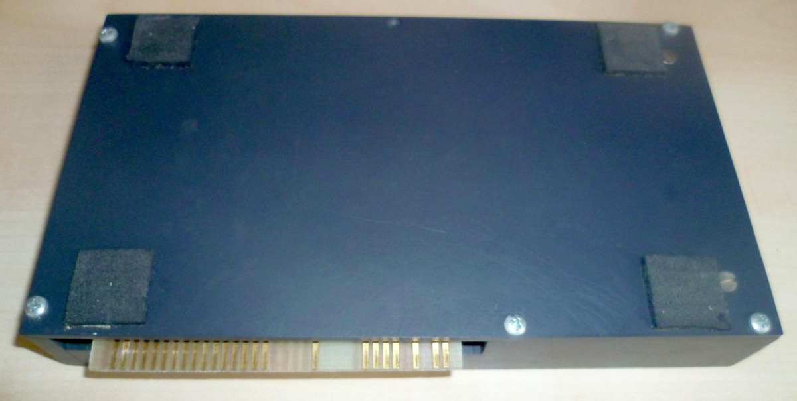 

> [EXDOS](../hardware/hd-exdos.md)-контролери в поліетиленових пакетах
> 
> - Контролери Exdos у тому вигляді, в якому вони прибували до Німеччини — у поліетиленових пакетах. Пластикові деталі корпусу контролера постачалися окремо, але оригінальних зразків у мене вже не залишилося.

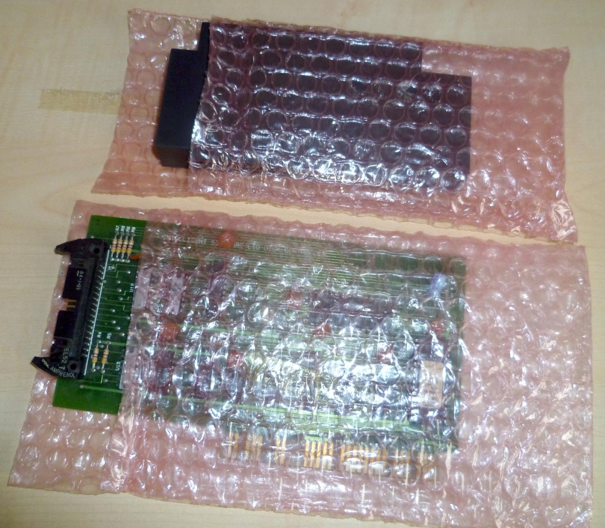 
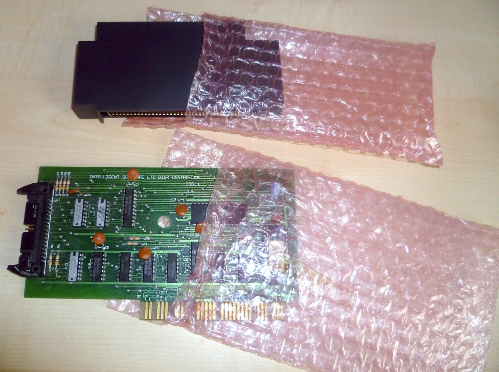 

> [EXDOS](../hardware/hd-exdos.md) — фінальна версія
> 
> - Більший монтажний отвір (діаметр 8 мм).
> - Довгий ножовий роз'єм.
> 
> Ця версія ідеально підходить для фінального корпусу контролера EXDOS.

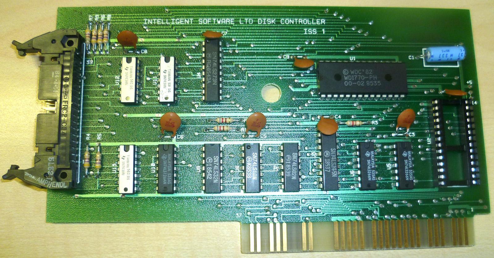 
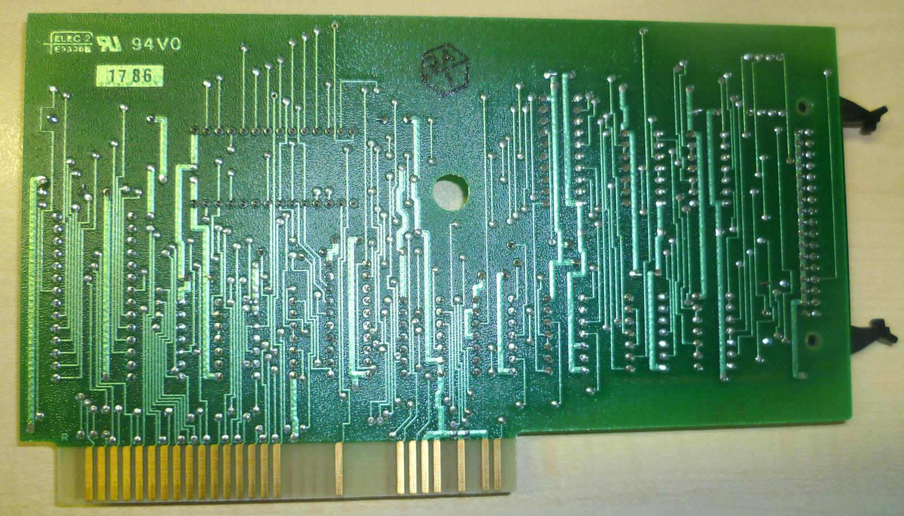 

> - Фотографії німецького контролера та оригінального англійського контролера для роздрібного продажу.

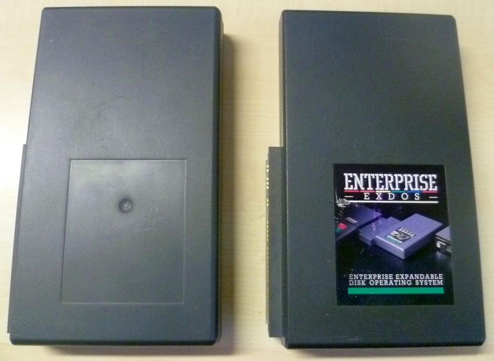 
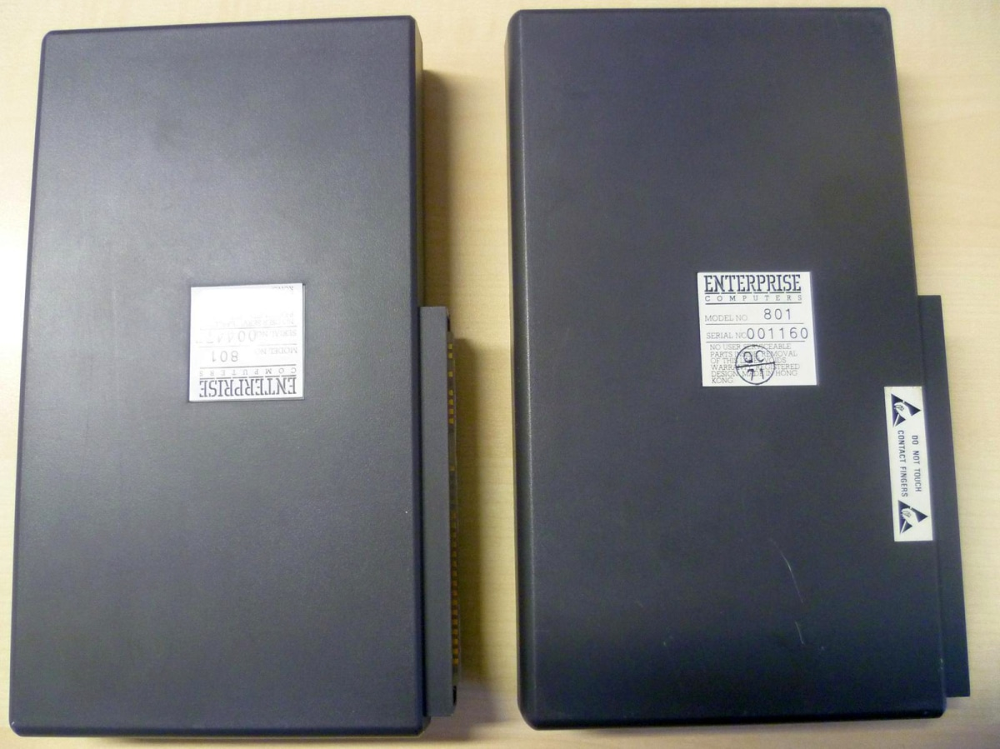 

----

[(оригінал повідомлення)](https://enterpriseforever.com/hall-of-fame/qa-with-werner-lindner-technical-director-of-the-enterprise-computers-gmbh/msg45944/#msg45944)

**Zozosoft**: Подивіться на ці фотографії [Floppy Station](../hardware/hd-diskettenstation-35.md). Думаю, вона розроблялася під ранні плати з "маленьким отвором". Для фінальних плат уже знадобилася велика шайба під гвинт.

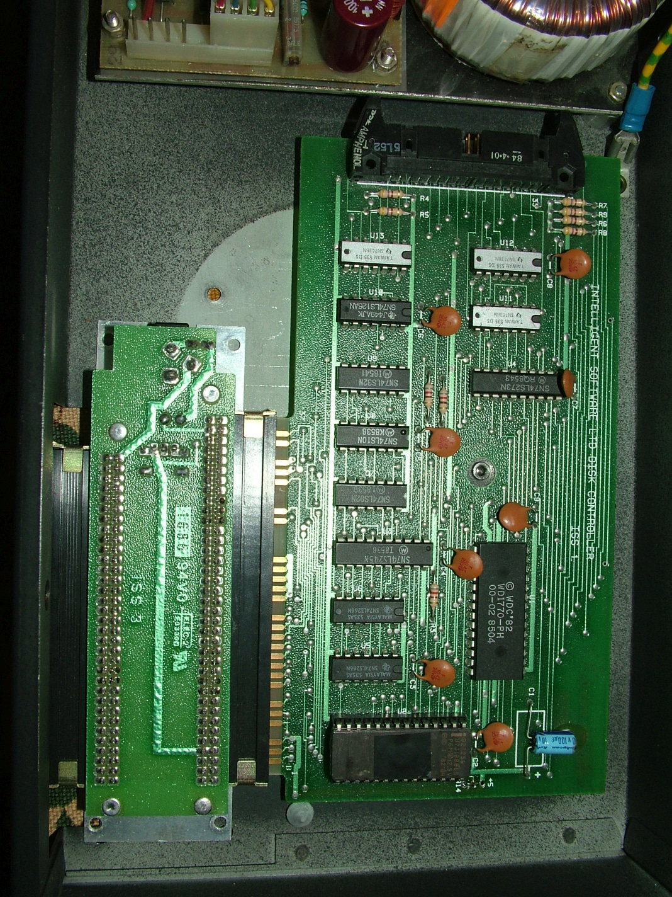 
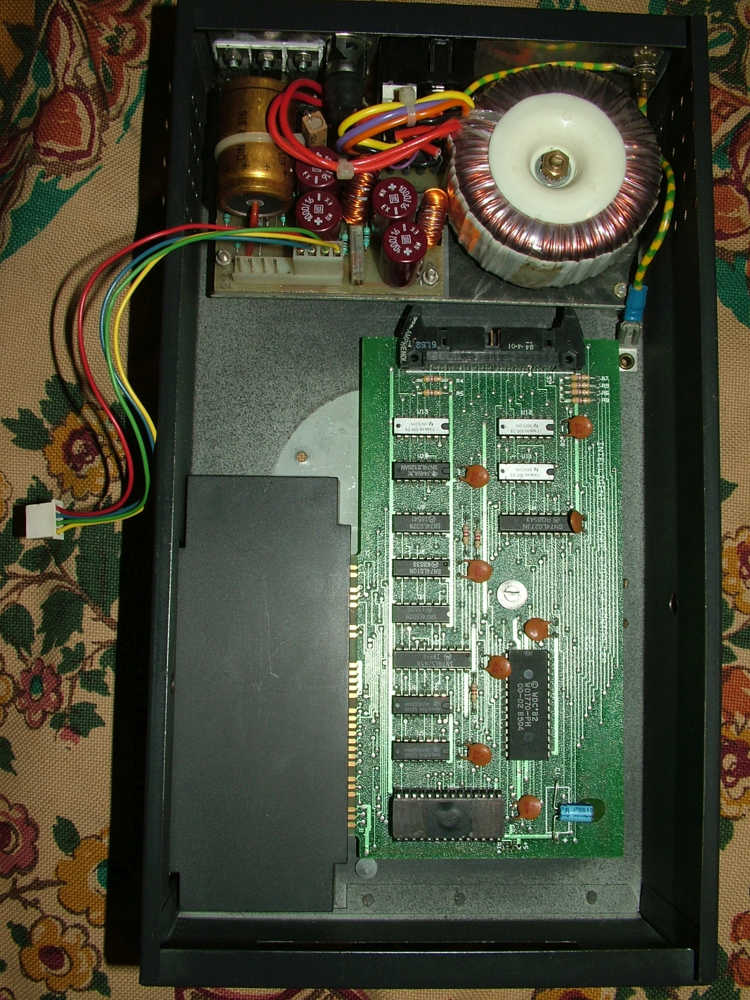 

> **Werner Lindner**: Так, я теж так вважаю. Схоже, німці отримали ранню версію контролера, щоб почати розробку Floppy Station, і на той час не було ні корпусу для контролера, ні корпусу для моста системної шини. Це, мабуть, і є причиною того, чому на модулі дисководів, зображеному в німецькій брошурі, видно "голий" ножовий роз'єм.
> 
> Металеві прес-форми для корпусу цього модуля вже були готові, коли [Enterprise UK](../companies/enterprise-computers-ltd.md) випустила фінальну версію контролера разом із пластиковим ABS-корпусом. Тоді вони й виготовили цю велику металеву шайбу, щоб зафіксувати новий контролер у корпусі. На жаль, відбулася також і ця незначна зміна в контурі ножового роз'єму. Через це перші німецькі дисководи мали проблеми із підключенням до порту розширення. Контакти на ножовому роз'ємі не повністю збігалися з контактами моста системної шини. Як наслідок, величезна кількість дисководних станцій поверталася назад із позначкою "не працює".
> 
> Нам довелося переробляти всі накопичувачі з першої виробничої партії: ми перевертали шайбу догори дриґом і зсували EXDOS-контролер трохи вперед, ближче до переднього краю. Ви можете побачити це на своєму фото, оскільки стійка зміщена відносно центру отвору. Крім того, нам довелося зрізати приблизно 1 мм з одного боку моста системної шини. Це дозволило змістити плату в тому ж напрямку. Після цього все запрацювало як слід.
> 
> І була ще одна механічна проблема: ми мусили використовувати вже існуючий міст системної шини. Цей міст розроблявся для використання в окремому корпусі. Висота його друкованої плати точно відповідала висоті плати комп'ютера. Коли ж міст разом із його ABS-корпусом монтували в металевий корпус дисковода, ножовий роз'єм моста виявлявся приблизно на 2 мм вищим, ніж плата комп'ютера. Через це комп'ютер, будучи підключеним до дисковода, піднімався з правого боку приблизно на 2 мм над столом. Нам довелося відрізати ці 2 мм від нижньої частини пластикового корпусу моста, щоб мати змогу "опустити" плату. Після такої переробки радіатор моста сідав безпосередньо на дно корпусу дисковода. Це також підвищило механічну стабільність.
> 
> Після цієї модернізації дисководні блоки працювали належним чином, і з ними більше не виникало жодних проблем. Загалом нам довелося переробити близько 250 пристроїв, які були в нас на складі. Це була "весела" робота, що принесла чимало клопоту та вилилася в кругленьку суму. Але це типовий приклад низки проблем, які [Enterprise UK](../companies/enterprise-computers-ltd.md) створила сама собі через недбале планування, поспіх і фінансову скруту, що насувалася.

----

[(оригінал повідомлення)](https://enterpriseforever.com/hall-of-fame/qa-with-werner-lindner-technical-director-of-the-enterprise-computers-gmbh/msg45890/#msg45890)

> **Werner Lindner**: Мій [власний EXDOS-контролер](../hardware/exdos/hd-exdos-w-lindner.md) 1986 року.
> 
> Я виготовив 20 таких плат контролера.
> 
> На жаль, ця плата не дуже добре документована, оскільки це був мій перший проєкт для ENTERPRISE. Як ви можете бачити з самої плати, що вона меншого розміру та була повністю зроблена вручну за допомогою самоклейних стрічок та символів.

 
 

----

[(оригінал повідомлення)](https://enterpriseforever.com/hall-of-fame/qa-with-werner-lindner-technical-director-of-the-enterprise-computers-gmbh/msg45550/#msg45550)

> **Werner Lindner**: додаю обіцяні фотографії дуже стильного на вигляд [EXDOS-контролера з Нідерландів](../hardware/exdos/hd-exdos-ddc.md) (фото на обкладинці [Enterface 87/04-05](../press/pr-enterface.md)). Він має пластиковий корпус, а дизайн дуже схожий на оригінальний стиль ENTERPRISE. Механічну структуру гнізда/роз'єму порту розширення можна побачити на обкладинці [Enterface 89/05-06](../press/pr-enterface.md), але я ніколи не бачив додаткових плат розширення для цієї системи. Плата на самому верху "стопки" — це макетна плата, тому я вважаю, що цей EXDOS-контролер був єдиною професійно випущеною платою.
> 
> 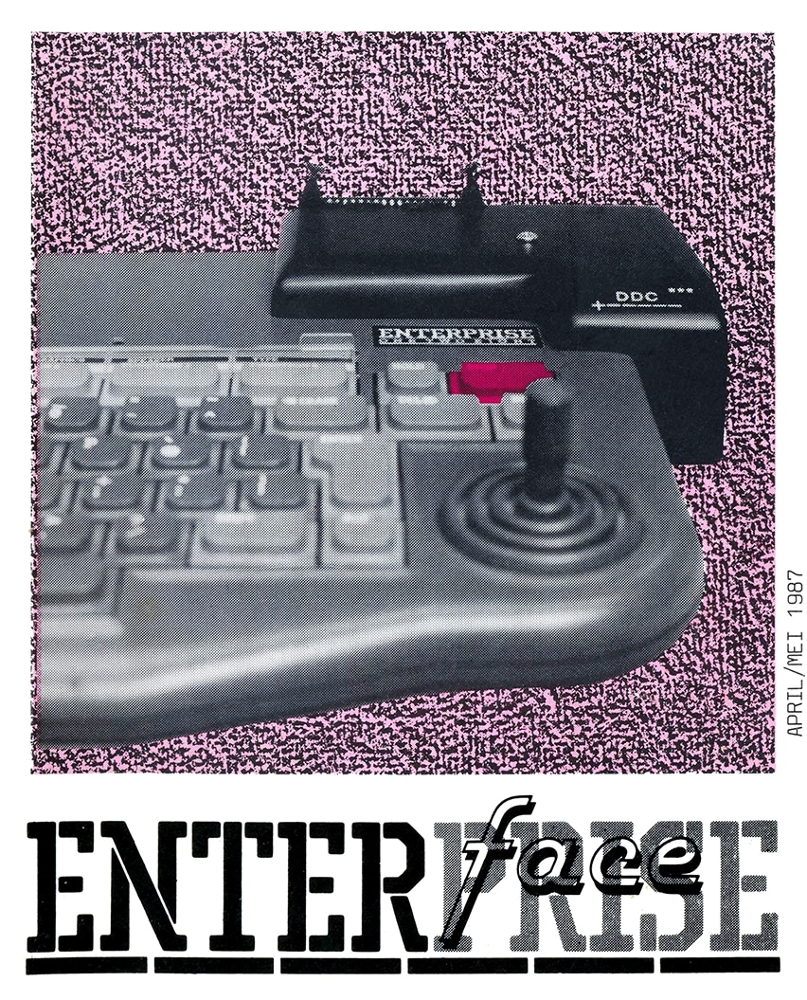 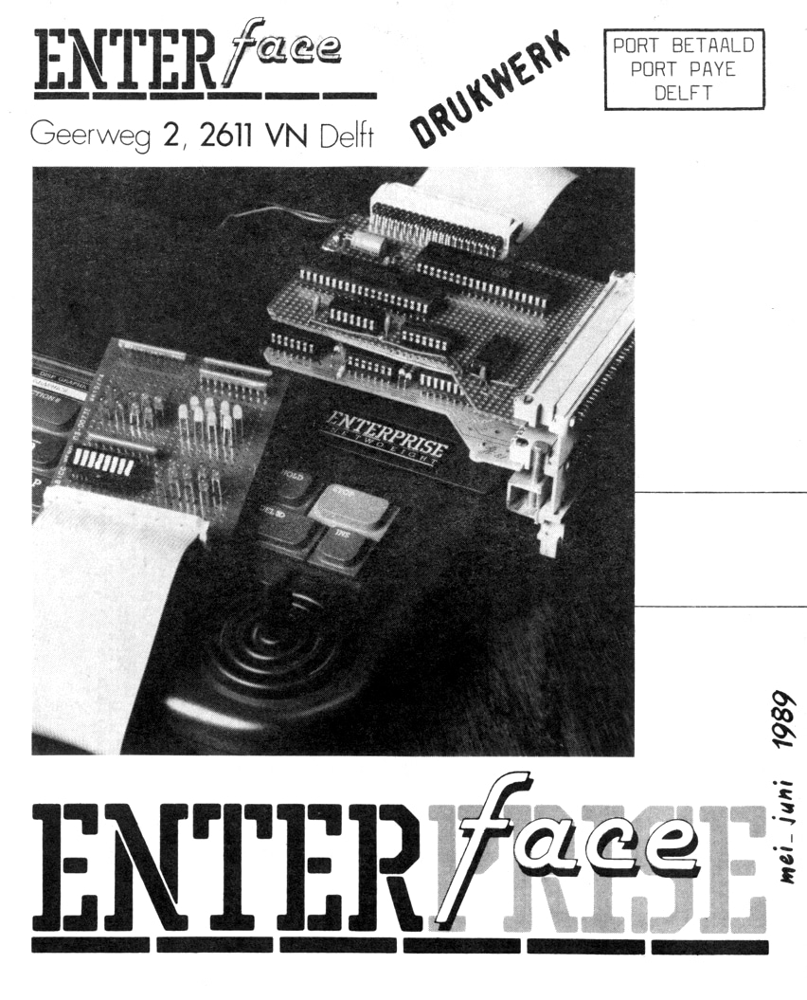 
> 
> Цікава деталь — алюмінієвий трубчастий профіль всередині роз'єму розширення. Він підтримує конструкцію, а також слугує радіатором охолодження для 5-вольтового стабілізатора напруги.
> 
> Вони використовували 3-міліметровий варіант роз'єму "[DIN 41612](https://uk.wikipedia.org/wiki/DIN_41612)". Одна частина була припаяна безпосередньо до порту розширення, що забезпечувало дуже міцне з'єднання.
> 
> У своєму [MINIBUS](../hardware/system-bus/hb-minibus.md) / [Motherboard Expansion Bus](../hardware/system-bus/hb-mb-exp-bus.md) я також використовував цей тип роз'єму, але з 5-міліметровою відстанню між двома рядами. Ці роз'єми ідеально підходять для шини розширення ENTERPRISE, оскільки мають 64 контакти (2 ряди по 32 контакти) і дуже якісно сконструйовані.

 
 
 
 
 
 
 
 
 
 
 

----

[(оригінал повідомлення)](https://enterpriseforever.com/hall-of-fame/qa-with-werner-lindner-technical-director-of-the-enterprise-computers-gmbh/msg45551/#msg45551)

> **Werner Lindner**: Ви, ймовірно, знаєте про дисковод [EXDOS/Floppy-Station](../hardware/hd-diskettenstation-35.md) ("Diskettengrundeinheit"), який продавався в Німеччині. У нас був прототип для додаткового дисковода, що встановлювався поверх першого, і я додаю кілька його фотографій. Це дійсно єдиний у своєму роді екземпляр. Він ніколи не випускався і не продавався ні в Німеччині, ні деінде. Навіть один дисковод з його металевим корпусом та великим імпульсним блоком живлення вже був занадто дорогим. Його замовила перша команда продажів ENTERPRISE у 1986 році, а загальна кількість випущених дисководів становила лише близько 600 штук. На самому початку він продавався за ціною 698,00 німецьких марок (DEM) з урахуванням ПДВ. За такою ціною ніхто не був зацікавлений у купівлі другого дисковода.
> 
> Прототип трохи постраждав від того, що зберігався в моєму підвалі щонайменше 25 років, але обидва дисководи досі працюють. За допомогою роз'єму на задній панелі другого дисковода можна підключати додаткові накопичувачі. У нас було два подвійних 3.5-дюймових дисководи **Cumana**, і в нашому офісі в Мюнхені ми демонстрували ENTERPRISE із чотирма підключеними дисководами.

 
 
 
 
 
 

----

[(оригінал повідомлення)](https://enterpriseforever.com/hall-of-fame/qa-with-werner-lindner-technical-director-of-the-enterprise-computers-gmbh/msg45554/#msg45554)

**Zozosoft:** Для їхнього створення розбирали вже існуючі карти EXDOS чи використовували залишки плат EXDOS?

Одинарні дисководи існували лише у версії 3.5" чи випускалися також і з 5.25" приводами?

> **Werner Lindner**: Німецькі [Floppy-Disk-Station](../hardware/hd-diskettenstation-35.md) вироблялися в Німеччині. З Англії постачалися такі деталі: готові [мости системної шини](../hardware/system-bus/hb-bus-bridge.md), запаковані в поліетиленові пакети, та голі [EXDOS-контролери](../hardware/hd-exdos.md) без мікросхем ПЗП (без корпусів, просто плати, запаковані в коробки та індивідуальні пакети). Німецький виробник брав ці деталі й монтував їх у корпус разом із блоком живлення та самим приводом дисковода. Він мав майстер-копію EXDOS 1.3 і сам прошивав мікросхеми EPROM.
> 
> Пристроїв із приводами 5.25" у продажу не було, такий привід мав лише той самий прототип. Усі інші станції комплектувалися чорними 3.5" приводами від BASF. Причина, чому контролер живився від комп'ютера, була простою: наявні мости системної шини, які доводилося використовувати (з міркувань економії), уже мали стабілізатор напруги й подавали 5 В на контролер. Тому від вбудованого блока живлення живився лише сам привід.
> 
> Оскільки з цими EXDOS-контролерами не постачалося жодних інструкцій, [німецьке представництво ENTERPRISE](../companies/enterprise-computers-gmbh.md) опинилося в скрутному становищі: вони нашвидкуруч зробили переклад оригінального посібника і просто розмножили його на ксероксі. Деякі з цих фотокопій були дуже поганої якості. Посібник до [IS-DOS](../software/ss-is-dos.md) на початках мав такий самий розмір і таку ж якість. Німецькі посібники у форматі А4 з'явилися пізніше, коли команда в [ENTERPRISE Germany](../companies/enterprise-computers-gmbh.md) вже змінилася. Наскільки я пам'ятаю, саме [Міхаель Леопольдседер](../peoples/ec-de/pers-michael-leopoldseder.md) (який пізніше написав софт для жорсткого диска) та я знову переклали оригінальні інструкції. Переклад робився на комп'ютері ENTERPRISE у програмі Wordstar 3.0. Я досі маю оригінальні файли у своїх резервних копіях.
> 
> Усі [EXDOS-контролери](../hardware/hd-exdos.md), які продавалися в Німеччині, надходили з Англії у вигляді комплектів деталей. Ці контролери не мали поролонового та/або картонного пакування. Ба більше, на них також була відсутня мікросхема EXDOS EPROM. Виробник дисководних станцій доукомплектовував їх мікросхемою ПЗП, поміщав у корпус і заново все пакував. Саме з цієї причини в Німеччині не було EXDOS-контролерів в оригінальній заводській упаковці. Ви можете легко впізнати ці контролери німецької збірки, оскільки на них на всіх відсутня кольорова наліпка "EXDOS" зверху.

----

[(оригінал повідомлення)](https://enterpriseforever.com/hall-of-fame/qa-with-werner-lindner-technical-director-of-the-enterprise-computers-gmbh/msg45823/#msg45823)

**Zozosoft**: Німецька брошура, яку ми ніколи раніше не бачили: Вона містить фотографію німецької [Floppy Station](../hardware/hd-diskettenstation-35.md), але придивіться ближче: вона з іншим приводом, а не зі звичайним дисководом BASF. Також відсутня кришка слота від [моста системної шини](../hardware/system-bus/hb-bus-bridge.md). Думаю, це один із ранніх прототипів.

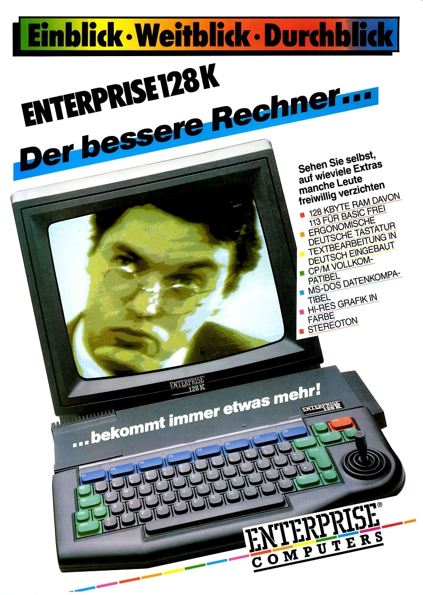 
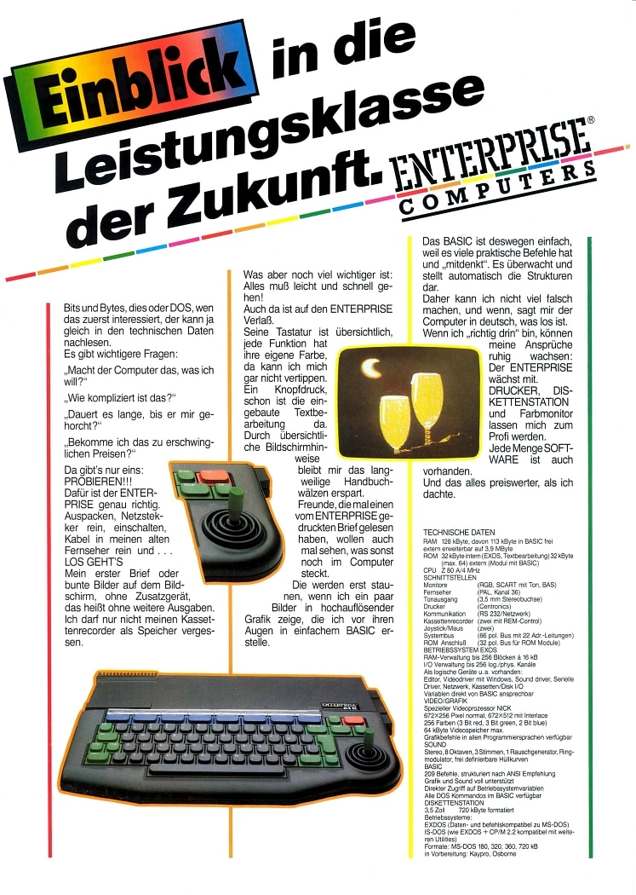 
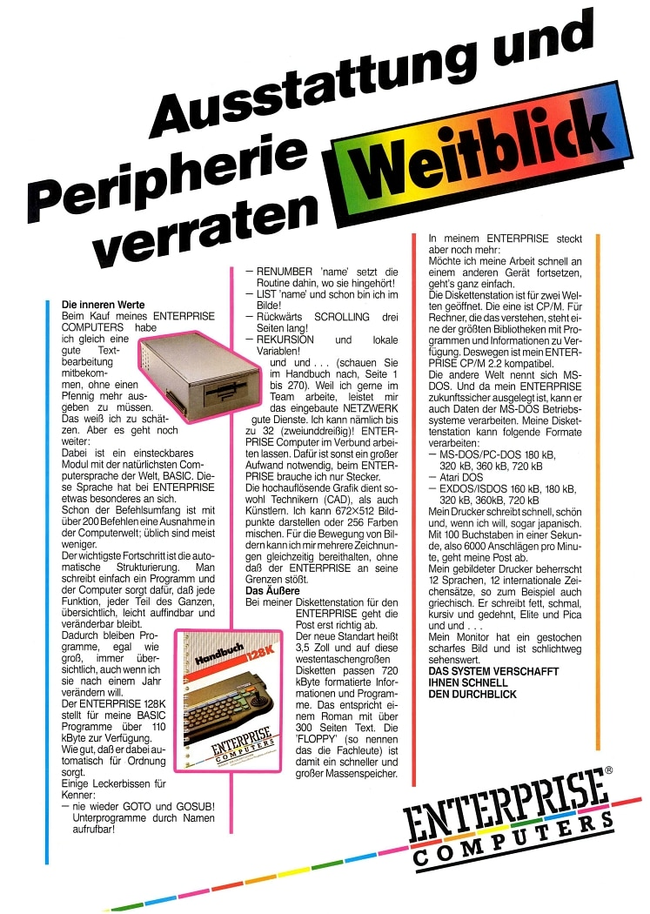 
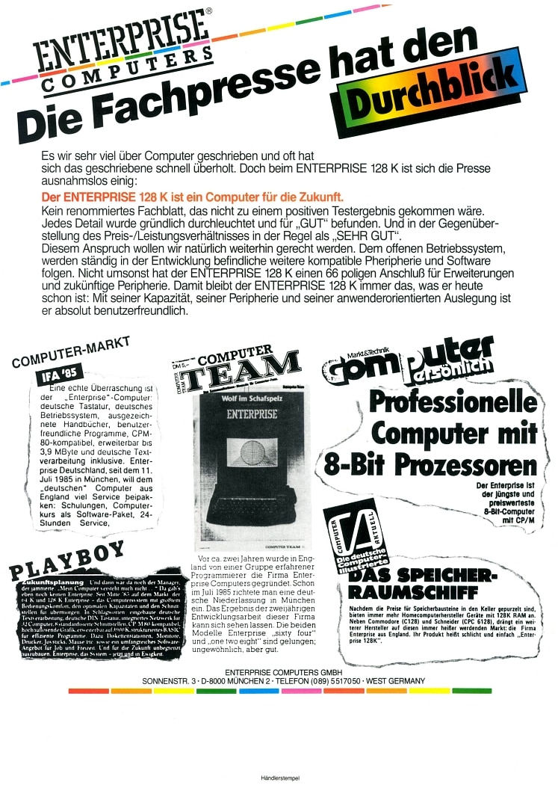 

> **Werner Lindner**: Привід у німецькій брошурі — це Mitsubishi MF-353-12M, я маю один із таких дисководів і зроблю для вас кілька фотографій.

----

[(оригінал повідомлення)](https://enterpriseforever.com/hall-of-fame/qa-with-werner-lindner-technical-director-of-the-enterprise-computers-gmbh/msg45891/#msg45891)

> **Werner Lindner**: Це мій саморобний подвійний дисковод FDD, зібраний з OEM-дисководів та OEM-корпусів, які я купив за дуже низькою ціною в одному з магазинів електроніки в Мюнхені. Мені так і не вдалося з'ясувати, хто початково їх виготовляв чи продавав, але самі дисководи виробництва **EPSON**. Я зробив для них зовнішній блок живлення (12В/5В) і використовував їх протягом кількох років зі своїм власним ENTERPRISE 128k.

 
 
 

----

[Наступна сторінка: прототип MIDI-картріджа](qa-werner-lindner5.md)
