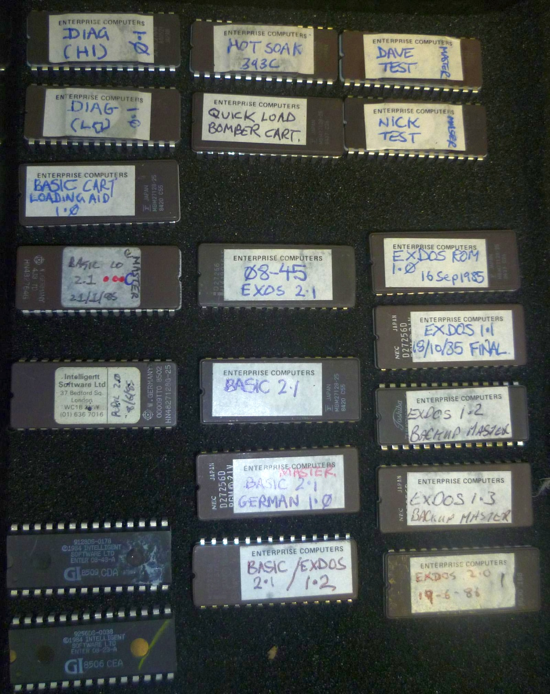
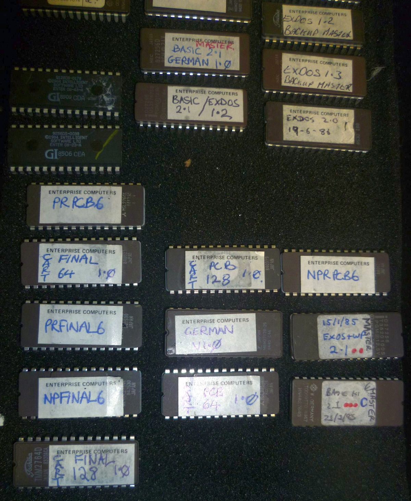
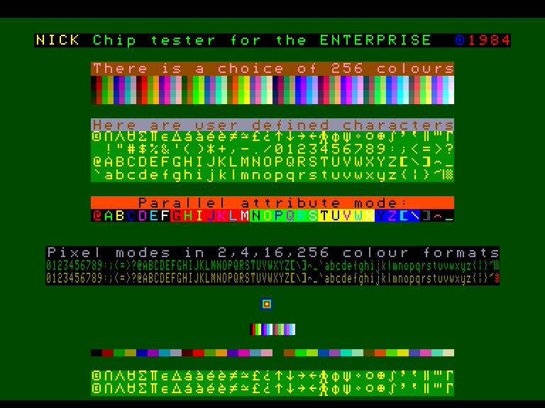
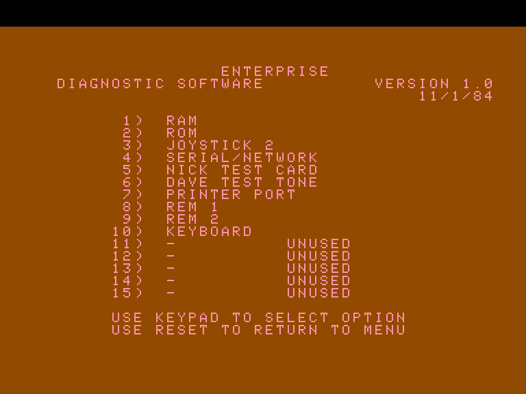
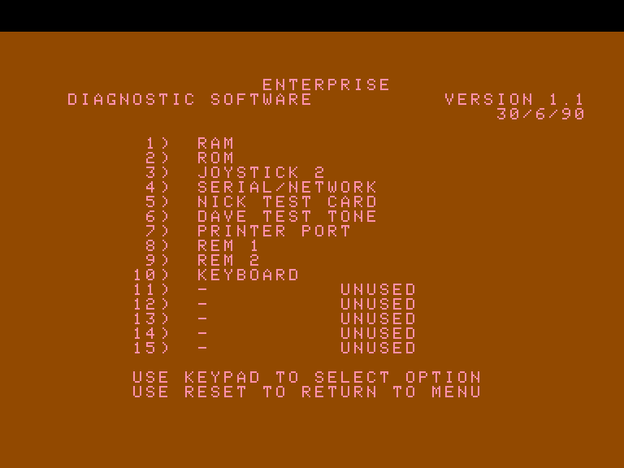
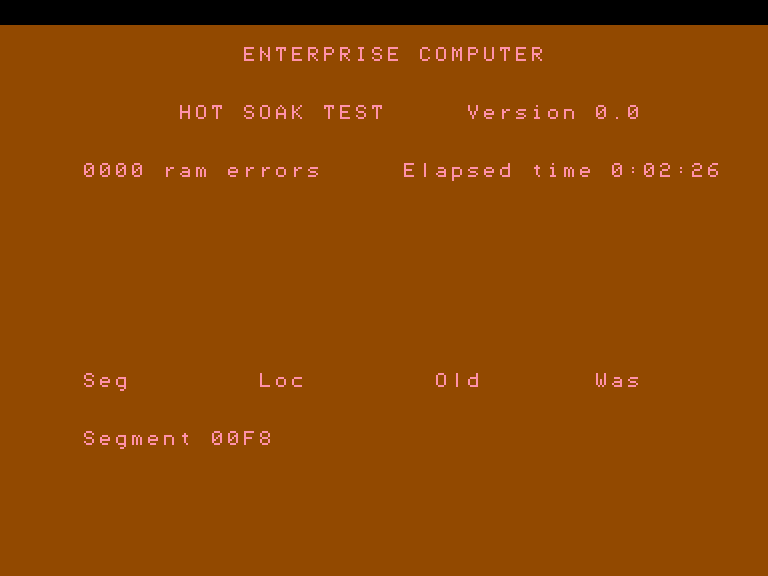
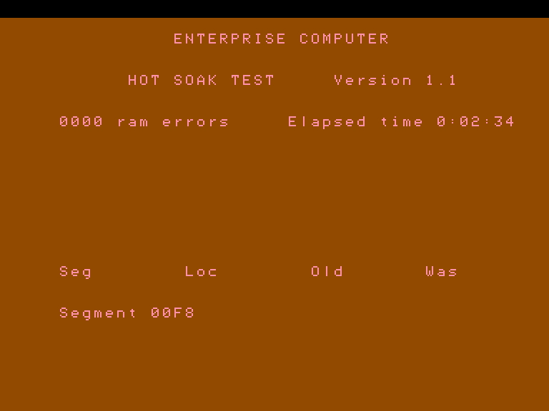
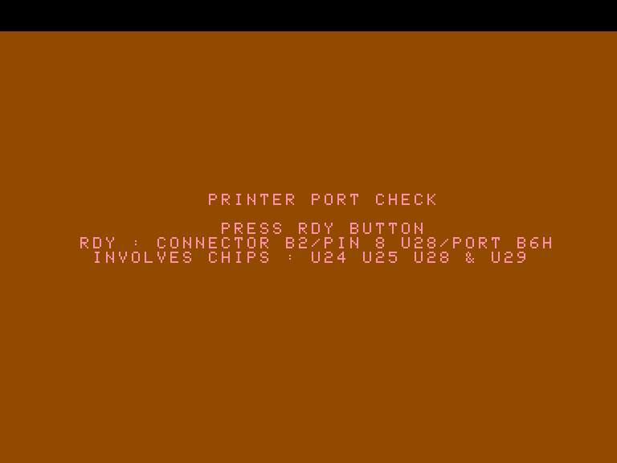
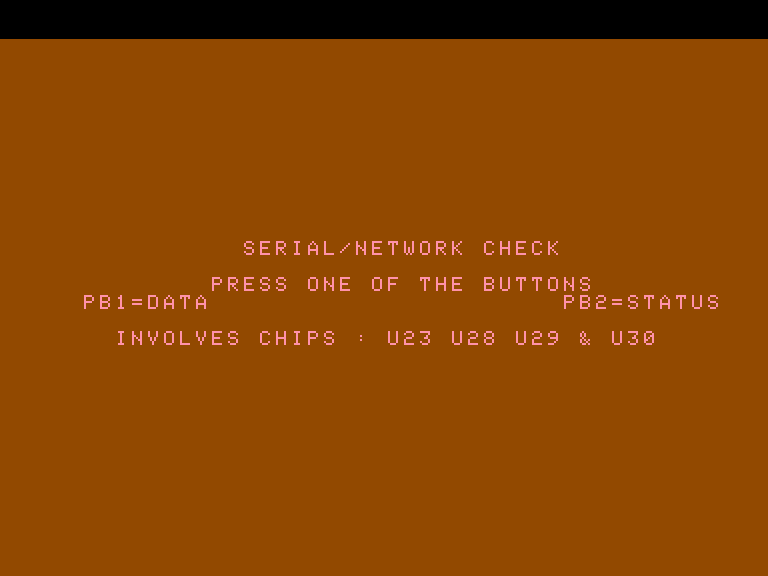

# Прошивки ПЗП

[(оригінал повідомлення)](https://enterpriseforever.com/hall-of-fame/qa-with-werner-lindner-technical-director-of-the-enterprise-computers-gmbh/msg45556/#msg45556)

> **Werner Lindner**:  Фотографії моєї колекції оригінальних еталонних ROM для ENTERPRISE з колишнього офісу [ENTERPRISE UK Ltd.](../companies/enterprise-computers-ltd.md) Німецьке ПЗП — одне з них, і ми отримали цю колекцію разом із іншим майном наприкінці 1986 року.

 
 

----

[(оригінал повідомлення)](https://enterpriseforever.com/hall-of-fame/qa-with-werner-lindner-technical-director-of-the-enterprise-computers-gmbh/msg45558/#msg45558)

**Tuby128**: Для чого саме використовуються мікросхеми EPROM із назвами "Dave test" та "Nick test"?

**Zozosoft**: Я думаю, що їх використовували на фабриці для перевірки комп'ютерів. Десь я читав статтю про те, що компанія EP витратила купу грошей на контроль якості, і всі машини проходили тестування на заводі. Я попросив Вернера зробити дампи цих EPROM.

----

[(оригінал повідомлення)](https://enterpriseforever.com/hall-of-fame/qa-with-werner-lindner-technical-director-of-the-enterprise-computers-gmbh/msg45950/#msg45950)

**Zozosoft**: Кілька діагностичних ПЗП із колекції ROM-ів Вернера. Вони використовувалися як `TEST_ROM` у сегменті `04h` картриджа.

DAVETEST: генерує тестовий звук.  
NICKTEST: виводить тестову картинку.  
DIAG 1.0 та 1.1: використовувалися на фабриці для тестування плат. Для керування меню застосовувалася 15-клавішна панель, яка підключалася до порту Control 1 (використовувалися всі можливі 15 кнопок на одному джойстик-порту Enterprise!). Деякі тести можна було запустити й за допомогою звичайного джойстика в порту Ext 1.
 
Для тестування периферійних портів потрібна була додаткова комутація дротів для зациклення вхідних/вихідних сигналів.  
Версії 1.0 та 1.1 ідентичні, змінено лише дату та номер версії.

> **Werner Lindner**: Програмне забезпечення для тестових стендів призначалося для Hypertone-Testgears. Ці стенди використовувалися для перевірки готових до роботи материнських плат комп'ютера, але ще не для повністю зібраного пристрою. Оскільки рідна клавіатура Enterprise підключалася вручну на пізнішому етапі збирання, до одного з джойстик-портів під'єднували маленьку клавіатуру, щоб мати змогу вводити команди. Жодної інформації про неї я не маю.

  
 
 
 
 
 
 

----

[(оригінал повідомлення)](https://enterpriseforever.com/hall-of-fame/qa-with-werner-lindner-technical-director-of-the-enterprise-computers-gmbh/msg45951/#msg45951)

**Zozosoft**: Ще кілька тестових ПЗП (Cart-Pcb64.rom, Cart-Pcb128.rom, Cart-Final64.rom, Cart-Final128.rom). Ймовірно, для якогось автоматичного тестування? Треба з'ясувати, що саме підключається до комп'ютера.

Воно перевіряє, чи заповнений сегмент `FCh` значеннями `55h`? Якщо ні, то заповнює його і чекає на перезавантаження (скидання). Якщо з `FCh` усе гаразд, далі перевіряється, чи сигнал Printer Strobe з'єднаний із сигналом Ready? Наступні частини коду ще належить розібрати...

Версії «Final 64» та «Final 128» ідентичні, різниця лише в обсязі оперативної пам'яті, що тестується. У нефінальних версіях відмінностей більше: схоже, нефінальна версія «128» була зроблена на основі пізнішої (але теж нефінальної) версії «64».

----

[(оригінал повідомлення)](https://enterpriseforever.com/hall-of-fame/qa-with-werner-lindner-technical-director-of-the-enterprise-computers-gmbh/msg45952/#msg45952)

**Zozosoft**: Щодо цього я не маю жодних ідей (NPRPCB6, PRPCB6, NPFINAL6, PRFINAL6).

Це не схоже на код Z80. Можливо, це ПЗП для самого тестового стенда? Або ПЗП з даними для попередніх тестових ромів?

----

[(оригінал повідомлення)](https://enterpriseforever.com/hall-of-fame/qa-with-werner-lindner-technical-director-of-the-enterprise-computers-gmbh/msg45954/#msg45954)

**Zozosoft**: Тут є програми для картриджів із цікавими назвами: «BASIC CART LOADING AID 1.0» та «QUICK LOAD BOMBER CART».

Це невелика програма, створена для завантаження BASIC-програм із ПЗП. Вона створює новий системний пристрій EXOS, який можна використовувати для завантаження.

У випадку з «LOADING AID» назва пристрою — `ROM:`. Тож ви використовуєте команду `LOAD "ROM:"`, і вона завантажує лише маленький приклад програми.

Для «BOMBER» використовується команда `LOAD "BOM:"`, яка завантажує добре відому гру «Bomber» із демонстраційної касети.

----

[(оригінал повідомлення)](https://enterpriseforever.com/hall-of-fame/qa-with-werner-lindner-technical-director-of-the-enterprise-computers-gmbh/msg46038/#msg46038)

> **Werner Lindner**: Я розробив схему тестового блоку "Test-Unit-II", який повністю сумісний із тестовим стендом Hypertone у тому, що стосується перевірки плат за допомогою картриджів. У додатку ви знайдете принципові схеми та мій дизайн плати 1992 року. Для підключення цього тестового блоку до ENTERPRISE вам знадобляться кабелі, але в усьому іншому він має працювати точнісінько як оригінальний блок введення/виведення (I/O-Unit) від Hypertone.

