# Кирилична версія для шкіл

[(оригінал повідомлення)](https://enterpriseforever.com/hall-of-fame/qa-with-werner-lindner-technical-director-of-the-enterprise-computers-gmbh/msg46220/#msg46220)

> **Werner Lindner**: Історія з кириличним картриджем особлива. Хоча повну версію я розповім вам пізніше, зараз можу сказати, що нам довелося зробити його менш ніж за 5 місяців. На початку літа 1989 року в Будапешті проходила комп'ютерна (або технічна) виставка. Ми з [Вілмошем](../peoples/pers_vilmos-kopacsy.md) брали в ній участь зі своїми продуктами, і там на нас вийшла компанія під назвою [Olympiatrade](../companies/olympiatrade.md). Вони запитали про можливість експорту комп'ютерів Enterprise до країн тодішнього СРСР. Вони привели до нас делегацію з Міністерства освіти Казахстану, і ці люди шукали шкільні комп'ютери для навчання комп'ютерної грамотності. Вони були в захваті від Enterprise, особливо тому, що один комп'ютер із зеленим монітором коштував усього близько 500 німецьких марок (DEM) — замість приблизно 2700 марок, які на той час просили за IBM-сумісний клон XT з Далекого Сходу.
> 
> Ми запросили делегацію до Мюнхена (вони приїхали восени 1989 року), хоча в нас ще не було готової російської версії машин. Робота над кириличним картриджем розпочалася негайно. Оскільки часу на розробку нової друкованої плати для картриджа не було, ми взяли вже існуючу плату на три слоти з Угорщини. [Вілмош](../peoples/pers_vilmos-kopacsy.md) створив першу версію кириличного драйвера клавіатури/принтера, а також були розроблені самоклеючі наліпки на клавіші. Демонстраційні машини закінчили збирати в ніч перед приїздом міністра до Мюнхена (пам'ятаю, ми з [Вілмошем](../peoples/pers_vilmos-kopacsy.md) пішли з офісу близько 4:00 ранку, щоб поспати годину-другу, а потім повернутися і зустріти делегацію). У мене є купа фотографій з тих часів, але досі не було часу їх відсканувати.

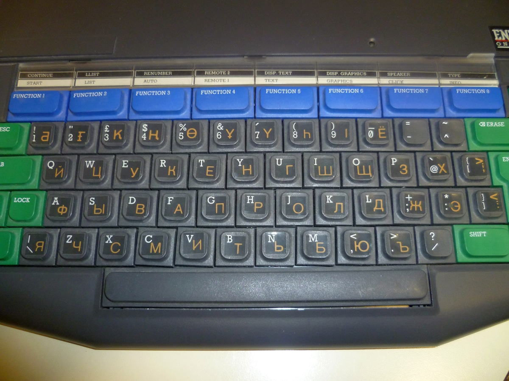 
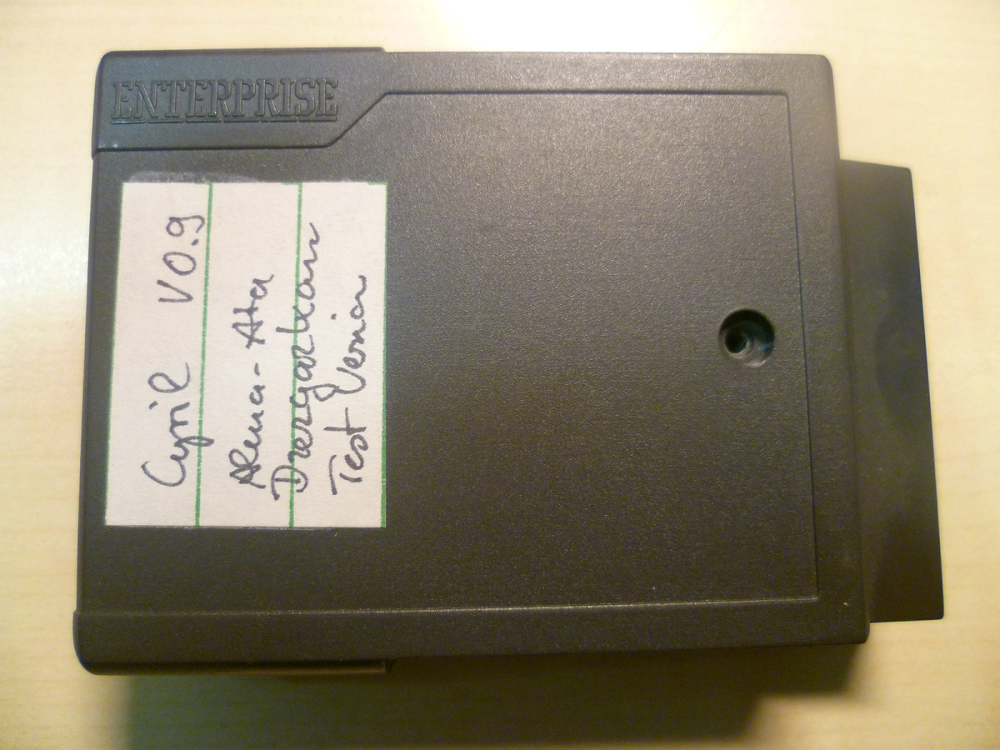 
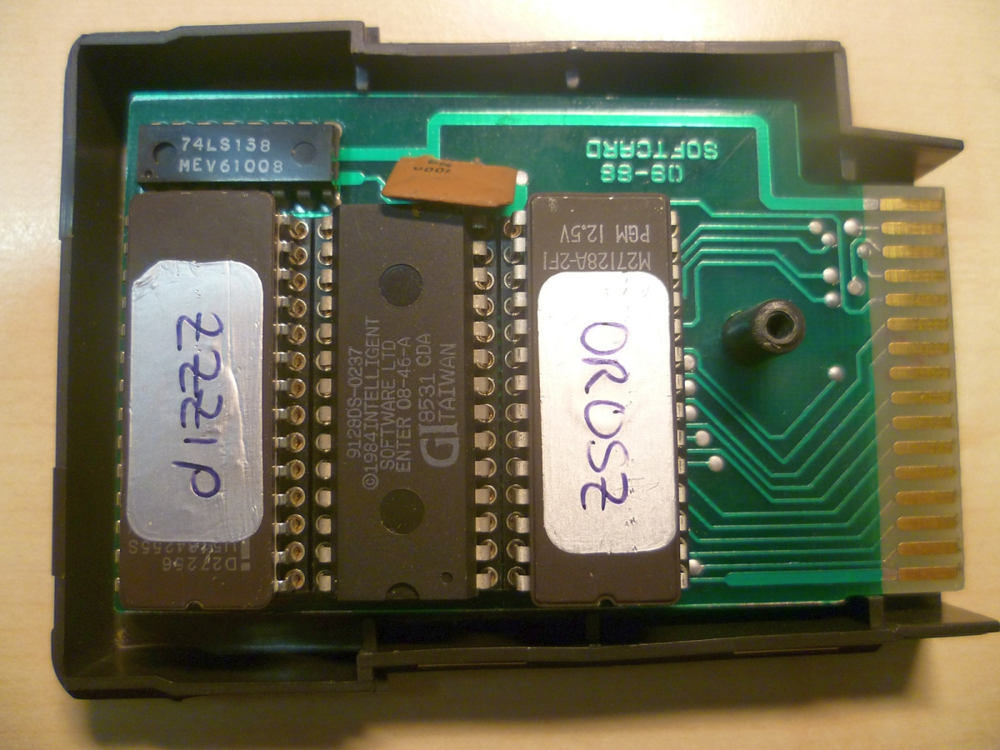 

> Делегація була вражена, але попросила додати специфічні казахські символи (ви можете побачити їх у першому ряду клавіатури на фотографіях). Ми пообіцяли, що зможемо це зробити, і завдяки цьому вони підписали контракт на дві демонстраційні мережі для Алмати. Встановлення мало відбутися незабаром (тобто до кінця 1989 року). Нам дійсно довелося викластися на повну, щоб встигнути до цього терміну. Обладнання (стандартні немодифіковані машини зі складу в Мюнхені) негайно відправили авіафрахтом, а ми з [Вілмошем](../peoples/pers_vilmos-kopacsy.md) полетіли до Алмати наприкінці листопада, де й залишалися до 23 грудня. Програмне забезпечення для перших двох мереж було готове десь 17–18 грудня, і ми тестували комп'ютери та мережі прямо в готельних номерах, які слугували нам "офісом" та "лабораторією". Ми вилетіли назад 23–24 грудня, але наш літак затримався, і 24 грудня вже не було жодного рейсу з Москви до Будапешта. Нам довелося провести Різдво в московському аеропорту, і ми вилетіли до Будапешта лише 25 грудня, де на мене чекала моя машина.
> 
> Як ви вже помітили, кириличні прошивки (ROM) мають деякі особливості:
> 
> - Нам довелося перевести всі доступні системні повідомлення та коди помилок у ВЕРХНІЙ РЕГІСТР через відсутність малих латинських літер у кириличному режимі.
> - Ми вирішили присвоїти номер [версії 2.2](../software/exos/exos-versions.md) усім прошивкам цих машин, просто щоб мати окремі версії для кириличних комп'ютерів.
> - Компілятор [ZZZIP](../programming/zzzip-compiler.md) був лише на демонстраційних картриджах для Мюнхена. Комп'ютери в Алмати мали лише картридж на два слоти з BASIC 2.2 та прошивкою PUPIL/TEACHER ("Учень/Учитель") всередині.
> - EXOS137 та EXOS 138 — це версії [EXOS](../software/ss-exos.md) для шкіл №137 та №138 (школи в Алмати на той час не мали назв, лише номери). Ці дві школи й отримали демонстраційні мережі. Причини створення цих специфічних прошивок EXOS я вже згадати не можу.
> 
> Усі інші дивацтва (екрани допомоги Help-Screens тощо) — це просто результат неймовірно стислих термінів, у які нам довелося все це створювати. У червні-липні в нас не було нічого, а в грудні того ж року ми вже мали дві робочі комп'ютерні мережі з кирилично-казахською клавіатурою, драйвером принтера та текстовим процесором. І все це відбувалося приблизно за 4950 км від Мюнхена/Будапешта в часи, коли Перебудові та Гласності було всього 4 роки. Тоді не було ні інтернету, ні електронної пошти, а зв'язок підтримувався через телекс/телетекс, факс або телефон. Прямих авіарейсів не існувало, оформлення візи займало близько 4 тижнів, і все було надзвичайно складно — справжня пригода.
> 
> У березні 1990 року ми були в Москві, щоб обговорити можливе виробництво комп'ютерів Enterprise в СРСР (тоді ми вели переговори з ASI Computers, далекосхідно-російським спільним підприємством). Там ми зустрілися з [Алєксандром Пєрєвозчіковим](../peoples/tm/pers-alexandr-perevozchikov.md) з журналу «[Техника – молодёжи](../companies/tehnika-molodezhi.md)». Трохи пізніше цей журнал отримав від нас партію комп'ютерів, програм, принтерів та моніторів. Люди з [Olympiatrade](../companies/olympiatrade.md) займалися всіма зустрічами в Москві, а також організовували логістику та платежі.
> 
> У ті часи продати щось у ці країни за тверду валюту було майже неможливо. Все робилося за бартерними контрактами, тобто товар в обмін на товар. Таким компаніям, як [EC GmbH](../companies/enterprise-computers-gmbh.md), завжди потрібен був посередник, який офіційно проводив угоду в обох напрямках. Наприклад, комбінат у Джезказгані (Казахстан) розрахувався за свої комп'ютери міддю. Вони постачали мідь, ми — комп'ютери. Оскільки ми самі не могли продавати мідь на сировинній біржі, [Olympiatrade](../companies/olympiatrade.md) брала весь цей процес на себе, а ми вже отримували від них гроші.

<div style="text-align:center;">
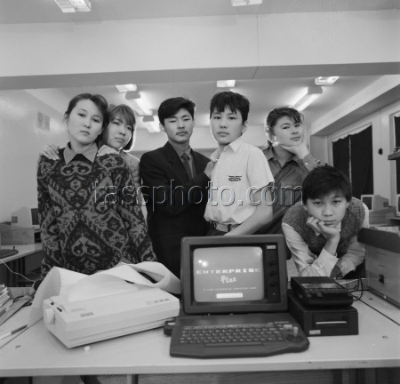
<br>
<i>Компю'терний клас у школі №138 м. Алма-Ати (29.01.1990)</i>
</div>

----

[(оригінал повідомлення)](https://enterpriseforever.com/hall-of-fame/qa-with-werner-lindner-technical-director-of-the-enterprise-computers-gmbh/msg46221/#msg46221)

**Zozosoft**: Мої знахідки щодо образів ПЗП (ROMs) i що мені вже вдалося з'ясувати:

Тут використовуються «фейкові» версії 2.2 для [EXOS](../software/ss-exos.md), [BASIC](../programming/is-basic.md) та [EXDOS](../software/ss-exdos.md). Головна модифікація в них полягає в тому, що всі повідомлення переведені у ВЕРХНІЙ РЕГІСТР. Завдяки цьому вони коректно відображаються і в кириличному режимі.

[EXOS](../software/ss-exos.md):  
Номер версії змінено лише на екрані тесту пам'яті.

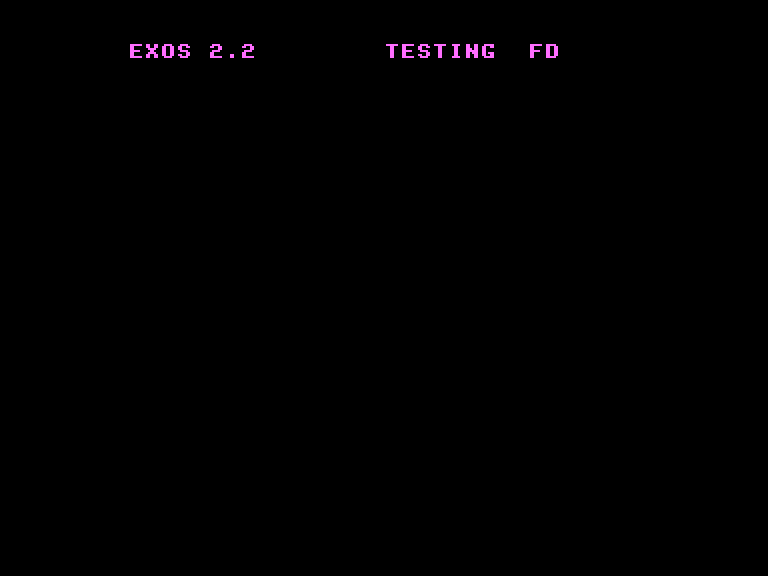 

Якщо подивитися на екран монітора-відладчика ASMON, система все одно рапортує про версію 2.1.

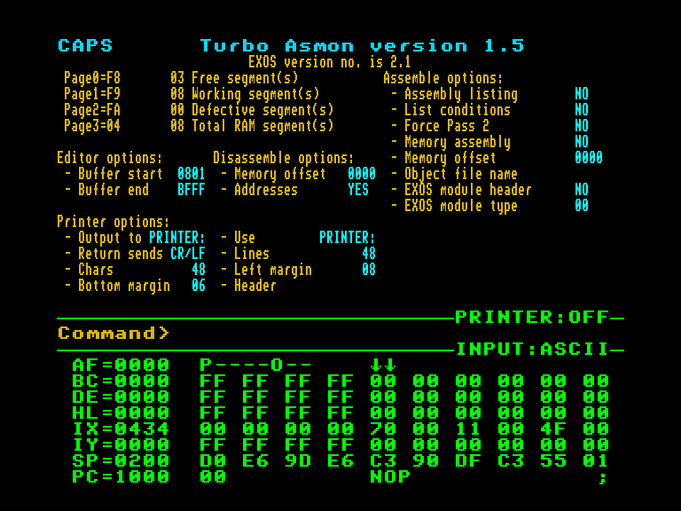 

Через внесені зміни контрольна сума (CRC) ПЗП виявилася неправильною. Замість того, щоб перерахувати коректну CRC, розробники просто вирізали підпрограму її перевірки. Проте, якщо запустити зовнішній тест пам'яті з цими ромами EXOS, система видасть помилку `INTERNAL CHECKSUM ERROR` і зависне.

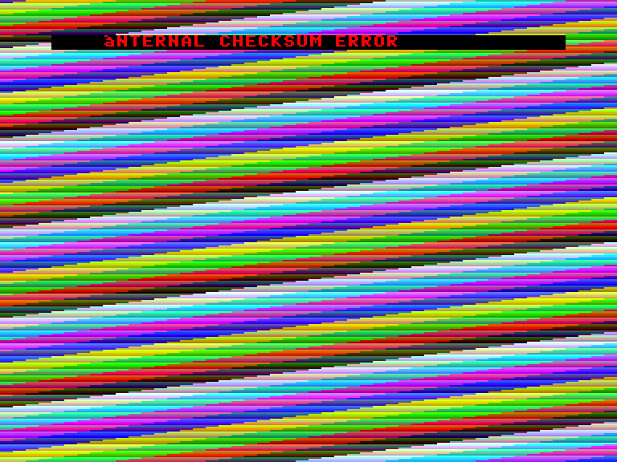 

Ще один байт було змінено в EXOS:

```
;PRE VER COPYRIGHT CHECKING
;SEGMENT 00
;         EXOS 2.1    EXOS 2.2
;0181     031H        032H
;019C     0C9H        НОМЕР ШКОЛИ (YET 089H, 08AH)
```

Замість першого символу повідомлення `INTERNAL CHECKSUM ERROR` тепер зберігається номер школи. Його можна побачити на екрані помилки. Саме цей байт із номером є причиною таких дивних назв файлів, як `EXOS137` та `EXOS138`.

Повідомлення про помилки в самому EXOS не змінювалися, оскільки вони зберігаються в стиснутому форматі.

[BASIC](../programming/is-basic.md):  
Номер версії змінено у списку команд `HELP`. Проте я думаю, що якщо запитати номер версії через системний виклик BASIC, він усе одно видасть 2.1...  
Копірайт змінено на **1989 Enterprise Computers GmbH**.

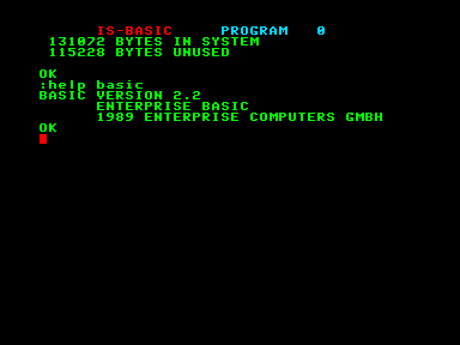 

Деякі тексти в цьому ПЗП переведені у верхній регістр, наприклад, повідомлення `OK` або `bytes in system`. Проте повідомлення про помилки самого BASIC залишилися оригінальними, оскільки вони зберігаються в сегменті `01h` ПЗП EXOS, до того ж у стиснутому вигляді...

[EXDOS](../software/ss-exdos.md):  
Це хакнута версія 1.3, де англійські повідомлення переведені у верхній регістр. Копірайт змінено на **1989 EC GmbH**.

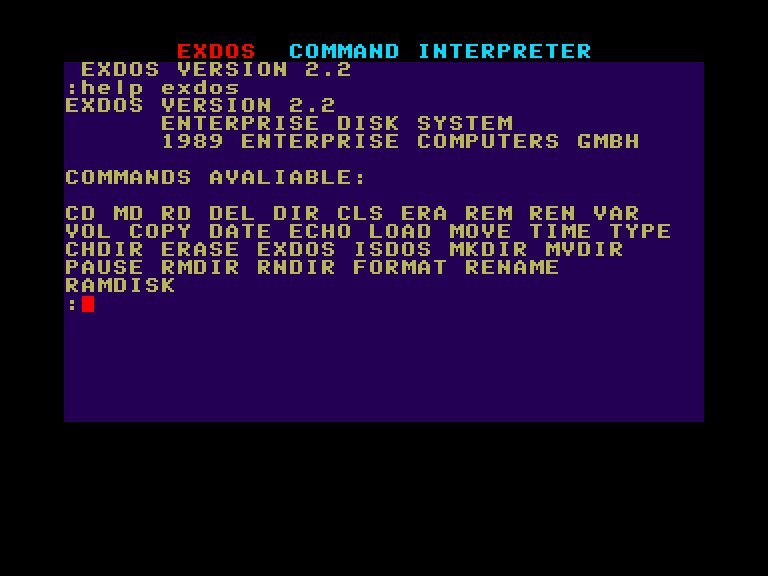 

Кириличний ROM:  
Першим і найбільшим сюрпризом для мене став стартовий екран! Це варіант картриджа [Enterprise Plus](../hardware/cartridge/hc-enterprise-plus.md) від угорської студії [«a» Studió](../companies/a-studio.md). Для порівняння я також зробив скріншоти з оригінальним Plus ROM.

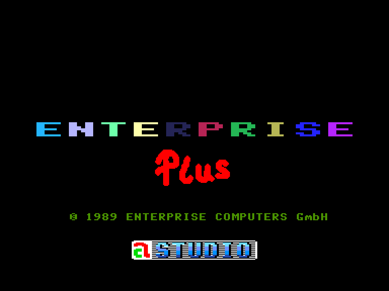 
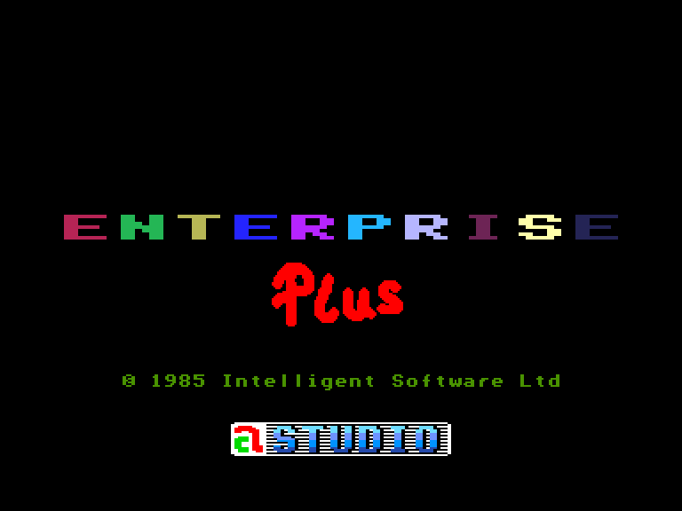 

При запуску кириличний ПЗП (CIRIL ROM) перевіряє модифіковані байти в ПЗП EXOS. Якщо вони відрізняються від очікуваних, з'являється екран `GAME OVER`.

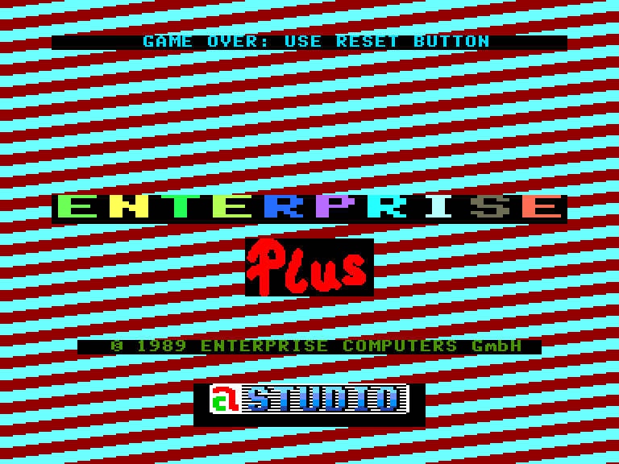 

Якщо порівняти список `HELP` у кириличному ПЗП та у версії PLUS, то у PLUS функцій більше, але в CIRIL описи в `HELP` трохи детальніші.

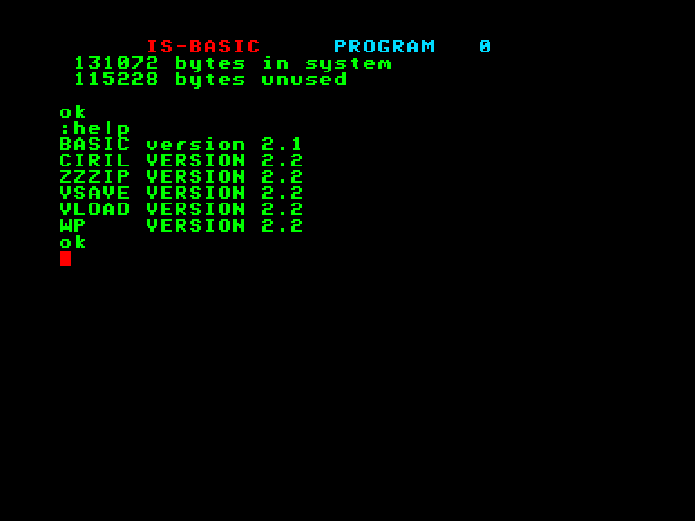 
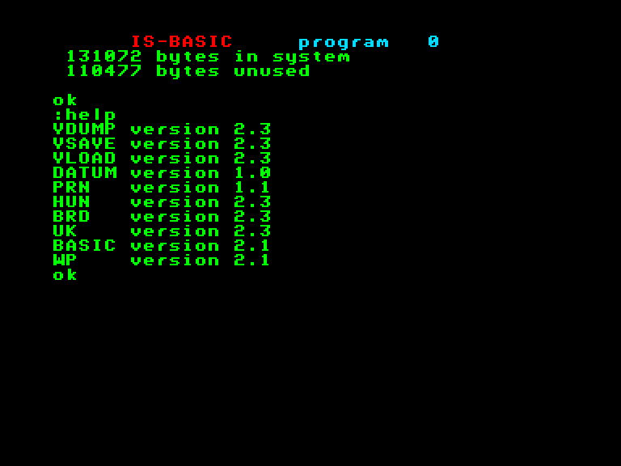 
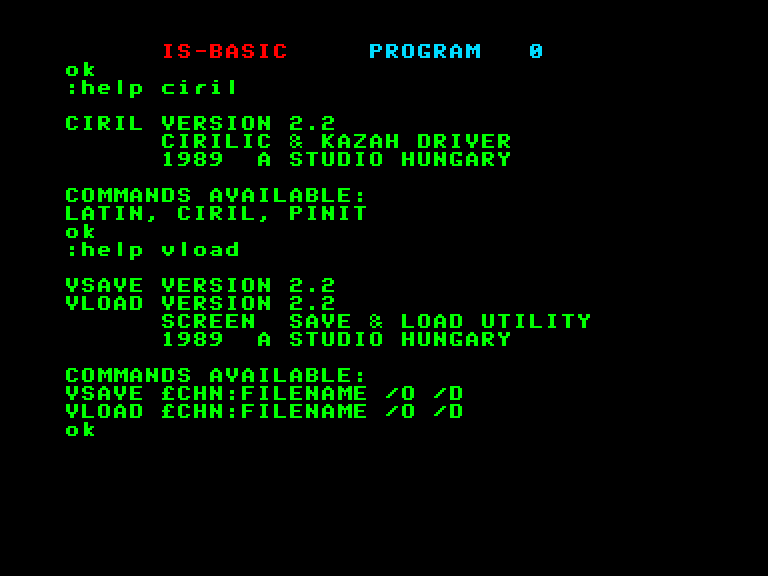 
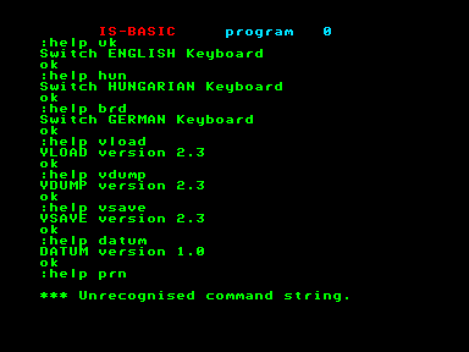 

Обидва розширення містять вбудований текстовий процесор ([WP](../software/st-wp.md)). І це дуже цікавий момент!  
У версії **Plus** він не відображається у списку `HELP` і не запускається автоматично (якщо не стартує інший ROM) — його можна запустити лише командою `WP`.  
У версії **CIRIL** він числиться як `WP 2.2` і може запускатися автоматично при старті системи. Копірайт тут також змінено на **1989 EC GmbH**.

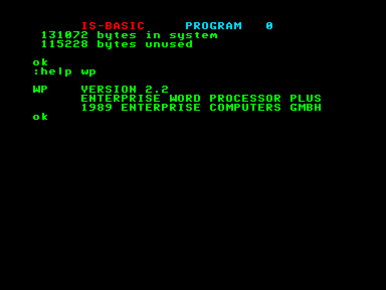 

Найбільший сюрприз чекає при його запуску! Це виявився **Super WP**, просто весь текст у ньому переведено у верхній регістр.

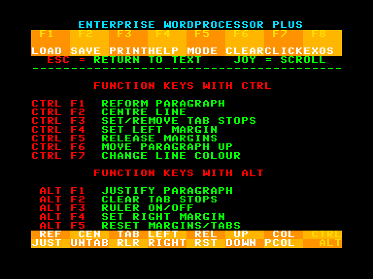 

А ось у **PLUS ROM** текстовий процесор виглядає так само, як і оригінальна версія 2.1. Тільки в статусному рядку написано `WP PLUS`. Проте верхня частина екрана дивна: вона ширша за оригінальну, прямо як у Super WP.

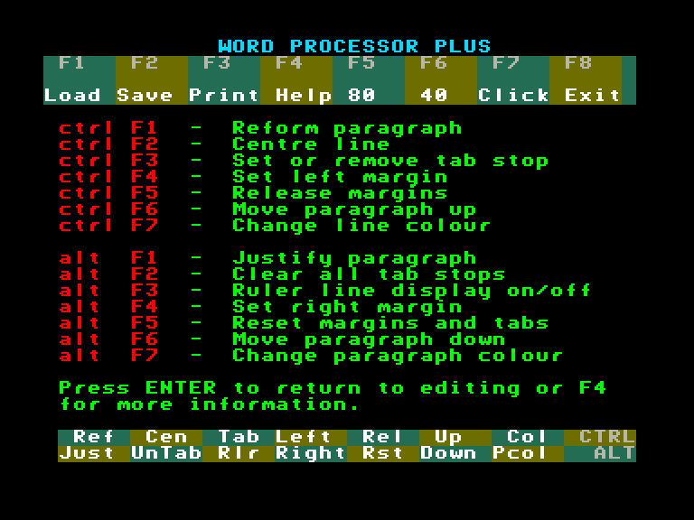 

Я не зміг знайти жодних функціональних відмінностей цієї версії від 2.1... І тут криється найдивніша річ: у посібнику користувача картриджа Plus (Plus Cartridge User Manual) згадується новий, покращений текстовий процесор із функціями принтера, вбудованими безпосередньо в Plus ROM. Але ми цих покращених функцій там не знайшли... Натомість вони є в **Super WP**, який вбудовано в кириличний ПЗП (**CIRIL ROM**)! Дуже дивно, чому його немає у версії Plus.

Повернемося до списку `HELP`: кирилична прошивка (CIRIL ROM) некоректно (нелегально) закриває список `HELP`, щоб запобігти відображенню стандартного `WP 2.1`. Це створює іншу проблему: у повному кириличному картриджі (тому, що ми бачимо на фото) встановлено ще одну мікросхему EPROM із компілятором Бейсіка [ZZZIP](../programming/zzzip-compiler.md). Але через те, що список `HELP` грубо обривається, `ZZZIP` у ньому не відображається. Щоб вирішити цю проблему, розробники вручну додали пункти `HELP` для `ZZZIP` прямо в кириличну прошивку. Доволі «костильне» рішення...

----

[(оригінал повідомлення)](https://enterpriseforever.com/hall-of-fame/qa-with-werner-lindner-technical-director-of-the-enterprise-computers-gmbh/msg45893/#msg45893)

> **Werner Lindner**: Як я вже казав вам раніше, ми виготовили 70 учительських робочих станцій із жорсткими дисками (HDD) для Казахстану та Киргизстану. Учительський комп'ютер являв собою оригінальну модель 64k, оснащену операційною системою EXOS 2.1 та вчительським картриджем (BASIC 2.1, кириличний шрифт, кириличний драйвер принтера). Завдяки 256 КБ статичного ОЗП (SRAM) на платі інтерфейсу машина мала 320 КБ пам'яті. Саме тому ми й зробили ці наліпки. На фото показано останні екземпляри, що дожили до наших днів.

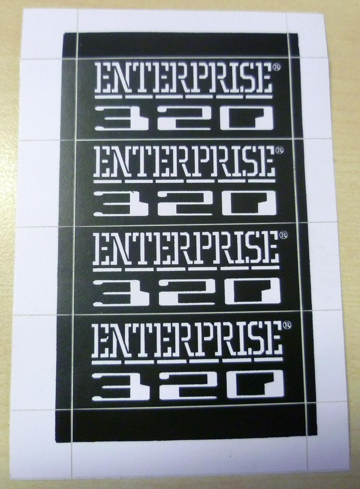 

----

[(оригінал повідомлення)](https://enterpriseforever.com/hall-of-fame/qa-with-werner-lindner-technical-director-of-the-enterprise-computers-gmbh/msg46613/#msg46613)

> **Werner Lindner**: Монітор [N12H](../hardware/monitor/hv-ciaegi-n12h.md) мав монохромну трубку з бурштиновим свіченням (amber) і використовувався як учнівський монітор у всіх шкільних мережах. Усі учнівські комп'ютери були англійськими моделями зі 128 КБ пам'яті.

 
 
 
 
 
 

----

> **Werner Lindner**: Учительські станції в радянських мережах комплектувалися моніторами [CIAEGI M14H](../hardware/monitor/hv-ciaegi-m14h.md) (кольоровий RGB із роз'ємом SCART).

