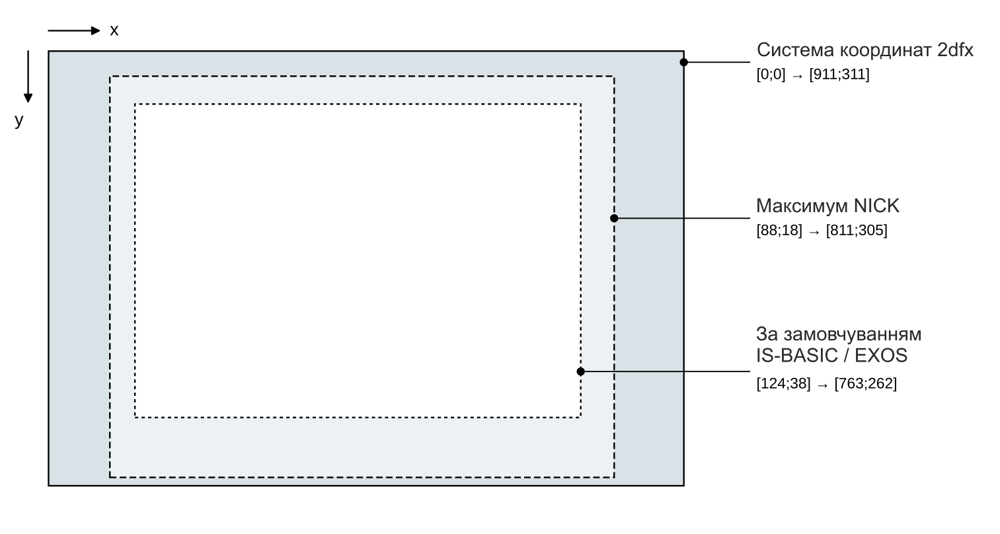
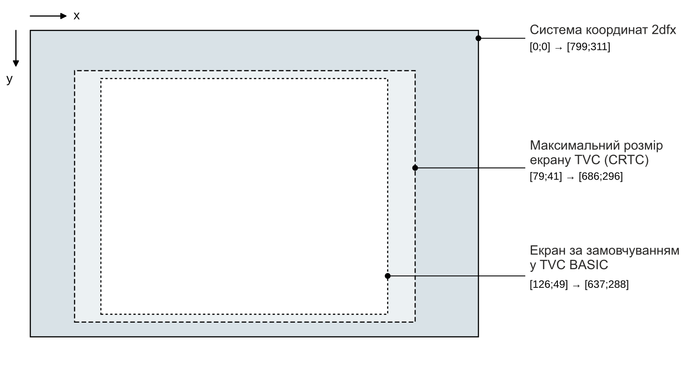
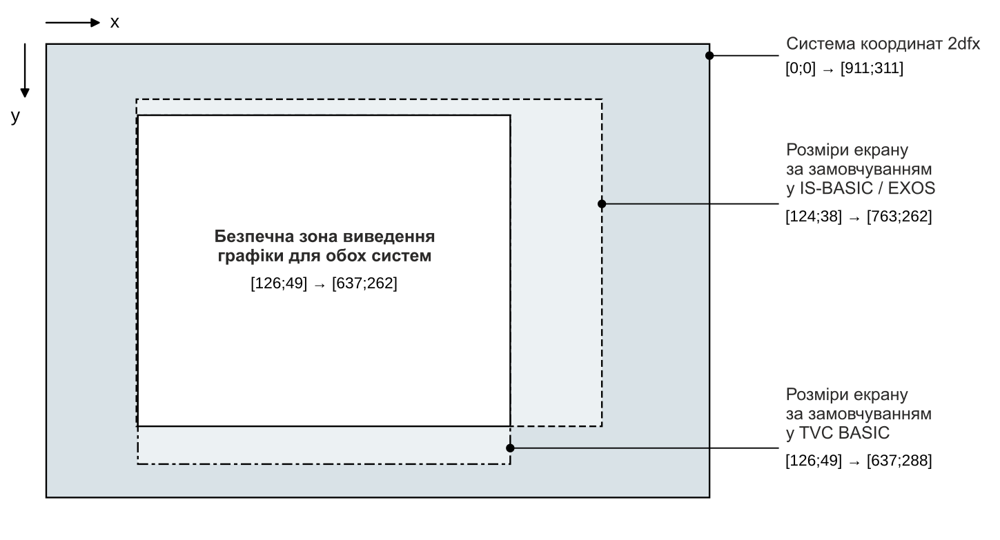

## Геометрія

Графічну систему координат [2dfx](../../hardware/hv-2dfx.md) визначає згадана раніше теоретична кількість пікселів — нагадуємо: для «Enterprise» це **912**×**312**, а для «TVC» — **800**×**312**. Оскільки це охоплює не лише видиму область кадру, ми можемо створювати об'єкти, які частково або повністю розташовані за межами екрана. Це особливо корисно, наприклад, коли ми хочемо плавно ввести спрайт із-за меж видимої області, або коли робимо піксельно точний текстовий скролінг так, що текст починається ще в невидимій частині, а потім виходить з іншого боку.

> Для обох машин важливою геометричною особливістю є те, що пропорція пікселів становить приблизно **2:1** (на «TVC» навіть трохи менше). Якщо ми хочемо побачити на екрані справжній квадрат, то його горизонтальний розмір у пікселях має бути приблизно вдвічі більшим за вертикальний.

Ані «Enterprise», ані «TVC» не повертають інформації про те, у якій роздільній здатності зараз працює екран, яка ширина видимої області, скільки рядків видно або який розмір бордюру. Тому програміст завжди має визначати позицію вмісту, що малюється 2dfx, відповідно до розміру зображення, налаштованого на машині. 2dfx працює на основі власної системи координат, описаної вище.

### Геометрія екрану «Enterprise»

У випадку з «Enterprise» наведена нижче схема демонструє практичну структуру системи координат:

В «Enterprise» розмір та положення видимої області кадру задаються шляхом програмування відеочипа [NICK](../../hardware/hm-nick.md). Найбільша можлива площа екрана відображається в межах координат, вказаних на схемі вище. Якщо не змінювати [LPT](../../programming/system-info/nick/lpt.md) чипа [NICK](../../hardware/hm-nick.md), а використовувати стандартний розмір екрана [EXOS](../../software/ss-exos.md) / [IS-BASIC](../../programming/is-basic.md), то фактично видима частина припадатиме на менший діапазон (див. на схемі). Область за межами цього екрана є частиною бордюру (border); NICK на апаратному рівні не дозволяє перекривати її зовнішніми колірними сигналами.

### Геометрія екрану «Videoton TVC»

Система координат Videoton TVC:

У «Videoton TVC» за таймінги відеопідсистеми відповідає контролер **Motorola 6845 CRTC**. У порівнянні з чипом NICK в «Enterprise» цей мікроконтролер дає скромніші можливості; найбільша видима роздільна здатність «TVC» може становити **608**×**256** пікселів.

У випадку з «TVC» особливо важливо пам'ятати, що повна горизонтальна роздільна здатність через особливості материнської плати досяжна лише в режимі **GRAPHICS 2**. У будь-якому іншому режимі «TVC» зчитує з зовнішніх колірних входів лише кожен другий із теоретичних пікселів і відображає його шириною у два пікселі. [2dfx](../../hardware/hv-2dfx.md) не отримує про це зворотного зв'язку — «TVC» не надає такої інформації, — тому завжди надсилає послідовні пікселі в одному й тому самому темпі. Інтерпретація відображення в такому разі залежить від самого «TVC». Серед Пасхальних яєць є одне, створене спеціально для демонстрації цього апаратного обмеження материнської плати.

Для «TVC» також справджується правило: область за межами видимої частини кадру залишається кольору бордюру. Під час виведення бордюру змінити колір тамтешніх пікселів за допомогою зовнішніх колірних входів неможливо.

### Крос-розробка

Оскільки базові налаштування двох машин відрізняються, під час крос-розробки корисно обирати таку систему координат, яка на обох комп'ютерах потрапляє у видиму область за замовчуванням ([IS-BASIC](../../programming/is-basic.md) або **TVC BASIC**). Хоча з двох попередніх схем можна за мить визначити безпечну область для малювання, куди варто розміщувати графіку, щоб уникнути зайвих обчислень, ось схема безпечної зони:

Також важливо, що при крос-розробці достатньо підготувати графічні елементи, спрайти та бітмапи, які малюються [2dfx](../../hardware/hv-2dfx.md), лише для однієї машини, оскільки 2dfx малюватиме їх абсолютно однаково як на «Enterprise», так і на «TVC», і навпаки. Звернути увагу потрібно фактично лише на налаштування кольорів: на «TVC» фіксовану колірну палітру необхідно відобразити на боці Enterprise шляхом відповідного програмування [NICK](../../programming/system-info/nick/pro-nick.md), якщо ми, наприклад, портуємо 2dfx-додаток з «TVC» на «Enterprise».

Увага! На двох машинах пропорції пікселів дещо відрізняються через різницю в тактовій частоті пікселів. Якщо на «Enterprise» один піксель триває **≈70 нс**, то на «TVC» це рівно **80 нс**. На практиці це означає, що при перегляді на одному й тому самому моніторі один піксель 2dfx у випадку «TVC» приблизно на **14%** ширший, ніж на «Enterprise». Менше з тим, це, ймовірно, не спричинить відчутної різниці в пропорціях при порівнянні зображення на двох машинах.