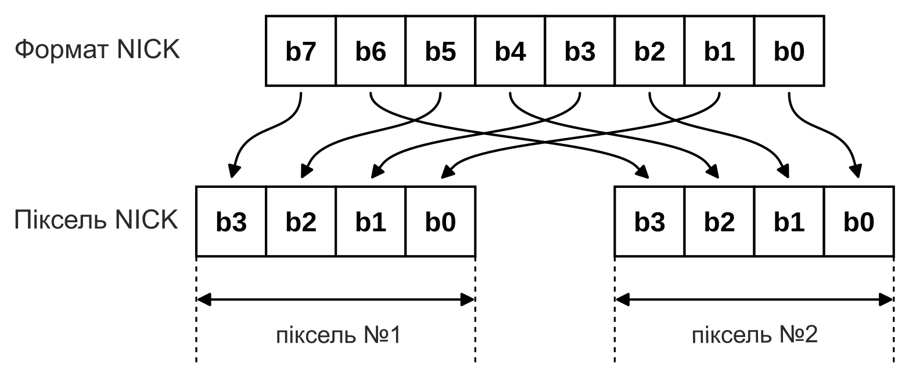
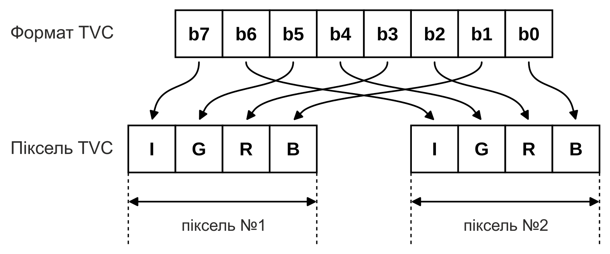
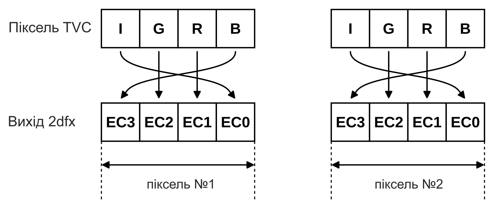

## Робота з кольором

Як уже відомо, у випадку з «Enterprise» та «TVC» є п'ять вхідних ліній для зміни кольору пікселя.

Лінії **EC0-3** визначають чотирибітне число — індекс кольору з поточної 16-колірної палітри, який ми хочемо відобразити на даному пікселі.

Вхідна лінія **/EXTC** керує як на «Enterprise», так і на «TVC» тим, чи дійсно індекс кольору, що надходить на входи **EC0-3**, має перекрити даний піксель. Простіше кажучи, для кожного конкретного пікселя це «перемикач прозорості». При **0** машина виводить на даний піксель індекс кольору з ліній **EC0-3**, а при **1** — відображає на екрані власний піксель, згенерований відеосхемами комп'ютера.

> Для **Enterprise** завдяки можливостям чипа [NICK](../../programming/system-info/nick/pro-nick.md) існує ще два інші, більш екзотичні варіанти налаштувань, але в цій книзі я їх не розглядаю — їх можна вивчити з опису NICK; на принцип роботи [2dfx](../../hardware/hv-2dfx.md) це не впливає.

Для керування нам довелося б використовувати всі п'ять вхідних дротів, що у випадку 2dfx вимагало б збереження п'яти біт на кожен піксель. Хоча перші експерименти базувалися саме на цьому, через складність збереження та пов'язані з цим додаткові затрати часу на рендеринг у фінальній версії 2dfx я використовую так зване апаратне компараторне керування прозорістю.

На практиці це означає, що для 2dfx ми можемо (і мусимо) встановити один із 16 можливих індексів кольору, який потім апаратний елемент, спроєктований на платі 2dfx незалежно від мікроконтролера, порівнює з індексом кольору, що саме надходить із 2dfx. Якщо два значення відрізняються, апаратний компаратор сигналізує комп'ютеру через вхідну лінію **/EXTC** про необхідність відобразити на даному пікселі колір, згенерований 2dfx. У протилежному випадку він дає команду комп'ютеру проігнорувати колір із ліній **EC0-3**, тобто відобразити піксель, згенерований ним самим.

Це спричиняє те, що при використанні 2dfx один колір потрібно призначити і тим самим пожертвувати ним для того, щоб 2dfx міг забезпечити сигнал прозорості для комп'ютера. У випадку **TVC** це практично може бути «другий чорний» колір, а на **Enterprise** — наприклад, один із кольорів **BIAS** (8-15). Незалежно від робочого профілю 2dfx («Enterprise» чи «TVC»), значенням за замовчуванням при ввімкненні є нульовий індекс кольору. Ми можемо змінити його за допомогою єдиної команди в будь-який момент часу безпосередньо під час роботи.

Водночас 2dfx має спеціальний режим **ENGINE_ON_FORCED**: він ігнорує апаратний колірний компаратор і постійно утримує вхід **/EXTC** на значенні **0**. У цьому режимі доведеться відмовитися від графіки та виведення тексту, згенерованих самим комп'ютером, оскільки 2dfx постійно дає йому команду відображати колірну інформацію, що надходить із зовнішніх колірних входів, повністю перекриваючи власну.

Зважаючи на те, що 2dfx прагне покрити своїм набором команд якомога ширший спектр графічних завдань, цілком імовірно, що власні графічні можливості комп'ютера нам знадобляться лише мінімально або не знадобляться взагалі.

Після розуміння прозорості ми зобов'язані поговорити про самі лінії **EC0-3**, щоб керування кольорами не стало несподіванкою для програміста 2dfx.

2dfx у власній пам'яті зберігає колір двох пікселів в одному байті, що пов'язано зі значеннями ліній **EC0-3** наступним чином — про це також ітиметься під час розгляду використання Resource RAM.

Як видно, незалежно від того, яку з машин ми використовуємо, у власній ОЗП 2dfx зберігаються індекси кольорів двох послідовних пікселів, і вони без змін та тактовано потрапляють на лінії **EC0-3**. Це зроблено для того, щоб не відбирати даремно час мікроконтролера на постійне перегрупування бітів перед виведенням кольору пікселя на виходи **EC0-3**. Завдяки цьому більше ресурсів залишається для завдань рендерингу.

У внутрішньому **4bpp** форматі пікселів 2dfx нижні чотири біти навмисно містять індекс кольору лівого пікселя, а верхні чотири біти — правого. Спочатку це може здатися зворотним щодо звичних способів збереження, однак це напряму підлаштовано під роботу вихідного інтерфейсу 2dfx: дані фреймбуфера передаються через 32-бітний DMA до PIO, який, зсуваючись праворуч, спочатку завжди відправляє нижні чотири біти на лінії **EC0-3**. Таким чином, вміст фреймбуфера можна відображати напряму без будь-яких проміжних перегрупувань півбайтів (нібблів), що також підвищує швидкість обробки.

Онлайн-графічні редактори 2dfx початково експортують намальовану графічну інформацію саме в цьому форматі.

### Керування кольором в Enterprise

В Enterprise зв'язок між кольорами та лініями **EC0-3** досить простий. Поточна 16-колірна палітра «Enterprise» один до одного відповідає значенням ліній **EC0-3**.

> нижні вісім кольорів палітри (0-7) можна довільно задавати з [256 можливих кольорів](../../programming/system-info/info_colour-palette.md) — навіть для кожного рядка окремо, якщо створити відповідну [LPT](../../programming/system-info/nick/lpt.md), — а верхні вісім кольорів палітри можна змінювати для всього екрана шляхом налаштування значення NICK BIAS.

Тобто, якщо ми хочемо змінити колір певного пікселя на сьомий колір нашої палітри, то нам потрібно лише змінити значення цього пікселя в ОЗП 2dfx на `0111b`.

Наскільки б простим для розуміння не був цей спосіб збереження даних, для програмістів, які виросли на «Enterprise», він є абсолютно чужим. Річ у тім, що через особливості чипа NICK колір двох пікселів у власній відеопам'яті NICK для 16-колірного режиму представлений наступним чином:

Таким чином, наші наявні дані спрайтів або зображень у форматі NICK довелося б конвертувати у внутрішній формат 2dfx для того, щоб 2dfx міг коректно їх відобразити. Але перш ніж шановний програміст вхопиться за серце, заспокоїмо: 2dfx допомагає в цьому. Адже окрім команди **UPLOAD_RAW** (це назва команди для завантаження у форматі 2dfx) він також підтримує команду **UPLOAD_NICK**. Остання призначена саме для того, щоб зробити можливим завантаження графічного матеріалу, початково створеного у форматі NICK, без будь-яких додаткових змін з боку користувача, після чого 2dfx сам виконує конвертацію з формату NICK у формат 2dfx байт за байтом. Детальна інформація про ці команди міститься в розділі «Структура та використання Resource RAM (RRAM)».

### Керування кольором у Videoton TVC

Хоч «TVC» має загалом шістнадцять кольорів, які до того ж є незмінними, розробники цього комп'ютера так само суттєво заплутали збереження кольорів пікселів у власній відеопам'яті, як і творці «Enterprise».

У 16-колірному режимі збереження кольорів сусідніх пікселів дивовижно схоже на формат NICK у «Enterprise», тобто:

Однак плутанина цим не обмежилася. Розробники змішали значення ліній **EC0-3** навіть порівняно з і без того хаотичним збереженням у відеопам'яті, ось:

Як видно, біти, що відповідають окремим значенням, розподілені абсолютно по-іншому навіть порівняно з відеопам'яттю «TVC»: замість **IGRB** вхід **EC3-0** очікує **BGRI**.

З цієї структури випливає чітке фіксоване розташування (через незмінну 16-колірну палітру), відповідно до якого графіку для «TVC» потрібно створювати та завантажувати в RRAM 2dfx згідно з наведеною нижче таблицею кольорів для забезпечення коректного відображення:

|                                                                   |     |                                 |     |                                                                   |     |                      |
|:-----------------------------------------------------------------:|:---:|:------------------------------- |:---:|:-----------------------------------------------------------------:|:---:|:-------------------- |
|  |  0  | чорний / black                  |     |  |  1  | чорний / black       |
|  |  2  | темно-червоний / dark red       |     |  |  3  | червоний / red       |
|  |  4  | темно-зелений / dark green      |     |  |  5  | зелений / green      |
|  |  6  | темно-жовтий / dark yellow      |     |  |  7  | жовтий / yellow      |
|  |  8  | темно-синій / dark blue         |     |  |  9  | синій / blue         |
|  | 10  | темно-пурпуровий / dark magenta |     |  | 11  | пурпуровий / magenta |
|  | 12  | темно-блакитний / dark cyan     |     |  | 13  | блакитний / cyan     |
|  | 14  | сірий / grey                    |     |  | 15  | білий / white        |

Приводів для паніки немає й тут. По-перше, наведений вище формат є обов'язковим лише при використанні команди **UPLOAD_RAW** для забезпечення правильних кольорів зображення. По-друге, вбудована в 2dfx команда **UPLOAD_TVC** завантажує в 2dfx графічні матеріали, підготовлені у стандартному для «TVC» 16-колірному режимі відеопам'яті (описаному в інструкції до «TVC»), після чого автоматично виконує необхідну конвертацію TVC→2dfx над завантаженими даними. Детальніше про це із конкретними командами та прикладами їх використання написано в розділі «Структура та використання Resource RAM (RRAM)».

Крім того, як уже зазначалося раніше, онлайн-редактори графіки для 2dfx за замовчуванням експортують готову графіку одразу у форматі 2dfx, тому її можна негайно використовувати з командою **UPLOAD_RAW** (див. далі).

Знання наведеної вище таблиці кольорів водночас є важливим при виборі прозорого кольору: має значення, яким саме індексом кольору ми пожертвуємо для забезпечення прозорості.