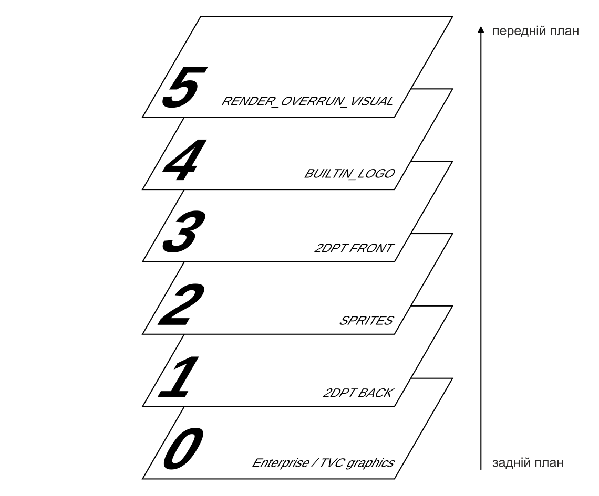

## Шари

[2dfx](../../hardware/hv-2dfx.md) формує зображення як п'ять послідовних шарів, що накладаються один на одного. Шар із більшим порядковим номером завжди має вищий пріоритет, тобто відображається поверх нижчих шарів:

Нульовим шаром є саме зображення, згенероване «Enterprise» або «TVC»: текст, графіка, бордюр — усе, що машина виводить самостійно. 2dfx модифікує це базове зображення за допомогою зовнішніх колірних входів.

Щоб зрозуміти наступні шари, варто коротко розглянути, як створювалася графічна система 2dfx.

Початковою метою розробки було виведення апаратних спрайтів із найменшим можливим залученням процесора Z80. Замість складного та тривалого програмного вимальовування спрайтів додатком достатньо лише задати відповідні параметри в 2dfx. Спрайти мають пріоритет за своїм номером: спрайт **0** знаходиться найнижче, а спрайт **63** — найвище. Якщо прозорі (видимі) пікселі двох спрайтів перекриваються, у цій точці виводиться піксель спрайта з більшим номером. Другий шар повністю відведено під спрайти.

У процесі розробки з'ясувалося, що мікроконтролер у складі 2dfx здатний на значно більше. Він може керувати не лише спрайтами, а й виводити графічний контент у повній теоретичній горизонтальній та вертикальній роздільній здатності машин — попіксельно, використовуючи будь-який із 16 доступних кольорів.

Так до спрайтів додалися два 2D-шари малювання: **2DPT back** та **2DPT front**. Обидва перемальовуються для кожного кадру на основі списку команд, що містить до 256 елементарних графічних кроків. **2DPT back** розміщується позаду спрайтів, а **2DPT front** — перед ними. Наступні розділи книги детально описують графічні можливості цих шарів. Таким чином, **2DPT back** утворює перший шар, а **2DPT front** — третій.

Окремим шаром може виводитися команда [SHOW_BUILTIN_LOGO](commands/show_builtin_logo.md). Вона малює або приховує вбудований логотип 2dfx у довільній точці екрана без потреби завантажувати дані логотипа користувачем. Це зручно використовувати, наприклад, у меню ігор або демок для напису «powered by 2dfx». Використання цієї функції є необов'язковим. Логотип має фіксований розмір **206**×**79** пікселів і є єдиним елементом четвертого шару.

Найвищий пріоритет має п'ятий шар, який слугує корисним індикатором під час розробки. Якщо малювання **2DPT back/front** та обробка спрайтів не вкладаються у відведений для кадру час (**20 мс** у режимі **50 fps** або **40 мс** у режимі **25 fps**), 2dfx може виводити знак оклику, що постійно змінює колір (якщо увімкнено команду [SET_RENDER_OVERRUN_VISUAL](commands/set_render_overrun_visual.md)). Це сигналізує про те, що графічне завдання перевищує поточний часовий ліміт рендерера, що на практиці може призвести до посмикування картинки. Детальніше про використання цієї функції буде описано далі.